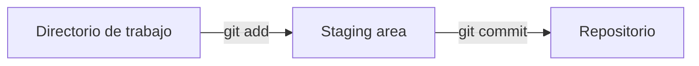
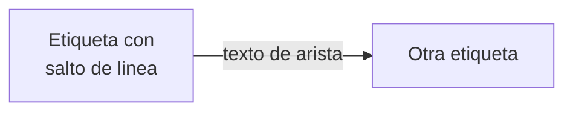

# Lesson Authoring — formato de los artefactos de una lección

Fuente de verdad del **formato**. El **contenido pedagógico** de cada curso se
decide leyendo su `microdiseno/info.md` y `microdiseno/cronograma-dia-a-dia.md`.

Todo lo de este documento fue verificado contra el código. Cuando algo aquí
contradiga una suposición, gana este documento; cuando contradiga el código,
gana el código y hay que actualizar este archivo.

---

## 1. Los cinco artefactos de una lección

| # | Artefacto | Ubicación | ¿Se publica? |
|---|-----------|-----------|--------------|
| 1 | Lección teórica | `content/cursos/<curso>/<slug>.mdx` | Sí |
| 1b | Registro de la lección | `lib/courses/data/<curso>.ts` | Requisito para publicar |
| 2 | Cuestionario de cierre | Banco de preguntas (Supabase, vía `question-bank-mcp`) | Sí, al publicar cada pregunta |
| 3 | Apuntes de clase — docente (spec-044) | `content/cursos/<curso>/apuntes/<articleSlug>.md` | Sí, pero **solo visible a owner/admin** (nunca a estudiantes) |
| 4 | Guía de laboratorio — estudiante | `content/cursos/<curso>/guias/<slug>.md` | Sí (`kind: "guide"`), **solo si la sesión es trabajo independiente del estudiante** |
| 5 | Quiz calificable A/B/C | Assignments (Supabase, vía `assignment-mcp`) | Solo a demanda |

> ⚠️ **No toda sesión práctica tiene los cinco.** Muchas prácticas se
> desarrollan en vivo por el docente (demo o ejercicio guiado en clase) en vez
> de asignarse como trabajo independiente. Esas sesiones producen **apuntes de
> clase (#3)** pero **no** guía de laboratorio del estudiante (#4). Antes de
> crear el artefacto #4, confirmar con el usuario si la sesión es trabajo
> independiente o desarrollo en vivo — nunca asumirlo (ver §4).

Cursos válidos (slugs exactos): `estructuras-de-datos`, `programacion-cientifica`,
`analisis-de-algoritmos`.

Convención de nombres: `id === slug === articleSlug === nombre de archivo`, en
`kebab-case` y sin acentos.

---

## 2. Lección teórica — `.mdx`

### 2.1 Frontmatter

El sistema solo parsea **cuatro** campos (`lib/courses/content.ts:11-16`, `:50-62`);
cualquier otra clave se descarta en silencio. Ninguno es técnicamente obligatorio.

| Campo | Efecto real |
|-------|-------------|
| `updatedAt` | **El único con efecto visible.** Formato `YYYY-MM-DD`. Renderiza "Actualizado el …" |
| `title` | Parseado pero **nunca consumido** — el `<h1>` sale de `lesson.title` del TS |
| `summary` | Parseado pero **nunca consumido** — el subtítulo sale de `lesson.summary` del TS |
| `cover` | Parseado, sin ningún consumidor en el repo |

Los demás campos que aparecen en las lecciones existentes (`course`, `course_code`,
`level`, `type`, `language`, `difficulty`, `estimated_time`, `presentation`,
`slides_hint`, `date`, `author`) son **metadatos de autoría ignorados por el
runtime**. Mantenerlos es útil para el docente y para generar presentaciones.

Frontmatter a usar:

```yaml
---
title: "Título de la lección"
course: "Estructura de Datos"
course_code: "ED"
level: "Primeros semestres"
type: "Apuntes teóricos"
language: "Java 21"
difficulty: "Básico"
estimated_time: "50 minutos de clase (sesión T1, Semana 8)"
presentation: true
slides_hint: "Cada sección ## es una diapositiva. Presentación sincrona."
date: "2026-07-30"
author: "Asistente de Docencia"
summary: ""
updatedAt: "2026-07-30"
---
```

`course_code`: `ED` (Estructura de Datos), `PC` (Programación Científica),
`AA` (Análisis de Algoritmos).

### 2.2 Estructura del cuerpo

**No escribir `# H1`.** `LessonArticle.tsx:28-30` ya renderiza el `<h1>` desde
`lesson.title`; un `#` en el cuerpo produce un segundo h1 duplicado. Empezar
directo en `##`.

Esqueleto pragmático (problema → teoría → práctica), 8–10 secciones `##`:

```
## El problema: <escenario cotidiano y concreto>
## Más problemas que resuelve <el concepto>
## La solución: <nombre del concepto>       ← + diagrama + definición formal
## <Concepto 1>                             ← Situación → En la práctica → código → diagrama → definición
## <Concepto 2>
## <Concepto 3>
## <Concepto 4>
## <Resumen operativo>                      ← tabla de comandos / operaciones / complejidades
## Síntesis                                 ← bullets, uno por sección anterior
```

Cada `##` es una diapositiva (por `slides_hint`), así que se mantiene corta:
5–15 líneas, 1–4 párrafos. **Cero `###`** — si necesitas un nivel más, la
sección debería partirse en dos. Sin separadores `---`.

Micro-patrón que se repite en las secciones de concepto:

````markdown
## De "guardar el archivo" a "guardar un cambio": el staging area

**Situación:** modificaste tres archivos, pero solo dos cambios pertenecen a la
misma idea. ¿Cómo le dices a Git "guarda solo estos dos, juntos"?

**En la práctica**, Git separa el proceso en dos pasos:

```bash
git add Cliente.java Cuenta.java   # 1. Preparar (staging)
git commit -m "Agrega validacion de edad"   # 2. Guardar en la historia
```



> **Staging area:** zona intermedia donde eliges _exactamente qué cambios_
> entrarán en el próximo commit.
````

Medidas de referencia de una lección completa: ~170 líneas, 9 secciones `##`,
4 diagramas Mermaid, 6 bloques de código, 1 tabla, 6 blockquotes de definición.

### 2.3 Tono

- Segunda persona del singular ("imagina que estás escribiendo", "¿cómo la recuperas?").
- Preguntas retóricas para abrir cada problema.
- Contexto local y concreto: "tu proyecto de aula", "el profesor", "por correo o USB o por WhatsApp".
- **Negrita** al introducir un término; `_cursiva_` para énfasis y anglicismos (`_staged_`).
- Backticks para todo comando, archivo, clase o método.
- Guion largo `—` para aclaraciones.
- Referencias cruzadas a otras **lecciones** por su título ("como viste en
  Sintaxis de Java"). Nunca a laboratorios ni a sesiones futuras (ver abajo).
- Español con acentuación completa. Nada de jerga sin definir antes.

> Las guías de laboratorio usan **usted** ("Implemente", "Verifique"); las
> lecciones usan **tú**. No mezclar.

> **Las lecciones no anuncian laboratorios.** Nada de "esto lo implementas en el
> laboratorio", "en la práctica del viernes" o "el sprint N te pedirá". No todas
> las lecciones tienen laboratorio y eso se decide sobre la marcha: prometer una
> práctica que quizá no exista confunde al estudiante. El puente teoría→práctica
> lo tiende la **guía de laboratorio**, que referencia a la lección cuando se
> crea — la dirección es siempre guía → lección, nunca lección → guía.

### 2.4 Diagramas Mermaid

**No es un componente JSX**: es un bloque de código con lenguaje `mermaid`, que
`lib/mdx/rehype-mermaid-block.ts` intercepta antes de Shiki.

````markdown

````

Reglas verificadas:
- Indentación de 2 espacios.
- **Etiquetas siempre entre comillas dobles** — evita que los caracteres especiales rompan el parser.
- `\n` literal dentro de las comillas para salto de línea.
- Emojis y flechas Unicode (`←`, `✅`, `❌`) permitidos dentro de las comillas.
- `securityLevel: "strict"` (`MermaidDiagram.tsx:36-44`): sin HTML crudo ni `click` handlers.
- `fontFamily` fijado a JetBrains Mono; el tema sigue claro/oscuro automáticamente.
- Si el diagrama no parsea, se muestra una tarjeta de error con el fuente — no rompe la página, pero **es un defecto**: valida la sintaxis mentalmente antes de escribir.
- `end` en minúscula rompe el parser: escribir `End`.

Cualquier tipo de diagrama de Mermaid v11 sirve. Referencia completa en
`content/cursos/mermaid_guia_completa.md`. Los tipos que más rinden aquí:

| Objetivo pedagógico | Diagrama |
|---|---|
| Flujo de datos, pipeline, pasos de un comando | `flowchart LR` |
| Estructura de carpetas, jerarquía, contenedores | `flowchart TB` + `subgraph` |
| Modelo de clases, herencia, composición (POO/UML) | `classDiagram` |
| Ciclo de vida, estados de un objeto o proceso | `stateDiagram-v2` |
| Interacción entre capas (View→Controller→Service) | `sequenceDiagram` |
| Comparar crecimiento asintótico, benchmarks | `xychart-beta` |
| Mapa conceptual de cierre de módulo | `mindmap` |
| Cronograma de sprints del proyecto | `gantt` |
| Modelo de datos / entidades | `erDiagram` |

Apuntar a **3–5 diagramas por lección**, cada uno ganándose su lugar: un
diagrama que solo repite el texto es ruido.

### 2.5 Código, matemáticas y tablas

**Código** — Shiki con `defaultLang: "plaintext"`. Lenguajes en uso: `java`,
`python`, `bash`, `text`. El patrón es comentar los pasos dentro del bloque.
Código inline con backticks simples.

> ⚠️ **`analisis-de-algoritmos` — desde la Semana 3 (2026-08-13, por decisión
> del docente):** todo bloque de código Python debe seguir el estándar que la
> propia lección de la Semana 2, `buenas-practicas-y-entornos-python.mdx`,
> establece: PEP 8 (`snake_case`, espacio alrededor de operadores, ≤79-99
> caracteres/línea), ***type hints*** en cada parámetro y en el valor de
> retorno, y **docstring Google-style** (`Args:`, `Returns:`) en cada función.
> No es opcional a partir de esa semana — el curso ya predicó ese estándar, así
> que su propio código de ejemplo tiene que cumplirlo.
>
> Aplica a **los tres artefactos con código**, no solo a la lección: lección
> `.mdx`, guía del estudiante (**incluidos los esqueletos con `TODO`**: la
> firma y el docstring van completos aunque el cuerpo esté por completar) y
> apuntes de clase. Estos últimos se proyectan en clase y el estudiante los
> copia, así que no hay artefacto exento.
>
> Excepción única: las funciones de test de `pytest` (`def test_...`) no llevan
> type hints ni docstring — es la convención del framework.
>
> Aplica a `@lesson-writer` y `@lab-designer`; ver también
> `.claude/skills/weekly-class-prep/SKILL.md` (calibración de este curso).

**KaTeX** — `remark-math` + `rehype-katex` están activos: `$...$` inline,
`$$...$$` en bloque.

> ⚠️ Ningún archivo de `content/` usa `$` hoy. Como `remark-math` está activo,
> **un `$` suelto en prosa rompe el parseo** (precios, variables de shell):
> escaparlo como `\$`. Para complejidad, las lecciones existentes usan negrita
> (`**O(1)**`) en vez de matemáticas. En Análisis de Algoritmos, donde las
> recurrencias lo justifican, sí usar KaTeX: `$T(n) = 2T(n/2) + \Theta(n)$`.

**Callouts** — el contenido real usa **blockquote de Markdown**, no `<Callout>`.
Una línea `>` por término, negrita en el término, emoji para advertencias:

```markdown
> **Repositorio (repo):** carpeta cuyo contenido es rastreado por Git.
> ⚠️ Si borras la carpeta `.git/`, pierdes todo el historial.
```

**Tablas** — GFM, con scroll horizontal automático. Alineación con guiones.

### 2.6 Componentes MDX disponibles

Registrados en `lib/mdx/components.tsx:159-162`. Son **exactamente cuatro**;
cualquier otro nombre JSX **rompe el render de la página**:

```mdx
<Callout tipo="advertencia">Texto.</Callout>
```
`tipo`: `"nota" | "advertencia" | "peligro" | "exito"` (default `"nota"`,
**`exito` sin acento**). No acepta `title`: la etiqueta se autogenera.

```mdx
<Tabs>
  <Tab label="Java">

```java
public class Pila<T> { }
```

  </Tab>
  <Tab label="Python">

```python
class Pila: pass
```

  </Tab>
</Tabs>
```
`label` es **obligatorio** en cada `<Tab>` (sin él la pestaña se filtra y
desaparece) y debe ser único. Las líneas en blanco alrededor del bloque de
código son necesarias para que MDX lo trate como Markdown y no como JSX.
Útil para el mismo algoritmo en pseudocódigo y en lenguaje real.

```mdx
<YouTubeEmbed id="dQw4w9WgXcQ" title="Introducción a Git" />
```
`id` (11 caracteres) **o** `url`; `title` y `start` (segundos) opcionales.

> Ninguna lección usa todavía estos tres componentes — no hay precedente de
> contenido, solo de código. Úsalos cuando aporten; el blockquote sigue siendo
> el patrón por defecto para definiciones.

### 2.7 Registro obligatorio en `lib/courses/data/<curso>.ts`

**Sin esta entrada la lección no existe para el sitio**: la página renderiza
`PreparationPlaceholder` y el `.mdx` se ignora (`page.tsx:62-64`, `:90-94`).

```ts
{
  id: "fundamentos-de-recursividad",
  slug: "fundamentos-de-recursividad",
  articleSlug: "fundamentos-de-recursividad",
  order: 14,
  title: "Fundamentos de recursividad",
  summary: "Casos base, casos recursivos y la pila de llamadas, con factorial y Fibonacci en Java.",
  topics: [
    { title: "Caso base y caso recursivo" },
    { title: "La pila de llamadas" },
  ],
},
```

`title` y `summary` de **esta** entrada son los que el estudiante ve en el
encabezado. Escribirlos con cuidado: el `summary` es la promesa de la lección.

Un validador IIFE (`lib/courses/index.ts:28-85`) **lanza en build y en dev** si:
- hay `id`, `slug` u `order` duplicado dentro del curso;
- el slug es reservado: `recursos`, `evaluaciones`, `notebooks`, `presentacion`, `guias`;
- el archivo referenciado por `articleSlug` **no existe** en disco.

Por eso: escribir primero el archivo, después la entrada. Y verificar con
`npm run build` (o `npx tsc --noEmit`) tras editar el TS.

---

## 3. Apuntes de clase — docente (spec-044)

`content/cursos/<curso>/apuntes/<articleSlug>.md`. Es el **único** artefacto
docente de una sesión práctica: reemplaza lo que antes eran dos documentos
separados (una guía de laboratorio del docente con ficha de sesión, minutado
y soluciones, en `microdiseno/labs/`, y estos apuntes). Producir ambos es
redundante — ya no se crea la guía docente con minutado; todo vive aquí.

Se resuelve por convención de nombre sobre el `articleSlug` de la lección o
guía a la que acompaña. No lleva frontmatter obligatorio ni entrada en TS.
Se publica, pero **solo es visible a owner/admin** (nunca a estudiantes) —
ruta dedicada `/[courseSlug]/[lessonSlug]/apuntes`, enlazada desde un botón
en el header de la lección/guía.

Es el **guion de la sesión que se proyecta en clase**, centrado en el código:
paso a paso detallado, con las soluciones completas y con las líneas
documentadas (comentarios que expliquen qué hace cada línea no obvia), no un
enunciado a medio resolver. Formato:

```
> (Opcional) una nota de contexto breve: de qué depende la sesión, qué hilo
> conecta los pasos, si la sesión es dictada en vivo por el docente en vez de
> ser trabajo independiente del estudiante.

## Paso N — <nombre del ejercicio o parte>

Enunciado breve + el código **completo y documentado** (solución de
referencia, no un esqueleto con `TODO`) en bloque de código con lenguaje
explícito (` ```java `, ` ```python `, etc.). Comentarios en las líneas que
no son obvias — es lo que el docente explica en voz alta mientras proyecta.

Punto a resaltar: qué observar o señalar en pantalla mientras se demuestra.

## Preguntas socráticas   (opcional)
  Preguntas para lanzar al grupo si se estanca, con la respuesta esperada.
  Van al final, una vez cerrado el desarrollo paso a paso.
```

**Prohibido en este artefacto:** ficha de sesión, objetivos de sesión,
**minutado**, puntos de control por minuto, diferenciación pedagógica
(andamiaje/extensión), errores frecuentes en tabla, cierre de sesión. Ese
aparato de planificación de sesión ya no se produce como artefacto aparte —
si algo de eso es indispensable para dictar la clase, se resuelve en la
conversación con el usuario, no en un documento versionado.

⚠️ El pipeline compila `.md` como MDX (igual que las guías de laboratorio,
ver §4): todo placeholder o genérico (`<tu-usuario>`, `List<Nodo>`) fuera de
backticks rompe la compilación en vez de degradar. Va siempre entre
backticks o dentro de un bloque de código.

---

## 4. Guía de laboratorio del estudiante (publicada)

> ⚠️ **Confirmar antes de crearla, siempre.** No toda sesión práctica es
> trabajo independiente del estudiante: muchas se desarrollan en vivo por el
> docente (demo, ejercicio guiado, o para explicar el flujo de trabajo del
> curso). Antes de escribir este artefacto, preguntar explícitamente al
> usuario si la sesión es trabajo independiente que el estudiante entrega, o
> si el docente la va a dictar en vivo. Si es en vivo, **no se crea esta
> guía**: el desarrollo paso a paso va en los apuntes de clase (§3) y no hay
> artefacto #4 para esa sesión. No asumir por el tipo de sesión (`P` en el
> cronograma no implica automáticamente trabajo independiente).

`content/cursos/<curso>/guias/<slug>.md` — **`.md`, no `.mdx`**, en la
subcarpeta `guias/` (`lib/courses/content.ts:24-26`).

Requiere entrada en `lib/courses/data/<curso>.ts` con **`kind: "guide"`**:

```ts
{
  id: "lab-01-listas-enlazadas",
  slug: "lab-01-listas-enlazadas",
  articleSlug: "lab-01-listas-enlazadas",
  kind: "guide",
  order: 9,
  title: "Laboratorio 01 — Listas Enlazadas",
  topics: [],
},
```

Diferencias de comportamiento frente a una lección: el header dice "Guía" en vez
de "Clase NN", y la guía queda **fuera del progreso, del resume, de la asistencia,
de la autoevaluación de cierre y del sitemap**.

> ⚠️ **Trampa principal:** el `.md` **se compila como MDX**. Un `<`, `{` o `}`
> suelto rompe el build igual que en un `.mdx`. En Java y Python esto aparece
> constantemente: `List<T>`, `Map<K,V>`, f-strings con `{}`. Dentro de bloques
> de código con backticks es seguro; **en prosa hay que usar backticks o
> escapar**. Nunca escribir `List<T>` sin backticks en un párrafo.

Frontmatter: la guía existente no lleva ninguno (no muestra fecha). Añadir
`title` + `updatedAt` es válido y preferible, para que se vea la fecha.

Estructura (secciones `##` separadas por `---`, `###` para subpartes):

```
# Laboratorio NN — <tema>

## Objetivo
  Un párrafo + "Competencias esperadas:" en bullets.

## Requisitos Previos
  Bullets de lo que debe dominar. Referenciar lecciones por su TÍTULO
  ("Clase 08 — Encapsulamiento"), nunca por spec interno: la guía existente
  filtra "(spec-009)" al estudiante, y eso es un defecto a no repetir.

## Desarrollo del Laboratorio
  ### Parte 1 — <nombre>
  Párrafo + esqueleto de código (SIN la solución) + bullets
  **Requisitos:** / **Operaciones obligatorias:** / **Restricciones:**
  ### Parte N — <nombre> (Opcional / Avanzado)

## Entregable
  Árbol de archivos ASCII en bloque de código sin lenguaje, formato de entrega
  (repo con rama y estructura, o .zip), y un ejemplo de archivo de prueba.

## Criterios de Evaluación
  Rúbrica detallada: ver sección 4.1.

## Dificultades Comunes
  ### "<pregunta entre comillas>"  + bullets de respuesta.

## Extensiones Sugeridas (Bonus)

## Recursos
  Bullets con **Etiqueta:** — apuntes del curso, capítulo del libro, herramienta.

**Plazo de entrega:** <plazo>.
```

Tono: **usted**, imperativo ("Implemente", "Verifique", "Empaquete"). Cero
diagramas Mermaid, cero componentes JSX, cero `$`.

### 4.1 Rúbrica

Tabla `| Criterio | Puntos | Descripción |` con separador compacto `|---|---|---|`,
criterio en negrita, y fila final `| **TOTAL** | **100** | |`. Debe sumar 100.

La descripción de cada criterio tiene que ser **verificable**, no una etiqueta
de calidad: "Todos los atributos son `private` y el acceso es por métodos" en
vez de "buen encapsulamiento". Cubrir siempre corrección funcional, calidad del
código, validación de casos límite, pruebas y documentación.

Análisis de Algoritmos tiene rúbrica común de 5 criterios definida en su
microdiseño (corrección conceptual, calidad de la explicación teórica,
corrección de la implementación, calidad del análisis de gráficas,
documentación y organización del informe): **respetarla**, no inventar otra.

### 4.2 Laboratorio evaluativo `★` de Estructuras de Datos

Los laboratorios que cierran un **momento evaluativo** (`★` en el cronograma)
de `estructuras-de-datos` siguen un patrón propio, fijado con el docente en
el M1 (agosto 2026). **Sobreescribe varias reglas de §4** — donde este
apartado contradiga al anterior, gana este.

**El UML se entrega resuelto; no se diseña.** Lo que se evalúa es leer un
diagrama de clases y traducirlo a código, no producirlo. Por eso la guía
**sí lleva diagramas Mermaid `classDiagram`** (excepción explícita al "cero
diagramas Mermaid" de §4): el diagrama *es* la especificación del entregable.

**La guía no lleva código. Ninguno.** Ni esqueletos, ni firmas sueltas, ni
bloques con `TODO` (excepción explícita al "esqueleto de código (SIN la
solución)" de §4). El diagrama Mermaid ya declara clases, atributos con
visibilidad, firmas de método y relaciones; la prosa de **"Requisitos de
implementación"** aporta lo que el diagrama no puede expresar: qué valida
cada constructor, qué método queda sin resolver en la clase abstracta, y la
regla de negocio concreta de cada subtipo. Entre ambos basta — si hace falta
un esqueleto para que el enunciado se entienda, el enunciado está mal escrito.
Los únicos bloques con backticks permitidos son el árbol ASCII del entregable
y la fórmula de la nota.

**Una sola guía genérica con una sección por proyecto.** La plataforma no
segmenta contenido publicado por equipo ni por proyecto: toda guía con
`kind: "guide"` la ven todos los matriculados. No se crean 5 guías, una por
caso de estudio. Se crea **una** con una subsección `###` por proyecto
elegible, cada una con su diagrama y sus requisitos, precedida de una
instrucción de "ubique la sección de su proyecto y trabaje solo sobre ella".

**Continuidad obligatoria con lo ya construido.** El diagrama de cada
proyecto debe reutilizar **los nombres exactos de las clases que ese equipo
ya escribió** en las sesiones previas del sprint (revisar la lección o
práctica correspondiente antes de diseñar el UML), evolucionándolas —
encapsular, promover una a abstracta, agregar `extends`/`implements` — en vez
de introducir un conjunto nuevo y desconectado. Indicar por clase, en la
prosa, si **ya existe** de la sesión anterior o si es un **archivo nuevo**;
y si un atributo previo se reemplaza por una relación de objetos, decirlo
explícitamente ("elimine el atributo `equipo:String`, ahora es composición
con `Equipo`"). Todas las clases previas siguen siendo entregables aunque no
participen de la jerarquía: se entregan igual, ya encapsuladas.

**Rúbrica de 3 criterios en escala 0–5, escalada al peso del momento.** No
la rúbrica de 5 dimensiones de §4.1. La columna `Puntos` es el **peso
porcentual** del criterio, no un puntaje absoluto — sigue sumando 100 y
cerrando con `| **TOTAL** | **100** | |`, pero cada criterio se califica de
**0 a 5**:

| Criterio | Peso | Qué verifica |
|---|---|---|
| Codificación correcta del UML | 60 | Clases, constructores, atributos, métodos, getters/setters y herencia fieles al diagrama entregado |
| Pruebas en el App — creación de objetos | 20 | Una clase con `main` que instancia cada subtipo concreto y ejercita el método polimórfico sin `instanceof`, imprimiendo por consola |
| Buenas prácticas de programación | 20 | Commits descriptivos y frecuentes, uso correcto de ramas, nombres siguiendo convenciones de Java |

Debajo de la tabla va siempre la fórmula del escalado, con un ejemplo
numérico resuelto:

```
nota_laboratorio (0-5) = 0.60 × item1 + 0.20 × item2 + 0.20 × item3
nota_final_curso (%)   = (nota_laboratorio / 5) × <peso del momento>%
```

El "peso del momento" sale de la tabla de evaluación de
`microdiseno/info.md` — leerla, no asumirlo. Si el laboratorio deja de valer
lo que dice esa tabla, **actualizar `info.md` en el mismo cambio** (tabla de
evaluación y descripción de la sesión `P ★` de esa semana), verificando que
el total del curso siga en 100 %.

**Secciones que no van en este artefacto:** "Ejemplo de archivo de prueba
esperado" (el entregable ya lo describe) ni "Extensiones Sugeridas (Bonus)".
Sí van "Dificultades Comunes", con al menos una entrada sobre lectura de
notación UML y otra sobre atributos de la sesión previa que el diagrama ya
no contempla.

**Los apuntes docente resuelven solo el Sistema Bancario.** Es el caso de
referencia del docente y no es elegible por ningún equipo; los apuntes nunca
resuelven los 5 proyectos (además, solo existe un archivo de apuntes por
`articleSlug`). Ver §3.

---

## 5. Cuestionario de cierre de lección (formativo, sin nota)

Es la sección de autoevaluación al final de la lección (spec-011). **No se
"crea" ningún objeto**: aparece sola cuando existen preguntas publicadas
**montadas** en la lección (spec-042 — el montaje sustituyó a
`course_slug`/`lesson_slug` como campos de la pregunta).

Procedimiento con `question-bank-mcp` — **tres pasos, en orden**:

1. `create_question` por cada pregunta, con `keywords: string[]` (deben existir
   en el catálogo — confirmar con `list_keywords` antes; nunca inventar un
   slug de keyword, y si falta una proponerle al usuario crearla con
   `create_keyword` antes de seguir).
2. Revisar el contenido con el usuario, luego `publish_question` en cada una.
   **No existe `unpublish_question`** — publicar es prácticamente irreversible
   desde el MCP.
3. `mount_question_in_lesson` por cada una, con el `course_slug`/`lesson_slug`
   exactos de la lección. **Publicar NO monta**: una pregunta publicada y
   nunca montada es invisible en cualquier autoevaluación, sin ningún error.
   Verificar con `list_lesson_questions` que las preguntas quedaron
   realmente visibles y en el orden esperado.

Restricciones que determinan el diseño:

- **Solo `multiple_choice` se muestra.** Los otros cuatro tipos montados en la
  misma lección se **ignoran en silencio** — no los crees para el cierre.
- `choices` necesita **mínimo 2** opciones y **al menos una** `is_correct: true`.
  Varias correctas ⇒ la UI pasa de radios a checkboxes automáticamente.
- `course_slug`/`lesson_slug` del montaje son **texto libre sin foreign key**
  hacia el catálogo de lecciones (vive en git, no en Postgres). Un slug mal
  escrito **no falla**: deja la pregunta huérfana e invisible para siempre.
  **Nunca inventar slugs** — copiarlos del nombre del archivo `.mdx`.
- `difficulty` es 1–5. `keywords` es un array de slugs del catálogo
  controlado (ya no hay `tags` libres).
- Es formativo y **no persiste nada**: sin nota, sin intentos, feedback efímero.
- Solo lo ven estudiantes matriculados.

Diseño recomendado: **4–6 preguntas** por lección, una por sección `##` de peso,
escalonadas en dificultad, con distractores que correspondan a errores
conceptuales reales (no opciones absurdas de relleno). `keywords` con el
módulo y el concepto (ej. `recursion`, `python`) — confirmadas en el catálogo,
nunca inventadas al vuelo.

---

## 6. Quiz calificable A/B/C (solo a demanda)

Con `assignment-mcp`. Un grupo de variantes = 1 config compartida + N variantes
con **preguntas distintas**. No hay generación automática: las tres se componen
explícitamente eligiendo del banco.

1. `list_academic_courses` → obtener `academic_course_id` (obligatorio).
2. Tener las preguntas ya creadas y publicadas en el banco.
3. `create_assignment_group` con `variants: [A, B, C]` en **una sola llamada**.
4. `publish_assignment_group`.
5. `get_variant_allocations` para monitorear el reparto (devuelve lista plana de
   `enrollment_id`; los conteos por variante hay que calcularlos).

Invariantes validadas al publicar — cada fallo es un 422:
- **≥ 2 variantes** (usar 3).
- **Ninguna variante vacía.**
- **Puntaje total idéntico en las tres variantes.** La comparación es `===` sobre
  suma de floats: usar puntajes que sumen exacto (0.5, 1, 2…) y **evitar
  decimales como 0.1 + 0.2**, que fallan por representación binaria.
- `closes_at` no puede estar en el pasado.

`points` por pregunta: **mínimo 0.01, máximo 5.00**. `type`: `practice`, `quiz`,
`exam`, `homework`. `show_feedback_on`: `submit`, `close`, `never`.

No valida que las preguntas estén publicadas, ni duplicados dentro de una
variante, ni que el número de preguntas coincida entre variantes. **Eso es
responsabilidad del autor**: las tres variantes deben ser equivalentes en
número de preguntas, dificultad y temas cubiertos, no solo en puntaje.

`replace_variant_questions` **borra y reinserta** todas las preguntas de una
variante. `delete_assignment_group` da 409 si ya hay entregas.

---

## 7. Requisitos de ejecución de los MCP

Ambos MCP son clientes HTTP: **requieren `npm run dev` corriendo** y fallan con
"API no disponible" **sin reintentos** (deliberado, para no duplicar creaciones).

Están registrados en `.mcp.json` y arrancan vía `mcp-servers/run-local-mcp.sh`,
que carga `.env.local` y deriva el origen de la app desde
`QUESTION_BANK_API_BASE_URL` (ojo: el puerto puede no ser 3000).

Si las herramientas MCP no aparecen: verificar que `npm run dev` está arriba,
que `.env.local` tiene `QUESTION_BANK_API_KEY` y `QUESTION_BANK_AGENT_TEACHER_ID`,
y que `mcp-servers/<nombre>/dist/` está compilado.

---

## 8. Checklist de cierre

- [ ] `.mdx` sin `# H1`, empieza en `##`, sin `###`, sin `---`.
- [ ] `updatedAt` con la fecha de hoy.
- [ ] 3–5 diagramas Mermaid, etiquetas entre comillas dobles, sin `end` minúscula.
- [ ] Ningún `$` sin escapar; ningún `<`/`{` suelto en prosa (crítico en `.md` de guías).
- [ ] Solo `Callout`, `Tabs`, `Tab`, `YouTubeEmbed` como JSX.
- [ ] Entrada en `lib/courses/data/<curso>.ts` con `articleSlug`, `order` único y `summary` escrito.
- [ ] Si la sesión es en vivo: apuntes de clase escritos, sin guía de estudiante. Si es trabajo independiente (confirmado con el usuario): guía del estudiante con `kind: "guide"` y apuntes de clase **sin** entrada TS.
- [ ] Rúbrica suma 100 y cada criterio es verificable.
- [ ] Preguntas de cierre: solo `multiple_choice`, publicadas y **montadas** en la lección (`mount_question_in_lesson`), verificado con `list_lesson_questions`.
- [ ] `npm run build` pasa (el validador de cursos corre ahí).
