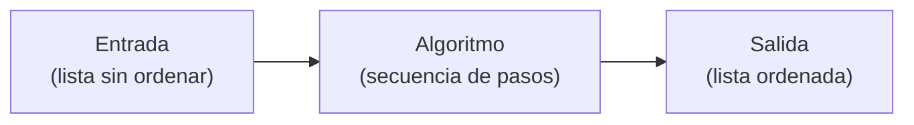
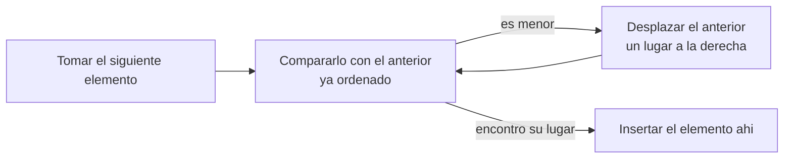
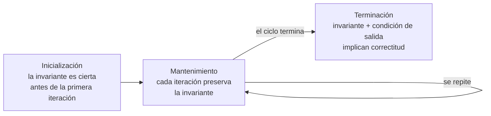

## El problema: la noche que no alcanza

Una empresa de energía de tu ciudad tiene 1.850.000 medidores instalados. Cada uno reporta, una vez al día, cuánta energía consumió el predio. Todas esas lecturas se acumulan durante el día en un servidor y, en la madrugada, un proceso automático las depura, las organiza y las deja listas para facturar.

Ese proceso tiene una ventana de cuatro horas: de medianoche a las cuatro de la mañana. Hoy tarda más de nueve.

Las consecuencias no son teóricas. La facturación del día sale tarde. Las alertas por posible fuga o manipulación del medidor llegan cuando el evento ya lleva más de un día ocurriendo. Y quien llama al call center en la mañana espera al teléfono, porque el proceso todavía está corriendo sobre los mismos datos que el operador necesita consultar.

La empresa ya descartó que el problema sea el servidor. Sospecha que el problema son los algoritmos.

## De un requisito de negocio a un problema computacional

Lo que acabas de leer todavía no es un problema computacional: es una queja. "Tarda nueve horas" no se puede programar. Antes de escribir una sola línea de código hay que traducir esa situación a algo preciso — y esa traducción es una decisión técnica, no un trámite.

Son cuatro preguntas:

| Pregunta                        | Respuesta en este caso                                                         |
| ------------------------------- | ------------------------------------------------------------------------------ |
| ¿Qué entra?                     | Cerca de 1.850.000 registros de lectura, en el orden en que la red los entregó |
| ¿Qué sale?                      | Los mismos registros, sin duplicados, ordenados por cuenta y por fecha         |
| ¿Qué restringe?                 | Cuatro horas de ventana; ninguna lectura válida puede perderse                 |
| ¿Qué operación domina el costo? | Ordenar cerca de 1.850.000 registros                                           |

Fíjate en lo que hizo ese paso: convirtió una empresa entera, con su call center y su facturación, en una sola pregunta con forma matemática. Todo lo demás —el nombre de la empresa, el color de los medidores— dejó de importar para el análisis.

> **Modelar un problema:** traducir una situación organizacional, ambigua y escrita en el lenguaje del negocio, a una especificación precisa de entrada, salida y restricciones. Es el paso que decide si el algoritmo que escribas después resuelve el problema correcto — un algoritmo impecable sobre un modelo equivocado no sirve de nada.

## El mismo problema, a una escala que puedes recorrer a mano

Ordenar no es una operación nueva para ti, y para entender por qué cuesta tanto conviene bajarla a un tamaño que puedas seguir paso a paso.

El profesor te pide organizar el directorio del curso: 50 nombres de compañeros, en orden alfabético. Tu método es el de siempre — tomas un nombre, lo comparas con los que ya tienes ordenados y lo insertas donde corresponde, como cuando ordenas cartas en la mano mientras las vas recibiendo. Con 50 nombres, terminas en un par de minutos.

La semana siguiente el profesor pide otra cosa: ordenar el listado completo de los 30.000 estudiantes matriculados en la universidad, por apellido. Tu método sigue siendo **correcto** — si lo aplicas con paciencia infinita, al final obtienes la lista ordenada. Pero cada nombre nuevo exige compararlo, en el peor caso, con miles de nombres ya colocados. Lo que tomaba minutos con 50 nombres, con 30.000 se vuelve un ejercicio de horas.

¿El método dejó de ser válido? No. Lo que cambió es la pregunta que importa: ya no es solo "¿esto funciona?", sino "¿esto funciona **a tiempo**?". Es exactamente la pregunta que tiene atascada a la empresa de energía — con la diferencia de que allí no son 30.000 registros, sino 1.850.000, todas las noches.

## ¿Qué es un algoritmo?

Antes de hablar de rapidez o de lentitud, hace falta precisar de qué estamos hablando cuando decimos "método para ordenar nombres".



Un algoritmo no es código Python ni pseudocódigo: es la idea detrás de ambos. El mismo algoritmo de "insertar donde corresponde" se puede describir en español, en pseudocódigo o implementarlo en Python, Java o C — el algoritmo es el mismo en los tres casos, solo cambia el lenguaje en el que lo expresas.

> **Algoritmo:** secuencia bien definida de pasos computacionales que transforma una entrada en una salida, resolviendo un problema computacional específico. Para ser correcto, debe producir la salida esperada para **toda** entrada válida del problema — no solo para los casos que probaste.

El problema de ordenar es un problema computacional clásico: dada una secuencia de $n$ números (o nombres, con un orden definido), producir una permutación de esa secuencia en orden no decreciente. "Ordenar el directorio del curso" y "ordenar los 30.000 matriculados" son dos **instancias** del mismo problema — cambia el tamaño de la entrada, no el problema.

## Algoritmos como tecnología

Es tentador pensar que la eficiencia de un algoritmo es un detalle técnico que un computador más rápido resuelve solo. No es así, y la razón es la misma que ya viste en el problema de entrada: cuando el tamaño de la entrada crece, la cantidad de trabajo que exige un mal algoritmo crece mucho más rápido que la que exige uno bueno.

Imagina dos formas de ordenar los 30.000 apellidos:

- **Algoritmo A** (el de las cartas en la mano): con $n$ nombres, el trabajo en el peor caso crece aproximadamente con $n^2$.
- **Algoritmo B** (uno que verás más adelante en el curso, tipo divide y vencerás): con $n$ nombres, el trabajo crece aproximadamente con $n \log n$.

Si duplicas la computadora — el doble de velocidad de procesamiento — el Algoritmo A tarda la mitad de tiempo que antes. Pero si duplicas el tamaño de la entrada, el Algoritmo A no tarda el doble: tarda **cuatro veces más**, porque el trabajo crece con el cuadrado de $n$. Ninguna mejora de hardware compensa indefinidamente esa diferencia: a medida que $n$ sigue creciendo, el Algoritmo B en una computadora modesta termina superando al Algoritmo A en la computadora más rápida disponible.

Por eso Cormen llama a los algoritmos una **tecnología**, en el mismo sentido que el hardware o las redes: una decisión de diseño con consecuencias medibles en tiempo, dinero y capacidad de resolver problemas que antes eran inviables. Elegir bien el algoritmo no es un lujo académico — es lo que determina si un sistema real escala o colapsa cuando su carga de datos crece.

## La eficiencia también es energía y acceso

"Consecuencias medibles" no es una figura retórica. El servidor donde corre el proceso nocturno consume unos 450 W bajo carga sostenida, y eso convierte el tiempo de ejecución en kilovatios-hora que alguien paga y que alguien genera:

| Escenario                      | Tiempo por noche | Consumo en un año |
| ------------------------------ | ---------------- | ----------------- |
| El proceso actual              | 9 h              | ≈ 1.478 kWh       |
| El mismo trabajo en 10 minutos | 0,17 h           | ≈ 27 kWh          |

Esa diferencia no la produjo un servidor más moderno ni una planta de energía nueva. La produjo cambiar el algoritmo. Cuando el proceso corre cada noche, durante años, la decisión de diseño que tomaste en una tarde se convierte en una cifra ambiental.

Hay un segundo costo, menos visible y más incómodo. Ese mismo proceso decide qué se factura y qué cuentas quedan señaladas como consumo atípico. Si la depuración descarta por error una lectura legítima, alguien recibe una factura que no corresponde. Si la detección de atípicos señala mal a un usuario, una familia queda marcada como posible fraude y tiene que demostrar que no lo es. En ambos casos el error lo comete el algoritmo, pero el costo de probarlo lo asume la persona.

> **La decisión algorítmica no es neutral.** Un algoritmo que corre a diario sobre datos de personas reparte tiempo, dinero y sospecha. Preguntarse quién paga cuando el algoritmo se equivoca es parte del diseño, no un apéndice ético que se agrega al final del informe.

## El método de las cartas en la mano

**Situación:** volvamos al método intuitivo con el que ordenaste los 50 nombres del directorio. ¿Cómo se traduce, paso a paso, ese gesto de "insertar donde corresponde"?

**En la práctica**, el método tiene una estructura precisa: tomas los elementos de la lista de izquierda a derecha, uno a la vez. En cada paso, el elemento actual se compara con los elementos ya ordenados a su izquierda, desplazándolos hacia la derecha mientras sean mayores que él, hasta encontrar su lugar correcto.



Este método, formalizado, es el algoritmo **insertion sort** (ordenamiento por inserción): en cada iteración, el arreglo se divide conceptualmente en una parte ya ordenada (a la izquierda) y una parte por procesar (a la derecha), y cada iteración mueve un elemento de la segunda a la primera, en la posición que le corresponde.

## Insertion sort en Python

Insertion sort recorre el arreglo desde el segundo elemento (el primero, por sí solo, ya está "ordenado"). En cada paso, guarda el elemento actual (`clave`), y recorre hacia atrás desplazando los elementos mayores que él una posición a la derecha, hasta encontrar el hueco donde insertarlo.

```python
def insertion_sort(arreglo: list) -> list:
    """Ordena una lista de menor a mayor usando el metodo de insercion.

    Recorre el arreglo desde el segundo elemento y, en cada paso,
    desplaza los elementos mayores que la clave actual una posicion
    a la derecha hasta encontrar el lugar donde insertarla.

    Args:
        arreglo: lista de elementos comparables entre si.

    Returns:
        La misma lista, modificada in place y ordenada de menor a mayor.
    """
    # Recorre desde el segundo elemento (indice 1) hasta el final
    for i in range(1, len(arreglo)):
        clave = arreglo[i]          # elemento que se va a insertar
        j = i - 1                   # ultimo indice de la parte ya ordenada

        # Desplaza a la derecha todo elemento mayor que 'clave'
        while j >= 0 and arreglo[j] > clave:
            arreglo[j + 1] = arreglo[j]
            j -= 1

        arreglo[j + 1] = clave       # inserta 'clave' en su lugar correcto
    return arreglo
```

Traza sobre `[5, 2, 4, 6, 1, 3]`, mostrando el arreglo al final de cada iteración de `i`:

| `i` | `clave` | Arreglo tras la iteración |
| --- | ------- | ------------------------- |
| 1   | 2       | `[2, 5, 4, 6, 1, 3]`      |
| 2   | 4       | `[2, 4, 5, 6, 1, 3]`      |
| 3   | 6       | `[2, 4, 5, 6, 1, 3]`      |
| 4   | 1       | `[1, 2, 4, 5, 6, 3]`      |
| 5   | 3       | `[1, 2, 3, 4, 5, 6]`      |

Cada fila confirma la idea de la sección anterior: al terminar la iteración `i`, los primeros `i + 1` elementos siempre están ordenados entre sí — sin importar qué contenía el resto del arreglo.

## ¿Cómo sé que insertion sort siempre funciona?

La traza anterior convence de que insertion sort funciona **en ese ejemplo**. Pero un algoritmo correcto tiene que funcionar para **toda** entrada válida: arreglos vacíos, con un solo elemento, ya ordenados, ordenados al revés, con elementos repetidos, con 30.000 apellidos. Probar ejemplos uno por uno nunca te da esa garantía — siempre queda la entrada que no probaste.

Necesitas un argumento que no dependa de qué números elegiste, sino de la **estructura** del algoritmo: qué es verdad antes de que empiece cada iteración, y por qué eso mismo sigue siendo verdad después. Esa herramienta es la **invariante de ciclo**.

## La invariante de ciclo

Una invariante de ciclo es una afirmación sobre el estado del programa que se cumple **antes de cada iteración** de un bucle. Demostrarla exige revisar tres momentos:



Para insertion sort, la invariante es: **al iniciar cada iteración del ciclo `for` (índice `i`), el subarreglo `arreglo[0..i-1]` contiene los mismos elementos que tenía originalmente esa porción, pero ordenados.**

- **Inicialización:** antes de la primera iteración (`i = 1`), el subarreglo `arreglo[0..0]` tiene un solo elemento. Un arreglo de un elemento está, trivialmente, ordenado. La invariante se cumple de entrada.
- **Mantenimiento:** si al iniciar la iteración `arreglo[0..i-1]` está ordenado, el cuerpo del ciclo toma `clave = arreglo[i]` y la desplaza hacia atrás hasta su posición correcta dentro de esa porción ya ordenada. Al terminar la iteración, `arreglo[0..i]` queda ordenado — la invariante se preserva para la siguiente iteración (`i + 1`).
- **Terminación:** el ciclo `for` termina cuando `i` supera `len(arreglo) - 1`, es decir, cuando `i = len(arreglo)`. En ese momento, la invariante dice que `arreglo[0..len(arreglo) - 1]` — el arreglo **completo** — está ordenado. Eso es exactamente lo que el algoritmo prometía entregar.

Este argumento no depende de los valores concretos de la traza anterior: es válido para cualquier arreglo de cualquier tamaño, incluidos los 30.000 apellidos.

## Resumen operativo

| Paso del algoritmo                        | Qué invariante se cumple                                                     | Por qué importa                                                                                 |
| ----------------------------------------- | ---------------------------------------------------------------------------- | ----------------------------------------------------------------------------------------------- |
| Antes de `i = 1` (inicialización)         | `arreglo[0..0]` está ordenado (un elemento)                                  | Da el punto de partida: no hay que demostrar nada más para arrancar                             |
| Al iniciar cada iteración `i`             | `arreglo[0..i-1]` está ordenado                                              | Es lo que le permite al `while` interno insertar `clave` en el lugar correcto                   |
| Dentro del `while` (desplazamiento)       | Los elementos mayores que `clave` se corren una posición, sin perder ninguno | El subarreglo ordenado nunca pierde elementos, solo cambia su disposición                       |
| Al terminar la iteración `i`              | `arreglo[0..i]` está ordenado                                                | Preserva la invariante para que la siguiente iteración pueda apoyarse en ella                   |
| Al terminar el `for` (`i = len(arreglo)`) | `arreglo[0..len(arreglo)-1]` está ordenado                                   | Es la condición de terminación: el arreglo completo, ordenado — el algoritmo cumplió su promesa |

## Síntesis

- Una situación organizacional no es todavía un problema computacional: **modelarla** —qué entra, qué sale, qué restringe, qué operación domina el costo— es el primer paso técnico, y de él depende que el algoritmo resuelva el problema correcto.
- Ordenar 50 nombres, 30.000 o 1.850.000 registros es el mismo problema con distinto tamaño de entrada — y ese tamaño es lo que decide si un método "que funciona" también es un método "que sirve".
- Un **algoritmo** es una secuencia bien definida de pasos que transforma una entrada en una salida, y debe ser correcto para **toda** entrada válida, no solo para los ejemplos que probaste.
- La eficiencia no es un detalle: un algoritmo con mejor crecimiento supera, tarde o temprano, a uno peor corriendo en hardware más rápido. Por eso los algoritmos son, en sí mismos, una tecnología.
- Esa eficiencia se mide también en kilovatios-hora y en personas: un proceso que corre cada noche convierte la decisión de diseño en consumo energético, y un algoritmo que se equivoca sobre datos de usuarios traslada el costo del error a quien tiene que demostrar que no lo cometió.
- El método de "insertar donde corresponde" —las cartas en la mano— tiene una estructura precisa de comparar y desplazar, iteración a iteración.
- **Insertion sort** formaliza ese método: en cada paso mueve un elemento de la parte sin ordenar a su lugar correcto dentro de la parte ya ordenada.
- Correr ejemplos nunca demuestra que un algoritmo siempre funciona — solo que funcionó en esos casos.
- La **invariante de ciclo** sí lo demuestra: inicialización, mantenimiento y terminación conectan lo que es cierto antes de la primera iteración con lo que el algoritmo promete al final.
- Cada paso de insertion sort sostiene una afirmación precisa sobre el estado del arreglo — esa cadena de afirmaciones, no la intuición, es lo que garantiza la corrección.
