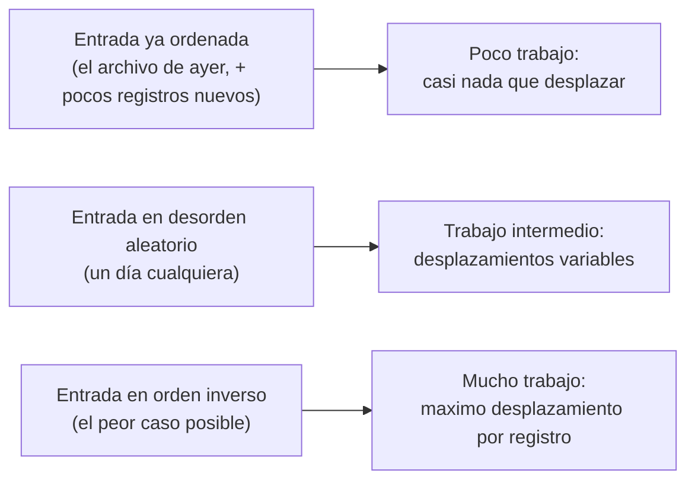
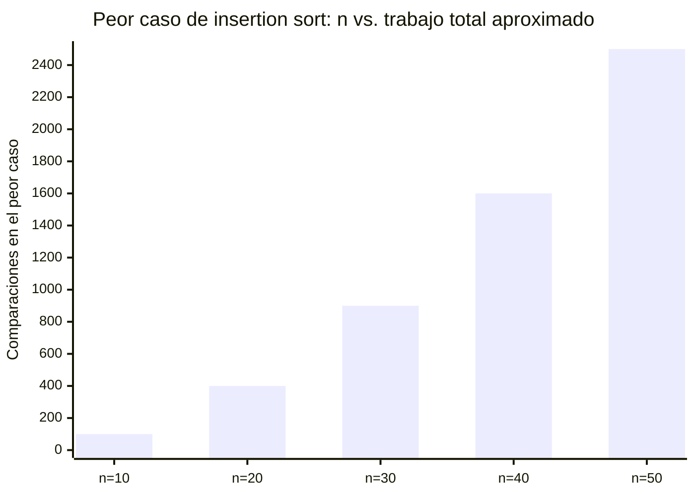
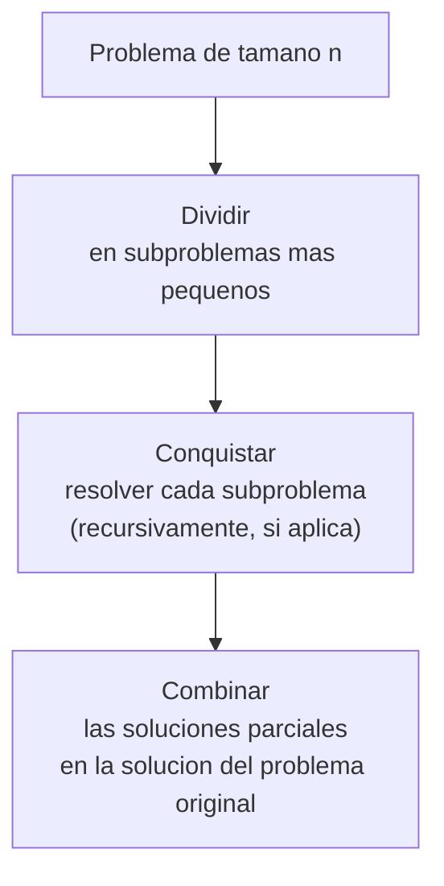
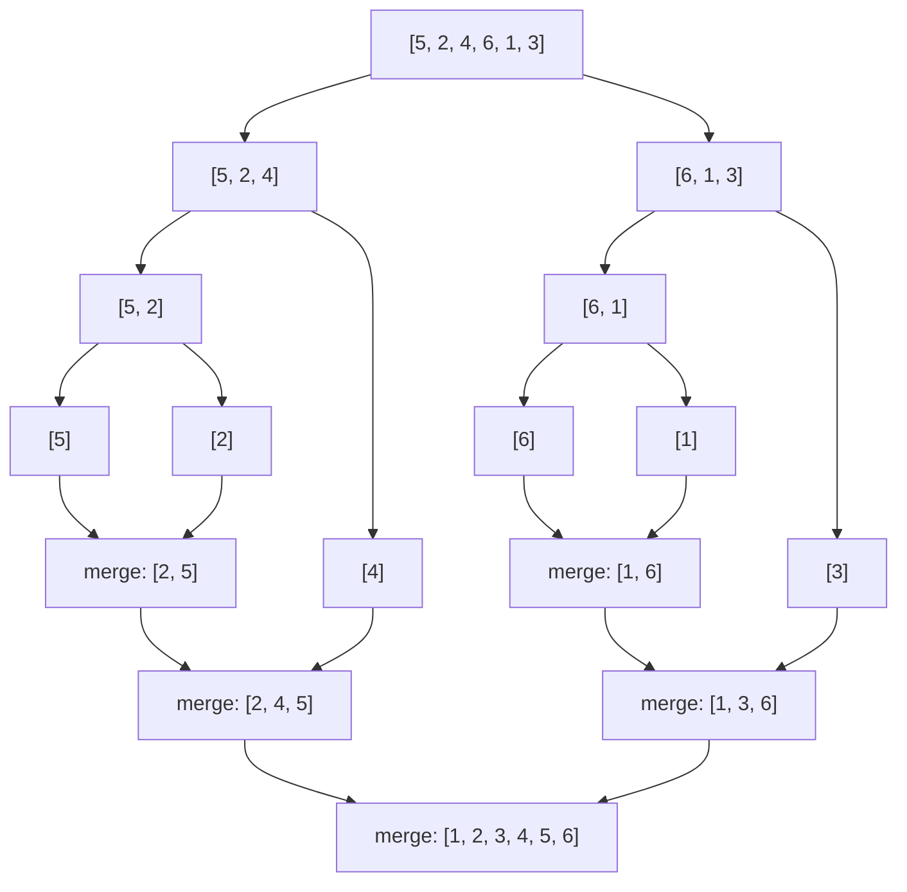

## El problema: la misma cola, la misma noche

En la lección anterior conociste a la empresa de energía metropolitana con un
proceso nocturno que no alcanza a cerrar en su ventana de cuatro horas. Ya
identificaste con ella cuatro etapas críticas: deduplicar los reportes que
llegaron repetidos, **ordenar** los registros por cuenta y fecha, detectar las
500 cuentas de mayor consumo del día, y resolver consultas puntuales del call
center. Esta lección se detiene en la segunda etapa: el ordenamiento de cerca
de 1.850.000 lecturas.

| Pregunta                        | Respuesta en esta etapa                                                                      |
| ------------------------------- | -------------------------------------------------------------------------------------------- |
| ¿Qué entra?                     | ~1.850.000 registros de lectura, en el orden en que la red los entregó                       |
| ¿Qué sale?                      | Los mismos registros, ordenados por `id_cuenta` y, dentro de cada cuenta, por `marca_tiempo` |
| ¿Qué restringe?                 | El ordenamiento comparte la ventana de 4 horas con las otras tres etapas del proceso         |
| ¿Qué operación domina el costo? | Comparar cada registro con los ya ordenados y desplazarlo hasta su posición correcta         |

La empresa ya tiene una implementación de insertion sort corriendo hace
varios años sobre este archivo — la conoces bien, la formalizaste en la
lección anterior con una invariante de ciclo que garantiza que siempre
termina ordenado. La pregunta que la empresa nunca se hizo es otra: **¿tarda
lo mismo** ordenar un archivo que llega casi ordenado —porque ayer ya estaba
ordenado y hoy solo se agregaron unos pocos registros nuevos— que uno que
llega en desorden total, o en el peor desorden posible?

## Dos preguntas distintas: cuánto tarda y cuánta memoria usa

Cuando la empresa de energía pregunta "¿qué tan eficiente es este proceso de
ordenamiento?", en realidad está mezclando dos preguntas separadas. Una es la
que ya la urge: ¿cuánto **tiempo** tarda en ordenar 1.850.000 lecturas, y
alcanza a caber en la ventana de 4 horas? La otra rara vez se hace en voz
alta, pero también tiene costo real: ¿cuánta **memoria** adicional necesita el
servidor mientras ordena, más allá del espacio que ya ocupan las lecturas?
Un servidor tiene RAM limitada igual que tiene horas limitadas — un algoritmo
que resuelve el problema a tiempo pero agota la memoria disponible también
falla.

- **Complejidad temporal:** cuánto tiempo —o, de forma equivalente, cuántas
  operaciones básicas— tarda un algoritmo en función del tamaño de la entrada
  `n`. Es lo que ya vienes midiendo desde insertion sort: cada comparación y
  cada desplazamiento del `while` interno es una operación que cuentas para
  saber cómo escala el algoritmo con `n`.
- **Complejidad espacial:** cuánta memoria adicional —más allá de la entrada
  misma— necesita el algoritmo en función de `n`. Cuenta variables auxiliares,
  estructuras temporales y, en un algoritmo recursivo, la memoria que ocupa la
  pila de llamadas mientras espera el resultado de cada llamada más pequeña.
  Insertion sort, por ejemplo, ordena **in place**: no reserva estructuras
  auxiliares que crezcan con `n`.

Ambas se miden y se comparan con las mismas herramientas matemáticas: la
notación asintótica que se formaliza en la próxima lección (O, Θ, Ω) no es
exclusiva del tiempo — se aplica igual a una función de espacio en función de
`n`. Este módulo, y la mayor parte del curso, se concentra en complejidad
**temporal**, porque es la que más urge resolver en el caso de la empresa de
energía; la complejidad espacial no desaparece, y se nombra cada vez que sea
relevante para una decisión de diseño.

## ¿Insertion sort tarda igual con cualquier entrada?

Antes de medir nada, vale la pena instalar la intuición. Piensa en tres
archivos de entrada del mismo tamaño, con un contenido radicalmente distinto.



La intuición dice que insertar un elemento que ya está cerca de su lugar
cuesta poco, e insertar uno que tiene que cruzar todo el arreglo ya ordenado
cuesta mucho. Insertion sort no es un algoritmo con un solo tiempo de
ejecución: su costo depende de **cómo** llega la entrada, no solo de **cuántos**
registros trae.

## Peor caso, mejor caso y caso promedio

Formaliza esa intuición sobre la función `insertion_sort` que ya escribiste
en la lección anterior. Su costo dominante es el ciclo `while` interno: por
cada elemento `i`, ese ciclo compara y, si hace falta, desplaza los elementos
mayores que `clave` hacia la derecha.

- **Mejor caso:** el arreglo ya está ordenado. Para cada `i`, `arreglo[j] > clave`
  es falso desde la primera comparación — el `while` nunca desplaza nada.
  Cada elemento cuesta una sola comparación.
- **Peor caso:** el arreglo está en orden inverso. Para cada `i`, `clave` es
  menor que **todos** los elementos ya ordenados a su izquierda, así que el
  `while` los desplaza uno por uno hasta llegar al principio del arreglo. El
  elemento `i` cuesta `i` comparaciones y `i` desplazamientos.
- **Caso promedio:** en una entrada en desorden aleatorio, `clave` termina, en
  promedio, a mitad de camino dentro de la porción ya ordenada. El elemento
  `i` cuesta, en promedio, alrededor de `i / 2` comparaciones y
  desplazamientos.

| Caso          | Condición de la entrada | Trabajo del `while` al insertar el elemento `i` |
| ------------- | ----------------------- | ----------------------------------------------- |
| Mejor caso    | Ya ordenada             | 1 comparación, 0 desplazamientos                |
| Peor caso     | Orden inverso           | `i` comparaciones, `i` desplazamientos          |
| Caso promedio | Orden aleatorio         | ≈ `i / 2` comparaciones y desplazamientos       |

El archivo de la empresa de energía casi nunca llega ya ordenado ni en el
peor orden posible: llega en un desorden más cercano al caso promedio, pero
con la posibilidad real de acercarse al peor caso en una noche con muchos
reintentos de red fuera de orden. Diseñar pensando solo en el mejor caso es
optimismo; diseñar pensando solo en el promedio, sin conocer el peor caso,
es no saber qué tan mal puede llegar a comportarse el sistema.

## Del análisis exacto a la intuición de crecimiento

El peor caso de insertion sort no crece de forma pareja con el tamaño de la
entrada. Compara el trabajo total —la suma de las comparaciones de cada
elemento `i`, desde 1 hasta `n`— para distintos valores de `n`:



Cuando `n` pasa de 20 a 40 —el doble de registros— el trabajo no pasa de 400
a 800: pasa de 400 a 1.600, **cuatro veces más**. Esa es la firma de un
crecimiento cuadrático: para `n` grande, duplicar la entrada casi cuadruplica
el trabajo del peor caso. Con 1.850.000 registros, ese efecto deja de ser una
curiosidad de tabla y se convierte en la diferencia entre cerrar la ventana
operativa o no cerrarla. Formalizar con precisión qué significa "crecer como
`n` al cuadrado" —y comparar ese crecimiento con el de otros algoritmos de
forma rigurosa— es el tema de la próxima lección; por ahora basta con la
intuición de que el peor caso de insertion sort escala mal.

## Antes de dividir: qué es la recursividad

Divide y vencerás, que viene a continuación, se apoya en una idea que todavía
no has usado en el curso: una función que resuelve un problema llamándose a
sí misma sobre una versión más pequeña del mismo problema. Antes de aplicarla
a ordenar, vale la pena verla en un ejemplo simple y ajeno al ordenamiento.

Toda función recursiva necesita dos partes:

- **Caso base:** una versión del problema tan pequeña que se puede responder
  directamente, sin volver a llamar a la función. Sin esto, la función nunca
  para.
- **Caso recursivo:** resuelve el problema en términos de una versión más
  pequeña de sí mismo, y confía en que esa llamada más pequeña —eventualmente—
  llega al caso base.

```python
def factorial(n: int) -> int:
    """Calcula el factorial de n mediante recursividad.

    Args:
        n: entero no negativo del que se calcula el factorial.

    Returns:
        El producto de todos los enteros entre 1 y n (1 si n es 0).
    """
    if n == 0:
        return 1  # caso base: no hay que llamar de nuevo a factorial

    return n * factorial(n - 1)  # caso recursivo: un problema mas pequeno
```

Cada llamada a `factorial` espera el resultado de la llamada más pequeña
antes de poder devolver el suyo — las llamadas se van apilando hasta llegar
al caso base, y desde ahí la pila se "deshace" hacia atrás, multiplicando en
cada paso.

## Cuando dividir el problema ayuda más que recorrerlo

Insertion sort ataca el arreglo completo con un único recorrido: cada
elemento nuevo se compara, en el peor caso, contra todos los que ya
insertaste. Hay una estrategia de diseño distinta, que no intenta acelerar
ese recorrido, sino evitarlo: en vez de resolver el problema completo de una
sola pasada, lo parte en pedazos más pequeños del mismo problema, los
resuelve por separado, y junta esas soluciones parciales en la solución
final.



Esta estrategia se llama **divide y vencerás**, y no es un parche sobre
insertion sort: es un esquema de diseño distinto, aplicable a problemas muy
distintos entre sí. Lo que la hace valiosa aquí es que un subproblema de la
mitad de tamaño es, para muchos algoritmos, mucho más barato de resolver que
la mitad del trabajo del problema completo — como verás enseguida con el
ordenamiento.

## Merge sort: dividir, conquistar, combinar

**Situación:** aplica divide y vencerás al problema de ordenar. Si dividir el
arreglo `[5, 2, 4, 6, 1, 3]` a la mitad, ordenar cada mitad por separado y
después combinarlas resulta más barato que insertarlos uno por uno, tienes un
algoritmo distinto para la misma tarea.

**En la práctica**, ese algoritmo es **merge sort**: divide el arreglo a la
mitad de forma recursiva hasta llegar a sublistas de un solo elemento —que ya
están ordenadas por definición— y las combina de regreso en orden, dos a la
vez, hasta reconstruir el arreglo completo.



```python
def merge_sort(arreglo: list[int]) -> list[int]:
    """Ordena una lista de menor a mayor mediante divide y venceras.

    Divide el arreglo a la mitad de forma recursiva hasta llegar a
    sublistas de un elemento (ya ordenadas por definicion), y las
    combina de vuelta en orden mediante la funcion auxiliar merge.

    Args:
        arreglo: lista de elementos comparables entre si.

    Returns:
        Una nueva lista con los mismos elementos, ordenada de menor
        a mayor.
    """
    if len(arreglo) <= 1:
        return arreglo

    mitad = len(arreglo) // 2
    izquierda = merge_sort(arreglo[:mitad])
    derecha = merge_sort(arreglo[mitad:])

    return merge(izquierda, derecha)


def merge(izquierda: list[int], derecha: list[int]) -> list[int]:
    """Combina dos listas ya ordenadas en una unica lista ordenada.

    Recorre ambas listas en paralelo, comparando siempre los
    elementos al frente y copiando el menor, hasta agotar una de
    las dos; despues copia lo que quede de la otra.

    Args:
        izquierda: lista ordenada de menor a mayor.
        derecha: lista ordenada de menor a mayor.

    Returns:
        Una lista ordenada con todos los elementos de izquierda y
        derecha.
    """
    resultado: list[int] = []
    i = j = 0

    while i < len(izquierda) and j < len(derecha):
        if izquierda[i] <= derecha[j]:
            resultado.append(izquierda[i])
            i += 1
        else:
            resultado.append(derecha[j])
            j += 1

    resultado.extend(izquierda[i:])
    resultado.extend(derecha[j:])
    return resultado
```

> **Divide y vencerás aplicado a ordenar:** en vez de insertar un elemento a
> la vez contra todo lo ya ordenado, merge sort reduce el problema a
> subproblemas de la mitad de tamaño, y confía en que combinar dos mitades
> ya ordenadas es una operación barata.

## ¿Cuánto trabajo hace merge sort?

Cada llamada a `merge_sort` sobre un arreglo de tamaño `n` hace dos llamadas
recursivas sobre arreglos de tamaño `n / 2`, y después un `merge` que recorre
ambas mitades una sola vez: un costo lineal en `n`. Esa relación se escribe
como una recurrencia sobre `T(n)`, el tiempo de ejecución (o, de forma
equivalente, el número de operaciones básicas) que le toma al algoritmo
resolver una entrada de tamaño `n` — no un número fijo, sino una función de
`n`:

$$T(n) = 2T(n/2) + \Theta(n)$$

En prosa: el trabajo de ordenar `n` elementos, `T(n)`, es el trabajo de
ordenar **dos** subproblemas de la mitad del tamaño —cada uno cuesta
`T(n/2)`—, más el costo de combinarlos, que crece proporcional a `n`.

## El costo real de seguir con insertion sort

En la lección anterior calculaste el costo energético del proceso nocturno de
la empresa de energía: el servidor consume cerca de 450 W bajo carga
sostenida, y eso convierte las horas de ejecución en kilovatios-hora que
alguien paga cada año.

| Escenario                          | Tiempo por noche | Consumo en un año |
| ---------------------------------- | ---------------- | ----------------- |
| El proceso actual (insertion sort) | 9 h              | ≈ 1.478 kWh       |
| El mismo trabajo en 10 minutos     | 0,17 h           | ≈ 27 kWh          |

En esa lección esa segunda fila quedó anunciada como "el Algoritmo B, tipo
divide y vencerás" — ya lo conoces: es **merge sort**. La diferencia entre
1.478 kWh y 27 kWh al año no la produce un servidor mejor: la produce
cambiar de un esquema iterativo con peor caso cuadrático a un esquema de
divide y vencerás con un costo de combinación lineal en cada nivel de la
recursión. Es la misma decisión de diseño de la sección anterior, con una
cifra concreta detrás: casi 1.451 kWh al año de diferencia, del orden de lo
que consume un hogar completo en ese mismo periodo.

## Resumen operativo

| Aspecto           | Insertion sort                          | Merge sort                                                     |
| ----------------- | --------------------------------------- | -------------------------------------------------------------- |
| Esquema de diseño | Iterativo: inserta un elemento a la vez | Divide y vencerás: divide, conquista, combina                  |
| Mejor caso        | Lineal — arreglo ya ordenado            | Igual en todos los casos: siempre divide y combina             |
| Peor caso         | Cuadrático — arreglo en orden inverso   | Su recurrencia $T(n) = 2T(n/2) + \Theta(n)$ (aún sin resolver) |
| Memoria extra     | Ninguna — ordena in place               | Requiere espacio adicional para las mitades y el `merge`       |
| Cuándo preferirlo | Arreglos pequeños o casi ordenados      | Arreglos grandes donde el peor caso importa                    |

## Síntesis

- La eficiencia de un algoritmo se mide en dos ejes distintos: complejidad
  **temporal** (tiempo en función de `n`) y complejidad **espacial**
  (memoria adicional en función de `n`) — este módulo, y la mayor parte del
  curso, se concentra en la temporal.
- Insertion sort no tiene un único tiempo de ejecución: su costo depende de
  cómo llega la entrada, y esa dependencia se formaliza en mejor caso, peor
  caso y caso promedio.
- El peor caso ocurre con la entrada en orden inverso, donde cada elemento se
  compara y desplaza contra todos los ya ordenados; el mejor caso ocurre con
  la entrada ya ordenada, donde el `while` interno nunca desplaza nada.
- El trabajo del peor caso no crece proporcional a `n`: duplicar la entrada
  casi cuadruplica el trabajo, la firma de un crecimiento cuadrático — la
  notación formal para describir esto llega en la próxima lección.
- Una función recursiva resuelve un problema llamándose a sí misma sobre una
  versión más pequeña de ese mismo problema, apoyada en un caso base que
  detiene la recursión y un caso recursivo que se acerca a él.
- Divide y vencerás es un esquema de diseño alternativo: partir un problema
  en subproblemas más pequeños del mismo tipo, resolverlos y combinar sus
  soluciones, en vez de recorrer el problema completo de una sola pasada.
- Merge sort aplica ese esquema al ordenamiento: divide el arreglo a la mitad
  recursivamente hasta arreglos de un elemento, y los combina de regreso con
  una función de `merge` que recorre ambas mitades una sola vez.
- El costo de merge sort se describe con la recurrencia
  $T(n) = 2T(n/2) + \Theta(n)$, que esta lección deja planteada — resolverla
  con rigor es contenido del Módulo 5.
- La diferencia entre insertion sort y merge sort no es solo teórica: en el
  proceso nocturno de la empresa de energía equivale a la diferencia entre
  consumir ≈ 1.478 kWh al año o ≈ 27 kWh — casi 1.451 kWh de diferencia por
  una decisión de diseño algorítmico.
