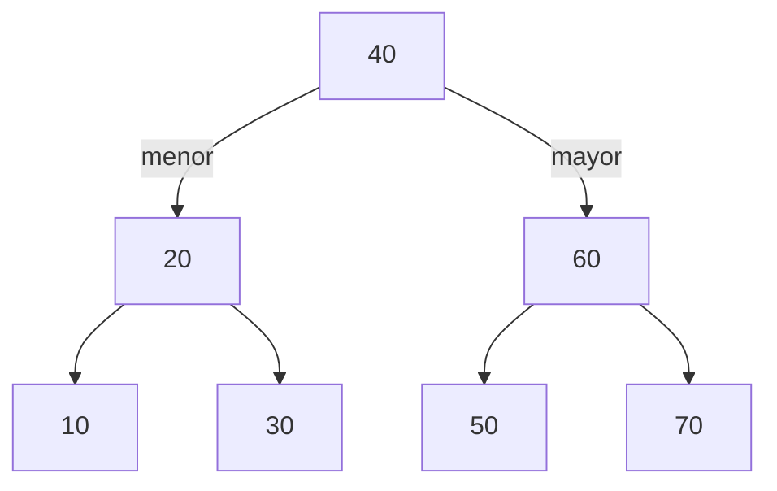

> 📖 Lectura previa a la clase — unos 12 minutos. Al final, responde la autoevaluación.

## El tablero de carpetas colgantes

El archivador con cajones de la secretaría responde muy bien a "dame la carpeta 4417", pero no sabe contestar "dame la de código menor" ni "dame todas las que van del 3000 al 4000". Cambia el mueble: un tablero de carpetas colgantes. Cuelgas la primera carpeta en el centro. Cada carpeta nueva se compara con la que ya cuelga: **si su código es menor, va a la izquierda; si es mayor, a la derecha**. Y así, bajando, hasta encontrar un hueco libre.



Vocabulario mínimo, todo sobre ese dibujo: la **raíz** es la primera carpeta (40); cada carpeta tiene a lo sumo un **hijo izquierdo** y un **hijo derecho**; una **hoja** es una carpeta sin hijos (10, 30, 50, 70); un **subárbol** es cualquier carpeta junto con todo lo que cuelga debajo de ella. La **altura** `h` es el número de niveles que hay que bajar, desde la raíz, para llegar a la carpeta más profunda: aquí `h = 2`.

## La regla de la izquierda y la derecha: propiedad y búsqueda

**Así en la vida real:** para buscar la carpeta 30 no revisas el tablero entero. Miras la raíz (40): 30 es menor, vas a la izquierda. Miras 20: 30 es mayor, a la derecha. Ahí está. En cada carpeta descartas todo un lado del tablero, igual que la búsqueda binaria en arreglo de _Cómo resolver recurrencias_ descartaba la mitad del arreglo.

**Así en código:** cada carpeta es un nodo con tres campos, como el `Nodo` de las listas enlazadas, pero con dos punteros en vez de uno.

```python
class Nodo:
    """Carpeta del tablero: una clave y dos huecos para colgar otras."""

    def __init__(self, clave: int) -> None:
        """Crea un nodo hoja.

        Args:
            clave: Código de la carpeta.
        """
        self.clave = clave
        self.izquierdo: "Nodo | None" = None
        self.derecho: "Nodo | None" = None


def buscar(raiz: "Nodo | None", clave: int) -> "Nodo | None":
    """Busca una clave bajando por el árbol.

    Args:
        raiz: Raíz del árbol (o None si está vacío).
        clave: Código que se busca.

    Returns:
        El nodo con esa clave, o None si no está.
    """
    actual = raiz
    while actual is not None and actual.clave != clave:
        actual = actual.izquierdo if clave < actual.clave else actual.derecho
    return actual
```

> **Propiedad del árbol de búsqueda binario (BST):** para todo nodo, todas las claves de su subárbol izquierdo son menores que su clave y todas las del derecho son mayores. Esa regla, aplicada en cada nodo, es lo que hace correcta la búsqueda.

## Colgar una carpeta nueva: inserción

**Así en la vida real:** la carpeta nueva baja por el tablero con la misma pregunta "¿menor o mayor?" hasta llegar a un hueco, y ahí se cuelga. Nunca se mueve una carpeta que ya estaba.

**Así en código:** bajamos guardando también el padre, para saber de qué lado colgar el nodo nuevo.

```python
def insertar(raiz: "Nodo | None", clave: int) -> Nodo:
    """Inserta una clave en el árbol; ignora las repetidas.

    Args:
        raiz: Raíz del árbol (o None si está vacío).
        clave: Código de la carpeta nueva.

    Returns:
        La raíz del árbol, que cambia solo si estaba vacío.
    """
    nuevo = Nodo(clave)
    if raiz is None:
        return nuevo
    actual = raiz
    while True:
        if clave == actual.clave:
            return raiz
        if clave < actual.clave:
            if actual.izquierdo is None:
                actual.izquierdo = nuevo
                return raiz
            actual = actual.izquierdo
        else:
            if actual.derecho is None:
                actual.derecho = nuevo
                return raiz
            actual = actual.derecho
```

Búsqueda e inserción son iterativas a propósito: bajan un nivel por vuelta del ciclo y no dejan llamadas pendientes en la pila.

## Leer el tablero en orden

**Así en la vida real:** si recorres el tablero de izquierda a derecha, las carpetas aparecen ordenadas por código, sin ordenar nada: la regla de colgado ya lo hizo. Para leerlo, por cada carpeta lees primero todo lo que cuelga a su izquierda, luego la carpeta, luego su derecha.

**Así en código:**

```python
def en_orden(nodo: "Nodo | None", salida: list[int]) -> None:
    """Agrega a salida las claves del subárbol, de menor a mayor.

    Args:
        nodo: Raíz del subárbol (o None).
        salida: Lista donde se acumulan las claves.
    """
    if nodo is not None:
        en_orden(nodo.izquierdo, salida)
        salida.append(nodo.clave)
        en_orden(nodo.derecho, salida)
```

Cada nodo se visita una vez: el recorrido cuesta $\Theta(n)$. Para el **mínimo** basta bajar siempre por la izquierda hasta una carpeta sin hijo izquierdo, y para el **máximo** por la derecha: ambos cuestan $\Theta(h)$. El borrado también existe y se apoya en el sucesor de la clave (la siguiente en el recorrido en orden), pero no lo desarrollamos aquí.

## Cuando el tablero se vuelve una fila: altura y degeneración

Buscar o insertar baja un nivel por comparación, así que ambos cuestan $\Theta(h)$: todo depende de la altura. Si las carpetas llegan en orden de código creciente (10, 20, 30, 40…), cada una es mayor que todas las anteriores y se cuelga a la derecha de la última. El tablero queda como una fila y $h = n - 1$, es decir $\Theta(n)$: la misma búsqueda lineal de una lista enlazada. Si el árbol está equilibrado, cada nivel duplica las carpetas y $h = \Theta(\log n)$.

> **Supuesto que sostiene el $\Theta(\log n)$:** que las claves lleguen en un orden que deje el árbol más o menos equilibrado. El BST por sí solo no lo garantiza. Existen **árboles balanceados** (AVL, rojo-negro) que se reacomodan al insertar para mantener $h = \Theta(\log n)$ siempre; quedan fuera de esta lectura.

## Dónde se rompe la analogía

En el tablero físico puedes elegir la primera carpeta a propósito, por ejemplo la del código del medio. En el árbol no: la raíz es simplemente la primera clave que llegó, y **la forma del árbol depende del orden de llegada**. Las mismas siete claves dan un árbol de altura 2 o una fila de altura 6 según cómo se inserten. Además, una carpeta física nunca se reacomoda sola cuando el tablero se desbalancea; un árbol balanceado sí lo hace, y ese trabajo extra es el precio de garantizar $\Theta(\log n)$.

## ¿Dónde aparece en la práctica?

En un sistema de consolidación de telemedición hay 1.850.000 cuentas. Para una consulta puntual ("lectura de la cuenta 4417") la tabla hash de la lección anterior es $\Theta(1)$ esperado y no tiene rival. El BST gana donde el hash no puede: el **mínimo y el máximo** en $\Theta(h)$, el **recorrido ordenado** en $\Theta(n)$ y los **rangos**, como todas las lecturas de una cuenta entre dos fechas (si la clave del árbol es el par cuenta-fecha), en $\Theta(h + k)$ con $k$ resultados.

> ⚠️ **Advertencia con números:** el archivo de consolidación llega ordenado por cuenta. Insertarlo en orden en un BST da $h \approx n \approx 1{,}85 \cdot 10^6$: una lista. Las inserciones sumarían unas $n^2/2 \approx 1{,}7 \cdot 10^{12}$ comparaciones (cerca de dos días a $10^7$ por segundo), frente a $n \log_2 n \approx 3{,}9 \cdot 10^7$ si el árbol estuviera equilibrado ($\log_2 n \approx 21$). Una versión recursiva fallaría con `RecursionError` pasados unos 1.000 niveles, el límite por defecto de Python, y por eso `buscar` e `insertar` son iterativos; el `en_orden` recursivo de esta lección sufriría lo mismo en un árbol así de profundo. El hash no se ve afectado por el orden de entrada.

## Síntesis

- **El tablero de carpetas:** cada clave nueva baja comparando "¿menor o mayor?" y se cuelga en un hueco; el vocabulario (raíz, hijos, hoja, subárbol, altura) describe el dibujo.
- **Propiedad y búsqueda:** izquierda menor, derecha mayor, en cada nodo; buscar descarta un lado por comparación.
- **Inserción:** la clave baja como en la búsqueda y se cuelga como hoja; nada existente se mueve.
- **Recorrido en orden:** devuelve las claves ordenadas en $\Theta(n)$; mínimo y máximo cuestan $\Theta(h)$.
- **Altura:** buscar e insertar cuestan $\Theta(h)$; entradas ordenadas dan $\Theta(n)$, árboles equilibrados dan $\Theta(\log n)$.
- **Dónde se rompe la analogía:** la forma depende del orden de llegada y el tablero físico no se reacomoda solo.
- **En la práctica:** el hash gana en la consulta puntual; el BST gana en mínimo, orden y rangos, siempre que su altura no degenere.

Lecturas: Cormen et al., _Introduction to Algorithms_, cap. 12 (secciones 12.1 a 12.3).
