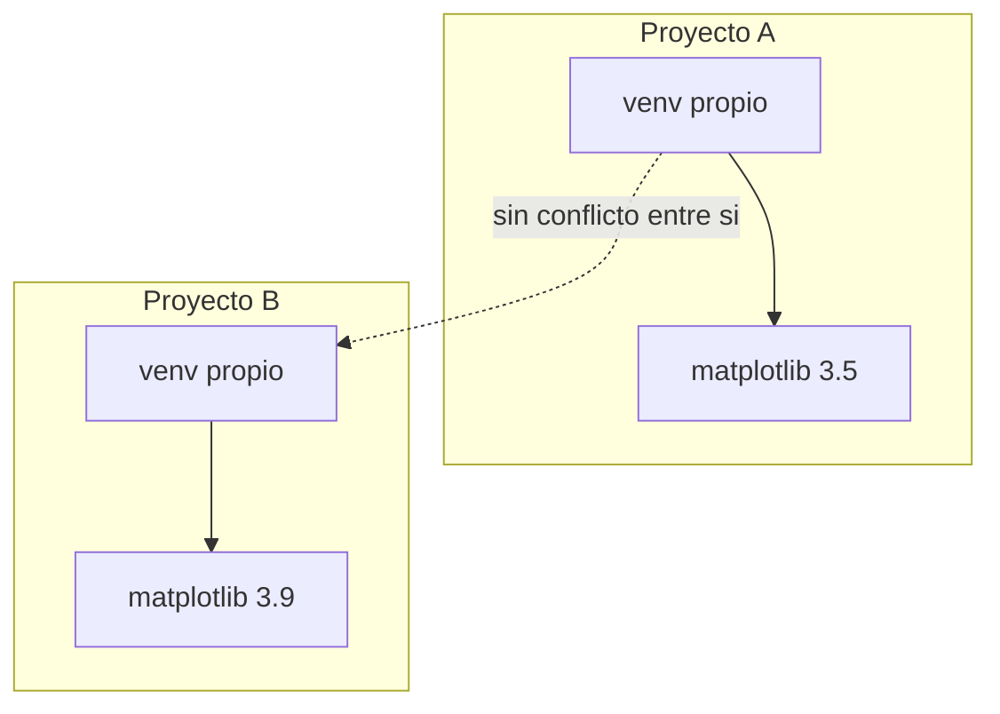

Ya escribes funciones que resuelven un algoritmo — pero un compañero que abre tu repositorio, o tú mismo dentro de tres semanas revisando un informe viejo, necesitan más que código que funcione: necesitan código legible, y un entorno que puedan reconstruir sin adivinar qué versión de `matplotlib` tenías instalada. Esta lección cierra esas dos piezas: cómo escribir Python que otros puedan leer, y cómo empaquetar las dependencias de un proyecto para que corra en cualquier máquina.

## Buenas prácticas: PEP 8, docstrings y type hints

- Nombres de variables y funciones en `snake_case` (`contar_comparaciones`, no `contarComparaciones` ni `ContarComparaciones`).
- Nombres de clases en `PascalCase` (`ListaEnlazada`).
- Máximo 79-99 caracteres por línea.
- Un espacio alrededor de operadores y después de cada coma (`s = s + x`, no `s=s+x`).

```python
# Estilo a evitar
def EsPrimo(N):
    if N<2:
        return False
    for i in range(2,N):
        if N%i==0:
            return False
    return True

# PEP 8, type hints y docstring
def es_primo(numero: int) -> bool:
    """Determina si un numero es primo.

    Args:
        numero: entero a evaluar.

    Returns:
        True si numero es primo, False en caso contrario.
    """
    if numero < 2:
        return False
    for i in range(2, numero):
        if numero % i == 0:
            return False
    return True
```

> **`if __name__ == "__main__":`** protege el punto de entrada de un script: el código dentro de ese bloque (normalmente una llamada a `main()`) solo se ejecuta cuando el archivo corre directamente, no cuando otro módulo lo importa. Es la convención estándar para separar "definir funciones" de "ejecutar el programa. En palabras simples utilice esta convención para ejecutar el programa."

```python
def es_primo(numero: int) -> bool:
    """Determina si un numero es primo."""
    if numero < 2:
        return False
    for i in range(2, numero):
        if numero % i == 0:
            return False
    return True


def main() -> None:
    """Punto de entrada del script."""
    print(es_primo(17))


if __name__ == "__main__":
    main()
```

Dos anotaciones más documentan la intención del código sin obligar a leer su cuerpo completo:

- **Type hints** (`numero: int`, `-> bool`): anotan el tipo esperado de cada parámetro y del valor de retorno, igual que `lista: list` y `-> int` en `contar_comparaciones`. Python no los obliga en tiempo de ejecución — pasar un `str` donde se espera un `list` no lanza error solo por eso —, pero documentan la intención y permiten que el editor detecte inconsistencias antes de ejecutar el programa.
- **Docstrings** en formato Google-style (`Args:`, `Returns:`): documentan qué hace la función, qué recibe y qué devuelve. En un informe de laboratorio, un docstring bien escrito suele ser la diferencia entre un lector que entiende tu código en diez segundos y uno que tiene que rastrear cada línea.

> **PEP 8:** guía de estilo oficial de Python. No es un capricho estético: código que la sigue es más fácil de leer, revisar y mantener — especialmente en un repositorio compartido, como el que ya usas desde la Semana 1.

## PIP: el gestor de paquetes de Python

**Situación:** `matplotlib`, la librería que vas a usar para graficar tiempos y operaciones, no viene incluida en Python. Antes de poder hacer `import matplotlib`, necesitas conseguirla e instalarla desde algún lugar.

**En la práctica**, Python resuelve esto con **pip**, el gestor de paquetes que se instala junto con el intérprete. `pip` descarga librerías desde **PyPI** (_Python Package Index_), el repositorio público donde miles de proyectos — incluido `matplotlib` — publican sus versiones, y las instala junto con sus propias dependencias:

```bash
pip install matplotlib          # instala la ultima version publicada
pip install matplotlib==3.9.0   # instala una version exacta
pip list                        # lista lo instalado en este interprete
pip freeze                      # lo mismo, en el formato que espera requirements.txt
```

> **`pip`:** gestor de paquetes de Python. Instala librerías publicadas en PyPI (como `matplotlib`) junto con las dependencias que ellas mismas necesitan, sin que tengas que buscarlas ni instalarlas a mano una por una.

Hay un problema con `pip install` tal como se ve arriba: instala directamente sobre el intérprete de Python de tu máquina, compartido por todos tus proyectos. Si dos proyectos necesitan versiones distintas de `matplotlib`, se pisan entre sí. Eso es exactamente lo que resuelven los entornos virtuales.

## Entornos virtuales y `requirements.txt`

Los entornos virtuales son un mecanismo para aislar las dependencias de un proyecto de las de otros proyectos en la misma máquina. Esto es especialmente importante cuando diferentes proyectos requieren distintas versiones de la misma librería. Los entornos virtuales crean una copia aislada del intérprete y sus paquetes, exclusiva de un proyecto.



> **Entorno virtual:** copia aislada del intérprete de Python y sus paquetes instalados, propia de un proyecto. Evita que las dependencias de un proyecto interfieran con las de otro.

Crear un entorno virtual es tan simple como ejecutar:

```bash
python -m venv venv          # crea un entorno virtual llamado 'venv'
source venv/bin/activate     # activa el entorno virtual (Linux/Mac)
venv\Scripts\activate        # activa el entorno virtual (Windows)
```

Falta una pieza: **`requirements.txt`**, el registro reproducible de esas dependencias. **Situación:** tu entorno virtual ya tiene `matplotlib` instalado y tu script funciona — pero ese entorno vive solo en tu máquina. Si subes el script a GitHub (como ya haces desde la Semana 1) y otra persona lo clona, o tú mismo lo abres en otro computador, no hay ningún `venv` ahí: solo el código, sin sus dependencias.

**En la práctica**, `requirements.txt` es un archivo de texto plano que lista cada paquete instalado junto con su versión exacta. Se genera automáticamente a partir del entorno virtual activo, y sirve para reconstruirlo en cualquier otra máquina:

```bash
pip freeze > requirements.txt        # vuelca lo instalado al archivo
pip install -r requirements.txt      # reinstala exactamente esas versiones
```

Un `requirements.txt` típico se ve así — una librería por línea, con `==` fijando la versión exacta:

```text
matplotlib==3.9.2
numpy==2.1.1
```

> **`requirements.txt`:** registro reproducible de las dependencias de un proyecto y sus versiones exactas. Se versiona en Git junto con el código (no el `venv` en sí, que es pesado y específico de cada máquina), para que cualquiera pueda recrear el mismo entorno con `pip install -r requirements.txt`.
