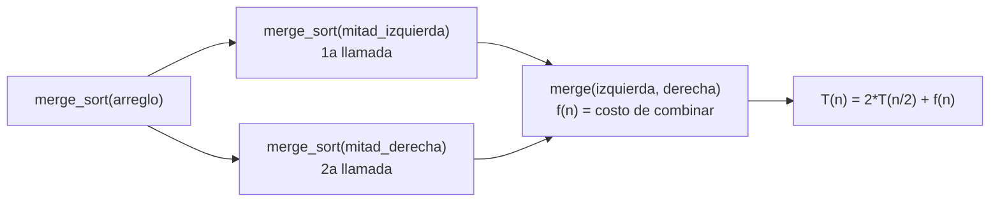
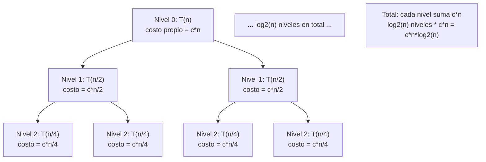
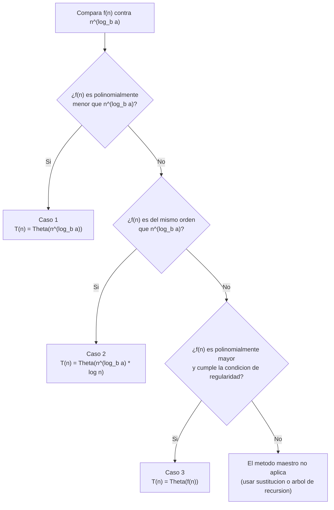
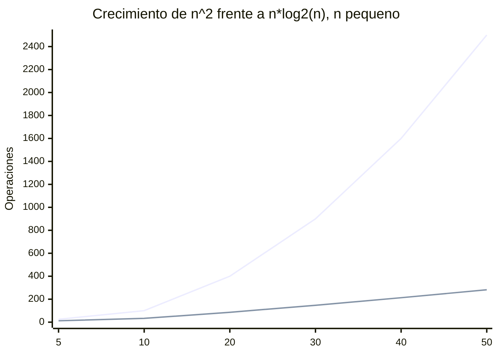

## El problema: una promesa sin cumplir

La lección anterior cerró con dos afirmaciones que no dejaste en igualdad de
condiciones. El peor caso de insertion sort quedó establecido con precisión:
contaste el costo de cada elemento `i` (`i` comparaciones y desplazamientos),
viste que ese trabajo crece de forma cuadrática, y le pusiste nombre formal
con las definiciones de la Semana 5: `Θ(n²)`. Merge sort recibió un trato
distinto — quedó descrito por una recurrencia,

$$T(n) = 2T(n/2) + \Theta(n)$$

y una afirmación sin demostrar: que esa recurrencia, "resuelta", da
`Θ(n log n)`. Nunca viste el paso de una cosa a la otra.

"Tiene una recurrencia" no es una respuesta al problema de la empresa de
energía. Una recurrencia describe el costo de un algoritmo en términos de sí
mismo — `T(n)` depende de `T(n/2)`, que depende de `T(n/4)`, y así
sucesivamente — pero no te dice, en una sola mirada, si esa cadena de
dependencias crece como `n`, como `n log n` o como `n²`. Hace falta un
método para pasar de la recurrencia a una fórmula cerrada, algo que puedas
evaluar directamente y comparar contra otras funciones de tiempo. Esta
lección es ese método — en realidad, tres métodos distintos, que conducen al
mismo resultado por caminos independientes. Es el contenido del capítulo 4
de Cormen, *Introduction to Algorithms*, dedicado enteramente a recurrencias
y divide y vencerás.

## Planteamiento de una recurrencia

**Situación:** tienes el código recursivo de un algoritmo de divide y
vencerás y necesitas describir su costo como una función de `n`, no como una
traza de llamadas.

**En la práctica**, toda recurrencia de divide y vencerás tiene la misma
forma general:

$$T(n) = a\,T(n/b) + f(n)$$

Cada término tiene un significado concreto:

- `a`: el número de subproblemas en los que se divide la entrada en cada
  llamada.
- `n/b`: el tamaño de cada subproblema — la entrada se divide entre `b`, no
  necesariamente en `a` partes iguales a `a`.
- `f(n)`: el costo de dividir la entrada y combinar las soluciones de los
  subproblemas, sin contar el trabajo de las llamadas recursivas mismas.

Para merge sort, el código recursivo se traduce directamente:

Dos llamadas recursivas (`a = 2`), cada una sobre la mitad de la entrada
(`b = 2`), más el costo de la función `merge` que recorre los dos arreglos
ya ordenados y los intercala — un recorrido lineal, `f(n) = Θ(n)`. De ahí
sale exactamente la recurrencia que la lección anterior dejó pendiente:
`T(n) = 2T(n/2) + Θ(n)`.

La forma general cubre más casos que solo merge sort. La búsqueda binaria,
por ejemplo, en cada llamada descarta la mitad de la entrada y solo continúa
sobre la otra mitad: una única llamada recursiva (`a = 1`) sobre la mitad de
la entrada (`b = 2`), con un costo de combinar constante — comparar la clave
contra el elemento medio, `f(n) = Θ(1)`. Su recurrencia es
`T(n) = T(n/2) + Θ(1)`, mucho más liviana que la de merge sort porque `a` es
1 en vez de 2: no hay dos ramas que atender, solo una.

## El método de sustitución

**Situación:** sospechas cuál es la solución cerrada de una recurrencia,
pero una sospecha no es una prueba.

**En la práctica**, el método de sustitución consiste en adivinar la forma
de la solución y demostrarla por inducción matemática — no "adivinar y ya",
sino "adivinar y demostrar". Aplícalo a `T(n) = 2T(n/2) + \Theta(n)`,
usando `cn` para representar el término `\Theta(n)` con una constante
concreta:

1. **Hipótesis:** conjetura que `T(n) \le c\,n\log n` para alguna constante
   `c > 0` y para todo `n \ge n_0`.
2. **Sustituir la hipótesis en la recurrencia**, asumiendo que se cumple
   para `n/2` (paso inductivo):
   $$T(n) \le 2\left(c\,\frac{n}{2}\log\frac{n}{2}\right) + cn$$
3. **Simplificar** el lado derecho:
   $$T(n) \le c\,n\log\frac{n}{2} + cn = c\,n\log n - c\,n\log 2 + cn = c\,n\log n - cn + cn = c\,n\log n$$
   porque `\log 2 = 1`. El término `-cn` que aparece al expandir
   `\log(n/2)` es justo lo que cancela el `+cn` del costo de combinar — esa
   cancelación es la razón por la que la hipótesis `cn\log n` funciona y una
   hipótesis más débil, como `cn`, no lo haría.
4. **Verificar que la desigualdad se sostiene**: el resultado es exactamente
   `T(n) \le c\,n\log n`, la misma forma de la hipótesis. La inducción se
   cierra.
5. **Caso base:** elegir `n_0` lo bastante grande para que la desigualdad
   valga también ahí (para `n = 1`, `\log n = 0` y la hipótesis exigiría
   `T(1) \le 0`, que es falso salvo que `T(1) = 0`; por eso se elige un
   `n_0 \ge 2` donde el caso base sí se cumple con una constante `c`
   suficientemente grande).

Con la hipótesis demostrada por inducción, `T(n) = O(n\log n)`. El mismo
procedimiento, invirtiendo la desigualdad, demuestra `T(n) = \Omega(n\log n)`
— y ambas cotas juntas dan `T(n) = \Theta(n\log n)`.

## El método del árbol de recursión

**Situación:** el método de sustitución exige adivinar la forma correcta
desde el principio, y en `T(n) = 2T(n/2) + \Theta(n)` esa forma —
`n\log n`, y no `n` o `n²` — no es obvia a simple vista. Necesitas una forma
de generarla, no solo de verificarla.

**En la práctica**, el árbol de recursión visualiza la recurrencia como una
jerarquía: cada nodo es un subproblema, y sus hijos son las llamadas
recursivas que ese subproblema genera. Sumar el trabajo de cada nivel y
sumar todos los niveles produce la solución.

En el nivel 0 hay un subproblema de tamaño `n`, con costo de combinar `cn`.
En el nivel 1 hay dos subproblemas de tamaño `n/2`, cada uno con costo
`c(n/2)` — el total del nivel sigue siendo `cn`. En el nivel 2 hay cuatro
subproblemas de tamaño `n/4`, cada uno con costo `c(n/4)`, y el total del
nivel es otra vez `cn`. El patrón se repite: aunque cada nivel tiene el
doble de subproblemas que el anterior, cada uno cuesta la mitad, así que
**el trabajo total por nivel es siempre `cn`**, sin importar cuántos
subproblemas contenga.

El árbol tiene `\log_2 n` niveles — tantos como veces se puede dividir `n`
entre 2 hasta llegar a subproblemas de tamaño 1. Sumar el costo `cn` de cada
uno de esos `\log_2 n` niveles da el total:

$$T(n) = cn \cdot \log_2 n = \Theta(n\log n)$$

El árbol de recursión no reemplaza al método de sustitución: es una
herramienta para **generar** la conjetura — aquí, que la respuesta es
`n\log n` — que después conviene verificar formalmente por inducción, como
en la sección anterior. Usado sin esa verificación posterior, el árbol es
una intuición fuerte, no una demostración.

## El método maestro

**Situación:** el método de sustitución exige adivinar y el árbol de
recursión exige dibujar toda la jerarquía. Para la familia de recurrencias
más común en divide y vencerás, existe un atajo: comparar directamente los
términos de la recurrencia contra una fórmula, sin resolver nada a mano.

**En la práctica**, el método maestro aplica a toda recurrencia de la forma
`T(n) = a\,T(n/b) + f(n)` con `a \ge 1` y `b > 1`. Compara `f(n)` contra
`n^{\log_b a}` y distingue tres casos:

- **Caso 1:** si `f(n)` es polinomialmente **menor** que `n^{\log_b a}` —es
  decir, `f(n) = O(n^{\log_b a - \epsilon})` para algún `\epsilon > 0`—,
  entonces `T(n) = \Theta(n^{\log_b a})`. El costo de combinar es
  insignificante frente al costo de las llamadas recursivas.
- **Caso 2:** si `f(n)` es del **mismo orden** que `n^{\log_b a}` —es decir,
  `f(n) = \Theta(n^{\log_b a})`—, entonces
  `T(n) = \Theta(n^{\log_b a}\log n)`. Combinar y recursar pesan lo mismo en
  cada nivel, y esa igualdad se paga con un factor `log n` extra.
- **Caso 3:** si `f(n)` es polinomialmente **mayor** que `n^{\log_b a}` —es
  decir, `f(n) = \Omega(n^{\log_b a + \epsilon})`— y además se cumple la
  **condición de regularidad** `a\,f(n/b) \le c\,f(n)` para alguna constante
  `c < 1` y `n` suficientemente grande, entonces `T(n) = \Theta(f(n))`. El
  costo de combinar domina y las llamadas recursivas son irrelevantes.

Aplícalo a `T(n) = 2T(n/2) + \Theta(n)`: `a = 2`, `b = 2`, así que
`n^{\log_b a} = n^{\log_2 2} = n^1 = n`. El costo de combinar es
`f(n) = \Theta(n)`, exactamente del mismo orden que `n^{\log_b a} = n`. Cae
en el caso 2, y la fórmula da directamente
`T(n) = \Theta(n^{\log_b a}\log n) = \Theta(n\log n)`.

## La recurrencia resuelta

Los tres métodos —sustitución, árbol de recursión y método maestro— llegan
al mismo resultado para la misma recurrencia:
`T(n) = 2T(n/2) + \Theta(n) = \Theta(n\log n)`. Esa coincidencia no es
casualidad: es la misma recurrencia resuelta de tres formas independientes,
cada una verificando a las otras dos.

Con esto, la promesa de la Semana 5 queda cumplida. El peor caso de
insertion sort es `\Theta(n²)`, ya establecido desde esa lección. Merge sort,
en cualquier caso —mejor, peor o promedio, porque su recurrencia no depende
de cómo llegue la entrada—, es `\Theta(n\log n)`. Con el respaldo formal
completo, puedes retomar la cifra de la empresa de energía: sobre el
proceso nocturno de una máquina que consume 450 W, el algoritmo `Θ(n²)`
corriendo su turno completo de 9 horas diarias durante un año consume
aproximadamente 1.478 kWh; el algoritmo `Θ(n\log n)`, resuelto en una
fracción de ese tiempo, consume aproximadamente 27 kWh en el mismo período.
Esa diferencia de casi 55 veces no es una estimación optimista — es lo que
predice la recurrencia, ahora demostrado por tres caminos distintos.

Para `n` grande la brecha es todavía mayor —a `n = 5.000`, `n²` vale
25.000.000 frente a apenas 61.439 de `n \log_2 n`, una diferencia de más de
400 veces—, pero graficar ese rango completo aplastaría las curvas de la
parte pequeña contra el eje. El gráfico de arriba usa un rango chico
justamente para que se vea cómo empieza a abrirse la brecha, no solo cuánto
mide al final.

## Resumen operativo

| Método | Cuándo usarlo | Qué necesita | Limitación principal |
| --- | --- | --- | --- |
| Sustitución | Cuando ya tienes una sospecha fundamentada de la solución | Adivinar la forma correcta antes de empezar | Si la conjetura inicial es incorrecta, la inducción no cierra y hay que reintentar |
| Árbol de recursión | Cuando no sabes qué conjeturar y necesitas generarla | Dibujar y sumar el costo de cada nivel | Es intuitivo pero informal — conviene verificar el resultado con sustitución después |
| Método maestro | Cuando la recurrencia tiene la forma exacta `aT(n/b) + f(n)` y quieres una respuesta rápida | Comparar `f(n)` contra `n^{\log_b a}` | No cubre todas las formas de `f(n)`, en particular cuando no es polinomialmente comparable con `n^{\log_b a}` |

## Síntesis

- El problema pendiente de las lecciones anteriores era pasar de una
  recurrencia como `T(n) = 2T(n/2) + \Theta(n)` a una fórmula cerrada que se
  pudiera comparar directamente contra otras funciones de tiempo.
- Toda recurrencia de divide y vencerás tiene la forma general
  `T(n) = aT(n/b) + f(n)`, donde `a` es el número de subproblemas, `n/b` su
  tamaño y `f(n)` el costo de dividir y combinar.
- El método de sustitución adivina la forma de la solución y la demuestra
  por inducción matemática, verificando que la hipótesis se sostiene al
  sustituirla en la propia recurrencia.
- El método del árbol de recursión visualiza la jerarquía de subproblemas y
  suma el trabajo nivel por nivel, generando la conjetura que la sustitución
  después verifica.
- El método maestro compara `f(n)` contra `n^{\log_b a}` y resuelve la
  recurrencia en tres casos, sin dibujar ni adivinar nada, cuando la
  recurrencia tiene exactamente esa forma.
- Los tres métodos, aplicados a la misma recurrencia de merge sort, confirman
  el mismo resultado: `Θ(n log n)`, cerrando formalmente la comparación con
  el `Θ(n²)` de insertion sort.
- Con estos tres caminos puedes tomar cualquier recurrencia de divide y
  vencerás de la forma `T(n) = aT(n/b) + f(n)` y resolverla por al menos dos
  métodos distintos — vocabulario que se pondrá en práctica sobre nuevas
  estrategias algorítmicas más adelante en el curso.
