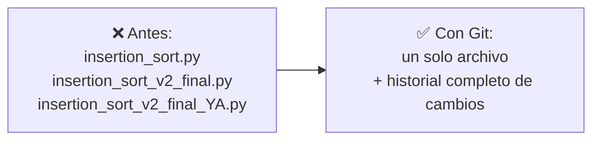
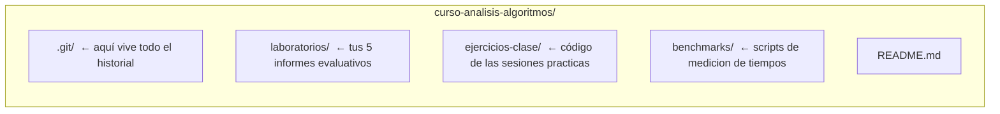
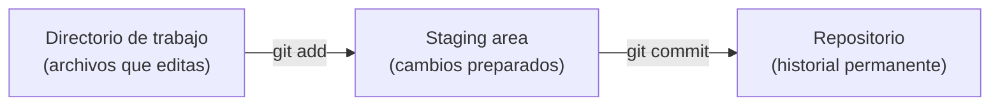
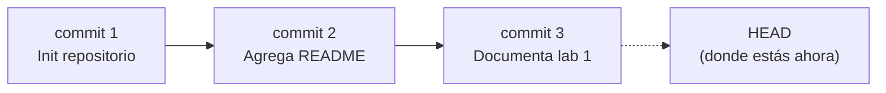
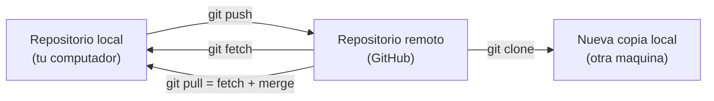
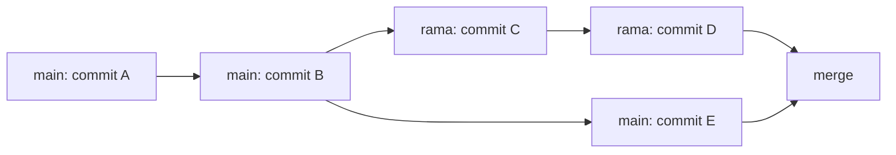
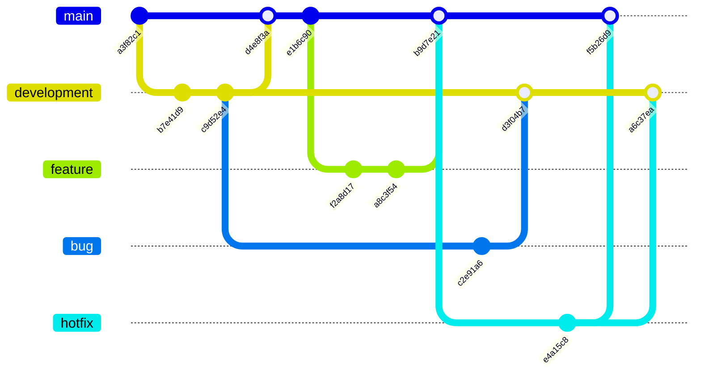

## El problema: proyectos sin memoria

Imagina que estás implementando el algoritmo de ordenamiento que te piden en el primer laboratorio de este curso. Para "no perder nada", vas guardando copias del archivo:

```text
insertion_sort.py
insertion_sort_v2.py
insertion_sort_v2_final.py
insertion_sort_v2_final_YA.py
insertion_sort_v2_final_YA_arreglado.py
```

- ¿Cuál versión es la que realmente pasa todos los casos de prueba?
- ¿Qué cambiaste exactamente entre una copia y la siguiente?
- Si borraste sin querer una optimización que sí funcionaba ayer, ¿cómo la recuperas?
- Ahora súmale un compañero de equipo que trabaja **al mismo tiempo** que tú sobre el mismo código, enviándolo por correo o USB o por WhatsApp.

Esto no es un problema de sintaxis ni de lógica del algoritmo: es un problema de **gestión de cambios en el tiempo**. Y es exactamente el problema que resuelve el control de versiones.

## Más problemas que resuelve el control de versiones

El ejemplo de las copias manuales es solo uno de varios escenarios donde la falta de control de versiones se convierte en un dolor de cabeza:

**1. Un cambio nuevo rompe lo que ya funcionaba**
Estás implementando el algoritmo de ordenamiento que te pide el laboratorio. Ya tienes tres casos de prueba pasando. Al intentar optimizar el algoritmo, algo sale mal: el cambio se daña y, sin darte cuenta, ese error también rompe los casos que ya funcionaban. Sin un historial de cambios, no tienes forma de volver al punto exacto donde todo funcionaba — tocaría reescribir desde cero o depurar a ciegas.

**2. Juntar el trabajo de dos personas**
Tú y un compañero trabajan sobre el mismo repositorio al mismo tiempo. Cada uno edita partes distintas (o a veces las mismas) del código o del informe. Al final del día, ¿cómo combinan ambos trabajos sin que uno sobrescriba al otro? Copiar y pegar archivos a mano es lento y propenso a errores — casi siempre alguien termina perdiendo parte de su trabajo.

**3. Cambias de opinión sobre tu propia solución**
Implementaste una versión del algoritmo, la probaste y funciona bien. Una semana después, mientras revisas el enunciado del laboratorio, notas que tu primer enfoque era mejor que el que llevas ahora. Sin un registro de versiones, "como estaba antes" es solo un recuerdo impreciso — no un estado real y recuperable del proyecto.

Los tres problemas comparten algo: todos requieren poder **volver atrás** o **combinar cambios** de forma confiable, en vez de depender de la memoria o de archivos duplicados. Git resuelve el primero y el tercero con el historial de commits que vemos hoy (`git log`, y comandos como `checkout`/`revert` que se profundizan en el laboratorio); el segundo requiere además trabajar con **ramas** (`branch`, `merge`), tema de la sesión T2.

## La solución: un sistema que recuerda por ti

En vez de copias manuales, un **sistema de control de versiones** guarda automáticamente cada cambio significativo del proyecto, con quién lo hizo, cuándo y por qué — sin duplicar archivos.



**Git** es el sistema de control de versiones más usado en la industria. Es **distribuido**: cada persona tiene una copia completa del historial del proyecto en su propia máquina, no depende de un único servidor central.

> Definición formal: el **control de versiones** es la práctica de registrar los cambios realizados sobre uno o varios archivos a lo largo del tiempo, de modo que se pueda recuperar cualquier versión anterior cuando se necesite.

## Material adicional: descarga e instalación de Git

Antes de crear tu primer repositorio necesitas tener Git instalado en tu máquina. El siguiente video cubre la descarga e instalación paso a paso en los distintos sistemas operativos:

<YouTubeEmbed id="jdXKwLNUfmg" title="Descarga e instalación de Git" />

## La terminal: donde vas a escribir todo esto

**Situación:** cada comando de Git que verás de aquí en adelante (`git init`, `git add`, `git commit`...) no se hace haciendo clic en botones — se escribe. Necesitas saber dónde escribirlo.

**En la práctica**, la **terminal** (o línea de comandos) es una ventana de texto donde escribes instrucciones y el sistema operativo las ejecuta directamente, sin pasar por menús gráficos. Antes de usar Git necesitas moverte por carpetas y archivos desde ahí:

| Comando                                               | ¿Qué hace?                                            |
| ----------------------------------------------------- | ----------------------------------------------------- |
| `pwd`                                                 | Muestra la carpeta en la que estás parado ahora mismo |
| `ls` (`dir` en Windows)                               | Lista los archivos y carpetas del directorio actual   |
| `cd <carpeta>`                                        | Entra a esa carpeta                                   |
| `cd ..`                                               | Sube un nivel, a la carpeta contenedora               |
| `mkdir <nombre>`                                      | Crea una carpeta nueva                                |
| `touch <archivo>` (o `type nul > archivo` en Windows) | Crea un archivo vacío                                 |
| `clear` (`cls` en Windows)                            | Limpia el texto acumulado en la pantalla              |

> **Terminal:** interfaz de texto para dar instrucciones al sistema operativo mediante comandos, en vez de clics. Es el lugar donde ejecutarás **todos** los comandos de Git de esta lección.

## El repositorio: la memoria del proyecto

**Situación:** para que Git pueda "recordar" los cambios, primero necesita un lugar donde guardar esa historia.

**En la práctica**, esto se hace con un solo comando dentro de la carpeta del proyecto:

```bash
git init
```

Esto crea una carpeta oculta `.git/` que contiene **todo** el historial del proyecto. El resto de la carpeta (tu código) no cambia en nada visible.



> **Repositorio (repo):** carpeta cuyo contenido es rastreado por Git. Contiene el proyecto actual **y** toda su historia de cambios.
> ⚠️ Si borras la carpeta `.git/`, pierdes todo el historial — el código actual queda, pero la memoria del proyecto desaparece.

## Lo que no debe entrar al historial: `.gitignore`

**Situación:** tu carpeta de `benchmarks/` genera archivos pesados de resultados (`.csv`, gráficas temporales) y tu editor crea carpetas propias (`.vscode/`, `__pycache__/`). Ninguno de esos archivos aporta al proyecto — son ruido generado, no código fuente — pero un `git add .` sin cuidado los sube igual.

**En la práctica**, un archivo `.gitignore` en la raíz del repositorio le dice a Git qué rutas ignorar por completo: ni aparecen en `git status`, ni se pueden agregar por accidente.

```text
# .gitignore
__pycache__/
*.pyc
.vscode/
resultados_temporales/
*.log
```

Cada línea es un patrón: una carpeta, una extensión (`*.pyc`) o un nombre exacto. Se agrega **una sola vez**, al iniciar el proyecto — antes de que esos archivos lleguen a quedar rastreados.

> **`.gitignore`:** archivo de texto en la raíz del repositorio que le indica a Git qué archivos y carpetas nunca debe rastrear. No borra nada del disco — solo lo excluye del historial.
> ⚠️ Si un archivo ya fue commiteado antes de agregarlo al `.gitignore`, seguirá rastreado: hay que quitarlo explícitamente con `git rm --cached <archivo>`.

## La carta de presentación del proyecto: `README.md`

**Situación:** un compañero (o el docente) clona tu repositorio por primera vez. No sabe qué hace el proyecto, cómo ejecutarlo, ni qué contiene cada carpeta. Sin un punto de entrada, tiene que adivinar leyendo el código.

**En la práctica**, el archivo `README.md` en la raíz del repositorio es lo primero que GitHub muestra al entrar al proyecto, y responde justamente esas preguntas:

````markdown
# Curso de Análisis de Algoritmos

Repositorio con laboratorios, ejercicios de clase y benchmarks del curso.

## Estructura

- `laboratorios/` — los 5 informes evaluativos
- `ejercicios-clase/` — código de las sesiones prácticas
- `benchmarks/` — scripts de medición de tiempos

## Cómo ejecutar

```bash
python benchmarks/comparar_ordenamientos.py
```
````

Está escrito en **Markdown** (de ahí la extensión `.md`), el mismo lenguaje de formato liviano que usaras para tus informes de laboratorio.

> **`README.md`:** archivo en Markdown, ubicado en la raíz del repositorio, que documenta de qué trata el proyecto, cómo está organizado y cómo usarlo. Es lo primero que ve cualquiera que llega al repositorio.

## De "guardar el archivo" a "guardar un cambio": el staging area

**Situación:** modificaste tres archivos, pero solo dos de esos cambios pertenecen a la misma idea (por ejemplo, "documenté el análisis de complejidad del Laboratorio 1"). El tercero es un cambio suelto en un ejercicio de clase que aún no quieres registrar. ¿Cómo le dices a Git "guarda solo estos dos, juntos, como una unidad"?

**En la práctica**, Git separa el proceso en dos pasos:

```bash
git add laboratorios/lab1-fundamentos-complejidad-recurrencias/README.md laboratorios/lab1-fundamentos-complejidad-recurrencias/graficas/tiempos.png   # 1. Preparar (staging)
git commit -m "Documenta analisis de complejidad del lab 1"   # 2. Guardar en la historia
```



Con `git status` puedes ver en cualquier momento en qué estado está cada archivo: sin rastrear, modificado, o ya preparado (_staged_).

> **Staging area:** zona intermedia donde eliges _exactamente qué cambios_ entrarán en el próximo commit, sin obligarte a guardar todo lo que has tocado.
> **Commit:** una "foto" (snapshot) permanente del proyecto en ese momento, con un mensaje descriptivo, autor, fecha y un identificador único (hash).

## HEAD y el historial: ¿dónde estoy parado?

**Situación:** después de 15 commits, ¿cómo sabes en cuál estás actualmente? ¿Cómo revisas qué pasó antes?

**En la práctica:**

```bash
git log            # historial completo de commits
git log --oneline  # versión resumida, un commit por línea
```



> **HEAD:** puntero que indica el commit en el que te encuentras actualmente. En el uso normal del día a día, HEAD apunta al último commit de tu rama de trabajo.
> **Historial:** la secuencia completa y ordenada de commits del proyecto, consultable en cualquier momento con `git log`.

## Ver el cambio exacto: git diff

**Situación:** antes de hacer `commit`, quieres confirmar _línea por línea_ qué modificaste, no solo recordar "creo que cambié algo en el README".

**En la práctica:**

```bash
git diff
```

```text
- ## Resultados
- Insertion sort tarda mas que merge sort.
+ ## Resultados
+ Insertion sort crece de forma cuadratica; merge sort, en n log n.
+ Ver grafica en graficas/tiempos.png.
```

Las líneas con `-` son lo que había antes; las líneas con `+` son lo nuevo.

> `git diff` compara el directorio de trabajo contra la staging area. `git diff --staged` compara la staging area contra el último commit.

## Buenas prácticas al escribir un mensaje de commit

**Situación:** revisas el `git log --oneline` de un compañero y encuentras mensajes como `cambios`, `arreglo`, `asdf`. Seis meses después, nadie — ni siquiera quien los escribió — recuerda qué significaban. El historial existe, pero no sirve como memoria del proyecto.

**En la práctica**, un buen mensaje de commit sigue unas pocas reglas simples:

- **Un commit, un cambio lógico.** Si el mensaje necesita un "y" para describirlo ("arregla el bug y refactoriza el main"), probablemente son dos commits.
- **Modo imperativo, presente:** "Agrega validación de edad", no "Agregado" ni "Agregando".
- **Máximo ~50 caracteres en la primera línea.** Si hace falta más detalle, una línea en blanco y luego el cuerpo explicando el _por qué_, no el _qué_ — el `git diff` ya muestra el qué.
- **Sin mensajes vacíos de contenido:** `wip`, `cambios`, `fix` no dicen nada sobre el proyecto.

```text
✅ "Corrige desborde de pila en insercion con lista vacia"
❌ "fix"

✅ "Documenta analisis de complejidad del lab 1"
❌ "cambios varios"
```

> **Mensaje de commit:** la explicación de _por qué_ existe un cambio, dirigida a tu yo del futuro o a un compañero que nunca vio el código. Un buen mensaje ahorra minutos de arqueología cada vez que alguien revisa `git log`.

## Comandos esenciales — resumen

| Comando                   | ¿Qué hace?                                          | ¿Cuándo se usa?                                    |
| ------------------------- | --------------------------------------------------- | -------------------------------------------------- |
| `git init`                | Crea un repositorio en la carpeta actual            | Una sola vez, al iniciar el proyecto               |
| `git status`              | Muestra el estado de cada archivo                   | Constantemente, para saber qué falta preparar      |
| `git add <archivo>`       | Mueve cambios al staging area                       | Antes de cada commit                               |
| `git commit -m "mensaje"` | Guarda el staging area como un punto en la historia | Cada vez que completas una unidad lógica de cambio |
| `git log`                 | Muestra el historial de commits                     | Para revisar qué se ha hecho                       |
| `git diff`                | Muestra los cambios línea por línea                 | Antes de un `add` o `commit`, para revisar         |

## Compartir el historial: repositorios remotos

**Situación:** todo lo que has visto hasta ahora vive únicamente en el disco de tu computador. Si se daña o lo pierdes, el historial completo desaparece con él. Y aunque no se dañe, ¿cómo entrega el docente acceso a tus cinco informes de laboratorio sin que le envíes una carpeta comprimida por correo cada vez?

**En la práctica**, Git puede sincronizar tu repositorio local con una copia alojada en un servidor — el **repositorio remoto**. GitHub es el servicio más usado para alojar esa copia. Cuatro comandos gobiernan la relación entre tu copia local y la remota:

```bash
git clone <url>    # descarga un repositorio remoto completo, con todo su historial
git push origin main  # sube tus commits locales al remoto
git fetch origin      # trae los commits nuevos del remoto, SIN aplicarlos todavía
git pull origin main   # trae los commits nuevos del remoto Y los aplica de una vez
```



`git fetch` es la operación prudente: te deja revisar qué trajo el remoto antes de mezclarlo con tu trabajo. `git pull` hace ambas cosas de una sola vez — cómodo, pero puede generar un conflicto de fusión de inmediato (ver la sección siguiente).

> **Repositorio remoto:** copia del repositorio alojada en un servidor (típicamente GitHub), que sincroniza su historial con una o varias copias locales mediante `push`, `pull`, `fetch` y `clone`.

Este es exactamente el mecanismo detrás de la entrega de cada uno de tus cinco laboratorios evaluativos: subes tu informe con `git push` a tu repositorio en GitHub, y ese es el estado que el docente revisa.

## Material adicional: configuración de claves SSH para Git y GitHub

Para autenticarte contra GitHub sin escribir usuario y contraseña en cada `push` o `pull`, se configura una **clave SSH** asociada a tu cuenta. El siguiente video muestra el proceso completo de generación y configuración:

<YouTubeEmbed
  id="akuG7eRtaXc"
  title="Cómo configurar claves SSH para Git y GitHub"
/>

## Dar acceso a otros: colaboradores en GitHub

**Situación:** ya tienes tu repositorio en GitHub, con `push` y `pull` funcionando desde tu propia cuenta. Pero el docente necesita revisar tu código directamente desde su computador — o, en un equipo real, un compañero necesita subir cambios al mismo repositorio remoto que tú creaste. Por defecto, solo **tu** cuenta tiene permiso de escritura sobre ese repositorio: cualquier otra persona que intente `git push` recibirá un error de permisos, aunque el repositorio sea público.

**En la práctica**, GitHub permite agregar **colaboradores**: otras cuentas a las que les das permiso explícito de `push` y `pull` sobre tu repositorio, sin que dejen de ser tu copia y tu historial.

1. En la página del repositorio en GitHub, entra a `Settings → Collaborators and teams`.
2. Haz clic en `Add people` y busca la cuenta por su nombre de usuario.
3. GitHub le envía una invitación a esa cuenta; el acceso queda activo solo **después** de que la acepte — hasta entonces aparece como `Pending`.
4. Una vez aceptada, esa cuenta puede hacer `git clone`, `git pull` y `git push` sobre tu repositorio exactamente igual que tú.

> **Colaborador:** cuenta de GitHub distinta al dueño del repositorio a la que se le concede permiso explícito de lectura y escritura (`push`/`pull`), sin transferir la propiedad del repositorio.
> ⚠️ Agregar un colaborador no es lo mismo que hacer público el repositorio: en uno privado, solo el dueño y sus colaboradores pueden siquiera verlo.

## Experimentar sin romper lo que funciona: ramas

**Situación:** tu `README.md` principal ya documenta bien la estructura del repositorio del curso, y quieres probar una forma distinta de organizarlo — con más secciones, otro orden. Si editas directamente el archivo que ya funciona y la nueva organización resulta peor, no hay vuelta atrás fácil sin revisar el historial commit por commit.

**En la práctica**, Git permite abrir una **línea de trabajo paralela** llamada **rama (branch)**, que parte del estado actual sin afectar la rama principal (`main`) hasta que decides fusionarla:

```bash
git branch reorganizar-readme     # crea la rama, sin cambiarte a ella
git checkout reorganizar-readme   # te mueves a la rama nueva
git checkout -b reorganizar-readme   # crea y cambia en un solo paso
# ... haces commits solo en esta rama ...
git checkout main                 # vuelves a la rama principal
git merge reorganizar-readme      # incorporas esos commits a main
```



Este patrón — crear una rama para cada cambio que quieres probar, y fusionarla a `main` solo cuando funciona — se conoce como **flujo tipo feature branch**. Es la forma estándar de trabajar en equipo sin pisarse el trabajo entre sí, y la usarás desde el laboratorio de hoy para cada informe.

> **Rama (branch):** puntero móvil e independiente sobre una secuencia de commits, que permite desarrollar y probar cambios sin afectar la rama principal hasta que se fusionan explícitamente con `git merge`.

## Convención de ramas: nombrar y organizar el trabajo en equipo

**Situación:** el flujo anterior sirve para un cambio aislado tuyo, pero en un equipo real hay varias personas abriendo ramas al mismo tiempo — funcionalidades nuevas, corrección de errores, parches urgentes. Sin una convención de nombres y de hacia dónde se fusiona cada una, nadie sabe qué rama corresponde a qué.

**En la práctica**, un esquema muy usado en la industria separa dos grupos: ramas **permanentes** (viven todo el proyecto) y ramas **temporales** (se crean para un cambio puntual y se eliminan al fusionarse):

| Rama               | Tipo       | ¿De dónde parte? | ¿Hacia dónde se fusiona?   | ¿Cuándo se usa?                                                     |
| ------------------ | ---------- | ---------------- | -------------------------- | ------------------------------------------------------------------- |
| `main`             | Permanente | —                | —                          | Código estable, listo para entregar o desplegar                     |
| `development`      | Permanente | `main`           | —                          | Integración: donde se juntan los cambios ya terminados              |
| `feature/<nombre>` | Temporal   | `development`    | `development`              | Una funcionalidad nueva, ej. `feature/ordenamiento-por-mezcla`      |
| `bug/<nombre>`     | Temporal   | `development`    | `development`              | Corregir un error detectado, ej. `bug/desborde-en-pila`             |
| `hotfix/<nombre>`  | Temporal   | `main`           | `main` **y** `development` | Un error crítico en producción que no puede esperar al ciclo normal |



Cada rama temporal se elimina inmediatamente después de fusionarse: dejarla viva no aporta nada y ensucia el repositorio.

> **Convención de ramas:** acuerdo de equipo sobre cómo nombrar cada rama según su propósito (`feature/`, `bug/`, `hotfix/`) y con qué rama permanente debe fusionarse. No es una regla de Git — es una disciplina que el equipo decide y respeta.

## Cuando dos cambios chocan: el conflicto de fusión

**Situación:** tú y tu rama `main` modificaron la **misma línea** del mismo archivo mientras trabajabas en paralelo — por ejemplo, la sección de resultados de un informe. Al hacer `git merge`, Git no tiene forma de adivinar cuál versión es la correcta.

**En la práctica**, Git detiene el merge y marca el archivo afectado con tres delimitadores:

```text
<<<<<<< HEAD
Insertion sort es mas eficiente para este caso de prueba.
=======
Merge sort es mas eficiente para este caso de prueba.
>>>>>>> reorganizar-readme
```

Todo lo que está entre `<<<<<<< HEAD` y `=======` es tu versión actual; todo entre `=======` y `>>>>>>> reorganizar-readme` es la versión que intentas fusionar. Resolverlo significa editar el archivo a mano hasta dejar el contenido correcto, borrar los tres delimitadores, y cerrar el merge con un commit:

```bash
git add README.md
git commit -m "Resuelve conflicto en seccion de resultados"
```

> **Conflicto de fusión:** situación en la que Git no puede combinar automáticamente dos cambios porque afectan la misma parte de un archivo; requiere intervención manual antes de completar el `merge`.
> Un conflicto no es un error — es una señal normal de que dos personas (o dos versiones de ti mismo) tocaron lo mismo. En el laboratorio de hoy vas a provocar uno a propósito y resolverlo, para que la primera vez que aparezca en un laboratorio evaluativo ya sepas exactamente qué hacer.

## Síntesis

- El control de versiones resuelve problemas reales: perder cambios, no saber qué cambió, que un error nuevo rompa lo que ya funcionaba, pisarse el trabajo entre compañeros, o no poder volver a "como estaba antes".
- La **terminal** es donde se escribe todo comando de Git — no hay menús ni clics; `pwd`, `ls`, `cd` y `mkdir` son la base para moverte por el proyecto.
- El **repositorio** (`.git/`) guarda todo el historial del proyecto.
- El `.gitignore` mantiene fuera del historial lo que no aporta (archivos generados, configuración del editor); el `README.md` es la carta de presentación que documenta de qué trata el proyecto y cómo usarlo.
- Los cambios pasan por dos etapas antes de quedar permanentes: **directorio de trabajo → staging area (`git add`) → historial (`git commit`)**.
- **HEAD** indica dónde estás parado en la historia; `git log` te muestra toda la historia.
- `git diff` te deja ver exactamente qué cambió, línea por línea, antes de comprometerte con el cambio.
- Un buen **mensaje de commit** explica el _por qué_ de un cambio, no el _qué_ — imperativo, presente, corto y con contenido real; es lo que hace útil el historial meses después.
- Los **repositorios remotos** (`push`, `pull`, `fetch`, `clone`) sincronizan tu historial local con una copia en GitHub — el mecanismo detrás de la entrega de cada informe de laboratorio.
- Los **colaboradores** en GitHub son cuentas a las que das permiso explícito de `push` y `pull` sobre tu repositorio, sin transferir su propiedad — así el docente puede acceder directamente a tu copia.
- Las **ramas** (`branch`, `checkout`, `merge`) te permiten probar cambios en paralelo sin arriesgar lo que ya funciona en `main`; el flujo tipo feature branch es la forma estándar de organizar ese trabajo.
- Una **convención de ramas** (`main`, `development`, `feature/`, `bug/`, `hotfix/`) define de dónde parte cada rama y hacia dónde se fusiona, para que un equipo completo trabaje sin pisarse.
- Un **conflicto de fusión** aparece cuando dos cambios tocan la misma línea del mismo archivo — no es un error, es parte normal del trabajo colaborativo, y se resuelve editando el archivo a mano.
