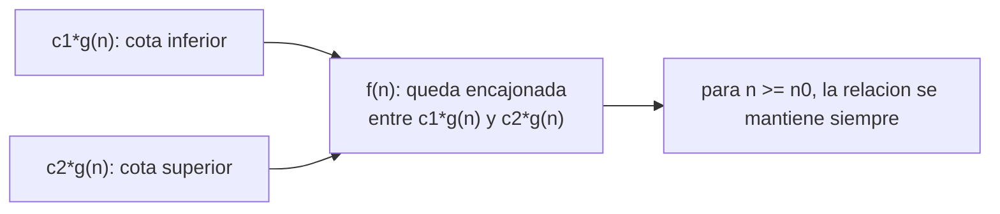

## El problema: dos funciones de tiempo y ninguna forma justa de compararlas

En la lección anterior le pusiste números al proceso nocturno de la empresa
de energía metropolitana: con 1.850.000 lecturas, insertion sort en su peor
caso "crece como `n` al cuadrado" y merge sort obedece la recurrencia

$$T(n) = 2T(n/2) + \Theta(n)$$

que quedó deliberadamente sin resolver. Los dos enunciados son informales.
"Crece como `n` al cuadrado" no dice si el trabajo real es `n²`, `3n² + 50n`
o `0.5n² - n`. Y una recurrencia sin resolver no te dice si merge sort es
más rápido que insertion sort para el archivo de 1.850.000 registros, o solo
para archivos gigantescos que la empresa nunca va a procesar.

Necesitas una forma de comparar el crecimiento de dos funciones de tiempo que
no dependa de en qué máquina corriste el experimento, qué tan optimizado
estaba el intérprete de Python esa tarde, ni de la constante de
proporcionalidad exacta — porque esa constante cambia con el hardware y el
compilador, pero el **orden de crecimiento** de un algoritmo no. Esa es la
pregunta que esta lección resuelve: cómo se compara, con rigor, cuánto crece
una función de tiempo cuando `n` crece.

## Por qué ignoramos constantes y términos pequeños

Imagina que mediste el trabajo exacto de dos algoritmos sobre el mismo
problema y obtuviste `f(n) = 2n²` para el primero y `g(n) = n² + 100n + 500`
para el segundo. A simple vista `g(n)` parece más complicada — tiene tres
términos en vez de uno—, y para `n` pequeño incluso puede ser más grande que
`f(n)`. Evalúa ambas para valores crecientes de `n`:

| `n`    | `f(n) = 2n²` | `g(n) = n² + 100n + 500` | ¿Cuál domina? |
| ------ | ------------ | ------------------------ | ------------- |
| 10     | 200          | 1.600                    | `g(n)`        |
| 100    | 20.000       | 20.500                   | `g(n)`        |
| 1.000  | 2.000.000    | 1.100.500                | `f(n)`        |
| 10.000 | 200.000.000  | 101.000.500              | `f(n)`        |

Para `n` grande, el término `100n + 500` de `g(n)` deja de importar frente a
`n²`: en `n = 10.000`, el `n²` de `g(n)` vale 100.000.000 y el resto apenas
suma 1.000.500, poco más del 1 %. Ambas funciones son, en esencia, "del
orden de `n²`" — la diferencia de constantes y de términos menores no cambia
esa clasificación. Por eso la notación asintótica ignora constantes
multiplicativas y términos de menor orden: lo que importa para comparar
algoritmos, cuando `n` es grande, es el término que domina.

## Cota superior asintótica: notación O

**Situación:** la empresa de energía necesita una garantía: "este algoritmo
nunca va a tardar más de tanto, sin importar qué tan mal venga la entrada".
Eso es distinto a decir cuánto tarda exactamente — es poner un techo al
crecimiento.

**En la práctica**, ese techo se expresa comparando la función de tiempo
`f(n)` contra una función más simple `g(n)`, multiplicada por una constante,
a partir de cierto tamaño de entrada `n₀`:

> $O(g(n)) = \{f(n) : \exists\, c, n_0 > 0 \text{ tal que } 0 \le f(n) \le c\,g(n)\ \forall n \ge n_0\}$

En prosa: `f(n)` pertenece a `O(g(n))` si, a partir de algún `n₀`, puedes
encontrar una constante `c` tal que `f(n)` nunca supera `c · g(n)`. `g(n)` es
una **cota superior** del crecimiento de `f(n)` — puede que `f(n)` crezca más
lento, pero nunca más rápido que `g(n)` a largo plazo.

El peor caso de insertion sort, que en la lección anterior contaste
término a término (`i` comparaciones y `i` desplazamientos por cada
elemento `i`), es una función que pertenece a `O(n²)`: existe una constante
`c` y un `n₀` a partir del cual el trabajo total nunca supera `c · n²`. `O`
es la afirmación correcta cuando quieres una garantía de "nunca peor que",
sin comprometerte a que el algoritmo realmente alcance ese crecimiento en
todos los casos.

## Cota inferior asintótica: notación Ω

El espejo de `O` es la notación **Ω** (omega): en vez de garantizar un
techo, garantiza un **piso**. `f(n)` pertenece a `Ω(g(n))` si, a partir de
algún `n₀`, existe una constante `c` tal que `f(n)` nunca es **menor** que
`c · g(n)`. La desigualdad de la definición formal de `O` simplemente se
invierte:

> $\Omega(g(n)) = \{f(n) : \exists\, c, n_0 > 0 \text{ tal que } 0 \le c\,g(n) \le f(n)\ \forall n \ge n_0\}$

`g(n)` es ahora una cota inferior: `f(n)` puede crecer más rápido, pero nunca
más lento que `g(n)` a largo plazo. Piensa de nuevo en insertion sort, pero
en su **mejor** caso — el que ya viste en la lección anterior con el arreglo
que llega prácticamente ordenado: cada elemento cuesta una sola comparación,
así que el trabajo total es lineal en `n`. Ese mejor caso pertenece a
`Ω(n)`: el trabajo nunca baja de un crecimiento lineal, sin importar qué tan
favorable sea la entrada — hay que revisar cada uno de los `n` elementos al
menos una vez.

`O` y `Ω` responden preguntas distintas sobre el mismo algoritmo: `O(n²)`
sobre el peor caso de insertion sort dice "nunca más lento que cuadrático";
`Ω(n)` sobre su mejor caso dice "nunca más rápido que lineal". Ninguna de
las dos, por sí sola, describe con precisión **cuánto** crece insertion
sort en un caso dado.

## Cota ajustada: notación Θ

**Situación:** para el peor caso de insertion sort, el trabajo no solo nunca
supera un crecimiento cuadrático (`O(n²)`) — tampoco baja nunca de un
crecimiento cuadrático, porque cada uno de los `n` elementos, en el peor
caso, sí llega a desplazarse contra casi todos los anteriores. Cuando la
cota superior y la cota inferior coinciden en la misma función, tienes algo
más fuerte que cualquiera de las dos por separado.

**En la práctica**, esa coincidencia se llama **cota ajustada** y se escribe
con la notación **Θ** (theta):

> $\Theta(g(n)) = \{f(n) : \exists\, c_1, c_2, n_0 > 0 \text{ tal que } 0 \le c_1\,g(n) \le f(n) \le c_2\,g(n)\ \forall n \ge n_0\}$

`f(n)` pertenece a `Θ(g(n))` si queda **encajonada** entre dos múltiplos de
`g(n)` — uno por debajo, uno por arriba — a partir de `n₀`. Es exactamente
`f(n) \in O(g(n))` y `f(n) \in \Omega(g(n))` a la vez.



## Funciones estándar y su jerarquía de crecimiento

No todas las funciones de tiempo que vas a encontrar en el curso son
polinomios. La siguiente tabla ordena las familias más comunes de menor a
mayor crecimiento, con su valor para `n = 20` como referencia de escala:

| Familia     | Función típica |
| ----------- | -------------- |
| Logarítmica | `log₂ n`       |
| Lineal      | `n`            |
| Cuadrática  | `n²`           |
| Cúbica      | `n³`           |
| Exponencial | `2ⁿ`           |
| Factorial   | `n!`           |

## Comparando merge sort e insertion sort con el vocabulario nuevo

Con `O`, `Ω` y `Θ` ya puedes nombrar con precisión lo que la lección
anterior dejó en intuición: el peor caso de insertion sort es `Θ(n²)`. Su
mejor caso, `Θ(n)`. Merge sort es distinto en un sentido importante: su
recurrencia `T(n) = 2T(n/2) + Θ(n)` no depende de cómo llegue la entrada —
divide, conquista y combina siempre de la misma forma, sin importar el
orden de los datos — así que su comportamiento es el mismo en el mejor, el
peor y el caso promedio; resuelta, el crecimiento de esa recurrencia es
`Θ(n log n)`.

Sobre el archivo de 1.850.000 lecturas de la empresa de energía, la
diferencia entre `Θ(n²)` y `Θ(n log n)` no es un matiz teórico: es la
diferencia entre un proceso que tarda 9 horas y uno que cabe, con margen,
en la ventana operativa de 4 horas. Puedes verificar la magnitud de esa
diferencia con un script breve:

```python
import math


def trabajo_cuadratico(n: int) -> int:
    """Aproxima el trabajo del peor caso de insertion sort.

    Args:
        n: cantidad de registros a ordenar.

    Returns:
        Una aproximacion del numero de comparaciones en el peor caso,
        del orden de Theta(n^2).
    """
    return n * n


def trabajo_linearitmico(n: int) -> float:
    """Aproxima el trabajo de merge sort una vez resuelta su recurrencia.

    Args:
        n: cantidad de registros a ordenar.

    Returns:
        Una aproximacion del trabajo total, del orden de
        Theta(n log n).
    """
    return n * math.log2(n)


registros = 1_850_000
razon = trabajo_cuadratico(registros) / trabajo_linearitmico(registros)
print(f"insertion sort hace aproximadamente {razon:.0f} veces mas trabajo")
```

## Resumen operativo

| Notación  | Qué garantiza                                          | Analogía informal |
| --------- | ------------------------------------------------------ | ----------------- |
| `O(g(n))` | `f(n)` nunca crece más rápido que `g(n)` a largo plazo | `f(n) ≤ g(n)`     |
| `Ω(g(n))` | `f(n)` nunca crece más lento que `g(n)` a largo plazo  | `f(n) ≥ g(n)`     |
| `Θ(g(n))` | `f(n)` crece exactamente al mismo ritmo que `g(n)`     | `f(n) = g(n)`     |

Jerarquía de funciones comunes, de menor a mayor crecimiento:

`Θ(log n)` < `Θ(n)` < `Θ(n log n)` < `Θ(n²)` < `Θ(n³)` < `Θ(2ⁿ)` < `Θ(n!)`

## Síntesis

- El problema de comparar dos funciones de tiempo sin depender de la
  máquina, el compilador o la constante de proporcionalidad exige ignorar
  constantes y términos de menor orden — lo que importa es el término que
  domina cuando `n` crece.
- `O(g(n))` formaliza una cota **superior**: una garantía de que el
  algoritmo nunca tarda más de lo que `g(n)` predice, a partir de cierto
  `n₀` y salvo una constante.
- `Ω(g(n))` formaliza el espejo: una cota **inferior**, la garantía de que
  el algoritmo nunca tarda menos de lo que `g(n)` predice.
- `Θ(g(n))` combina ambas: cuando la cota superior y la inferior coinciden
  en la misma función, esa es la afirmación más fuerte y precisa sobre el
  crecimiento de un algoritmo — como `Θ(n²)` para el peor caso de insertion
  sort.
- Las funciones estándar del curso forman una jerarquía de crecimiento con
  saltos de escala, no graduales: logarítmica, lineal, cuadrática, cúbica,
  exponencial y factorial.
- Insertion sort queda descrito con precisión — `Θ(n)` en su mejor caso,
  `Θ(n²)` en su peor caso— y merge sort, una vez resuelta su recurrencia,
  resulta `Θ(n log n)` en todos los casos.
