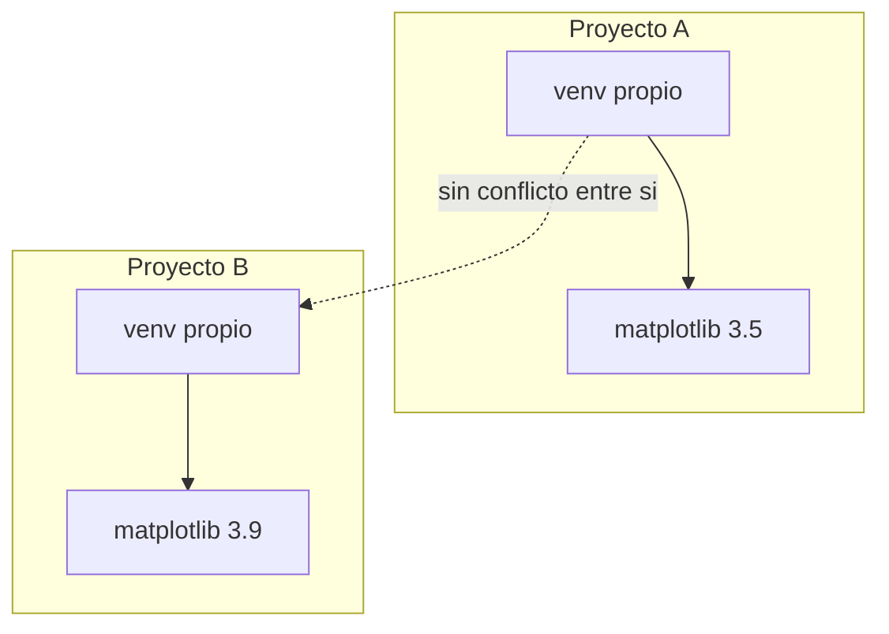

## Antes de escribir código: entornos virtuales y dependencias

**Situación:** en el laboratorio de esta semana vas a instalar `matplotlib` para graficar tiempos de ejecución. Más adelante, otro proyecto en tu computador podría necesitar una versión distinta de esa misma librería. Si instalas todo "a nivel del sistema" con un solo `pip`, ambos proyectos comparten las mismas versiones — y actualizar una para el proyecto nuevo puede romper silenciosamente el proyecto viejo.

**En la práctica**, Python resuelve esto con **entornos virtuales**: una carpeta que contiene una copia aislada del intérprete y sus paquetes, exclusiva de un proyecto. `venv` (incluido en la instalación estándar) crea uno; lo activas para que `pip install` instale ahí y no en el sistema; y `pip freeze` vuelca la lista exacta de lo instalado a un archivo `requirements.txt`, que cualquier otra persona — o tú mismo en otra máquina — puede usar para reconstruir el mismo entorno con `pip install -r requirements.txt`.



> **Entorno virtual:** copia aislada del intérprete de Python y sus paquetes instalados, propia de un proyecto. Evita que las dependencias de un proyecto interfieran con las de otro. `requirements.txt` es el registro reproducible de esas dependencias — cualquiera puede recrear el entorno exacto con `pip install -r requirements.txt`.

El **Laboratorio 02** de esta semana practica el flujo completo paso a paso: creación, activación, instalación y verificación de reproducibilidad. Aquí solo necesitas entender **por qué** existe, antes de llegar a esa sesión.

## Tipos de datos básicos

```python
n = 10000                       # int: numero entero
tiempo = 0.0034                 # float: numero con decimales
algoritmo = "insertion_sort"    # str: texto
ordenado = True                 # bool: verdadero o falso
resultado = None                # None: "todavia no hay valor"
```

> **Tipado dinámico:** el tipo de una variable no se declara explícitamente; se determina en tiempo de ejecución según el valor que contiene, y puede cambiar si la variable se reasigna. La funcion `type()` devuelve el tipo de un valor o variable.

## Estructuras de control

```python
tiempo = 0.0034

if tiempo < 0.001:
    categoria = "rapido"
elif tiempo < 0.01:
    categoria = "moderado"
else:
    categoria = "lento"

for tamano in [100, 1000, 10000]:
    print(f"Probando con n = {tamano}")

intentos = 0
while intentos < 3:
    intentos = intentos + 1
```

> **Bloque indentado:** en Python, el conjunto de instrucciones que pertenecen a un `if`, `for`, `while` o función se delimita por indentación (4 espacios, por convención de PEP 8), no por llaves `{}`.

## Funciones

Una **función** empaqueta código, tiene un nombre, parámetros y valores de retorno. La puedes reutilizar las veces que sean necesarias pasandole diferentes argumentos.

```python
def contar_comparaciones(lista: list) -> int:
    """Cuenta cuantas comparaciones hace insertion sort sobre 'lista'.

    Args:
        lista: lista de numeros a ordenar.

    Returns:
        El numero total de comparaciones realizadas.
    """
    comparaciones = 0
    for i in range(1, len(lista)):
        j = i
        while j > 0 and lista[j - 1] > lista[j]:
            comparaciones = comparaciones + 1
            lista[j - 1], lista[j] = lista[j], lista[j - 1]
            j = j - 1
    return comparaciones

total = contar_comparaciones([5, 2, 9, 1])
```

Los valores entre paréntesis al definirla (`lista`) son **parámetros**; los valores que le pasas al llamarla (`[5, 2, 9, 1]`) son **argumentos**. `return` entrega el resultado a quien llamó la función; una función sin `return` explícito entrega `None`. El texto entre `"""..."""` justo después de `def` es el **docstring**: documenta qué hace la función, sin necesidad de leer su cuerpo.

> **Función:** bloque de código con nombre propio, que recibe parámetros, ejecuta una tarea y opcionalmente devuelve un resultado con `return`. Se define una vez y se invoca cuantas veces haga falta.

## Buenas prácticas: PEP 8, docstrings y type hints

**Situación:** en este curso vas a entregar cinco informes de laboratorio que tu profesor va a leer y evaluar como código, no solo ejecutarlo. Además, desde la Semana 1 tu código vive en un repositorio Git que puede compartirse con otros. Un script que funciona pero es ilegible cuesta tiempo a quien lo lee — incluido tu propio yo, dos semanas después.

**En la práctica**, la comunidad de Python estandarizó estas convenciones en la **PEP 8**, la guía de estilo oficial del lenguaje:

- Nombres de variables y funciones en `snake_case` (`contar_comparaciones`, no `contarComparaciones` ni `ContarComparaciones`).
- Nombres de clases en `PascalCase` (`ListaEnlazada`).
- Máximo 79-99 caracteres por línea.
- Un espacio alrededor de operadores y después de cada coma (`s = s + x`, no `s=s+x`).
- 4 espacios de indentación, nunca tabulaciones — ya lo viste en "Estructuras de control", donde la indentación no es solo estilo: es sintaxis.

```python
# Estilo a evitar
def EsPrimo(N):
    if N<2:
        return False
    for i in range(2,N):
        if N%i==0:
            return False
    return True

# PEP 8, type hints y docstring
def es_primo(numero: int) -> bool:
    """Determina si un numero es primo.

    Args:
        numero: entero a evaluar.

    Returns:
        True si numero es primo, False en caso contrario.
    """
    if numero < 2:
        return False
    for i in range(2, numero):
        if numero % i == 0:
            return False
    return True
```

Dos anotaciones más documentan la intención del código sin obligar a leer su cuerpo completo:

- **Type hints** (`numero: int`, `-> bool`): anotan el tipo esperado de cada parámetro y del valor de retorno, igual que `lista: list` y `-> int` en `contar_comparaciones`. Python no los obliga en tiempo de ejecución — pasar un `str` donde se espera un `list` no lanza error solo por eso —, pero documentan la intención y permiten que el editor detecte inconsistencias antes de ejecutar el programa.
- **Docstrings** en formato Google-style (`Args:`, `Returns:`): documentan qué hace la función, qué recibe y qué devuelve. En un informe de laboratorio, un docstring bien escrito suele ser la diferencia entre un lector que entiende tu código en diez segundos y uno que tiene que rastrear cada línea.

> **PEP 8:** guía de estilo oficial de Python. No es un capricho estético: código que la sigue es más fácil de leer, revisar y mantener — especialmente en un repositorio compartido, como el que ya usas desde la Semana 1.

El **Laboratorio 02** de esta semana te pide refactorizar un script que viola estas convenciones, aplicando PEP 8 y type hints de punta a punta. Cada uno de tus cinco informes se evalúa, en parte, con este mismo criterio.

## Estructuras de datos nativas

**En la práctica**, Python trae cuatro estructuras nativas, cada una con un comportamiento distinto:

```python
numeros = [5, 2, 9, 1]                      # lista: mutable, ordenada, admite duplicados
punto = (10000, 0.0034)                     # tupla: inmutable, ordenada, admite duplicados
tiempos = {10000: 0.0034, 1000: 0.0002}     # diccionario: clave -> valor
tamanos_probados = {100, 1000, 10000}       # conjunto: sin orden, sin duplicados
```

Usa **lista** cuando el orden importa y vas a modificar el contenido (los números que vas a ordenar). Usa **tupla** cuando el dato es fijo y no debería cambiarse por accidente (un par `(tamaño, tiempo)` ya medido). Usa **diccionario** cuando necesitas buscar un valor por una clave (el tiempo medido para cada tamaño de entrada). Usa **conjunto** cuando solo te importa "¿esto ya está?", sin importar el orden ni repetir.

> **Mutabilidad:** una estructura es mutable si su contenido puede modificarse después de creada (`lista.append(6)`), e inmutable si no (una tupla no admite `punto[0] = 5`; hay que crear una tupla nueva).

| Estructura  | Mutable | Ordenada             | Duplicados            | Sintaxis    |
| ----------- | ------- | -------------------- | --------------------- | ----------- |
| Lista       | Sí      | Sí                   | Sí                    | `[1, 2, 3]` |
| Tupla       | No      | Sí                   | Sí                    | `(1, 2, 3)` |
| Diccionario | Sí      | Por inserción (3.7+) | Claves no, valores sí | `{"a": 1}`  |
| Conjunto    | Sí      | No                   | No                    | `{1, 2, 3}` |

## De un `for` a una línea: comprensión de listas

**Situación:** quieres construir la lista de los cuadrados de los tamaños de entrada que vas a probar: `[100, 1000, 10000]` → `[10000, 1000000, 100000000]`. La forma más directa que ya conoces es un `for` que va llenando una lista vacía:

```python
tamanos = [100, 1000, 10000]
cuadrados = []
for t in tamanos:
    cuadrados.append(t ** 2)
```

Funciona, pero son cuatro líneas para una idea simple: "el cuadrado de cada elemento". Python permite expresar exactamente esa idea en una sola línea, con **comprensión de listas**:

```python
cuadrados = [t ** 2 for t in tamanos]

# con filtro: solo los tamanos mayores a 500
grandes = [t for t in tamanos if t > 500]
```

Ambas versiones producen el mismo resultado. La segunda es más corta, pero no siempre más clara — si la expresión dentro de `[...]` empieza a ser difícil de leer, el `for` explícito de varias líneas sigue siendo la opción correcta. Es idiomática en Python y la vas a ver constantemente en el código de otros, así que necesitas poder leerla aunque no la uses siempre.

## Cuando algo falla en tiempo de ejecución: excepciones e `import`

**Situación:** una función de ordenamiento recibe una lista vacía, o alguien intenta dividir el tiempo total entre cero repeticiones. El programa no debería simplemente detenerse con un mensaje críptico — necesitas anticipar ese fallo y decidir qué hacer.

**En la práctica**, Python permite envolver el código riesgoso en un bloque `try`, y capturar el error en `except` sin que el programa se caiga:

```python
try:
    promedio = tiempo_total / repeticiones
except ZeroDivisionError:
    print("No se registraron repeticiones; no se puede promediar.")
    promedio = None
```

> **Excepción:** error que ocurre durante la ejecución del programa (no al escribirlo). Un bloque `try`/`except` permite anticiparlo y responder sin que el programa se detenga abruptamente.

El otro mecanismo que vas a usar desde el primer laboratorio es traer código que no escribiste tú: la librería `time` para medir tiempos, o `matplotlib` para graficar. Eso se hace con `import`:

```python
import time
from matplotlib import pyplot as plt

inicio = time.time()
# ... código a medir ...
duracion = time.time() - inicio
```

> **`import`:** trae al script el código de un módulo o librería externa, para usar sus funciones sin reescribirlas.
