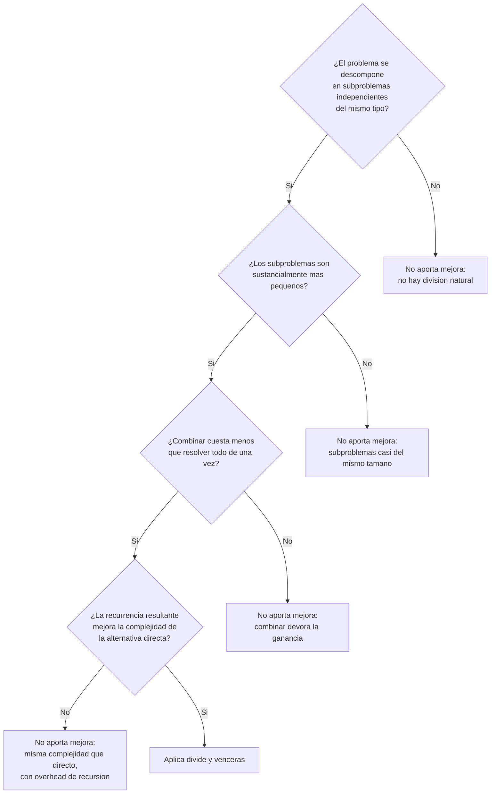

## El problema: dos candidatos que no son iguales

Llevas tres algoritmos resueltos con divide y vencerás: merge sort, el subarreglo máximo y la multiplicación de matrices de Strassen. En los tres, partir el problema por la mitad y combinar las soluciones parciales terminó ganándole a la alternativa directa.

Ahora considera dos problemas nuevos, ninguno visto en clase todavía:

- **Hallar el máximo** de un arreglo de `n` números.
- **Sumar** todos los elementos de un arreglo de `n` números.

¿Vale la pena partirlos por la mitad, resolver cada mitad por separado y combinar los resultados? Antes de responder, compara los tres problemas que ya conoces con estos dos:

| Problema           | ¿Qué entra/sale?                          | ¿Qué costaría "combinar" las dos mitades?                                                       |
| ------------------ | ----------------------------------------- | ----------------------------------------------------------------------------------------------- |
| Merge sort         | Arreglo desordenado → arreglo ordenado    | Intercalar dos listas ya ordenadas: recorrido lineal, pero evita comparar cada par de elementos |
| Subarreglo máximo  | Arreglo de números → suma máxima contigua | Considerar el subarreglo que **cruza** la mitad: trabajo lineal que la fuerza bruta no evita    |
| Máximo del arreglo | Arreglo de números → un número            | Comparar los dos máximos parciales: **una** comparación                                         |
| Suma del arreglo   | Arreglo de números → un número            | Sumar los dos resultados parciales: **una** suma                                                |

En los dos primeros, combinar hace un trabajo que la alternativa directa no puede evitar. En los dos últimos, combinar es casi gratis — y ahí está la pregunta que esta lección responde: si combinar cuesta tan poco, ¿de verdad dividir aporta algo, o solo agrega una capa de recursión encima de un recorrido que ya era óptimo?

## Modelado: la decisión misma es el problema

Esta lección no modela una situación del dominio, como las anteriores —
modela un problema distinto: **decidir si conviene aplicar divide y
vencerás**. Traducido a los mismos términos que usaste para cualquier otro
problema:

- **Entra:** la descripción de un problema nuevo (cómo se divide, qué cuesta
  combinar) y su alternativa directa conocida.
- **Sale:** un veredicto — "divide y vencerás mejora" o "no aporta nada
  frente a resolverlo de una pasada" — más la recurrencia que lo justifica.
- **Qué domina el costo de la decisión:** comparar la complejidad resultante
  de dividir contra la complejidad de la alternativa directa

Las tres instancias del curso encajan en columnas idénticas:

| Algoritmo         | Dividir                                         | Conquistar                                                       | Combinar                                                    | Recurrencia                    |
| ----------------- | ----------------------------------------------- | ---------------------------------------------------------------- | ----------------------------------------------------------- | ------------------------------ |
| Merge sort        | Partir el arreglo por la mitad                  | Ordenar cada mitad recursivamente                                | Intercalar (`merge`) las dos mitades ordenadas — Θ(n)       | $T(n) = 2T(n/2) + \Theta(n)$   |
| Subarreglo máximo | Partir el arreglo por la mitad                  | Resolver el subarreglo máximo en cada mitad                      | Calcular el máximo que **cruza** el punto medio — Θ(n)      | $T(n) = 2T(n/2) + \Theta(n)$   |
| Strassen          | Partir cada matriz en 4 submatrices `n/2 × n/2` | Multiplicar submatrices con 7 productos recursivos (en vez de 8) | Sumar/restar submatrices para ensamblar el producto — Θ(n²) | $T(n) = 7T(n/2) + \Theta(n^2)$ |

Los tres comparten la forma $T(n) = aT(n/b) + f(n)$ que el método maestro sabe resolver. Lo que cambia entre ellos es cuánto cuesta combinar frente a cuánto se gana dividiendo — y eso es exactamente lo que decide si la técnica vale la pena.

## De la forma de la recurrencia a la ganancia real

El método maestro, visto en la sesión de recurrencias, resuelve $T(n) = aT(n/b) + f(n)$ comparando $f(n)$ contra $n^{\log_b a}$: cuál de los dos términos domina determina la complejidad final. Pero el método maestro solo te da la fórmula cerrada — la pregunta de **si esa fórmula representa una mejora** todavía depende de compararla contra la alternativa directa (iterativa, sin recursión) para el mismo problema.

Recuerda merge sort: $T(n) = 2T(n/2) + \Theta(n)$ resuelve a $\Theta(n \log n)$. La alternativa directa para ordenar sin aprovechar ninguna estructura —por ejemplo, insertion sort— es $\Theta(n^2)$ en el peor caso. Ahí sí hay ganancia real: $n \log n$ crece muchísimo más lento que $n^2$, y esa diferencia es la que divide y vencerás explota al partir el problema.

La pregunta que falta hacerse en cada nuevo problema es simétrica: ¿la recurrencia que resulta de dividirlo da una complejidad **menor** que resolverlo directamente, de una sola pasada? Si la respuesta es sí —como en merge sort, el subarreglo máximo o Strassen—, dividir vale la pena. Si la respuesta es "da exactamente lo mismo", dividir no aporta nada: solo reemplaza un recorrido simple por una recursión que hace el mismo trabajo, con overhead adicional.

## Cuándo dividir no aporta ninguna mejora

Vuelve a los dos candidatos de la primera sección. Plantea la versión recursiva de **hallar el máximo**: dividir el arreglo por la mitad, hallar el máximo de cada mitad recursivamente, y combinar comparando los dos máximos parciales.

$$T(n) = 2T(n/2) + \Theta(1)$$

Aquí $a = 2$, $b = 2$, $f(n) = \Theta(1)$. Como $f(n) = \Theta(1)$ crece más lento que $n^{\log_2 2} = n^1$, el método maestro (caso 1) da $T(n) = \Theta(n)$. Lo mismo ocurre con **sumar el arreglo**: $T(n) = 2T(n/2) + \Theta(1)$, también $\Theta(n)$.

Compáralo con la alternativa directa: recorrer el arreglo una vez, llevando el máximo (o la suma) visto hasta el momento, también es $\Theta(n)$ — y sin ninguna llamada recursiva.

```python
def maximo_iterativo(numeros: list[float]) -> float:
    """Calcula el máximo de una lista recorriéndola una sola vez.

    Args:
        numeros: Lista no vacía de números.

    Returns:
        El valor máximo de la lista.
    """
    mayor = numeros[0]
    for valor in numeros[1:]:
        if valor > mayor:
            mayor = valor
    return mayor


def maximo_divide_y_venceras(numeros: list[float]) -> float:
    """Calcula el máximo de una lista partiéndola recursivamente por la mitad.

    Args:
        numeros: Lista no vacía de números.

    Returns:
        El valor máximo de la lista.
    """
    if len(numeros) == 1:
        return numeros[0]
    medio = len(numeros) // 2
    izquierda = maximo_divide_y_venceras(numeros[:medio])
    derecha = maximo_divide_y_venceras(numeros[medio:])
    return izquierda if izquierda > derecha else derecha
```

Las dos funciones son Θ(n). La segunda no es más rápida asintóticamente y en la práctica es más lenta: cada llamada recursiva reserva un nuevo marco en la pila, y `numeros[:medio]` copia una porción de la lista en cada partición. Al medir el trabajo total de ambas versiones a medida que crece `n`, no hay separación entre las curvas, porque las dos son lineales.

Dividir el problema aquí no compra ninguna reducción de complejidad: ambas versiones son Θ(n), y la recursiva paga overhead extra sin ninguna contrapartida. Esa es la señal de que **divide y vencerás no siempre mejora las cosas** — a diferencia de merge sort, donde dividir sí cambia la clase de complejidad.

## Señales para decidir si divide y vencerás es la técnica adecuada

Antes de aplicar el esquema a un problema nuevo, verifica estas cuatro condiciones en orden. Si alguna falla, la técnica no aporta sobre la alternativa directa.



> **Combinar no debe devorar la ganancia:** si el paso de combinar dos soluciones parciales cuesta tanto como resolver el problema completo de una vez, dividir no genera ahorro — solo lo aplaza.

## Resumen operativo

Las cinco instancias del módulo, con su recurrencia y el veredicto final sobre si divide y vencerás mejoró la alternativa directa:

| Problema           | Recurrencia                                             | Alternativa directa            | Veredicto |
| ------------------ | ------------------------------------------------------- | ------------------------------ | --------- |
| Merge sort         | $T(n) = 2T(n/2) + \Theta(n)$ → $\Theta(n \log n)$       | Insertion sort: Θ(n²)          | Mejora    |
| Subarreglo máximo  | $T(n) = 2T(n/2) + \Theta(n)$ → $\Theta(n \log n)$       | Fuerza bruta: Θ(n²) o Θ(n³)    | Mejora    |
| Strassen           | $T(n) = 7T(n/2) + \Theta(n^2)$ → $\Theta(n^{\log_2 7})$ | Multiplicación estándar: Θ(n³) | Mejora    |
| Máximo del arreglo | $T(n) = 2T(n/2) + \Theta(1)$ → $\Theta(n)$              | Recorrido directo: Θ(n)        | No mejora |
| Suma del arreglo   | $T(n) = 2T(n/2) + \Theta(1)$ → $\Theta(n)$              | Recorrido directo: Θ(n)        | No mejora |

## Síntesis

- El esquema **dividir–conquistar–combinar** es un patrón, no una garantía: aplica a cualquier problema que admita esa descomposición, pero solo mejora el resultado cuando la recurrencia le gana a la alternativa directa.
- Merge sort, el subarreglo máximo y Strassen comparten la misma forma de recurrencia ($aT(n/b) + f(n)$) y el mismo criterio de análisis: el método maestro.
- Hallar el máximo o sumar un arreglo por divide y vencerás son el contraejemplo necesario: la recursión no siempre paga. Cuando combinar es tan barato que no compensa dividir, la versión iterativa directa es la mejor opción.
- El checklist de cuatro preguntas —descomposición natural, subproblemas sustancialmente menores, combinar barato, recurrencia con mejora real— queda instalado como criterio de decisión para cualquier problema nuevo que se te presente.
