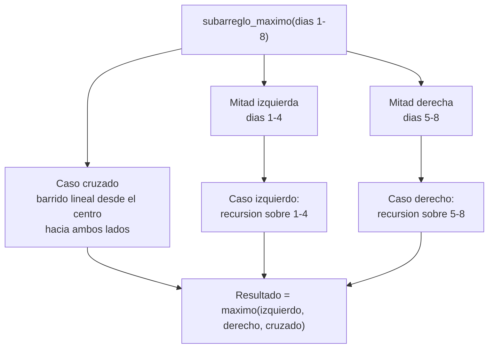

## El problema del analista de telemedición

La Empresa Metropolitana de Energía, del caso que vienes siguiendo desde
semanas anteriores (todavía en estado de propuesta, sin aplicarse en
producción), tiene un dato adicional por medidor: la variación diaria de
consumo respecto al día anterior, en kWh. Un analista sospecha que cierto
medidor tuvo un tramo de días consecutivos con una ganancia acumulada de
consumo anormalmente alta — posible indicio de una conexión fraudulenta que
se activó y luego se disimuló. La serie de un medidor durante 8 días se ve
así:

```text
día:        1    2    3    4    5    6    7    8
variación: -3   +5   -2   +8   -6   +3   +9   -4
```

El tramo de mayor ganancia acumulada no es obvio a simple vista: sumar todo
da `+10`, pero el tramo de los días 2 a 7 (`+5, -2, +8, -6, +3, +9`) suma
`+17`, más que la serie completa. Encontrar automáticamente ese tramo, sobre
las series de 1.850.000 medidores, es el problema que esta lección resuelve.

## Modelado: de la situación a la operación

Antes de pensar en algoritmos, conviene fijar el problema computacional que
esconde la situación del analista:

- **Entra:** una serie de `n` variaciones diarias de consumo (números, pueden
  ser negativos), una por medidor.
- **Sale:** el tramo de días consecutivos `[i, j]` con mayor suma acumulada,
  y el valor de esa suma.
- **Restringe:** el proceso corre cada noche, sobre 1.850.000 series
  independientes, dentro de la ventana de tiempo disponible para el cierre
  nocturno.
- **Qué domina el costo:** la operación que se repite es sumar un rango de
  la serie; el problema es evitar recalcular sumas de rangos que se
  traslapan.

Esta traducción —de "encontrar el tramo sospechoso" a "maximizar la suma de
un subarreglo contiguo"— es la que permite razonar sobre su complejidad en
vez de sobre el dominio del negocio.

## Por qué la fuerza bruta no alcanza

**En la práctica**, la forma directa de resolverlo es probar todos los pares
posibles de día inicial `i` y día final `j`, sumar la variación entre ambos y
quedarse con la suma máxima:

```python
def suma_entre(variaciones: list[float], i: int, j: int) -> float:
    """Suma la variación acumulada entre los días i y j, inclusive.

    Args:
        variaciones: Variación diaria de consumo, una por día.
        i: Índice del día inicial del tramo.
        j: Índice del día final del tramo.

    Returns:
        La suma de variaciones[i..j].
    """
    return sum(variaciones[i:j + 1])
```

Probar todo par `(i, j)` con `i <= j` recorre, para cada uno de los
aproximadamente `n²/2` pares, hasta `n` posiciones para sumarlos —
`Θ(n³)` en su forma más ingenua, o `Θ(n²)` si se acumula la suma en vez de
recalcularla desde cero en cada par. Ninguna de las dos formas sirve a la
escala del caso: con `n = 365` días eso ya son decenas de miles de
operaciones por medidor, y hay 1.850.000 medidores que revisar cada vez que
se corre el análisis. Necesitas algo mejor que cuadrático.

## Subarreglo máximo por divide y vencerás

**Situación:** divide y vencerás ya te resolvió problemas donde la mitad
izquierda y la mitad derecha se combinan de forma simple — piensa en merge
sort. Aquí no es tan directo: el tramo de mayor ganancia puede empezar en la
mitad izquierda de la serie y terminar en la mitad derecha, cruzando
exactamente el punto donde dividiste.

**En la práctica**, dividir el arreglo de variaciones por la mitad deja tres
posibilidades para dónde vive el subarreglo máximo, y hay que resolver las
tres:

- **Caso izquierdo:** el tramo completo está en la mitad izquierda — se
  resuelve recursivamente sobre esa mitad.
- **Caso derecho:** el tramo completo está en la mitad derecha — se resuelve
  recursivamente sobre esa mitad.
- **Caso cruzado:** el tramo incluye al menos un día de cada mitad, es decir,
  cruza el punto medio. Este caso **no** es recursivo: se resuelve con un
  barrido lineal que parte del punto medio y avanza hacia cada lado,
  acumulando la suma y guardando el máximo visto en cada dirección, y
  después suma ambos máximos.

El caso cruzado es la parte que no tiene equivalente en merge sort: ahí vive
la dificultad real del problema, no en la división en sí.



## Planteando y resolviendo la recurrencia

Cada llamada recursiva divide la serie en dos mitades (`a = 2`, `b = 2`) y
resuelve el caso cruzado con un barrido lineal que recorre toda la serie una
sola vez — `f(n) = Θ(n)`. La recurrencia es idéntica, término a término, a
la de merge sort:

$$T(n) = 2T(n/2) + \Theta(n)$$

Aplicando el método maestro de la Semana 6: `a = 2`, `b = 2`,
$n^{\log_b a} = n$, y `f(n) = Θ(n)` es del mismo orden — caso 2. La solución
es $T(n) = \Theta(n\log n)$.

Frente a los `Θ(n²)` de la fuerza bruta acumulada, dividir y vencerás gana el
mismo tipo de ventaja que ya viste con merge sort: para `n = 365` días, la
razón `n / log₂ n` es de casi 44 veces menos operaciones, y la brecha crece
con `n`.

## El código en Python

La función principal delega el caso cruzado en una función auxiliar
separada, siguiendo el mismo patrón de responsabilidad única que ya usaste
en merge sort:

```python
def suma_cruzada(
    variaciones: list[float], inicio: int, medio: int, fin: int
) -> tuple[int, int, float]:
    """Encuentra el subarreglo máximo que cruza el punto medio.

    Args:
        variaciones: Variación diaria de consumo.
        inicio: Índice inicial del rango considerado.
        medio: Índice del punto de división.
        fin: Índice final del rango considerado (inclusive).

    Returns:
        Una tupla (mejor_izquierda, mejor_derecha, suma_maxima) con los
        límites del tramo cruzado y su ganancia acumulada.
    """
    suma = 0.0
    suma_maxima_izquierda = float("-inf")
    mejor_izquierda = medio
    for i in range(medio, inicio - 1, -1):
        suma += variaciones[i]
        if suma > suma_maxima_izquierda:
            suma_maxima_izquierda = suma
            mejor_izquierda = i

    suma = 0.0
    suma_maxima_derecha = float("-inf")
    mejor_derecha = medio + 1
    for j in range(medio + 1, fin + 1):
        suma += variaciones[j]
        if suma > suma_maxima_derecha:
            suma_maxima_derecha = suma
            mejor_derecha = j

    return mejor_izquierda, mejor_derecha, suma_maxima_izquierda + suma_maxima_derecha


def subarreglo_maximo(
    variaciones: list[float], inicio: int, fin: int
) -> tuple[int, int, float]:
    """Encuentra el subarreglo de mayor ganancia acumulada por divide y vencerás.

    Args:
        variaciones: Variación diaria de consumo de un medidor.
        inicio: Índice inicial del rango a considerar (inclusive).
        fin: Índice final del rango a considerar (inclusive).

    Returns:
        Una tupla (mejor_inicio, mejor_fin, suma_maxima) del tramo óptimo
        dentro de variaciones[inicio..fin].
    """
    if inicio == fin:
        return inicio, fin, variaciones[inicio]

    medio = (inicio + fin) // 2
    izq_inicio, izq_fin, suma_izq = subarreglo_maximo(variaciones, inicio, medio)
    der_inicio, der_fin, suma_der = subarreglo_maximo(variaciones, medio + 1, fin)
    cruz_inicio, cruz_fin, suma_cruz = suma_cruzada(variaciones, inicio, medio, fin)

    if suma_izq >= suma_der and suma_izq >= suma_cruz:
        return izq_inicio, izq_fin, suma_izq
    if suma_der >= suma_izq and suma_der >= suma_cruz:
        return der_inicio, der_fin, suma_der
    return cruz_inicio, cruz_fin, suma_cruz
```

La versión de fuerza bruta — probar todos los pares `(i, j)` con la función
`suma_entre` de la sección anterior — es más corta de escribir, pero es
exactamente la que no escala a 1.850.000 medidores; completarla y medirla
frente a esta versión es trabajo de práctica, no de esta lección.

## Un segundo problema: multiplicar matrices

El algoritmo escolar —tres bucles
anidados— cuesta `Θ(n³)`. Si dividir y vencerás bajó el exponente en el
problema anterior, ¿hace lo mismo aquí?

**En la práctica**, la partición natural de una matriz `n × n` es en cuatro
submatrices `n/2 × n/2`:

Multiplicar dos matrices particionadas así, `C = A · B`, requiere calcular
cuatro submatrices de `C`, y cada una es la suma de dos productos de
submatrices:

$$C_{11} = A_{11}B_{11} + A_{12}B_{21}, \quad C_{12} = A_{11}B_{12} + A_{12}B_{22}$$
$$C_{21} = A_{21}B_{11} + A_{22}B_{21}, \quad C_{22} = A_{21}B_{12} + A_{22}B_{22}$$

Eso son **8 multiplicaciones** de matrices `n/2 × n/2` (una por cada término
de la derecha) más las sumas, que cuestan `Θ(n²)` en total. La recurrencia
es

$$T(n) = 8T(n/2) + \Theta(n^2)$$

Método maestro: `a = 8`, `b = 2`, $n^{\log_b a} = n^{\log_2 8} = n^3$, y
`f(n) = Θ(n²)` es polinomialmente **menor** — caso 1. La solución es
$T(n) = \Theta(n^3)$: exactamente el mismo orden que el algoritmo escolar.
Dividir la matriz en cuatro bloques no ahorra nada mientras sigan siendo 8
las multiplicaciones recursivas — la dificultad no está en dividir, está en
encontrar una división que **reduzca ese número**.

## El truco de Strassen

**En la práctica**, Strassen encontró una forma de calcular las cuatro
submatrices de `C` con **7** multiplicaciones en vez de 8, combinando
algebraicamente las submatrices de `A` y `B` antes de multiplicar. El costo
es más sumas y restas —siguen siendo `Θ(n²)`, no cambian el orden—, a cambio
de una multiplicación recursiva menos. Las siete multiplicaciones
intermedias son:

$$M_1 = A_{11}(B_{12} - B_{22}), \quad M_2 = (A_{11} + A_{12})B_{22}$$
$$M_3 = (A_{21} + A_{22})B_{11}, \quad M_4 = A_{22}(B_{21} - B_{11})$$
$$M_5 = (A_{11} + A_{22})(B_{11} + B_{22}), \quad M_6 = (A_{12} - A_{22})(B_{21} + B_{22})$$
$$M_7 = (A_{11} - A_{21})(B_{11} + B_{12})$$

Y las cuatro submatrices de `C` se reconstruyen solo con sumas y restas de
`M_1` a `M_7`:

$$C_{11} = M_5 + M_4 - M_2 + M_6, \quad C_{12} = M_1 + M_2$$
$$C_{21} = M_3 + M_4, \quad C_{22} = M_5 + M_1 - M_3 - M_7$$

Verificar que estas combinaciones realmente reconstruyen `C = A · B` es
álgebra directa pero tediosa; la derivación completa está en Cormen, Cap. 4
(sección de Strassen) — aquí interesa el resultado y su efecto en la
recurrencia, no reconstruir el truco desde cero.

## Resolviendo la recurrencia de Strassen

Con 7 multiplicaciones recursivas en vez de 8, y el mismo costo `Θ(n²)` de
sumar y restar submatrices, la recurrencia cambia a

$$T(n) = 7T(n/2) + \Theta(n^2)$$

Método maestro: `a = 7`, `b = 2`, $n^{\log_b a} = n^{\log_2 7} \approx
n^{2.81}$, y `f(n) = Θ(n²)` es polinomialmente menor que $n^{2.81}$ — caso 1
de nuevo. La solución es

$$T(n) = \Theta(n^{\log_2 7}) \approx \Theta(n^{2.81})$$

Una sola multiplicación recursiva menos, por nivel de recursión, es
suficiente para bajar el exponente de 3 a aproximadamente 2.81. Para
matrices de tamaño moderado la diferencia práctica es pequeña —Strassen
tiene una constante oculta más alta y solo se nota a partir de cierto
`n`—, pero asintóticamente es una mejora real, no un artificio.

## Cierre: qué compraste y qué te costó

| Problema                   | Fuerza bruta / algoritmo directo         | Divide y vencerás                                                     | Qué costó lograrlo                                                                       |
| -------------------------- | ---------------------------------------- | --------------------------------------------------------------------- | ---------------------------------------------------------------------------------------- |
| Subarreglo máximo          | Θ(n²) (todos los pares, con acumulación) | Θ(n log n)                                                            | Resolver el caso cruzado con un barrido lineal adicional                                 |
| Multiplicación de matrices | Θ(n³) (algoritmo escolar)                | Θ(n^2.81) con Strassen (Θ(n³) con la partición ingenua de 8 llamadas) | Encontrar una combinación algebraica no evidente que ahorra una multiplicación recursiva |

Los dos casos dejan una lección común: dividir a la mitad no garantiza nada
por sí solo. En el subarreglo máximo, dividir es fácil y la dificultad está
en **combinar** correctamente el caso cruzado. En matrices, dividir en
cuatro bloques es obvio pero **no basta** — hace falta una división más
inteligente, no evidente, para que el exponente realmente baje. Cuándo
conviene aplicar divide y vencerás en general, y cuándo dividir el problema
no aporta ninguna mejora, es la pregunta que cierra el paradigma en la
próxima lección.
