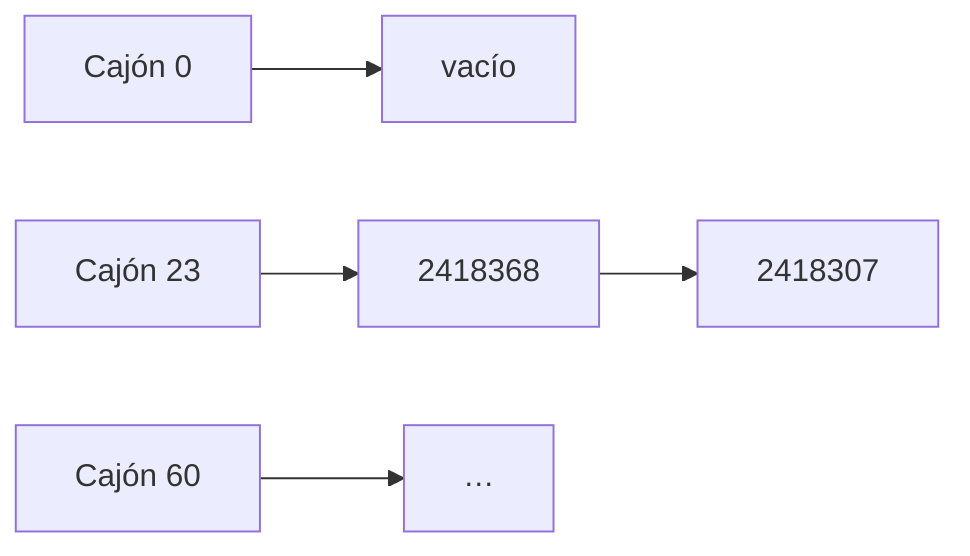

> 📖 Lectura previa a la clase — unos 12 minutos. Al final, responde la autoevaluación.

## El archivador de la secretaría

Recuerda la pila de 60 exámenes sobre el escritorio del profesor. Alguien pregunta por el examen del estudiante con código 2418307 y no queda más remedio que ir pasando hoja por hoja: en el peor caso revisas los 60. Es el mismo costo Θ(n) de buscar en una lista enlazada, y crece con cada examen que se apila.

La secretaría resolvió esto con un mueble de 61 cajones numerados del 0 al 60. Al recibir un examen no lo deja en cualquier parte: aplica una regla fija al código del estudiante y obtiene el número de cajón. Para buscarlo, aplica la misma regla, abre **un** cajón y mira dentro. El costo ya no se mide en exámenes revisados de la pila completa, sino en cajones abiertos y exámenes dentro de ese cajón.

## Del cajón por código a la función hash

**Así en la vida real:** la idea más simple sería un cajón por cada código posible. Con códigos de 7 dígitos serían 10⁷ cajones para guardar 60 exámenes: casi todos vacíos. Eso es el **direccionamiento directo**: búsqueda inmediata, memoria absurda.

**Así en código:** una tabla de tamaño `m` y una función que comprime cualquier clave `k` a una posición entre 0 y m−1.

- **Método de la división:** $h(k) = k \bmod m$. Con `m = 61` y `k = 2418307`: 2418307 = 61 · 39644 + 23, así que va al cajón 23. Conviene un `m` primo y lejos de una potencia de 2, para que no dependa solo de los últimos dígitos binarios del código.
- **Método de la multiplicación:** $h(k) = \lfloor m \cdot (kA \bmod 1) \rfloor$, con $A \approx 0{,}618$. Con el mismo `k`: $kA \approx 1\,494\,513{,}726$, la parte fraccionaria es 0,726 y $\lfloor 61 \cdot 0{,}726 \rfloor = 44$. Aquí `m` no necesita ser primo; la idea es que la parte fraccionaria "revuelve" los dígitos.

> **Función hash:** función `h` que asigna a cada clave posible una posición de una tabla de `m` casillas. Debe ser barata de calcular y repartir las claves de forma pareja.

## Dos exámenes en el mismo cajón: encadenamiento

**Así en la vida real:** el estudiante 2418368 también cae en el cajón 23, porque 2418368 = 2418307 + 61. Dos exámenes, un cajón. La secretaría no tira ninguno: en cada cajón guarda un fajo de post-its enlazados, uno por examen.

**Así en código:** cada casilla guarda la cabeza de una lista enlazada, como la de la lección anterior.

```python
class Nodo:
    """Nodo de una lista enlazada con un par clave-valor."""

    def __init__(self, clave: int, valor: str) -> None:
        """Crea un nodo sin siguiente.

        Args:
            clave: Código que identifica el elemento.
            valor: Dato asociado a la clave.
        """
        self.clave = clave
        self.valor = valor
        self.siguiente: "Nodo | None" = None


class TablaHash:
    """Tabla hash con encadenamiento y h(k) = k mod m."""

    def __init__(self, m: int) -> None:
        """Crea una tabla con m cajones vacíos.

        Args:
            m: Número de cajones.
        """
        self.m = m
        self.cajones: list["Nodo | None"] = [None] * m

    def insertar(self, clave: int, valor: str) -> None:
        """Inserta la pareja o actualiza el valor si la clave existe.

        Args:
            clave: Código del elemento.
            valor: Dato asociado.
        """
        i = clave % self.m
        actual = self.cajones[i]
        while actual is not None:
            if actual.clave == clave:
                actual.valor = valor
                return
            actual = actual.siguiente
        nuevo = Nodo(clave, valor)
        nuevo.siguiente = self.cajones[i]
        self.cajones[i] = nuevo

    def buscar(self, clave: int) -> str | None:
        """Busca el valor de una clave.

        Args:
            clave: Código a buscar.

        Returns:
            El valor asociado, o None si la clave no está.
        """
        actual = self.cajones[clave % self.m]
        while actual is not None:
            if actual.clave == clave:
                return actual.valor
            actual = actual.siguiente
        return None

    def eliminar(self, clave: int) -> bool:
        """Elimina una clave de su cadena.

        Args:
            clave: Código a eliminar.

        Returns:
            True si se eliminó, False si no estaba.
        """
        i = clave % self.m
        anterior: "Nodo | None" = None
        actual = self.cajones[i]
        while actual is not None:
            if actual.clave == clave:
                if anterior is None:
                    self.cajones[i] = actual.siguiente
                else:
                    anterior.siguiente = actual.siguiente
                return True
            anterior, actual = actual, actual.siguiente
        return False
```



> **Encadenamiento:** cada casilla de la tabla guarda una lista con todas las claves que la función hash envía a ella. Buscar, insertar y eliminar recorren solo la lista de un cajón.

## Buscar otro cajón: direccionamiento abierto

**Así en la vida real:** imagina que el mueble no admite fajos: un examen por cajón. Si el cajón está ocupado, pruebas con el siguiente libre.

**Así en código:** sin listas, todo vive dentro del arreglo y se calcula una secuencia de posiciones a probar (**sondeo**). Con `m = 7` y sondeo lineal: la clave 10 va al cajón 3; la 24 también cae en 3, está ocupado, pasa al 4; la 17 prueba 3 y 4 y se queda en el 5; la 5 cae en 5, ocupado, y termina en el 6. Las claves forman una racha que cada vez crece más rápido.

- **Sondeo lineal:** prueba `h(k)`, `h(k)+1`, `h(k)+2`… módulo `m`. Sufre **agrupamiento primario**: las rachas ocupadas se alargan y atraen más claves.
- **Sondeo cuadrático:** salta `1, 4, 9…` posiciones en vez de una; rompe las rachas, aunque claves con el mismo `h(k)` siguen la misma secuencia (**agrupamiento secundario**).
- **Doble hashing:** el tamaño del salto lo da una segunda función hash de la clave, así claves con el mismo `h(k)` recorren secuencias distintas.

Al eliminar no se deja el cajón vacío, porque cortaría la secuencia de otras claves: se marca con una **lápida** que la búsqueda atraviesa y la inserción puede reutilizar.

## Qué tan llenos están los cajones: factor de carga

**Así en la vida real:** con 60 exámenes en 61 cajones, en promedio hay casi uno por cajón; con 600 exámenes habría unos diez, y abrir un cajón ya es hojear un fajo.

**Así en código:** esa relación es el **factor de carga**, $\alpha = n/m$. Bajo el supuesto de **hash uniforme simple** —cada clave cae en cualquier cajón con igual probabilidad e independiente de las demás—, una búsqueda con encadenamiento cuesta en promedio $\Theta(1 + \alpha)$: calcular `h(k)` más recorrer una cadena de longitud esperada $\alpha$. Si `m` crece junto con `n`, $\alpha$ queda acotado y el costo esperado es $\Theta(1)$. Es un supuesto, no un hecho: si todas las claves cayeran en un cajón, la tabla sería una lista y buscar costaría $\Theta(n)$.

Por eso las tablas **se redimensionan**: cuando $\alpha$ supera un umbral, se crea una tabla mayor y se reinsertan todas las claves con el nuevo `m`. En Python, `dict` y `set` son tablas hash: sus claves deben ser _hashables_ (inmutables, como `int`, `str` o `tuple`). CPython usa direccionamiento abierto y las agranda antes de que se llenen (del orden de dos tercios de ocupación).

> **Factor de carga:** $\alpha = n/m$, el promedio de claves por casilla. Gobierna el costo esperado de buscar, insertar y eliminar.

## Dónde se rompe la analogía

- **Dos códigos distintos pueden caer en el mismo cajón:** por eso hay que guardar la clave completa junto al dato y compararla al abrir el cajón.
- **Los cajones no guardan orden:** pedir "el menor código" o "todos entre 2000000 y 2100000" obliga a abrir todos los cajones.
- **Una mala regla amontona:** repartir por el primer dígito del código deja casi todo en unos pocos cajones y devuelve el Θ(n).
- **Un mueble real no crece gratis:** redimensionar la tabla cuesta Θ(n) en una sola operación, aunque repartido entre muchas inserciones resulta barato.

## ¿Dónde aparece en la práctica?

En la consolidación de lecturas de telemedición (contexto narrativo del curso; los datos son órdenes de magnitud, no mediciones) llegan n ≈ 1.850.000 lecturas y hay que descartar duplicadas, es decir, con el mismo `(id_medidor, marca_tiempo)`.

- **Sin tabla hash:** comparar cada lectura con todas las aceptadas hasta ahora cuesta ≈ n²/2 = 1,85²·10¹²/2 ≈ 1,7·10¹² comparaciones.
- **Con tabla hash** (clave `(id_medidor, marca_tiempo)`, `m` del orden de n, α ≈ 0,75): ≈ n(1 + α) = 1,85·10⁶ · 1,75 ≈ 3,2·10⁶ operaciones. Casi seis órdenes de magnitud menos.
- **Consulta puntual:** el call center hace ≈ 10.000 consultas al día. Recorriendo los ≈ 1,85·10⁶ registros cada vez son ≈ 1,85·10¹⁰ comparaciones diarias; con la tabla, Θ(1) esperado por consulta, es decir, del orden de 10⁴ operaciones al día.

Con esto puedes escribir una `TablaHash`, medir `insertar` y `buscar` al variar `n`, y justificar `m` y α. Lo que la tabla no da es el menor, el mayor ni un rango de claves: eso lo resuelve la lección siguiente.

## Síntesis

- **Archivador:** una pila cuesta Θ(n) por búsqueda; un mueble de cajones indexado por la clave la reduce a abrir un cajón.
- **Función hash:** comprime la clave a un índice; división (`k mod m`, `m` primo) o multiplicación (con A ≈ 0,618).
- **Encadenamiento:** cada cajón guarda una lista; las colisiones se apilan, nada se pierde.
- **Direccionamiento abierto:** sondeo lineal, cuadrático o doble hashing, con lápidas al borrar.
- **Factor de carga:** α = n/m; costo esperado Θ(1 + α) bajo hash uniforme simple, Θ(n) en el peor caso.
- **Límites de la analogía:** hay colisiones, no hay orden y las mudanzas (redimensionar) cuestan.
- **Práctica:** deduplicar y consultar por clave pasa de ≈ 10¹² a ≈ 10⁶ operaciones.

Lecturas: Cormen et al., _Introduction to Algorithms_, cap. 11 (Hash Tables).
