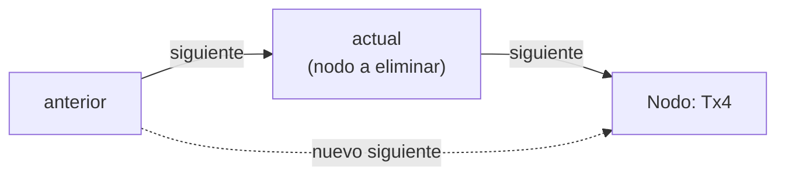

> Sesión T1, Semana 6, segunda mitad — desarrollo en vivo del docente,
> continuación directa de la primera mitad (`operaciones-sobre-la-lista-simple`).
> `ListaSimple<Transaccion>` ya tiene `insertarInicio`, `insertarFinal`,
> `insertarEnPosicion`, `buscarPorIndice`, `buscarPorValor`, `estaVacia`,
> `getTamano` y `recorrerEImprimir`. Hoy se agregan las tres eliminaciones —
> `eliminarInicio`, `eliminarFinal` y `eliminarPorValor` — sobre la misma
> clase `Transaccion` y la misma instancia `historial` que quedó armada al
> cierre de la primera mitad, y se cierra con la comparación lista vs.
> arreglo y el criterio de decisión aplicado al Sistema Bancario. Esta
> sesión no tiene laboratorio propio.
>
> Las tres eliminaciones lanzan `java.util.NoSuchElementException` en el
> caso borde de lista vacía — agrega
> `import java.util.NoSuchElementException;` al inicio de
> `ListaSimple.java` antes del Paso 1, o el proyecto no compila.

## Paso 1 — Eliminar al inicio: `eliminarInicio`

Se abre con la eliminación más simple: la que no recorre nada, porque el
nodo a quitar ya está referenciado por `head`.

```java
public void eliminarInicio() {
    if (estaVacia()) {
        throw new NoSuchElementException("No hay elementos para eliminar");
    }
    head = head.getSiguiente(); // el segundo nodo pasa a ser el primero
    tamano--;
}
```

Explicación línea a línea:
- `if (estaVacia())` — precondición obligatoria: no hay nodo que eliminar en
  una lista vacía. Sin esta validación, `head.getSiguiente()` reventaría con
  `NullPointerException` en vez de dar un mensaje claro.
- `head = head.getSiguiente();` — es la línea entera del método. Si `head`
  tenía un solo nodo, `head.getSiguiente()` ya vale `null`, así que `head`
  queda en `null` — exactamente la condición de lista vacía. No hace falta
  una rama aparte para ese caso.
- El nodo original no se toca ni se destruye explícitamente: al quedar sin
  ninguna referencia que lo señale, el recolector de basura de Java lo
  reclama solo, en algún momento posterior.
- `tamano--;` — se actualiza el contador, sin haber recorrido nada.

Punto a resaltar: proyectar el dibujo de nodos en el tablero antes y después
de la llamada — remarcar que el nodo viejo sigue "vivo" en el heap por un
instante, pero ya es inalcanzable desde el programa. Es la misma idea de
"basura, no memoria corrupta" que ya vieron con `insertarInicio()`.

## Paso 2 — Eliminar al final: `eliminarFinal`

Cambia el reto: ya no hay que encontrar el último nodo (eso ya lo resolvía
`insertarFinal()`), sino llegar al **penúltimo** — es él quien tiene que
quedar apuntando a `null`.

```java
public void eliminarFinal() {
    if (estaVacia()) {
        throw new NoSuchElementException("No hay elementos para eliminar");
    }
    if (head.getSiguiente() == null) {
        head = null; // unico nodo: la lista queda vacia
        tamano--;
        return;
    }
    Nodo<T> actual = head;
    while (actual.getSiguiente().getSiguiente() != null) {
        actual = actual.getSiguiente(); // avanza hasta el penultimo nodo
    }
    actual.setSiguiente(null); // el penultimo pasa a ser el nuevo ultimo
    tamano--;
}
```

Explicación línea a línea:
- `if (estaVacia())` — mismo borde que en `eliminarInicio()`: cero nodos no
  se puede eliminar.
- `if (head.getSiguiente() == null)` — segundo borde, propio de este método:
  con un solo nodo no existe un "penúltimo" real. Si no se separa este caso,
  el `while` de abajo llamaría `getSiguiente()` sobre un `actual.getSiguiente()`
  que ya es `null`, y explotaría con `NullPointerException`.
- `while (actual.getSiguiente().getSiguiente() != null)` — la condición
  mira **dos pasos adelante**, no uno: se corta cuando el nodo siguiente al
  siguiente de `actual` ya no existe, es decir, cuando `actual` es el
  penúltimo.
- `actual.setSiguiente(null);` — única línea que modifica la cadena: el
  penúltimo suelta la referencia al último, que queda sin nadie que lo
  señale.
- `tamano--;` se ejecuta en las dos ramas (un nodo, y más de uno).

Punto a resaltar: contrastar en voz alta con `eliminarInicio()` — ahí basta
con leer `head`, acá hay que **recorrer** para encontrar el nodo correcto.
Es la primera pista visible de que estas dos eliminaciones no van a costar
lo mismo (se cierra en el Paso 4).

## Paso 3 — Eliminar por valor: `eliminarPorValor`

Cierra el desarrollo con la eliminación que no conoce la posición de
antemano — hay que buscar por contenido, igual que `buscarPorValor()`, pero
llevando dos punteros a la vez para poder reenlazar.

```java
public boolean eliminarPorValor(T dato) {
    if (estaVacia()) {
        return false;
    }
    if (head.getDato().equals(dato)) {
        eliminarInicio(); // sin anterior: delega en el caso ya resuelto
        return true;
    }
    Nodo<T> anterior = head;
    Nodo<T> actual = head.getSiguiente();
    while (actual != null) {
        if (actual.getDato().equals(dato)) {
            anterior.setSiguiente(actual.getSiguiente()); // salta el nodo encontrado
            tamano--;
            return true;
        }
        anterior = actual;
        actual = actual.getSiguiente();
    }
    return false; // se recorrio toda la lista sin encontrar el dato
}
```

Explicación línea a línea:
- `if (estaVacia()) return false;` — a diferencia de las dos eliminaciones
  anteriores, aquí "no encontrado" es un resultado válido, no un error: por
  eso se devuelve `false` en vez de lanzar excepción.
- `if (head.getDato().equals(dato))` — caso especial: si el dato buscado
  está justo en el primer nodo, no existe un `anterior` real que reenlazar.
  En vez de forzar un puntero nulo o duplicar lógica, se **delega** en
  `eliminarInicio()`, que ya resuelve exactamente ese caso.
- `Nodo<T> anterior = head; Nodo<T> actual = head.getSiguiente();` — a partir
  de aquí `anterior` va un paso detrás de `actual`: es lo que permite
  reenlazar sin perder el resto de la cadena.
- `anterior.setSiguiente(actual.getSiguiente());` — el salto de referencia:
  `anterior` deja de apuntar al nodo encontrado y pasa a apuntar directo a lo
  que ese nodo tenía como `siguiente`. El nodo `actual` queda sin
  referencias entrantes, igual que en `eliminarInicio()`.
- `anterior = actual; actual = actual.getSiguiente();` — solo se ejecuta
  cuando **no** hubo coincidencia: ambos punteros avanzan un nodo,
  manteniendo la distancia de uno entre sí.
- `return false;` final — se llega aquí únicamente si `actual` recorrió
  toda la cadena sin encontrar el dato.

Punto a resaltar: remarcar que el patrón `anterior.siguiente = actual.siguiente`
es el más general de las tres eliminaciones — es el mismo salto de referencia
que usan, implícitamente, `eliminarInicio()` (donde el "anterior" es la
propia variable `head`) y `eliminarFinal()` (donde el nuevo `siguiente` es
`null` en vez de otro nodo).



## Paso 4 — Análisis de complejidad y prueba completa

Antes de correr el ejemplo, se cierra la tabla de complejidad en el
tablero — es la misma que trae la lección teórica, pero vale la pena
que el estudiante la vea nacer de lo que acaba de escribir:

| Operación | Complejidad | Por qué |
| --- | --- | --- |
| `eliminarInicio` | **O(1)** | Reasigna `head`, sin recorrer nada |
| `eliminarFinal` | **O(n)** | Recorre hasta el penúltimo nodo antes de reenlazar |
| `eliminarPorValor` | **O(n)** | En el peor caso compara con todos los nodos antes de encontrar el dato |

Se cierra el desarrollo reutilizando el `historial` que quedó armado al
final de la primera mitad de la sesión (`Transferencia → Deposito(50000) →
Ajuste → Retiro → Deposito(15000)`), ejercitando las tres eliminaciones
nuevas sobre él.

```java
public class Main {
    public static void main(String[] args) {
        ListaSimple<Transaccion> historial = new ListaSimple<>();

        historial.insertarFinal(new Transaccion("Deposito", 50000));
        historial.insertarFinal(new Transaccion("Retiro", 20000));
        historial.insertarFinal(new Transaccion("Deposito", 15000));
        historial.insertarInicio(new Transaccion("Transferencia", 10000));
        historial.insertarEnPosicion(2, new Transaccion("Ajuste", 500));

        historial.recorrerEImprimir();
        System.out.println("Tamano inicial: " + historial.getTamano()); // 5

        // eliminarPorValor: se descarta la transaccion "Ajuste" por duplicado de captura
        boolean eliminado = historial.eliminarPorValor(new Transaccion("Ajuste", 500));
        System.out.println("Se elimino Ajuste 500: " + eliminado);

        // eliminarFinal: se descarta el ultimo deposito cargado por error
        historial.eliminarFinal();

        // eliminarInicio: se purga la transaccion mas antigua del historial
        historial.eliminarInicio();

        historial.recorrerEImprimir();
        System.out.println("Tamano final: " + historial.getTamano()); // 2

        // precondicion violada a proposito: eliminar en una lista que se vacia por completo
        historial.eliminarInicio();
        historial.eliminarInicio();
        try {
            historial.eliminarInicio();
        } catch (NoSuchElementException e) {
            System.out.println("Error esperado: " + e.getMessage());
        }
    }
}
```

Salida esperada:

```
Transferencia 10000.0
Deposito 50000.0
Ajuste 500.0
Retiro 20000.0
Deposito 15000.0
Tamano inicial: 5
Se elimino Ajuste 500: true
Deposito 50000.0
Retiro 20000.0
Tamano final: 2
Error esperado: No hay elementos para eliminar
```

Punto a resaltar: seguir en el tablero, nodo por nodo, por qué tras
`eliminarPorValor(Ajuste)`, `eliminarFinal()` y `eliminarInicio()` la
cadena queda reducida a `Deposito(50000) → Retiro(20000)` — cada
eliminación tocó un punto distinto de la lista (medio, final, inicio) sin
desplazar nada del resto.

## Paso 5 — Comparación lista vs. arreglo, en vivo

Se cierra la sesión sin código nuevo: se proyecta la tabla comparativa de
la lección teórica y se resuelve verbalmente sobre el propio ejemplo de
`historial` por qué cada fila es cierta.

| Criterio | Arreglo | Lista enlazada por nodos |
| --- | --- | --- |
| Acceso por índice | **O(1)** | **O(n)** |
| Inserción/eliminación en medio | **O(n)** — desplaza | **O(1)** una vez ubicado el nodo |
| Uso de memoria | Contiguo, sin overhead | Un `Nodo<T>` extra por elemento |
| Tamaño | Fijo al crearse | Dinámico |

Punto a resaltar: retomar `eliminarPorValor(Ajuste)` del Paso 4 y preguntar
al grupo qué habría pasado con un `Transaccion[]`: habría que desplazar
todas las casillas después de la posición de `Ajuste` una a la izquierda.
En la lista, en cambio, solo se reescribió una referencia — el `anterior`
del `Ajuste` saltó directo al `Retiro`, sin tocar nada más.

Cierra con el criterio de decisión aplicado al caso: el historial de
transacciones prioriza altas y bajas frecuentes (insertar al inicio,
eliminar por contenido) sobre pedir "la transacción en la posición 200" —
por eso el Sistema Bancario modela el historial con `ListaSimple<T>` y no
con un arreglo de tamaño fijo.

# Aplicacion al proyecto

```java

public class MenuView {
    private ClienteService clienteService = new ClienteService();

    public void iniciar() {
        int opcion;
        do {
            mostrarMenu();
            opcion = ConsoleUtils.leerEntero("Seleccione una opcion: ");
            switch (opcion) {
                case 1 -> crearCliente();
                case 2 -> buscarClientePorIndice();
                case 3 -> buscarClientePorIdentificacion();
                case 4 -> actualizarClientePorIdentificacion();
                case 5 -> eliminarClientePorIdentificacion();
                case 6 -> clienteService.recorrerLista();
                case 0 -> System.out.println("Saliendo del sistema...");
                default -> System.out.println("Opcion invalida.");
            }
        } while (opcion != 0);

        ConsoleUtils.cerrar();
    }

    private void mostrarMenu() {
    }

    private Cliente buscarClientePorIdentificacion() {
        String identificacion = ConsoleUtils.leerTexto("Identificacion del cliente: ");
        return clienteService.buscarPorIdentificacion(identificacion);
    }

    private void buscarClientePorIndice() {
        int indice = ConsoleUtils.leerEntero("Indice del cliente: ");
        Cliente cliente = clienteService.buscarPorIndice(indice);
        if (cliente != null) {
            System.out.println("Cliente encontrado: " + cliente.getNombre());
        } else {
            System.out.println("Cliente no encontrado.");
        }
    }

    private void mostrarMenuActualizarCliente() {
        System.out.println("1. Actualizar nombre");
        System.out.println("2. Actualizar telefono");
        System.out.println("3. Actualizar direccion");
    }

    private void actualizarClientePorIdentificacion() {
        String identificacion = ConsoleUtils.leerTexto("Identificacion del cliente a actualizar: ");
        Cliente cliente = clienteService.buscarPorIdentificacion(identificacion);
        if (cliente == null) {
            System.out.println("Cliente no encontrado.");
            return;
        }
        mostrarMenuActualizarCliente();
        int opcion = ConsoleUtils.leerEntero("Seleccione una opcion: ");
        switch (opcion) {
            case 1: {
                String nuevoNombre = ConsoleUtils.leerTexto("Nuevo nombre: ");
                clienteService.actualizarNombreCliente(cliente, nuevoNombre);
                break;
            }
            case 2: {
                String nuevoTelefono = ConsoleUtils.leerTexto("Nuevo telefono: ");
                clienteService.actualizarTelefonoCliente(cliente, nuevoTelefono);
                break;
            }
            case 3: {
                String nuevaDireccion = ConsoleUtils.leerTexto("Nueva direccion: ");
                clienteService.actualizarDireccionCliente(cliente, nuevaDireccion);
                break;
            }
            default:
                System.out.println("Opcion invalida.");
        }
    }

    private void eliminarClientePorIdentificacion() {
        String identificacion = ConsoleUtils.leerTexto("Identificacion del cliente a eliminar: ");
        Cliente cliente = clienteService.buscarPorIdentificacion(identificacion);
        if (cliente != null) {
            boolean eliminado = clienteService.eliminarCliente(cliente);
            if (eliminado) {
                System.out.println("Cliente eliminado exitosamente.");
            } else {
                System.out.println("Error al eliminar el cliente.");
            }
        } else {
            System.out.println("Cliente no encontrado.");
        }
    }

}
```

```java
public class ClienteService {
    private ListaSimple<Cliente> clientes = new ListaSimple<>();

    public Cliente buscarPorIdentificacion(String identificacion) {
        Nodo<Cliente> clienteActual = clientes.getHead();
        while (clienteActual != null) {
            if (clienteActual.getDato().getIdentificacion().equals(identificacion)) {
                return clienteActual.getDato();
            }
            clienteActual = clienteActual.getSiguiente();
        }
        System.out.println("Dato no encontrado");
        return null;
    }

    public Cliente buscarPorIndice(int indice) {
        Cliente clienteEncontrado = clientes.buscarPorIndice(indice);
        if (clienteEncontrado != null) {
            return clienteEncontrado;
        }
        return null;
    }

    public void recorrerLista() {
        Nodo<Cliente> actual = clientes.getHead();
        for (int i = 0; i < clientes.getTamano(); i++) {
            Cliente clienteActual = actual.getDato();
            System.out.println("Indice: " + i + " Cliente: " +
                    clienteActual.getNombre());
            actual = actual.getSiguiente();
        }
    }

    public void actualizarNombreCliente(Cliente cliente, String nuevoNombre) {
        if (cliente != null) {
            cliente.setNombre(nuevoNombre);
            System.out.println("Nombre del cliente actualizado exitosamente.");
        } else {
            System.out.println("Cliente no encontrado.");
        }
    }

    public void actualizarTelefonoCliente(Cliente cliente, String nuevoTelefono) {
        if (cliente != null) {
            cliente.setTelefono(nuevoTelefono);
            System.out.println("Teléfono del cliente actualizado exitosamente.");
        } else {
            System.out.println("Cliente no encontrado.");
        }
    }

    public void actualizarDireccionCliente(Cliente cliente, String nuevaDireccion) {
        if (cliente != null) {
            cliente.setDireccion(nuevaDireccion);
            System.out.println("Dirección del cliente actualizada exitosamente.");
        } else {
            System.out.println("Cliente no encontrado.");
        }
    }

    public boolean eliminarCliente(Cliente cliente) {
        if (cliente != null) {
            boolean eliminado = clientes.eliminar(cliente);
            if (eliminado) {
                System.out.println("Cliente eliminado exitosamente.");
                return true;
            } else {
                System.out.println("Error al eliminar el cliente.");
                return false;
            }
        } else {
            System.out.println("Cliente no encontrado.");
            return false;
        }
    }
}

```

## Preguntas socráticas

- *"¿Por qué `eliminarPorValor` delega en `eliminarInicio()` cuando el dato
  está en el primer nodo, en vez de reenlazar directamente con un
  `anterior`?"* — Respuesta esperada: porque en ese caso no existe un
  `anterior` real — el primer nodo no tiene nadie antes que reenlazar. La
  única forma de "eliminarlo" es reasignar `head`, que es exactamente lo que
  ya hace `eliminarInicio()`; delegar evita repetir esa lógica dos veces.
- *"¿Por qué `eliminarFinal` necesita un `if` especial para la lista de un
  solo nodo, pero `eliminarInicio` no?"* — Respuesta esperada: porque
  `eliminarInicio` solo necesita leer `head.getSiguiente()`, que vale `null`
  sin problema incluso con un solo nodo. `eliminarFinal`, en cambio, necesita
  encontrar el **penúltimo** nodo mirando dos pasos adelante
  (`actual.getSiguiente().getSiguiente()`) — y con un solo nodo ese segundo
  paso ya no existe, así que hay que cortar el caso antes de intentarlo.
- *"Si el historial de transacciones necesitara frecuentemente 'dame la
  transacción número 200' sin recorrer nada antes, ¿seguiría siendo buena
  idea usar `ListaSimple<T>`?"* — Respuesta esperada: no. Ese patrón de uso
  es exactamente el que favorece a un arreglo (u `ArrayList`): acceso O(1)
  contra el O(n) de recorrer nodo por nodo en la lista. La elección de
  estructura depende del patrón de operaciones más frecuente, no de que una
  estructura sea "mejor" en abstracto.
