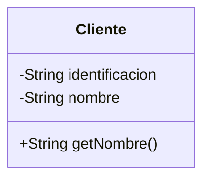
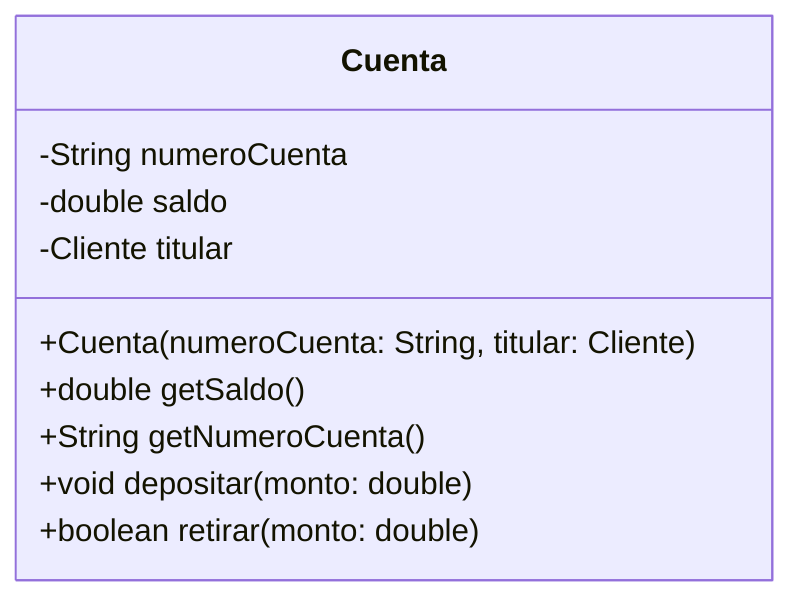

> Sesión T5, sin código Java propio: el ejercicio en clase es traducir entre
> el diagrama de clases y su equivalente en Java, ida y vuelta, sobre
> `Cliente`/`Cuenta` del Sistema Bancario.

## Paso 1 — Leer una clase de tres compartimentos

Proyectar el diagrama mínimo y pedir al grupo que identifique, sin
ayuda, los tres compartimentos antes de nombrarlos:



Punto a resaltar: nombre arriba, atributos en medio, métodos abajo —
**siempre en ese orden**, aunque algún compartimento quede vacío.

## Paso 2 — Traducir visibilidad, símbolo por símbolo

Con el mismo diagrama proyectado, ir símbolo por símbolo pidiendo la
traducción a Java antes de confirmarla:

| Símbolo UML | Modificador Java |
| ----------- | ----------------- |
| `+`         | `public`           |
| `-`         | `private`          |
| `#`         | `protected`        |

`-identificacion` → `private String identificacion;`
`+getNombre()` → `public String getNombre() { ... }`

Punto a resaltar: el patrón que se repite en casi cualquier clase de
dominio es atributos con `-` y métodos con `+` — cuando el diagrama ya
sigue ese patrón, se puede anticipar la visibilidad antes de leerla.

## Paso 3 — Notación de atributos y de métodos

Escribir en el tablero, en vivo, la notación genérica y pedir ejemplos del
propio proyecto de cada estudiante:

```
-nombreAtributo: Tipo
+nombreMetodo(parametro: Tipo): TipoRetorno
```

Aplicarla sobre `Cuenta`:

```
-saldo: double
+getSaldo(): double
+depositar(monto: double): void
```

Y su equivalente en Java, proyectado en paralelo:

```java
public double getSaldo() {
    return saldo;
}

public void depositar(double monto) {
    saldo = saldo + monto;
}
```

Punto a resaltar: la traducción es casi carácter por carácter — `-saldo:
double` es `private double saldo;` sin más que reordenar. Es el ancla que
hace que leer UML deje de sentirse como un lenguaje nuevo.

## Paso 4 — Leer un diagrama completo y anticipar el `.java`

Cerrar con el diagrama más denso de la sesión, sin haber mostrado antes
ningún código de `Cuenta`:



Pedir al grupo que dicte, en voz alta, el esqueleto de `Cuenta.java` —
atributos primero, constructor después, métodos al final — antes de
proyectar la solución. Señalar `+Cuenta(numeroCuenta: String, titular:
Cliente)`: se distingue del resto porque no tiene tipo de retorno y
comparte el nombre de la clase — es el constructor.

Punto a resaltar: si el grupo puede dictar el esqueleto completo sin haber
visto el `.java`, el diagrama cumplió su función. Esa es la señal de cierre
de la sesión, no un tiempo fijo.

## Preguntas socráticas

- *"¿Por qué los tres compartimentos van siempre en el mismo orden, incluso
  si alguno queda vacío?"* — Respuesta esperada: porque es la convención
  fija de la notación UML — leer cualquier diagrama de cualquier
  herramienta o proyecto depende de que el orden nunca cambie.
- *"Si un atributo aparece como `#titular: Cliente` en vez de `-titular:
  Cliente`, ¿qué cambia respecto al Java que ya conocen?"* — Respuesta
  esperada: que el atributo sería `protected` en vez de `private`, visible
  también para subclases — el mismo concepto de Encapsulamiento, con otro
  símbolo.
- *"¿Cómo se distingue un constructor de un método normal en el diagrama,
  sin que diga la palabra 'constructor' en ningún lado?"* — Respuesta
  esperada: no tiene tipo de retorno después de los dos puntos, y su nombre
  es exactamente el nombre de la clase.
