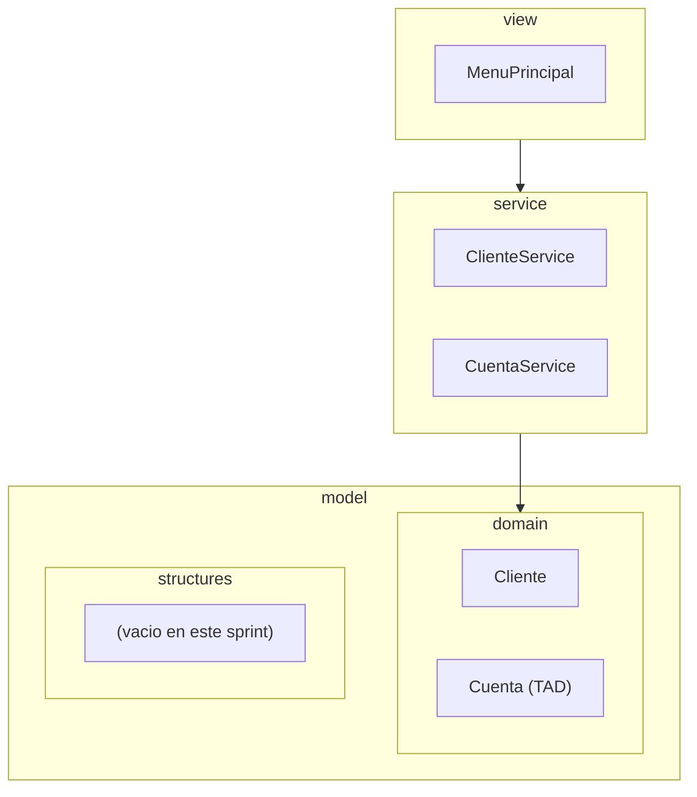
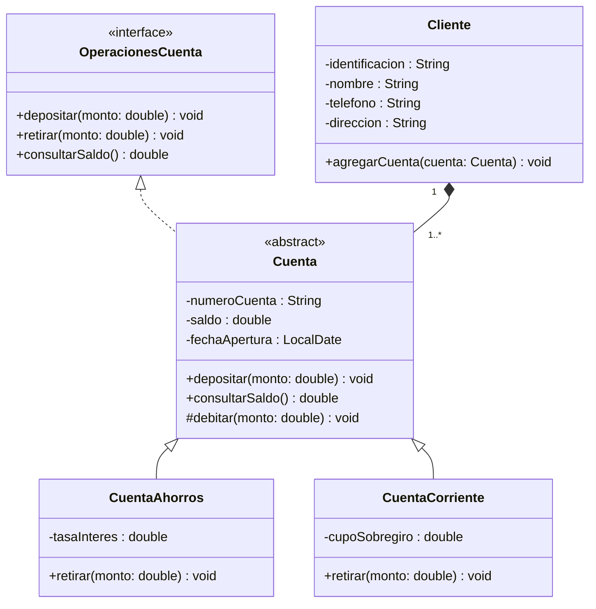

> Sesión evaluativa (Momento 1, 5 % — el 10 % restante del tema se evalúa
> la semana siguiente con un quiz de opción múltiple). Cada equipo recibe el
> diagrama UML **ya resuelto** de su proyecto (ver la guía publicada, sección
> "Diagrama UML por proyecto") y debe traducirlo a código: la interfaz, la
> clase abstracta, las dos subclases concretas y la relación de composición.
> Aquí se resuelve el Sistema Bancario completo como demostración íntegra de
> esa traducción UML → código, más la clase de prueba de creación de objetos
> que pide la rúbrica ("Pruebas en el App"). Proyectar el diagrama entregado
> primero, después bajar a la implementación paso a paso.
>
> El Sistema Bancario es el proyecto de referencia del docente, no uno de
> los cinco casos de estudio de equipo — este paso a paso no cambia. Para
> contexto al explicar en clase: en la guía publicada, cada uno de los cinco
> proyectos de equipo ahora parte explícitamente de las cinco clases que ya
> construyeron en la práctica de Semana 2 ("Modela una clase de tu proyecto
> de aula"), no de cero — el laboratorio las evoluciona con encapsulamiento,
> herencia e interfaces en vez de introducir un diseño desconectado.

## Paso 1 — Diagrama de paquetes: las tres capas

Antes del detalle de clases, ubicar cada paquete y quién depende de quién.
Flecha = "conoce a / llama a".



La `View` habla directo con el `Service`: no hay capa intermedia. Cada
flecha es una dependencia real y unidireccional — el `Service` nunca
conoce a la `View`, y el `Model` no conoce a nadie por encima suyo.

Punto a resaltar: `model/structures/` existe como paquete desde ya (así lo
pide la estructura de carpetes de la Semana 1), pero queda vacío hasta el
Sprint 2 — el diagrama de paquetes no miente sobre el estado real del
proyecto, y eso también se evalúa.

## Paso 2 — Diagrama de clases del dominio: el TAD `Cuenta`

Este es el plano de referencia que se va a reutilizar todo el semestre.
Muestra la interfaz (el TAD, contrato de la Semana 4 T2), la jerarquía de
`Cuenta` y la relación de composición con `Cliente`.



Puntos a resaltar mientras se proyecta:

- **`OperacionesCuenta <|.. Cuenta`** es realización (línea punteada): el
  TAD se define primero como contrato, después `Cuenta` lo implementa —
  el puente diseño OO → TAD de la T2.
- **`Cuenta <|-- CuentaAhorros`** y su hermana son herencia (línea sólida):
  la jerarquía de dos niveles ya vista en el laboratorio de la Semana 3.
- **`Cliente "1" *-- "1..*" Cuenta`** es composición: el diamante relleno
  del lado de `Cliente`, más la multiplicidad "una cuenta pertenece
  exactamente a un cliente y no sobrevive fuera de él" — distinto de una
  agregación, donde la parte podría existir sin el todo.
- `retirar()` no aparece en `Cuenta`: la interfaz lo exige, pero cada
  subtipo lo implementa con su propia regla (sin sobregiro vs. con cupo).
  Eso es lo que hace `Cuenta` abstracta sin necesidad de la palabra clave
  `abstract` sobre el método — ya está pendiente por herencia de interfaz.

## Paso 3 — El TAD `OperacionesCuenta`

```java
package model.domain;

public interface OperacionesCuenta {
    void depositar(double monto);
    void retirar(double monto);
    double consultarSaldo();
}
```

Contrato de tres operaciones. Cualquier tipo de cuenta que exista en el
sistema, presente o futuro, tiene que poder responder a las tres.

## Paso 4 — `Cuenta`, clase abstracta que implementa el TAD

```java
package model.domain;

import java.time.LocalDate;

public abstract class Cuenta implements OperacionesCuenta {
    private final String numeroCuenta;
    private double saldo;
    private final LocalDate fechaApertura;

    public Cuenta(String numeroCuenta, double saldoInicial) {
        if (saldoInicial < 0) {
            // Validacion en el constructor: nunca se construye una
            // cuenta con saldo negativo, sin importar el subtipo.
            throw new IllegalArgumentException("El saldo inicial no puede ser negativo");
        }
        this.numeroCuenta = numeroCuenta;
        this.saldo = saldoInicial;
        this.fechaApertura = LocalDate.now();
    }

    @Override
    public void depositar(double monto) {
        // Depositar es igual para cualquier cuenta: se resuelve una sola
        // vez aqui y las subclases lo heredan sin sobreescribirlo.
        if (monto <= 0) {
            throw new IllegalArgumentException("El monto a depositar debe ser positivo");
        }
        this.saldo += monto;
    }

    @Override
    public double consultarSaldo() {
        return saldo;
    }

    protected void debitar(double monto) {
        // 'protected': solo las subclases pueden mover saldo directamente,
        // despues de que cada una valido su propia regla de retiro.
        this.saldo -= monto;
    }

    protected double getSaldo() {
        return saldo;
    }

    public String getNumeroCuenta() {
        return numeroCuenta;
    }

    public LocalDate getFechaApertura() {
        return fechaApertura;
    }
}
```

Punto a resaltar: `retirar()` no se escribe aquí. `Cuenta` sigue siendo
abstracta porque deja sin resolver un método de la interfaz — el
compilador obliga a que cada subclase concreta lo implemente.

## Paso 5 — `CuentaAhorros` y `CuentaCorriente`, la implementación polimórfica

```java
package model.domain;

public class CuentaAhorros extends Cuenta {
    private double tasaInteres;

    public CuentaAhorros(String numeroCuenta, double saldoInicial, double tasaInteres) {
        super(numeroCuenta, saldoInicial);
        this.tasaInteres = tasaInteres;
    }

    @Override
    public void retirar(double monto) {
        if (monto <= 0) {
            throw new IllegalArgumentException("El monto a retirar debe ser positivo");
        }
        if (monto > getSaldo()) {
            // Regla propia de la cuenta de ahorros: no hay sobregiro.
            throw new IllegalStateException("Saldo insuficiente: las cuentas de ahorro no permiten sobregiro");
        }
        debitar(monto);
    }

    public double getTasaInteres() {
        return tasaInteres;
    }
}
```

```java
package model.domain;

public class CuentaCorriente extends Cuenta {
    private double cupoSobregiro;

    public CuentaCorriente(String numeroCuenta, double saldoInicial, double cupoSobregiro) {
        super(numeroCuenta, saldoInicial);
        this.cupoSobregiro = cupoSobregiro;
    }

    @Override
    public void retirar(double monto) {
        if (monto <= 0) {
            throw new IllegalArgumentException("El monto a retirar debe ser positivo");
        }
        if (monto > getSaldo() + cupoSobregiro) {
            // Regla propia de la cuenta corriente: puede quedar en saldo
            // negativo hasta el limite del cupo autorizado.
            throw new IllegalStateException("Saldo insuficiente: supera el cupo de sobregiro autorizado");
        }
        debitar(monto);
    }

    public double getCupoSobregiro() {
        return cupoSobregiro;
    }
}
```

Punto a resaltar: `retirar()` es la misma firma en las dos clases, pero el
cuerpo es distinto — esto es polimorfismo real, no una coincidencia de
nombre. Más adelante, `CuentaService` va a llamar `cuenta.retirar(monto)`
sin saber ni importarle cuál de las dos es.

## Paso 6 — `Cliente`, la composición con `Cuenta`

```java
package model.domain;

import java.util.ArrayList;
import java.util.List;

public class Cliente {
    private final String identificacion;
    private String nombre;
    private String telefono;
    private String direccion;
    private final List<Cuenta> cuentas;

    public Cliente(String identificacion, String nombre, String telefono, String direccion) {
        if (identificacion == null || identificacion.isBlank()) {
            throw new IllegalArgumentException("La identificacion no puede estar vacia");
        }
        this.identificacion = identificacion;
        this.nombre = nombre;
        this.telefono = telefono;
        this.direccion = direccion;
        this.cuentas = new ArrayList<>();
    }

    public void agregarCuenta(Cuenta cuenta) {
        // Composicion en codigo: la unica forma de que una Cuenta exista
        // en el sistema es colgada de un Cliente ya construido.
        this.cuentas.add(cuenta);
    }

    public List<Cuenta> getCuentas() {
        return cuentas;
    }

    public String getIdentificacion() {
        return identificacion;
    }

    public String getNombre() {
        return nombre;
    }

    public void setNombre(String nombre) {
        this.nombre = nombre;
    }

    public String getTelefono() {
        return telefono;
    }

    public void setTelefono(String telefono) {
        this.telefono = telefono;
    }
}
```

Punto a resaltar: `cuentas` se expone como `List<Cuenta>` — un `ArrayList`
temporal, no un `ListaSimple<T>` propia todavía. Eso llega recién en el
Sprint 2 (Semana 5); adelantarlo hoy sería contenido que el curso no ha
enseñado.

## Paso 7 — Clase de prueba de creación de objetos

Esto es lo que resuelve el ítem **"Pruebas en el App" (20 %)** de la
rúbrica: una clase con `main` que instancia cada subtipo concreto, los
agrega a la clase de composición, y ejercita el método polimórfico
(`retirar()`) sobre cada uno **sin `instanceof`**, imprimiendo el resultado.

```java
import model.domain.Cliente;
import model.domain.Cuenta;
import model.domain.CuentaAhorros;
import model.domain.CuentaCorriente;

import java.util.List;

public class PruebaCreacionObjetos {
    public static void main(String[] args) {
        // Se crea un Cliente y se le agregan una cuenta de cada subtipo
        // concreto -- exactamente lo que pide la Parte 2 de la guia.
        Cliente cliente = new Cliente("CC-123", "Ana Torres", "3001234567", "Calle 10 #5-20");

        CuentaAhorros ahorros = new CuentaAhorros("AH-001", 100000, 0.02);
        CuentaCorriente corriente = new CuentaCorriente("CC-001", 50000, 200000);

        cliente.agregarCuenta(ahorros);
        cliente.agregarCuenta(corriente);

        // Se recorren las cuentas como referencias del tipo abstracto
        // Cuenta -- ni una sola vez se pregunta de que subtipo es cada una.
        List<Cuenta> cuentas = cliente.getCuentas();
        for (Cuenta cuenta : cuentas) {
            probarRetiro(cuenta, 30000);
        }
    }

    private static void probarRetiro(Cuenta cuenta, double monto) {
        // Este metodo no sabe (ni le importa) si 'cuenta' es CuentaAhorros
        // o CuentaCorriente: retirar() resuelve la regla de cada subtipo
        // por si sola gracias al polimorfismo. Sin instanceof en ningun lado.
        cuenta.retirar(monto);
        System.out.println(cuenta.getClass().getSimpleName()
            + " " + cuenta.getNumeroCuenta()
            + " -> saldo tras retirar " + monto + ": " + cuenta.consultarSaldo());
    }
}
```

Punto a resaltar: `cuenta.getClass().getSimpleName()` se usa solo para el
mensaje impreso, no para decidir comportamiento — eso es distinto de un
`instanceof` que ramifica la lógica. La regla de retiro sigue viviendo
exclusivamente dentro de cada subtipo.

> Lo siguiente (capas `service`/`view` y revisión entre pares)
> ya no es parte de los criterios evaluados de este laboratorio (ver rúbrica
> ajustada), pero se mantiene como demostración de hacia dónde va el
> proyecto en las siguientes semanas.

## Paso 8 — Capa `service`: coordina, no decide sola

```java
package service;

import model.domain.Cliente;

import java.util.ArrayList;
import java.util.List;
import java.util.Optional;

public class ClienteService {
    private final List<Cliente> clientes = new ArrayList<>();

    public Cliente registrar(String identificacion, String nombre, String telefono, String direccion) {
        // El Service es el unico que construye entidades del dominio: la
        // View le pasa datos crudos, nunca objetos Cliente ya armados.
        boolean existe = clientes.stream()
            .anyMatch(c -> c.getIdentificacion().equals(identificacion));
        if (existe) {
            throw new IllegalStateException("Ya existe un cliente con esa identificacion");
        }
        Cliente cliente = new Cliente(identificacion, nombre, telefono, direccion);
        clientes.add(cliente);
        return cliente;
    }

    public Optional<Cliente> buscarPorIdentificacion(String identificacion) {
        return clientes.stream()
            .filter(c -> c.getIdentificacion().equals(identificacion))
            .findFirst();
    }

    public Cliente buscarPorIdentificacionOFallar(String identificacion) {
        return buscarPorIdentificacion(identificacion)
            .orElseThrow(() -> new IllegalArgumentException("Cliente no encontrado: " + identificacion));
    }
}
```

```java
package service;

import model.domain.Cliente;
import model.domain.Cuenta;
import model.domain.CuentaAhorros;
import model.domain.CuentaCorriente;

public class CuentaService {
    private final ClienteService clienteService;

    public CuentaService(ClienteService clienteService) {
        // Un Service puede apoyarse en otro Service de la misma capa;
        // lo que no puede es conocer la View que esta por encima.
        this.clienteService = clienteService;
    }

    public CuentaAhorros abrirCuentaAhorros(String identificacion, String numeroCuenta,
                                            double saldoInicial, double tasaInteres) {
        // El Service valida la regla de negocio ("una cuenta se abre a
        // nombre de un cliente ya registrado"), construye el subtipo
        // concreto y delega la mutacion al Model. La View nunca llama a
        // Cliente.agregarCuenta directo.
        Cliente cliente = clienteService.buscarPorIdentificacionOFallar(identificacion);
        CuentaAhorros cuenta = new CuentaAhorros(numeroCuenta, saldoInicial, tasaInteres);
        cliente.agregarCuenta(cuenta);
        return cuenta;
    }

    public CuentaCorriente abrirCuentaCorriente(String identificacion, String numeroCuenta,
                                                double saldoInicial, double cupoSobregiro) {
        Cliente cliente = clienteService.buscarPorIdentificacionOFallar(identificacion);
        CuentaCorriente cuenta = new CuentaCorriente(numeroCuenta, saldoInicial, cupoSobregiro);
        cliente.agregarCuenta(cuenta);
        return cuenta;
    }

    public void retirar(Cuenta cuenta, double monto) {
        // Polimorfismo otra vez: el Service no pregunta que tipo de
        // Cuenta recibio. Cada subtipo resuelve su propia regla.
        cuenta.retirar(monto);
    }
}
```

Punto a resaltar: los métodos de apertura son el **único** lugar donde se
nombra un subtipo concreto (`CuentaAhorros`, `CuentaCorriente`), porque
alguien tiene que decidir cuál construir según lo que pidió el usuario. De
ahí en adelante todo se maneja como `Cuenta` — `retirar()` no vuelve a
preguntar de qué tipo es. Esa decisión vive en el `Service`, junto a la
regla de negocio que la acompaña.

## Paso 9 — Capa `view`: el menú de consola

```java
package view;

import model.domain.Cliente;
import service.ClienteService;
import service.CuentaService;

import java.util.Scanner;

public class MenuPrincipal {
    private final ClienteService clienteService;
    private final CuentaService cuentaService;
    private final Scanner entrada;

    public MenuPrincipal(ClienteService clienteService, CuentaService cuentaService) {
        // La View recibe los services que necesita y los invoca directo.
        this.clienteService = clienteService;
        this.cuentaService = cuentaService;
        this.entrada = new Scanner(System.in);
    }

    public void iniciar() {
        int opcion;
        do {
            mostrarOpciones();
            opcion = Integer.parseInt(entrada.nextLine());
            switch (opcion) {
                case 1 -> registrarCliente();
                case 2 -> abrirCuentaAhorros();
                case 0 -> System.out.println("Cerrando el sistema...");
                default -> System.out.println("Opcion invalida");
            }
        } while (opcion != 0);
    }

    private void mostrarOpciones() {
        System.out.println("1. Registrar cliente");
        System.out.println("2. Abrir cuenta de ahorros");
        System.out.println("0. Salir");
        System.out.print("Elija una opcion: ");
    }

    private void registrarCliente() {
        // La View solo recolecta datos y se los entrega al Service;
        // nunca instancia Cliente ni Cuenta directamente.
        System.out.print("Identificacion: ");
        String identificacion = entrada.nextLine();
        System.out.print("Nombre: ");
        String nombre = entrada.nextLine();
        System.out.print("Telefono: ");
        String telefono = entrada.nextLine();
        System.out.print("Direccion: ");
        String direccion = entrada.nextLine();
        Cliente cliente = clienteService.registrar(identificacion, nombre, telefono, direccion);
        System.out.println("Cliente registrado: " + cliente.getNombre());
    }

    private void abrirCuentaAhorros() {
        System.out.print("Identificacion del cliente: ");
        String identificacion = entrada.nextLine();
        System.out.print("Numero de cuenta: ");
        String numeroCuenta = entrada.nextLine();
        System.out.print("Saldo inicial: ");
        double saldoInicial = Double.parseDouble(entrada.nextLine());
        System.out.print("Tasa de interes: ");
        double tasaInteres = Double.parseDouble(entrada.nextLine());
        cuentaService.abrirCuentaAhorros(identificacion, numeroCuenta, saldoInicial, tasaInteres);
        System.out.println("Cuenta de ahorros abierta");
    }
}
```

Punto a resaltar: los dos métodos privados terminan igual — leen del
`Scanner`, llaman **un** método del `Service` y muestran el resultado. Si
alguna vez aparece un `if` con una regla de negocio dentro de esta clase,
está en la capa equivocada.

## Paso 10 — `Main.java`: se ensamblan las tres capas

```java
import service.ClienteService;
import service.CuentaService;
import view.MenuPrincipal;

public class Main {
    public static void main(String[] args) {
        // El unico lugar del proyecto donde las tres capas se conocen
        // todas a la vez: aqui se cablean, en ningun otro sitio.
        ClienteService clienteService = new ClienteService();
        CuentaService cuentaService = new CuentaService(clienteService);
        MenuPrincipal menu = new MenuPrincipal(clienteService, cuentaService);
        menu.iniciar();
    }
}
```

## Paso 11 — Revisión entre pares

Con el diseño y el código completos, cada equipo intercambia su diagrama y
su repositorio con otro equipo (dominios distintos, así que la revisión se
hace sobre la fidelidad de la estructura, no sobre el contenido del
dominio). La pregunta que guía la revisión es una sola: **¿el código que
estoy viendo es exactamente lo que el diagrama promete, ni más ni menos?**
En el Sistema Bancario, eso significa comprobar que `Cuenta` en el código
es abstracta como en el diagrama, que `retirar()` no aparece implementado
en `Cuenta` sino en cada subtipo, y que ninguna clase de `view` construye
un objeto `Cuenta` directamente sin pasar por el `service`.

## Preguntas socráticas

- *"¿Por qué `OperacionesCuenta` es una interfaz y no simplemente tres
  métodos abstractos declarados en `Cuenta`?"* — Respuesta esperada: porque
  el contrato debería poder aplicarse a cualquier tipo de cuenta futura sin
  obligarla a heredar de `Cuenta` — la interfaz separa "qué hace una cuenta"
  de "cómo está construida esta familia de cuentas en particular", que es
  exactamente la idea de TAD vista en la T2.
- *"Si `CuentaCorriente` no sobreescribiera `retirar()`, ¿compilaría el
  proyecto?"* — Respuesta esperada: no, porque `Cuenta` es abstracta y deja
  `retirar()` sin implementar; cualquier subclase concreta está obligada a
  proveerlo o el compilador la obliga a declararse también abstracta.
- *"¿Por qué la relación entre `Cliente` y `Cuenta` es composición y no
  agregación?"* — Respuesta esperada: porque una `Cuenta` no tiene sentido
  ni se conserva fuera de su `Cliente` — si el cliente se elimina del
  sistema, sus cuentas se eliminan con él. Una agregación, en cambio,
  permitiría que la parte sobreviva al todo.
- *"¿Por qué `CuentaService.retirar()` no pregunta con `instanceof` si la
  cuenta es de ahorros o corriente?"* — Respuesta esperada: porque
  preguntar el tipo concreto y ramificar manualmente sería reimplementar a
  mano lo que el polimorfismo ya resuelve automáticamente al invocar
  `cuenta.retirar(monto)` — cada subtipo ejecuta su propia versión sin que
  el `Service` necesite saberlo.
- *"¿Qué pasaría si `MenuPrincipal` construyera la cuenta y llamara
  `cliente.getCuentas().add(cuenta)` directamente, en vez de pasar por
  `CuentaService.abrirCuentaAhorros()`?"* — Respuesta esperada: seguiría
  funcionando hoy, pero rompería la separación de responsabilidades:
  cualquier regla de negocio futura sobre abrir cuentas (por ejemplo, un
  tope de cuentas por cliente) tendría que escribirse dentro del menú, y
  habría que repetirla en cada opción que abra cuentas. La `View` solo debe
  pedir datos y mostrar resultados; en el momento en que decide algo del
  negocio, el `Service` deja de ser la única fuente de esas reglas.
