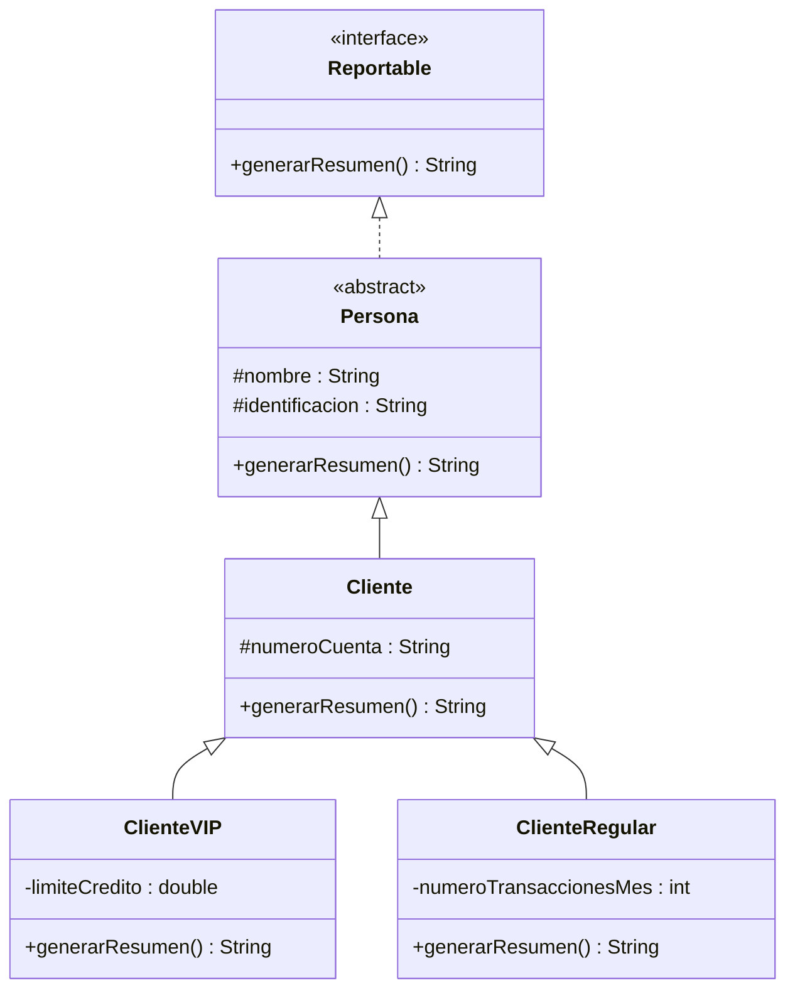

> Jerarquía de referencia del Sistema Bancario: interfaz `Reportable`,
> clase abstracta `Persona` que la implementa, y dos niveles más de herencia
> hasta `ClienteVIP`/`ClienteRegular`. Se desarrolla completa en vivo antes
> de que cada equipo la traslade a su propio caso de estudio.

## Paso 1 — La interfaz `Reportable`

```java
public interface Reportable {
    String generarResumen();
}
```

Contrato de un solo método: cualquier nivel de la jerarquía que la implemente
debe poder responder `generarResumen()`.

## Paso 2 — `Persona`, clase abstracta que implementa la interfaz

```java
public abstract class Persona implements Reportable {
    protected String nombre;
    protected String identificacion;

    public Persona(String nombre, String identificacion) {
        this.nombre = nombre;
        this.identificacion = identificacion;
    }

    @Override
    public String generarResumen() {
        return "Persona: " + nombre + " (ID " + identificacion + ")";
    }
}
```

Punto a resaltar: `Persona` puede dar una implementación completa de
`generarResumen()` y aun así seguir siendo `abstract` — lo abstracto no es el
método, es la clase: no tiene sentido instanciar "una persona genérica" del
banco.

## Paso 3 — `Cliente`, segundo nivel

```java
public class Cliente extends Persona {
    protected String numeroCuenta;

    public Cliente(String nombre, String identificacion, String numeroCuenta) {
        super(nombre, identificacion);
        this.numeroCuenta = numeroCuenta;
    }

    @Override
    public String generarResumen() {
        return super.generarResumen() + " | Cuenta: " + numeroCuenta;
    }
}
```

Punto a resaltar: `super.generarResumen()` reutiliza el formato del nivel
anterior en vez de reescribirlo — el mismo patrón visto en la lección de
Herencia.

## Paso 4 — `ClienteVIP` y `ClienteRegular`, tercer nivel

```java
public class ClienteVIP extends Cliente {
    private double limiteCredito;

    public ClienteVIP(String nombre, String identificacion, String numeroCuenta, double limiteCredito) {
        super(nombre, identificacion, numeroCuenta);
        this.limiteCredito = limiteCredito;
    }

    @Override
    public String generarResumen() {
        return super.generarResumen() + " | VIP, cupo: " + limiteCredito;
    }
}

public class ClienteRegular extends Cliente {
    private int numeroTransaccionesMes;

    public ClienteRegular(String nombre, String identificacion, String numeroCuenta, int numeroTransaccionesMes) {
        super(nombre, identificacion, numeroCuenta);
        this.numeroTransaccionesMes = numeroTransaccionesMes;
    }

    @Override
    public String generarResumen() {
        return super.generarResumen() + " | Regular, transacciones del mes: " + numeroTransaccionesMes;
    }
}
```

Punto a resaltar: los tres niveles sobreescriben `generarResumen()`
encadenando `super` en cada uno — la salida final muestra que la cadena
completa se ejecutó, no solo el nivel más específico.

## Paso 5 — Prueba con arreglo de referencias

```java
public class Main {
    public static void main(String[] args) {
        Reportable[] personas = {
            new ClienteVIP("Ana Torres", "1001", "CTA-001", 5_000_000),
            new ClienteRegular("Luis Pérez", "1002", "CTA-002", 7)
        };

        for (Reportable p : personas) {
            System.out.println(p.generarResumen());
        }
    }
}
```

Salida esperada:

```
Persona: Ana Torres (ID 1001) | Cuenta: CTA-001 | VIP, cupo: 5000000.0
Persona: Luis Pérez (ID 1002) | Cuenta: CTA-002 | Regular, transacciones del mes: 7
```

Punto a resaltar: la variable de recorrido es `Reportable p`, no `Cliente p`
ni `ClienteVIP p` — el arreglo declarado con el tipo de la interfaz es la
prueba de que ni la interfaz ni la clase abstracta necesitan conocer, en
tiempo de compilación, qué subtipo concreto van a recorrer.

## Diagrama de clases para la lectura guiada

Proyectar este diagrama junto al código de los pasos anteriores. El
objetivo es que el grupo aprenda a **leer** las partes marcadas, no a
dibujarlo — construir un UML completo de las tres capas es contenido de
la Semana 4.



Guion de lectura, señalando cada elemento en orden:

1. **`<<interface>>` sobre `Reportable`** — así se marca una interfaz en UML; no tiene atributos, solo la firma del método.
2. **`<<abstract>>` sobre `Persona`** — clase que no se puede instanciar directamente.
3. **Flecha punteada con triángulo hueco (`<|..`), de `Persona` a `Reportable`** — es **realización**: "`Persona` implementa el contrato de `Reportable`". Es la flecha que más se confunde con la de herencia — resaltar que es **punteada**.
4. **Flechas sólidas con triángulo hueco (`<|--`)** — son **herencia**: `Cliente` extiende `Persona`, `ClienteVIP` y `ClienteRegular` extienden `Cliente`. Continua, no punteada.
5. **Tres niveles en la misma cadena de flechas sólidas** — así se ve una jerarquía de tres niveles en UML: no hay notación especial, solo dos flechas de herencia encadenadas.

## Errores frecuentes y cómo intervenir

| Síntoma observable | Causa probable | Intervención sugerida |
|---|---|---|
| El método sobreescrito no se ejecuta — sale la versión del padre | Falta `@Override`, la firma del "método nuevo" no coincide exactamente | Agregar `@Override` a todos los métodos que deberían sobreescribir; si el compilador marca error ahí, ese es el bug |
| `error: cannot find symbol` sobre un atributo heredado | El atributo de la superclase quedó `private` en vez de `protected` | Revisar visibilidad de los atributos de la clase base |
| Casteos dentro del `for` que recorre el arreglo | El arreglo se declaró con un tipo demasiado específico (`Object[]` o el tipo concreto) | Cambiar el tipo del arreglo al de la interfaz o clase abstracta común |
| `error: Cliente is not abstract and does not override abstract method` | Una clase concreta no implementó un método abstracto heredado | Revisar que todas las clases hoja tengan el método concreto |
| El constructor de la subclase no compila o los atributos heredados quedan en `null`/`0` | Falta `super(...)` como primera línea del constructor, o el orden de argumentos es incorrecto | Volver al patrón de `super(...)` de la lección de Herencia |

## Preguntas socráticas

- *"¿Por qué `Persona` es `abstract` si ya tiene una implementación completa de `generarResumen()`?"* — Respuesta esperada: porque no tiene sentido instanciar "una persona genérica" en el dominio del banco; ser `abstract` no depende de tener métodos sin cuerpo, sino de si la clase representa un concepto completo por sí sola.
- *"Si cambio el arreglo de `Reportable[]` a `Cliente[]`, ¿sigue compilando el mismo `for`? ¿Y si lo cambio a `Persona[]`?"* — Respuesta esperada: sí en ambos casos, porque `ClienteVIP` y `ClienteRegular` son también `Cliente` y también `Persona` — el polimorfismo funciona con cualquier tipo de referencia que sea ancestro común del objeto real.
- *"¿Qué pasaría si `ClienteVIP` no sobreescribiera `generarResumen()`?"* — Respuesta esperada: se ejecutaría la versión heredada de `Cliente` (o de `Persona`, si `Cliente` tampoco la sobreescribiera) — no es un error, es exactamente cómo funciona la herencia cuando no hay sobreescritura.
- *"¿Podría `Persona` implementar dos interfaces a la vez?"* — Respuesta esperada: sí, `implements InterfazA, InterfazB` — a diferencia de `extends`, que admite una sola superclase.
