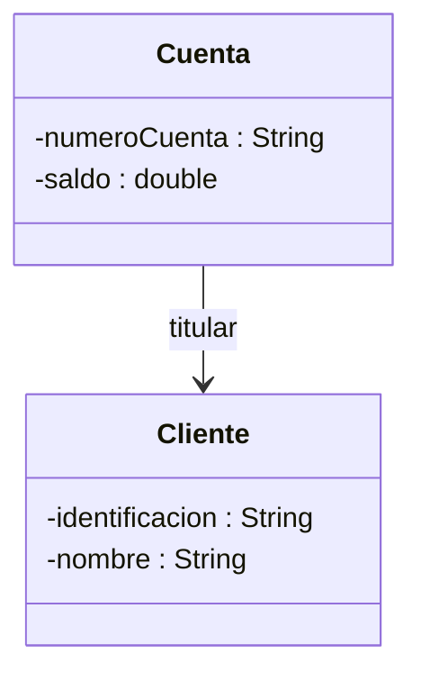
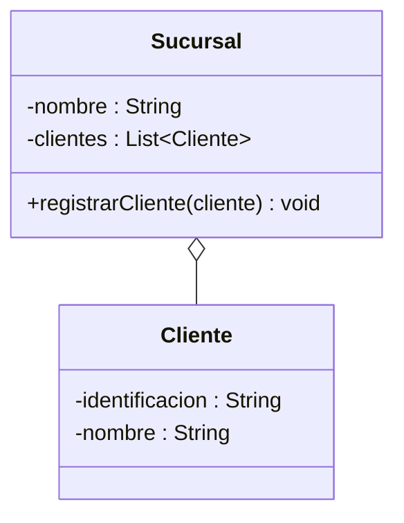
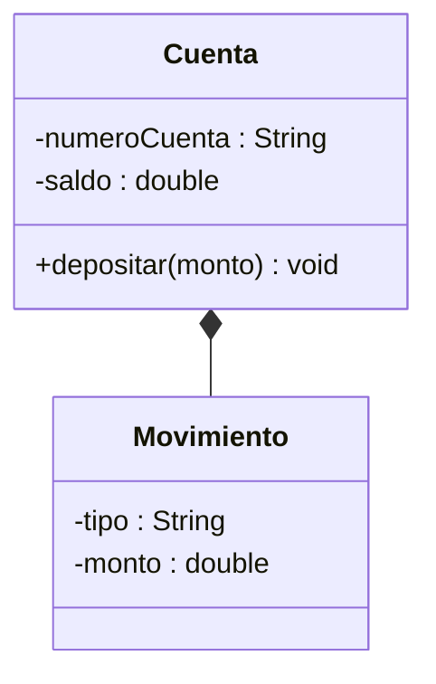
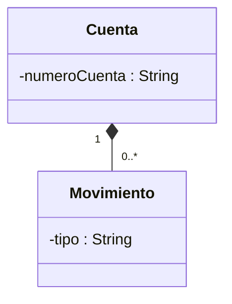

<Callout tipo="nota">
  Repositorio de referencia del proyecto (Sistema Bancario):
  [github.com/santiagoSuarez219/estructura-de-datos-sistema-bancario](https://github.com/santiagoSuarez219/estructura-de-datos-sistema-bancario).
  Clónalo para seguir los ejemplos de esta lección sobre el código real del
  proyecto.
</Callout>

## El problema: ¿existe una relación entre `Cliente` y `Cuenta`?

En Introducción al UML modelaste `Cliente` y `Cuenta` por separado: cada
clase con su recuadro de tres compartimentos, cada atributo con su tipo,
cada método con su firma. Tu equipo revisó ambos diagramas y todos
estuvieron de acuerdo. Nadie preguntó lo obvio: ¿cómo se relacionan?

Al sentarse a codificar aparecen las preguntas que el diagrama de una clase
sola nunca podía responder. Si borras un `Cliente` de la base de datos,
¿sus `Cuenta`s deben borrarse también, o pueden seguir existiendo a nombre
de nadie? Si una `Cuenta` puede existir un instante sin ningún `Cliente`
todavía asignado, ¿por qué el constructor de `Cuenta` exige un `Cliente`
como parámetro obligatorio? Dos clases bien diseñadas por separado no
garantizan que el equipo esté de acuerdo en cómo se conectan — y esa es
precisamente la pregunta que un diagrama de clases aislado no puede
contestar.

## La solución: tres formas de "tener" un objeto en UML

UML distingue tres relaciones según qué tan atado está el ciclo de vida de
un objeto al del otro: si solo se conocen, si uno reúne al otro sin
poseerlo, o si uno no tiene sentido sin el otro.

Las tres se dibujan como una línea entre dos clases, pero la punta que toca
al "todo" cambia: una flecha simple, un diamante hueco, un diamante
relleno. Esa punta es la única diferencia visual — y encierra una decisión
de diseño completa.

> **Relación de clases en UML:** vínculo entre dos clases que indica que los
> objetos de una conocen, reúnen o dependen de los objetos de la otra. UML
> distingue tres intensidades — asociación, agregación y composición — según
> cuánto controla el "todo" el ciclo de vida de la "parte".

## Asociación: dos clases que se conocen, sin dependencia

**Situación:** una `Cuenta` necesita saber quién es su `titular`, pero un
`Cliente` puede dejar de tener esa cuenta —cerrarla, transferirla— sin que
el objeto `Cliente` deje de existir, y viceversa: el `Cliente` sigue
existiendo en el banco aunque no tenga ninguna cuenta abierta hoy.

**En la práctica**, es la relación más simple: una clase guarda una
referencia a otra como uno de sus atributos, sin ninguna obligación sobre
cuándo se crea o se destruye el objeto referenciado.

```java
public class Cuenta {
    private String numeroCuenta;
    private double saldo;
    private Cliente titular;   // referencia, sin crearlo ni destruirlo aqui

    public Cuenta(String numeroCuenta, Cliente titular) {
        this.numeroCuenta = numeroCuenta;
        this.titular = titular;   // el Cliente ya existia antes
        this.saldo = 0.0;
    }
}
```



> **Asociación:** relación en la que una clase conoce y usa a otra a través
> de una referencia, sin que ninguna controle la existencia de la otra. Se
> dibuja con una flecha simple (`-->`), apuntando hacia la clase conocida.

## Agregación: "tiene un" débil, el todo no controla el ciclo de vida

**Situación:** una `Sucursal` reúne a varios `Cliente`s que la tienen como
sucursal de atención preferente. Pero un `Cliente` puede trasladarse a otra
sucursal —sigue existiendo, con su misma identidad, aunque cambie de
sucursal o aunque la sucursal original cierre—.

**En la práctica**, `Sucursal` guarda una lista de `Cliente`s, pero **no los
instancia**: los recibe ya creados (ya se registraron en el banco) y solo
los agrega a su colección.

```java
public class Sucursal {
    private String nombre;
    private List<Cliente> clientes;

    public Sucursal(String nombre) {
        this.nombre = nombre;
        this.clientes = new ArrayList<>();   // lista vacia: sin clientes todavia
    }

    public void registrarCliente(Cliente cliente) {
        clientes.add(cliente);   // el Cliente ya existia antes de registrarlo
    }
}
```

`Sucursal` nunca ejecuta `new Cliente(...)`: la responsabilidad de crear al
`Cliente` es de quien construye el objeto y se lo entrega a
`registrarCliente()`.



> **Agregación:** relación "tiene un" en la que el todo reúne a la parte,
> pero **no controla su ciclo de vida** — la parte puede existir antes,
> después o independientemente del todo. Se dibuja con un diamante hueco
> junto al todo (`o--`).

## Composición: "tiene un" fuerte, la parte no sobrevive al todo

**Situación:** una `Cuenta` acumula `Movimiento`s de historial — depósitos,
retiros. Un `Movimiento` no significa nada fuera de la cuenta a la que
pertenece: nadie ficha un `Movimiento` a otra cuenta, y si la `Cuenta` se
elimina, sus movimientos no tienen ninguna razón para seguir existiendo.

**En la práctica**, `Cuenta` no recibe los `Movimiento`s ya construidos: los
**crea ella misma**, dentro de su propio código.

```java
public class Cuenta {
    private String numeroCuenta;
    private double saldo;
    private List<Movimiento> historial;

    public Cuenta(String numeroCuenta) {
        this.numeroCuenta = numeroCuenta;
        this.saldo = 0.0;
        this.historial = new ArrayList<>();
    }

    public void depositar(double monto) {
        saldo += monto;
        historial.add(new Movimiento("DEPOSITO", monto));   // Cuenta lo crea
    }
}
```

El constructor de `Movimiento` nunca se llama fuera de `Cuenta`: no existe
código en el proyecto que cree un `Movimiento` suelto, sin una `Cuenta` que
lo posea.



> **Composición:** relación "tiene un" en la que el todo es **dueño
> exclusivo** de la parte y controla su ciclo de vida — si el todo deja de
> existir, la parte deja de existir con él, y ninguna otra clase la conserva
> ni puede reasignarla a otro todo. El indicio más frecuente en el código es
> que el todo la cree él mismo con `new`, como aquí, pero **el criterio es la
> propiedad exclusiva y el ciclo de vida**, no quién ejecuta el `new`: verás
> composiciones donde la parte se construye afuera y se le entrega al todo
> que la posee. Se dibuja con un diamante relleno junto al todo (`*--`).

## Multiplicidades: cuántas instancias hay a cada lado

**Situación:** ya viste que `Cuenta` y `Movimiento` tienen una relación de
composición, pero el diagrama todavía no dice cuántos movimientos puede
acumular una cuenta, ni si una cuenta recién abierta puede existir sin
ningún movimiento todavía.

**En la práctica**, cada extremo de la línea lleva un número o rango entre
comillas: `"1"` (exactamente uno), `"0..*"` (cero o muchos), `"1..*"` (uno o
muchos).



`Cuenta "1" *-- "0..*" Movimiento` se lee así: **una** `Cuenta` se compone de
**cero o muchos** `Movimiento`s. La multiplicidad no cambia el tipo de
relación —sigue siendo composición, con su diamante relleno—, solo agrega la
cardinalidad exacta que el código debe respetar: una `Cuenta` recién abierta
empieza con `historial` vacío, y eso es válido porque el diagrama permite
`"0..*"`, no `"1..*"`.

## Resumen operativo

| Notación UML     | Nombre        | Indicio típico en el código                      | Criterio: ¿existe la parte sin el todo? |
| ---------------- | ------------- | ------------------------------------------------ | --------------------------------------- |
| `-->`            | Asociación    | `private Cliente titular;` (recibido, no creado) | Sí, siempre                             |
| `o--`            | Agregación    | `clientes.add(cliente);` (recibido en un método) | Sí — puede pasar a otro todo            |
| `*--`            | Composición   | `new Movimiento(...)` (creado dentro del todo)   | No — muere con el todo                  |
| `"1" ... "1..*"` | Multiplicidad | —                                                | Cuántas instancias, no de qué tipo      |

La tercera columna es un **indicio**, no la definición. Quien decide es la
última: si la parte puede sobrevivir al todo y pasar a otro, es agregación;
si muere con él y nadie más la conserva, es composición — aunque el objeto
se haya construido afuera y se le haya entregado al todo que lo posee.

## Síntesis

- La **asociación** es el vínculo más simple: dos clases se conocen a
  través de una referencia, sin que ninguna controle la existencia de la
  otra — como `Cuenta` y su `titular`.
- La **agregación** es un "tiene un" débil: el todo reúne partes que
  recibe ya creadas y que pueden sobrevivirlo — como `Sucursal` con sus
  `Cliente`s registrados.
- La **composición** es un "tiene un" fuerte: el todo crea y destruye a
  la parte, que no tiene sentido fuera de él — como `Cuenta` con su
  historial de `Movimiento`s.
- Las **multiplicidades** (`"1"`, `"0..*"`, `"1..*"`) precisan cuántas
  instancias participan a cada lado de cualquiera de las tres relaciones.
- Con estas cuatro piezas —los tres tipos de relación, más
  multiplicidades— ya puedes leer cualquier diagrama de relaciones de tu
  proyecto de aula, aunque combine varias clases a la vez.
