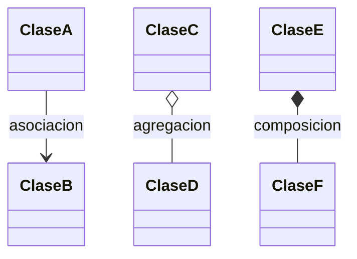
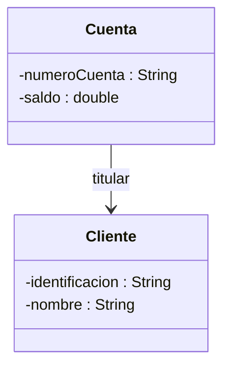
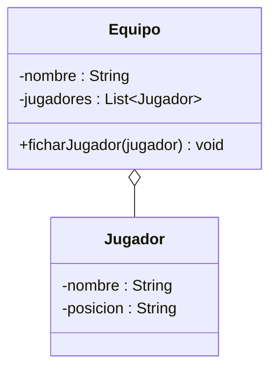
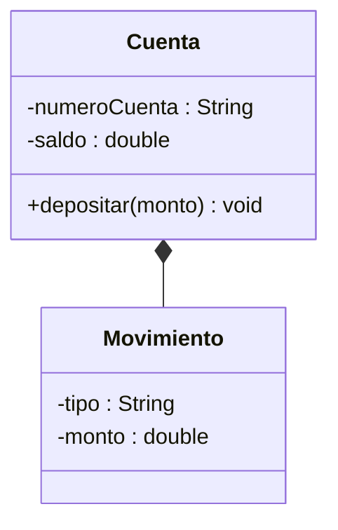
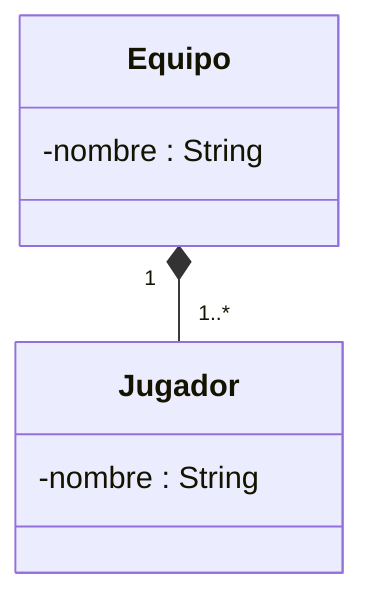
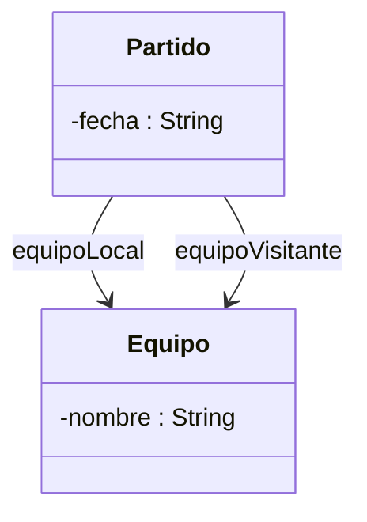

## El problema: ¿el Cliente es dueño de su Cuenta, o solo la conoce?

En Introducción al UML modelaste `Cliente` y `Cuenta` por separado: cada
clase con su recuadro de tres compartimentos, cada atributo con su tipo,
cada método con su firma. Tu equipo revisó ambos diagramas y todos
estuvieron de acuerdo. Nadie preguntó lo obvio: ¿cómo se relacionan?

Al sentarse a codificar aparecen las preguntas que el diagrama de una clase
sola nunca podía responder. Si borras un `Cliente` de la base de datos,
¿sus `Cuenta`s deben borrarse también, o pueden seguir existiendo a nombre
de nadie? Si una `Cuenta` puede existir un instante sin ningún `Cliente`
todavía asignado, ¿por qué el constructor de `Cuenta` exige un `Cliente`
como parámetro obligatorio? Dos clases bien diseñadas por separado no
garantizan que el equipo esté de acuerdo en cómo se conectan — y esa es
precisamente la pregunta que un diagrama de clases aislado no puede
contestar.

## La solución: tres formas de "tener" un objeto en UML

UML no trata todo "tener un" por igual. Distingue tres relaciones según qué
tan atado está el ciclo de vida de un objeto al del otro: si solo se
conocen, si uno reúne al otro sin poseerlo, o si uno no tiene sentido sin el
otro.



Las tres se dibujan como una línea entre dos clases, pero la punta que toca
al "todo" cambia: una flecha simple para asociación, un diamante hueco para
agregación, un diamante relleno para composición. Esa punta es la única
diferencia visual — y encierra una decisión de diseño completa.

> **Relación de clases en UML:** vínculo entre dos clases que indica que los
> objetos de una conocen, reúnen o dependen de los objetos de la otra. UML
> distingue tres intensidades — asociación, agregación y composición — según
> cuánto controla el "todo" el ciclo de vida de la "parte".

## Asociación: dos clases que se conocen, sin dependencia

**Situación:** una `Cuenta` necesita saber quién es su `titular`, pero un
`Cliente` puede dejar de tener esa cuenta —cerrarla, transferirla— sin que
el objeto `Cliente` deje de existir, y viceversa: el `Cliente` sigue
existiendo en el banco aunque no tenga ninguna cuenta abierta hoy.

**En la práctica**, es la relación más simple: una clase guarda una
referencia a otra como uno de sus atributos, sin ninguna obligación sobre
cuándo se crea o se destruye el objeto referenciado.

```java
public class Cuenta {
    private String numeroCuenta;
    private double saldo;
    private Cliente titular;   // referencia, sin crearlo ni destruirlo aqui

    public Cuenta(String numeroCuenta, Cliente titular) {
        this.numeroCuenta = numeroCuenta;
        this.titular = titular;   // el Cliente ya existia antes
        this.saldo = 0.0;
    }
}
```



> **Asociación:** relación en la que una clase conoce y usa a otra a través
> de una referencia, sin que ninguna controle la existencia de la otra. Se
> dibuja con una flecha simple (`-->`), apuntando hacia la clase conocida.

## Agregación: "tiene un" débil, el todo no controla el ciclo de vida

**Situación:** un `Equipo` de la liga reúne a varios `Jugador`es. Pero un
`Jugador` puede ser fichado por otro equipo en el siguiente semestre — el
jugador sigue existiendo, con su misma identidad, aunque cambie de equipo o
aunque el equipo entero desaparezca por quiebra.

**En la práctica**, `Equipo` guarda una lista de `Jugador`es, pero **no los
instancia**: los recibe ya creados y solo los agrega a su colección.

```java
public class Equipo {
    private String nombre;
    private List<Jugador> jugadores;

    public Equipo(String nombre) {
        this.nombre = nombre;
        this.jugadores = new ArrayList<>();   // lista vacia: sin jugadores todavia
    }

    public void ficharJugador(Jugador jugador) {
        jugadores.add(jugador);   // el Jugador ya existia antes de ficharlo
    }
}
```

`Equipo` nunca ejecuta `new Jugador(...)`: la responsabilidad de crear al
`Jugador` es de quien construye el objeto y se lo entrega a `ficharJugador()`.



> **Agregación:** relación "tiene un" en la que el todo reúne a la parte,
> pero **no controla su ciclo de vida** — la parte puede existir antes,
> después o independientemente del todo. Se dibuja con un diamante hueco
> junto al todo (`o--`).

## Composición: "tiene un" fuerte, la parte no sobrevive al todo

**Situación:** una `Cuenta` acumula `Movimiento`s de historial — depósitos,
retiros. Un `Movimiento` no significa nada fuera de la cuenta a la que
pertenece: nadie ficha un `Movimiento` a otra cuenta, y si la `Cuenta` se
elimina, sus movimientos no tienen ninguna razón para seguir existiendo.

**En la práctica**, `Cuenta` no recibe los `Movimiento`s ya construidos: los
**crea ella misma**, dentro de su propio código.

```java
public class Cuenta {
    private String numeroCuenta;
    private double saldo;
    private List<Movimiento> historial;

    public Cuenta(String numeroCuenta) {
        this.numeroCuenta = numeroCuenta;
        this.saldo = 0.0;
        this.historial = new ArrayList<>();
    }

    public void depositar(double monto) {
        saldo += monto;
        historial.add(new Movimiento("DEPOSITO", monto));   // Cuenta lo crea
    }
}
```

El constructor de `Movimiento` nunca se llama fuera de `Cuenta`: no existe
código en el proyecto que cree un `Movimiento` suelto, sin una `Cuenta` que
lo posea.



> **Composición:** relación "tiene un" en la que el todo **crea y controla**
> por completo el ciclo de vida de la parte — si el todo deja de existir, la
> parte deja de existir con él. Se dibuja con un diamante relleno junto al
> todo (`*--`).

## Multiplicidades: cuántas instancias hay a cada lado

**Situación:** el diagrama de `Equipo`/`Jugador` ya muestra la relación,
pero no dice cuántos jugadores puede tener un equipo, ni si un equipo puede
existir sin ninguno todavía fichado.

**En la práctica**, cada extremo de la línea lleva un número o rango entre
comillas: `"1"` (exactamente uno), `"0..*"` (cero o muchos), `"1..*"` (uno o
muchos). Se lee del lado que está más cerca:



`Equipo "1" *-- "1..*" Jugador` se lee así: **un** `Equipo` se compone de
**uno o muchos** `Jugador`es. La multiplicidad no cambia el tipo de relación
—sigue siendo composición, con su diamante relleno—, solo agrega la
cardinalidad exacta que el código debe respetar: si tu clase `Equipo`
permitiera un `List<Jugador>` vacío para siempre, estaría violando el
`"1..*"` que el diagrama exige.

## Roles y navegación: cuando el nombre de la relación no basta

**Situación:** un `Partido` se relaciona con `Equipo` **dos veces** — el
equipo que juega de local y el que juega de visitante. Una sola línea
`Partido --> Equipo` sería ambigua: no dice cuál es cuál.

**En la práctica**, cada línea lleva un **rol nombrado** después de los dos
puntos, que distingue relaciones repetidas entre las mismas dos clases:



`equipoLocal` y `equipoVisitante` son dos atributos distintos de tipo
`Equipo` dentro de `Partido` — el diagrama ya te dice sus nombres exactos.
La flecha simple (`-->`) también indica **navegación**: `Partido` conoce a
`Equipo`, pero nada obliga a que `Equipo` conozca de vuelta a cada
`Partido` en el que jugó. Si la relación necesitara leerse en ambos
sentidos —`Equipo` con una lista de sus partidos, además—, se dibuja sin
punta de flecha en ningún extremo, indicando navegación bidireccional.

## Resumen operativo

| Notación UML | Nombre | Ejemplo de código Java | ¿Existe la parte sin el todo? |
|---|---|---|---|
| `-->` | Asociación | `private Cliente titular;` (recibido, no creado) | Sí, siempre |
| `o--` | Agregación | `jugadores.add(jugador);` (recibido en un método) | Sí — puede pasar a otro todo |
| `*--` | Composición | `new Movimiento(...)` (creado dentro del todo) | No — muere con el todo |
| `"1" ... "1..*"` | Multiplicidad | — | Cuántas instancias, no de qué tipo |
| `: equipoLocal` | Rol nombrado | `private Equipo equipoLocal;` | Distingue relaciones repetidas |

## Síntesis

- La **asociación** es el vínculo más simple: dos clases se conocen a
  través de una referencia, sin que ninguna controle la existencia de la
  otra — como `Cuenta` y su `titular`.
- La **agregación** es un "tiene un" débil: el todo reúne partes que
  recibe ya creadas y que pueden sobrevivirlo — como `Equipo` con sus
  `Jugador`es fichados.
- La **composición** es un "tiene un" fuerte: el todo crea y destruye a
  la parte, que no tiene sentido fuera de él — como `Cuenta` con su
  historial de `Movimiento`s.
- Las **multiplicidades** (`"1"`, `"0..*"`, `"1..*"`) precisan cuántas
  instancias participan a cada lado de cualquiera de las tres relaciones.
- Los **roles nombrados** distinguen relaciones repetidas entre las mismas
  dos clases, como los dos vínculos de `Partido` hacia `Equipo`.
- Con estas seis piezas —tres tipos de relación, sus dos notaciones
  restantes y su lectura— ya puedes leer cualquier diagrama de relaciones
  de tu proyecto de aula, aunque combine varias clases a la vez.
