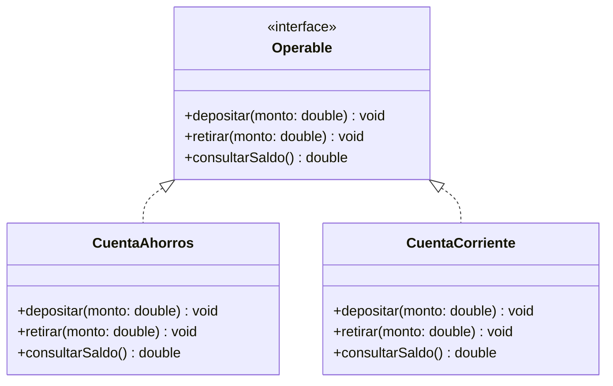
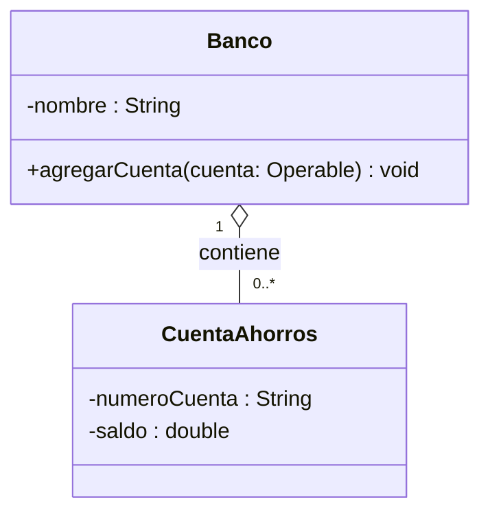
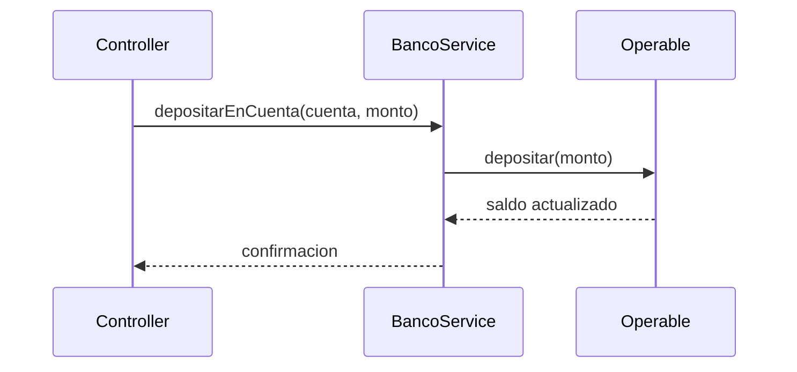
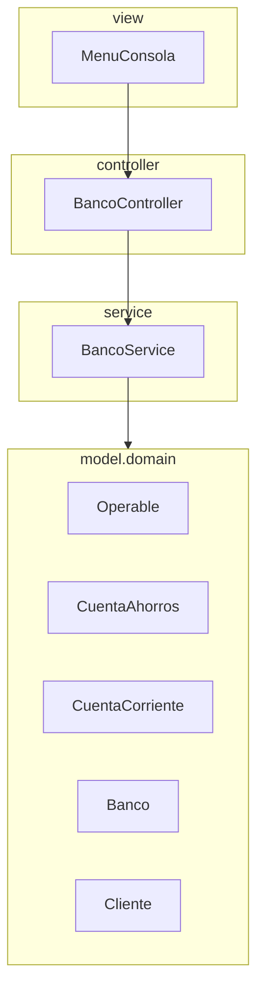

<Callout tipo="nota">
Repositorio de referencia del proyecto (Sistema Bancario): [github.com/santiagoSuarez219/estructura-de-datos-sistema-bancario](https://github.com/santiagoSuarez219/estructura-de-datos-sistema-bancario). Clónalo para seguir los ejemplos de esta lección sobre el código real del proyecto.
</Callout>

## El problema: tu Service no puede tratar dos cuentas por igual

El `Service` del Sistema Bancario necesita cerrar el mes: recorrer todas las
cuentas del banco y liquidar los intereses o cobrar la cuota de manejo que
corresponda. Pero `CuentaAhorros` y `CuentaCorriente` son dos clases sin
relación entre sí — cada una con su propio método (`liquidarIntereses()` en
una, `cobrarCuotaManejo()` en la otra) — así que el `Controller` que las
recorre termina lleno de preguntas sobre el tipo de cada objeto:

```java
public void cerrarMes(List<Object> cuentas) {
    for (Object cuenta : cuentas) {
        if (cuenta instanceof CuentaAhorros) {
            ((CuentaAhorros) cuenta).liquidarIntereses();
        } else if (cuenta instanceof CuentaCorriente) {
            ((CuentaCorriente) cuenta).cobrarCuotaManejo();
        }
    }
}
```

Este código ya te resulta familiar — es el mismo problema que resolviste en
Polimorfismo con las tarjetas. Aquí vuelve a aparecer, un nivel más arriba:
en el `Service`, la capa que coordina la lógica de negocio de todo el
proyecto.

## Más problemas que aparecen al crecer el proyecto

El `if instanceof` no es el único síntoma. Si `CuentaAhorros` y
`CuentaCorriente` no comparten ni una superclase ni una interfaz, cada una
reimplementa `depositar()` y `retirar()` por su cuenta — la misma
duplicación de lógica que ya viste entre `TarjetaDebito` y `TarjetaCredito`
antes de introducir herencia. Y a medida que el banco agrega `Cliente`,
`Transaccion`, `CuentaAhorros`, `CuentaCorriente`, `Prestamo`... todas esas
clases de dominio terminan amontonadas en una sola carpeta, sin ningún
criterio que distinga "esto es una regla de negocio" de "esto es un dato
puro":

```
src/
├── Cliente.java
├── Cuenta.java
├── CuentaAhorros.java
├── CuentaCorriente.java
├── Transaccion.java
├── BancoService.java
├── BancoController.java
├── MenuConsola.java
└── Main.java
```

Nadie encuentra nada a simple vista: no hay forma de saber, mirando la
carpeta, cuáles archivos son entidades del dominio y cuáles son lógica de
negocio o interfaz de usuario.

## La solución: separar el contrato de la implementación

Ambos problemas comparten una raíz: el código que **usa** un objeto está
mezclado con el código que **decide cómo está hecho** ese objeto. La
solución es declarar primero **qué puede hacer** un objeto — sus
operaciones, sin decir cómo las ejecuta — y dejar que cada clase concreta
decida **cómo** las implementa. En Java, ese contrato es una `interface`; la
clase que la implementa usa `implements`:

```java
public interface Operable {
    void depositar(double monto);
    void retirar(double monto);
    double consultarSaldo();
}
```



> **Tipo abstracto de datos (TAD):** modelo que define un conjunto de datos
> junto con las operaciones que se pueden realizar sobre ellos, sin
> especificar cómo esos datos ni esas operaciones están implementados por
> dentro. En orientación a objetos, el TAD es la `interface`; cada `class`
> que la implementa es una representación posible, oculta detrás del
> contrato.

## Del diagrama de clases al código: leer relaciones e implementarlas en Java

En Asociación, agregación y composición viste cómo UML anota multiplicidades
sobre una relación entre dos clases. Ese mismo diagrama, cuando te lo
entregan ya resuelto, se lee de izquierda a derecha para decidir qué
escribir en Java:



La multiplicidad `"1" o-- "0..*"` dice: un `Banco` reúne cero o más
`CuentaAhorros`, y cada `CuentaAhorros` pertenece a un único `Banco` en un
momento dado (agregación: si el banco cierra, la cuenta podría trasladarse a
otro banco en una fusión, sin dejar de existir). Esa lectura se traduce,
casi línea por línea, a una colección como campo y a un método que agrega
una cuenta ya construida a esa colección:

```java
public class Banco {
    private String nombre;
    private List<Operable> cuentas = new ArrayList<>();   // "0..*" -> colección

    public Banco(String nombre) {
        this.nombre = nombre;
    }

    public void agregarCuenta(Operable cuenta) {
        cuentas.add(cuenta);
    }
}
```

El campo `cuentas` es de tipo `List<Operable>`, no `List<CuentaAhorros>`: el
`Banco` no necesita saber si una cuenta es de ahorros o corriente para
guardarla — solo necesita saber que es `Operable`.

## Diseñar el TAD de una cuenta bancaria: `Operable` + `CuentaAhorros`/`CuentaCorriente`

**Situación:** ya tienes el contrato `Operable` y sabes que `Banco` guarda
una colección de cuentas por ese tipo. Falta escribir las dos
implementaciones concretas, cada una con su regla de negocio propia.

**En la práctica**, cada clase concreta declara `implements Operable` y
resuelve las tres operaciones a su manera:

```java
public class CuentaAhorros implements Operable {
    private String numeroCuenta;
    private double saldo;
    private double tasaInteres;

    public CuentaAhorros(String numeroCuenta, double saldo, double tasaInteres) {
        this.numeroCuenta = numeroCuenta;
        this.saldo = saldo;
        this.tasaInteres = tasaInteres;
    }

    @Override
    public void depositar(double monto) {
        if (monto <= 0) throw new IllegalArgumentException("Monto invalido");
        saldo += monto;
    }

    @Override
    public void retirar(double monto) {
        if (monto > saldo) throw new IllegalArgumentException("Saldo insuficiente");
        saldo -= monto;
    }

    @Override
    public double consultarSaldo() {
        return saldo;
    }

    public void liquidarIntereses() {
        saldo += saldo * tasaInteres;
    }
}

public class CuentaCorriente implements Operable {
    private String numeroCuenta;
    private double saldo;
    private double cupoSobregiro;

    public CuentaCorriente(String numeroCuenta, double saldo, double cupoSobregiro) {
        this.numeroCuenta = numeroCuenta;
        this.saldo = saldo;
        this.cupoSobregiro = cupoSobregiro;
    }

    @Override
    public void depositar(double monto) {
        if (monto <= 0) throw new IllegalArgumentException("Monto invalido");
        saldo += monto;
    }

    @Override
    public void retirar(double monto) {
        if (monto > saldo + cupoSobregiro) {
            throw new IllegalArgumentException("Cupo de sobregiro insuficiente");
        }
        saldo -= monto;
    }

    @Override
    public double consultarSaldo() {
        return saldo;
    }

    public void cobrarCuotaManejo() {
        saldo -= 5000;
    }
}
```

`liquidarIntereses()` y `cobrarCuotaManejo()` no están en `Operable` —cada
cuenta las declara solo para sí misma, porque no son parte del contrato
compartido con el resto de cuentas del banco.

> **TAD aplicado a diseño OO:** `Operable` es el TAD — declara **qué**
> operaciones existen (`depositar`, `retirar`, `consultarSaldo`) sin decir
> **cómo** se ejecutan. `CuentaAhorros` y `CuentaCorriente` son dos
> representaciones distintas del mismo TAD: cada una guarda sus propios
> datos privados y resuelve las operaciones a su manera, sin que el resto
> del sistema necesite conocer esa diferencia.

## El Service programa contra la interfaz, no contra la implementación

Con `Operable` ya definida, el `Service` que cierra el mes deja de preguntar
tipos: recibe cualquier `Operable` y lo trata igual, sin importar qué clase
concreta hay detrás.

```java
public class BancoService {
    public void depositarEnCuenta(Operable cuenta, double monto) {
        cuenta.depositar(monto);   // el Service nunca pregunta el tipo real
    }
}
```



`Service` solo conoce la firma de `Operable`; nunca sabe ni le importa si
`cuenta` es una `CuentaAhorros` o una `CuentaCorriente`. Esto es lo que
permite agregar `CuentaEmpresarial` el día de mañana sin tocar una sola
línea de `BancoService`: basta con que la nueva clase implemente
`Operable`. También es lo que permite probar el `Service` con una
implementación falsa de `Operable` en una prueba unitaria, sin depender de
ninguna cuenta real.

## Diagramas de paquetes: organización de clases en Java

El segundo problema —archivos de dominio amontonados sin criterio— se
resuelve agrupando las clases en **paquetes**: espacios de nombres que
Java usa para organizar clases relacionadas y evitar colisiones de
nombres entre proyectos distintos. El proyecto de aula ya sigue una
convención de cuatro paquetes, uno por capa:



Cada paquete agrupa clases que cambian juntas por la misma razón: si el
diseño de una cuenta cambia, el cambio queda dentro de `model.domain`; si
cambia el algoritmo de cierre de mes, queda dentro de `service`. Un diagrama
de paquetes no muestra atributos ni métodos — solo nombres de paquete y las
dependencias entre ellos, en el sentido en que una capa **usa** a la otra.

> **Diagrama de paquetes:** representación UML que agrupa las clases de un
> sistema en paquetes con nombre, mostrando qué paquete depende de cuál. No
> detalla el contenido de cada clase — esa es tarea del diagrama de clases.

## De paquete a carpeta: `package` y estructura de directorios en Java

**Situación:** el diagrama de paquetes ya dice que `Operable`,
`CuentaAhorros`, `CuentaCorriente` y `Banco` viven en `model.domain`. Falta
saber cómo Java traduce ese nombre en archivos reales.

**En la práctica**, cada archivo `.java` declara su paquete en la primera
línea, y esa declaración tiene que coincidir exactamente con la carpeta en
la que vive el archivo:

```java
// src/model/domain/Operable.java
package model.domain;

public interface Operable {
    void depositar(double monto);
}
```

```java
// src/service/BancoService.java
package service;

import model.domain.Operable;   // clase de otro paquete: se importa

public class BancoService {
    public void depositarEnCuenta(Operable cuenta, double monto) {
        cuenta.depositar(monto);
    }
}
```

`model.domain` corresponde a la ruta `model/domain/` en disco: cada punto
del nombre del paquete es una carpeta anidada. Por convención, los nombres
de paquete van siempre en minúsculas, sin guiones ni mayúsculas — al
contrario de las clases (`PascalCase`). Cuando una clase necesita otra de un
paquete distinto, la declara con `import nombre.del.paquete.Clase;`; dentro
del mismo paquete, ningún `import` es necesario.

## Resumen operativo

| Concepto UML/Java | Qué representa | Dónde vive en el proyecto |
|---|---|---|
| `interface` (`<<interface>>`) | Contrato puro, sin estado ni implementación | `Operable` en `model.domain` |
| `class ... implements` | Representación concreta de un TAD | `CuentaAhorros`, `CuentaCorriente` en `model.domain` |
| `Banco "1" o-- "0..*" Cuenta` | Agregación: colección como campo, recibida ya construida | `List<Operable> cuentas` en `Banco` |
| Paquete (`package nombre;`) | Agrupación de clases por responsabilidad | `model.domain`, `service`, `controller`, `view` |
| Dependencia entre paquetes | Un paquete usa clases de otro vía `import` | `service` importa de `model.domain` |

## Síntesis

- El problema de partida era un `Service`/`Controller` lleno de
  `if instanceof` porque dos variantes de cuenta no compartían contrato.
- Al crecer el proyecto, aparecen dos problemas más: lógica duplicada entre
  implementaciones parecidas, y archivos de dominio sin ninguna
  organización.
- Un **TAD** en diseño OO es una `interface`: declara qué operaciones
  existen sin decir cómo se implementan; cada `class` que la implementa es
  una representación distinta.
- Un diagrama de clases con relaciones (`o--`, multiplicidades) se traduce
  a Java como un campo, una colección o un constructor, según lo que la
  notación indique.
- `Operable` te permitió diseñar `CuentaAhorros` y `CuentaCorriente` como
  dos representaciones del mismo contrato, cada una con su propia regla de
  negocio.
- El `Service` que programa contra `Operable` en vez de contra las clases
  concretas gana extensibilidad —agregar un tipo nuevo no lo obliga a
  cambiar— y se vuelve más fácil de probar.
- Un **diagrama de paquetes** organiza las clases del proyecto en grupos con
  nombre y dependencias explícitas entre ellos, mapeando las cuatro capas
  del proyecto de aula.
- En Java, cada paquete corresponde a una carpeta real: `package
  model.domain;` vive en `model/domain/`, y las clases de paquetes distintos
  se conectan con `import`.
