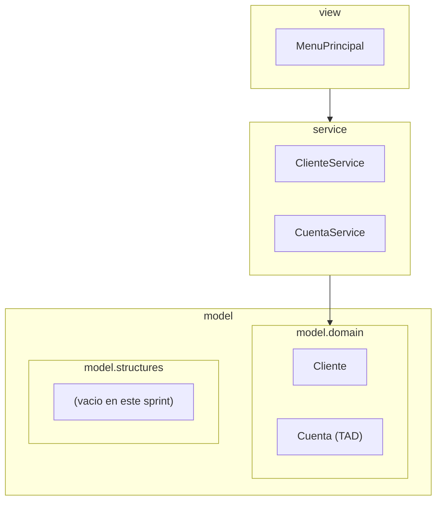
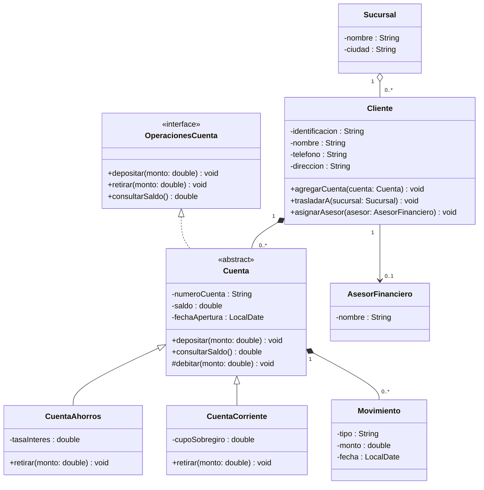
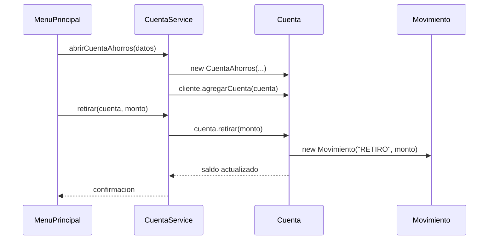

<Callout tipo="nota">
  Repositorio de referencia del proyecto (Sistema Bancario):
  [github.com/santiagoSuarez219/estructura-de-datos-sistema-bancario](https://github.com/santiagoSuarez219/estructura-de-datos-sistema-bancario).
  Clónalo para seguir los pasos de esta sesión sobre el código real del
  proyecto.
</Callout>

## Hoy resolvemos el mismo problema que tú vas a resolver

Tienes ya el diagrama UML de tu propio proyecto de aula, resuelto y listo
para traducir a Java: una interfaz, una clase abstracta, dos subtipos
concretos, dos composiciones (una fuerte, dentro de la propia clase, y otra
recibiendo la parte ya construida desde afuera), una agregación y una
asociación. Antes de que te sientes a codificarlo, recorremos ese mismo
camino completo aquí, en clase, sobre el **Sistema Bancario** — el proyecto
de referencia del docente. Cada paso que ves hoy es literalmente el mismo
paso que vas a dar tú, cambiando solo los nombres de las clases por los de
tu dominio.

No hay atajos ni resúmenes: leemos el diagrama, escribimos el TAD, la clase
que compone la abstracta, la clase abstracta con su método abstracto, los
dos subtipos, las relaciones restantes (agregación y asociación) y la clase
que prueba que todo compila y se comporta distinto según el subtipo. Al
final, un mapa exacto de qué paso de hoy corresponde a qué parte de tu
propio laboratorio.

## Paso 1 — Diagrama de paquetes: las tres capas del proyecto

Antes de escribir una sola clase, ubicamos dónde vive cada cosa. El
proyecto de aula sigue una arquitectura de tres capas — `View → Service →
Model` — y cada capa es un paquete real en el código:



La `View` habla directo con el `Service`: no hay capa intermedia. Cada
flecha es una dependencia real y unidireccional — el `Service` nunca conoce
a la `View`, y el `Model` no conoce a nadie por encima suyo.
`model/structures/` existe como paquete desde ya, pero queda vacío hasta el
próximo sprint: el diagrama de paquetes no miente sobre el estado real del
proyecto, y hoy solo trabajamos `model.domain`.

## Paso 2 — El diagrama UML de partida: se lee antes de escribir código

Este es el plano que hoy traducimos a Java, tal como a ti te va a llegar el
tuyo: ya resuelto, con la interfaz, la jerarquía y la composición
completas.



Antes de tocar el teclado, léelo de arriba hacia abajo:
`OperacionesCuenta <|.. Cuenta` es realización (línea punteada) — el TAD se declara primero
como contrato, después `Cuenta` lo implementa. `Cuenta <|-- CuentaAhorros`
y su hermana son herencia (línea sólida): la jerarquía de dos niveles.
`Cuenta "1" *-- "0..*" Movimiento` es la otra composición del diagrama: el
diamante relleno cae del lado de `Cuenta` porque es ella, y no un actor
externo, quien construye cada `Movimiento` con `new`. `Cliente "1" *--
"0..*" Cuenta` es la composición que ya conoces: el diamante relleno del
lado de `Cliente` dice que una cuenta no existe fuera de su cliente. Y
`retirar()` no aparece resuelto en `Cuenta` — cada subtipo lo implementa
con su propia regla, sin sobregiro en un caso y con cupo en el otro. Eso es
lo que obliga a `Cuenta` a quedar abstracta.

Las otras dos flechas son las relaciones que faltaban. `Sucursal "1" o--
"0..*" Cliente` es **agregación**: diamante hueco del lado de `Sucursal` —
una sucursal agrupa clientes, pero un cliente sigue existiendo aunque se
traslade de sucursal. `Cliente "1" --> "0..1" AsesorFinanciero` es
**asociación** simple: ni diamante ni jerarquía, solo una referencia que
puede faltar (`0..1`) o reasignarse sin comprometer a nadie.

El diagrama omite getters y setters por legibilidad: el código sí los lleva,
como verás en `Cliente`.

## Paso 3 — El TAD `OperacionesCuenta`: el contrato primero

```java
package model.domain;

public interface OperacionesCuenta {
    void depositar(double monto);
    void retirar(double monto);
    double consultarSaldo();
}
```

Tres operaciones, nada más. Cualquier tipo de cuenta que exista en el
sistema, presente o futuro, tiene que poder responder a las tres — este es
el TAD: declara **qué** se puede hacer, sin decir todavía **cómo**.

## Paso 4 — `Movimiento`: el registro que `Cuenta` crea para sí misma

Antes de `Cuenta`, la clase con la que arma su historial. Sin `Movimiento`
no hay forma de responder "¿qué pasó con esta cuenta?" — solo el saldo
final, sin rastro de cómo se llegó ahí.

```java
package model.domain;

import java.time.LocalDate;

public class Movimiento {
    private final String tipo;
    private final double monto;
    private final LocalDate fecha;

    public Movimiento(String tipo, double monto) {
        this.tipo = tipo;
        this.monto = monto;
        this.fecha = LocalDate.now();
    }

    public String getTipo() {
        return tipo;
    }

    public double getMonto() {
        return monto;
    }

    public LocalDate getFecha() {
        return fecha;
    }
}
```

`Movimiento` no tiene constructor vacío ni setters: nace completo o no nace.
Esa rigidez es intencional — vas a ver en el Paso 5 que solo `Cuenta` puede
crear uno, y siempre con los tres datos ya decididos.

## Paso 5 — `Cuenta`, clase abstracta que implementa el TAD

```java
package model.domain;

import java.time.LocalDate;
import java.util.Arrays;

public abstract class Cuenta implements OperacionesCuenta {
    private final String numeroCuenta;
    private double saldo;
    private final LocalDate fechaApertura;
    private Movimiento[] movimientos;
    private int totalMovimientos;

    public Cuenta(String numeroCuenta, double saldoInicial) {
        if (saldoInicial < 0) {
            // Validacion en el constructor: nunca se construye una cuenta
            // con saldo negativo, sin importar el subtipo.
            throw new IllegalArgumentException("El saldo inicial no puede ser negativo");
        }
        this.numeroCuenta = numeroCuenta;
        this.saldo = saldoInicial;
        this.fechaApertura = LocalDate.now();
        this.movimientos = new Movimiento[4];
        this.totalMovimientos = 0;
    }

    @Override
    public void depositar(double monto) {
        // Depositar es igual para cualquier cuenta: se resuelve una sola
        // vez aqui y las subclases lo heredan sin sobreescribirlo.
        if (monto <= 0) {
            throw new IllegalArgumentException("El monto a depositar debe ser positivo");
        }
        this.saldo += monto;
        registrarMovimiento("DEPOSITO", monto);
    }

    @Override
    public double consultarSaldo() {
        return saldo;
    }

    // Metodo abstracto explicito: sin cuerpo y con la palabra reservada
    // 'abstract'. No basta con que la interfaz lo exija -- declararlo asi
    // aqui deja constancia de que Cuenta delega esta operacion en sus
    // subtipos a proposito, no por descuido.
    public abstract void retirar(double monto);

    protected void debitar(double monto) {
        // 'protected': solo las subclases pueden mover saldo directamente,
        // despues de validar su propia regla de retiro.
        this.saldo -= monto;
        registrarMovimiento("RETIRO", monto);
    }

    private void registrarMovimiento(String tipo, double monto) {
        // Composicion en su forma mas nitida: el 'new Movimiento(...)'
        // ocurre aqui adentro, no afuera. Ningun otro codigo construye un
        // Movimiento ni lo reasigna a otra cuenta -- nace y muere con esta.
        if (totalMovimientos == movimientos.length) {
            movimientos = Arrays.copyOf(movimientos, movimientos.length * 2);
        }
        movimientos[totalMovimientos] = new Movimiento(tipo, monto);
        totalMovimientos++;
    }

    public Movimiento[] getMovimientos() {
        return Arrays.copyOf(movimientos, totalMovimientos);
    }

    protected double getSaldo() {
        return saldo;
    }

    public String getNumeroCuenta() {
        return numeroCuenta;
    }

    public LocalDate getFechaApertura() {
        return fechaApertura;
    }
}
```

`retirar()` no lleva cuerpo aquí: es un **método abstracto**, declarado con
`abstract` y terminado en `;`. `Cuenta` sigue siendo abstracta porque deja
ese método sin resolver — el compilador obliga a que cada subclase concreta
lo implemente con su propia regla de negocio.

`registrarMovimiento()` es `private`, no `protected`: ni siquiera
`CuentaAhorros` ni `CuentaCorriente` construyen un `Movimiento` directamente,
solo heredan el comportamiento a través de `depositar()` y `debitar()`. Esa
es la relación **fuerte** entre `Cuenta` y `Movimiento` — más estricta que la
composición con `Cliente` del Paso 8: allí una `Cuenta` ya construida se le
entregaba a `Cliente` desde afuera; aquí el `new Movimiento(...)` nunca sale
de `Cuenta`.

## Paso 6 — `CuentaAhorros` y `CuentaCorriente`: la implementación polimórfica

```java
package model.domain;

public class CuentaAhorros extends Cuenta {
    private double tasaInteres;

    public CuentaAhorros(String numeroCuenta, double saldoInicial, double tasaInteres) {
        super(numeroCuenta, saldoInicial);
        this.tasaInteres = tasaInteres;
    }

    @Override
    public void retirar(double monto) {
        if (monto <= 0) {
            throw new IllegalArgumentException("El monto a retirar debe ser positivo");
        }
        if (monto > getSaldo()) {
            // Regla propia de la cuenta de ahorros: no hay sobregiro.
            throw new IllegalStateException("Saldo insuficiente: las cuentas de ahorro no permiten sobregiro");
        }
        debitar(monto);
    }

    public double getTasaInteres() {
        return tasaInteres;
    }
}
```

```java
package model.domain;

public class CuentaCorriente extends Cuenta {
    private double cupoSobregiro;

    public CuentaCorriente(String numeroCuenta, double saldoInicial, double cupoSobregiro) {
        super(numeroCuenta, saldoInicial);
        this.cupoSobregiro = cupoSobregiro;
    }

    @Override
    public void retirar(double monto) {
        if (monto <= 0) {
            throw new IllegalArgumentException("El monto a retirar debe ser positivo");
        }
        if (monto > getSaldo() + cupoSobregiro) {
            // Regla propia de la cuenta corriente: puede quedar en saldo
            // negativo hasta el limite del cupo autorizado.
            throw new IllegalStateException("Saldo insuficiente: supera el cupo de sobregiro autorizado");
        }
        debitar(monto);
    }

    public double getCupoSobregiro() {
        return cupoSobregiro;
    }
}
```

`retirar()` tiene la misma firma en las dos clases, pero el cuerpo es
distinto — esto es polimorfismo real, no una coincidencia de nombre. Más
adelante, cualquier código que reciba una `Cuenta` va a poder llamar
`cuenta.retirar(monto)` sin saber ni importarle cuál de las dos es.

## Paso 7 — `Sucursal` y `AsesorFinanciero`: agregación y asociación

Antes de `Cliente`, dos clases pequeñas que hoy solo guardan datos, sin
herencia ni interfaz de por medio — sirven para cerrar el catálogo completo
de relaciones con las dos que faltaban.

```java
package model.domain;

public class Sucursal {
    private final String nombre;
    private final String ciudad;

    public Sucursal(String nombre, String ciudad) {
        this.nombre = nombre;
        this.ciudad = ciudad;
    }

    public String getNombre() {
        return nombre;
    }

    public String getCiudad() {
        return ciudad;
    }
}
```

```java
package model.domain;

public class AsesorFinanciero {
    private String nombre;

    public AsesorFinanciero(String nombre) {
        this.nombre = nombre;
    }

    public String getNombre() {
        return nombre;
    }
}
```

`Sucursal` existe con total independencia de cualquier `Cliente`: se crea
antes, sigue viva si el cliente se traslada, y varios clientes pueden
compartir la misma instancia. Eso es **agregación** — el todo (`Cliente`)
referencia a la parte (`Sucursal`), pero la parte no depende del todo para
existir. `AsesorFinanciero` es más débil todavía: **asociación** simple, sin
diamante en el UML — un `Cliente` puede tener un asesor asignado, cambiarlo
o quedarse sin ninguno, y eso no compromete el ciclo de vida de ninguno de
los dos.

## Paso 8 — `Cliente`: composición, agregación y asociación juntas

```java
package model.domain;

import java.util.Arrays;

public class Cliente {
    private final String identificacion;
    private String nombre;
    private String telefono;
    private String direccion;
    private Sucursal sucursal;
    private AsesorFinanciero asesorAsignado;
    private Cuenta[] cuentas;
    private int totalCuentas;

    public Cliente(String identificacion, String nombre, String telefono, String direccion, Sucursal sucursal) {
        if (identificacion == null || identificacion.isBlank()) {
            throw new IllegalArgumentException("La identificacion no puede estar vacia");
        }
        this.identificacion = identificacion;
        this.nombre = nombre;
        this.telefono = telefono;
        this.direccion = direccion;
        // Agregacion: la Sucursal llega ya construida desde afuera. El
        // Cliente solo guarda la referencia -- no es su dueno ni decide
        // cuando deja de existir.
        this.sucursal = sucursal;
        this.cuentas = new Cuenta[4];
        this.totalCuentas = 0;
    }

    public Sucursal getSucursal() {
        return sucursal;
    }

    public void trasladarA(Sucursal nuevaSucursal) {
        // El Cliente puede moverse de Sucursal libremente: la sucursal
        // anterior sigue existiendo, con o sin este Cliente. Eso es lo
        // que distingue la agregacion de la composicion de mas abajo.
        this.sucursal = nuevaSucursal;
    }

    public AsesorFinanciero getAsesorAsignado() {
        return asesorAsignado;
    }

    public void asignarAsesor(AsesorFinanciero asesor) {
        // Asociacion: puede llegar null, reasignarse cuantas veces haga
        // falta, y ni el Cliente ni el AsesorFinanciero dependen del otro
        // para existir.
        this.asesorAsignado = asesor;
    }

    public void agregarCuenta(Cuenta cuenta) {
        // Composicion en codigo: la unica forma de que una Cuenta exista
        // en el sistema es colgada de un Cliente ya construido.
        if (totalCuentas == cuentas.length) {
            // Arreglo lleno: se duplica la capacidad antes de insertar.
            // Es el costo que un arreglo cobra por ser de tamano fijo.
            cuentas = Arrays.copyOf(cuentas, cuentas.length * 2);
        }
        cuentas[totalCuentas] = cuenta;
        totalCuentas++;
    }

    public Cuenta[] getCuentas() {
        // Se devuelve una copia exacta de las posiciones ocupadas, nunca el
        // arreglo interno completo: las posiciones vacias del final no son
        // parte del estado publico del Cliente.
        return Arrays.copyOf(cuentas, totalCuentas);
    }

    public String getIdentificacion() {
        return identificacion;
    }

    public String getNombre() {
        return nombre;
    }

    public void setNombre(String nombre) {
        if (nombre == null || nombre.isBlank()) {
            throw new IllegalArgumentException("El nombre no puede estar vacio");
        }
        this.nombre = nombre;
    }

    public String getTelefono() {
        return telefono;
    }

    public void setTelefono(String telefono) {
        if (telefono == null || telefono.isBlank()) {
            throw new IllegalArgumentException("El telefono no puede estar vacio");
        }
        this.telefono = telefono;
    }
}
```

`cuentas` se expone como `Cuenta[]`, no como `Object[]` ni con un arreglo de
cada subtipo por separado: `Cliente` no necesita saber si una cuenta es de
ahorros o corriente para guardarla — le basta con saber que es una `Cuenta`.
El arreglo interno crece por copia (`Arrays.copyOf`) porque en Java un
arreglo no cambia de tamaño una vez creado; `totalCuentas` es quien lleva la
cuenta real de cuántas posiciones están ocupadas.

> **Composición cuando el `new` ocurre afuera.** En el Paso 5 viste el caso
> más nítido: `Cuenta` creaba sus propios `Movimiento`s con `new` dentro de
> su propio método. Aquí la `Cuenta` se construye afuera y se le entrega al
> `Cliente`, y la relación sigue siendo composición. Lo que la define no es
> quién ejecuta el `new`, sino la
> **propiedad exclusiva y el ciclo de vida**: ninguna otra clase conserva
> una referencia a esa `Cuenta`, no puede reasignarse a otro `Cliente`, y si
> el `Cliente` desaparece del sistema sus cuentas desaparecen con él.
> Compáralo con `sucursal`, arriba: `trasladarA()` reasigna la referencia
> sin tocar el ciclo de vida de nadie — la sucursal anterior sigue viva, con
> o sin este cliente. Y con `asesorAsignado`, más débil todavía:
> `asignarAsesor()` acepta `null` y no compromete a nadie con nadie.

## Paso 9 — `PruebaCreacionObjetos`: la clase que demuestra el polimorfismo

Esto es lo que tu laboratorio evalúa como "Pruebas en el App": una clase
con `main`, ubicada fuera de `model/domain/`, que instancia cada subtipo
concreto, los agrega a la composición y ejercita el método polimórfico
sobre cada uno **sin `instanceof`**, imprimiendo un resultado distinto para
cada uno.

```java
import model.domain.Cliente;
import model.domain.Cuenta;
import model.domain.CuentaAhorros;
import model.domain.CuentaCorriente;
import model.domain.Sucursal;

public class PruebaCreacionObjetos {
    public static void main(String[] args) {
        // Se crea un Cliente y se le agregan una cuenta de cada subtipo
        // concreto. La Sucursal se construye afuera y se entrega ya lista:
        // asi se ve la agregacion del Paso 7 en accion.
        Sucursal sucursalNorte = new Sucursal("Sucursal Norte", "Bogota");
        Cliente cliente = new Cliente("CC-123", "Ana Torres", "3001234567", "Calle 10 #5-20", sucursalNorte);

        CuentaAhorros ahorros = new CuentaAhorros("AH-001", 100000, 0.02);
        CuentaCorriente corriente = new CuentaCorriente("CC-001", 50000, 200000);

        cliente.agregarCuenta(ahorros);
        cliente.agregarCuenta(corriente);

        // Se recorren las cuentas como referencias del tipo abstracto
        // Cuenta -- ni una sola vez se pregunta de que subtipo es cada una.
        // Se pide un retiro de 120000: mas que el saldo de ambas cuentas.
        // La de ahorros lo rechaza; la corriente lo acepta contra su cupo
        // de sobregiro. Misma llamada, dos comportamientos distintos.
        Cuenta[] cuentas = cliente.getCuentas();
        for (Cuenta cuenta : cuentas) {
            probarRetiro(cuenta, 120000);
        }
    }

    private static void probarRetiro(Cuenta cuenta, double monto) {
        // Este metodo no sabe (ni le importa) si 'cuenta' es CuentaAhorros
        // o CuentaCorriente: retirar() resuelve la regla de cada subtipo
        // por si sola gracias al polimorfismo. Sin instanceof en ningun lado.
        String etiqueta = cuenta.getClass().getSimpleName() + " " + cuenta.getNumeroCuenta();
        try {
            cuenta.retirar(monto);
            System.out.println(etiqueta
                + " -> retiro de " + monto + " aceptado; saldo: " + cuenta.consultarSaldo());
        } catch (IllegalStateException e) {
            System.out.println(etiqueta
                + " -> retiro de " + monto + " rechazado: " + e.getMessage());
        }
    }
}
```

`cuenta.getClass().getSimpleName()` se usa solo para el mensaje impreso, no
para decidir comportamiento — eso es distinto de un `instanceof` que
ramifica la lógica. La regla de retiro sigue viviendo exclusivamente dentro
de cada subtipo, y al correr este `main` la misma llamada
(`cuenta.retirar(120000)`) produce dos salidas visiblemente distintas:

```
CuentaAhorros AH-001 -> retiro de 120000.0 rechazado: Saldo insuficiente: las cuentas de ahorro no permiten sobregiro
CuentaCorriente CC-001 -> retiro de 120000.0 aceptado; saldo: -70000.0
```

Eso es exactamente lo que tu laboratorio pide demostrar por consola: que las
dos implementaciones **se comportan distinto** ante la misma llamada.

## Dónde encajan `service` y `view`

Con el dominio completo y probado, el resto de las capas se apoyan encima
sin tocar lo que ya escribiste. El `service` es quien decide **cuál**
subtipo concreto construir según lo que pide el usuario — es el único
lugar del proyecto donde se nombra `CuentaAhorros` o `CuentaCorriente`
fuera de `model.domain` — y de ahí en adelante maneja todo como `Cuenta`.
La `view` solo recolecta datos por consola y se los entrega al `service`;
nunca instancia `Cuenta` ni llama `Cliente.agregarCuenta()` directamente.



Esto cierra la historia de los paquetes del Paso 1: `model.domain` ya no
cambia por esto, `service` es quien coordina la regla de negocio de abrir
cuentas y mover saldo, y `view` solo pide datos y muestra resultados.
`Movimiento` ni siquiera aparece nombrado en `service` ni en `view`: el
`new` de la línea `Model->>Registro` ocurre dentro de `cuenta.retirar(monto)`,
sin que nadie por encima se entere — exactamente lo que hace fuerte a esa
composición.

## Correspondencia con tu propio laboratorio

Cada paso de hoy sobre el Sistema Bancario es exactamente un paso de tu
laboratorio sobre tu propio proyecto — solo cambian los nombres de las
clases por los de tu dominio.

| Paso de hoy (Sistema Bancario) | Qué te pide tu laboratorio |
|---|---|
| Paso 1 — Diagrama de paquetes | Tu proyecto ya tiene la misma estructura de tres capas; hoy no la modificas, solo ubicas dónde van tus clases nuevas |
| Paso 2 — Leer el diagrama UML antes de codificar | Ubica la sección de tu proyecto en la guía y lee su diagrama completo antes de escribir una línea |
| Paso 3 — TAD `OperacionesCuenta` | Crea la interfaz de tu proyecto con las operaciones que el diagrama declara |
| Paso 4 — `Movimiento` (composición fuerte) | Crea la clase equivalente a tu registro interno, sin constructor vacío ni setters |
| Paso 5 — `Cuenta` abstracta | Convierte tu clase equivalente en abstracta, implementa la interfaz, deja pendiente el método que cada subtipo resuelve distinto y crea sus propios registros internos con `new` |
| Paso 6 — `CuentaAhorros` / `CuentaCorriente` | Crea o evoluciona los dos subtipos concretos de tu proyecto, cada uno con su propia regla |
| Paso 7 — `Sucursal` / `AsesorFinanciero` (agregación y asociación) | Identifica en tu diagrama cuál relación es agregación y cuál es asociación, y modélalas con una referencia simple, sin `new` interno |
| Paso 8 — `Cliente` (composición, agregación y asociación) | Encapsula tu clase de composición y agrega los métodos que integran la parte al todo, más los que reasignan las relaciones más débiles |
| Paso 9 — `PruebaCreacionObjetos` | Escribe tu propia clase de prueba, con `main`, fuera de `model/domain/`, sin `instanceof` |

## Síntesis

- El diagrama UML se lee completo antes de escribir código: dice qué es
  interfaz, qué es clase abstracta, qué queda pendiente por subtipo y cómo
  se relacionan las clases entre sí.
- El TAD en diseño OO es la interfaz (`OperacionesCuenta`): declara qué
  operaciones existen sin decir cómo se implementan.
- La clase abstracta (`Cuenta`) implementa lo que es común a todos los
  subtipos y deja pendiente, con un **método abstracto** explícito
  (`abstract`, sin cuerpo), lo que cada uno resuelve distinto — `retirar()`,
  en este caso.
- Los subtipos concretos (`CuentaAhorros`, `CuentaCorriente`) comparten
  firma pero difieren en comportamiento: eso es polimorfismo, no
  coincidencia de nombres.
- La composición tiene dos variantes en esta lección: `Cuenta` con
  `Movimiento` es la más fuerte — el `new` nunca sale de `Cuenta`, ni
  siquiera sus propias subclases lo ejecutan. `Cliente` con `Cuenta` sigue
  siendo composición aunque el `new` ocurra afuera: lo que la sostiene es la
  propiedad exclusiva y el ciclo de vida, no quién ejecuta el `new`.
- La agregación (`Cliente` con `Sucursal`) guarda una referencia recibida
  desde afuera y permite reasignarla (`trasladarA()`) sin afectar el ciclo
  de vida de la parte. La asociación (`Cliente` con `AsesorFinanciero`) es
  la relación más débil de las tres: una referencia opcional que puede ser
  `null` o cambiar libremente, sin implicar propiedad de ningún lado.
- La clase de prueba demuestra el polimorfismo sin `instanceof`: recorre las
  instancias por su tipo abstracto y deja que cada una resuelva su propia
  versión.
- `service` y `view` se apoyan sobre ese dominio ya probado sin tocarlo:
  `service` decide qué subtipo construir, `view` solo pide datos y muestra
  resultados.
