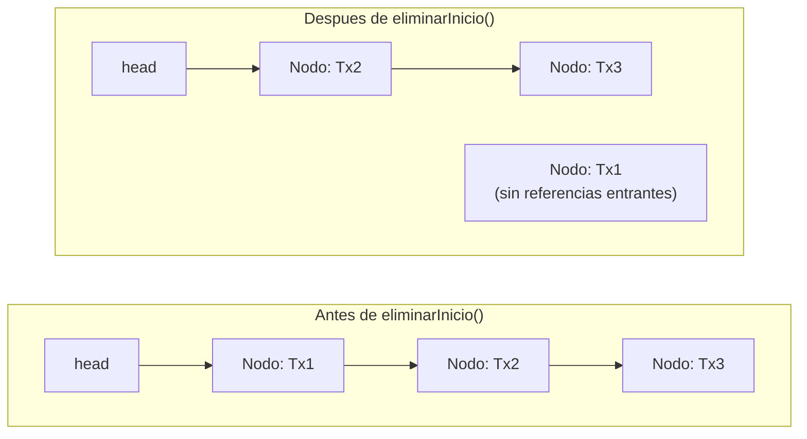
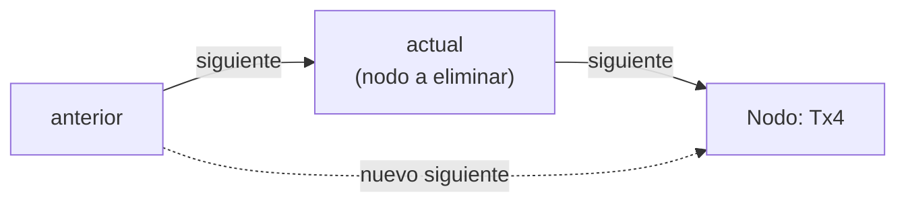
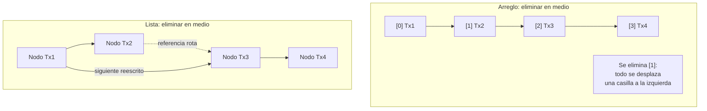

## El problema: quitar sin desplazar

`ListaSimple<Transaccion>` ya sabe insertar al inicio, al final, en
cualquier posición, y buscar por índice o por valor. Falta la operación
inversa: sacar un nodo de la cadena sin romper el resto. En un arreglo, ya
viste que quitar un elemento del medio obliga a desplazar todas las casillas
siguientes una posición hacia atrás — el bloque es contiguo, no admite
huecos. En una lista de nodos ese problema no debería existir: si insertar
es solo reescribir una referencia, eliminar también debería serlo. La
pregunta es cómo se ve eso en código, y qué nodo exactamente hay que tocar
en cada caso.

## Eliminar al inicio: liberar el primer nodo

**Situación:** el historial de una cuenta acumula transacciones sin límite,
y una tarea de mantenimiento necesita purgar la más antigua — la que hoy
ocupa el `head`.

**En la práctica**, basta con reasignar `head` para que apunte al nodo que
hoy es el segundo. El nodo original queda sin ninguna referencia que lo
señale, así que el recolector de basura de Java lo reclama en algún momento
posterior — no hace falta destruirlo explícitamente. El único caso borde es
la lista con un solo nodo: ahí el "siguiente" del `head` es `null`, y `head`
termina valiendo `null` también, que es exactamente la condición de lista
vacía.

```java
public void eliminarInicio() {
    if (estaVacia()) {
        throw new NoSuchElementException("No hay elementos para eliminar");
    }
    head = head.getSiguiente(); // el segundo nodo pasa a ser el primero
    tamano--;
}
```



`Tx1` sigue existiendo en el heap por un instante, pero ya nada de tu
programa puede llegar hasta él — es basura, no memoria corrupta. Esa
diferencia es la que le permite a `eliminarInicio()` costar lo mismo con 3
transacciones que con 3.000: no hay nada que recorrer ni que desplazar,
solo una reasignación.

## Eliminar al final: hay que llegar al penúltimo

**Situación:** un error de captura duplicó la última transacción cargada;
hay que descartarla antes de que el resumen de cuenta la cuente dos veces.

**En la práctica**, el reto no es encontrar el último nodo — eso ya lo
resolvía `insertarFinal()` recorriendo hasta `siguiente == null` — sino
llegar al **penúltimo**, porque es él quien tiene que quedar apuntando a
`null`. Recorres comparando `actual.getSiguiente().getSiguiente()` contra
`null`: cuando eso se cumple, `actual` es el penúltimo y su `siguiente` es
el nodo que hay que soltar.

```java
public void eliminarFinal() {
    if (estaVacia()) {
        throw new NoSuchElementException("No hay elementos para eliminar");
    }
    if (head.getSiguiente() == null) {
        head = null; // unico nodo: la lista queda vacia
        tamano--;
        return;
    }
    Nodo<T> actual = head;
    while (actual.getSiguiente().getSiguiente() != null) {
        actual = actual.getSiguiente(); // avanza hasta el penultimo nodo
    }
    actual.setSiguiente(null); // el penultimo pasa a ser el nuevo ultimo
    tamano--;
}
```

El caso de un solo nodo se resuelve aparte porque ahí no existe un
"penúltimo": intentar llamar `getSiguiente()` sobre `null` revienta con
`NullPointerException` si no lo separas antes. Con la lista vacía ya
cubierta por la excepción inicial, quedan cubiertos los tres tamaños
posibles: cero, uno y muchos nodos.

## Eliminar por valor: buscar y reenlazar en un solo recorrido

**Situación:** un cliente reporta una transacción duplicada por un fallo
del sistema de captura; hay que quitarla identificándola por su contenido,
no por la posición que ocupa en el historial.

**En la práctica**, se recorre la lista igual que en `buscarPorValor()`
—comparando con `equals()`—, pero esta vez llevando dos punteros a la vez:
`anterior`, que va un paso detrás, y `actual`, que compara cada nodo con el
dato buscado. Cuando `actual` coincide, el reenlace salta al nodo
eliminado: `anterior.siguiente` pasa a apuntar directamente a
`actual.siguiente`.

```java
public boolean eliminarPorValor(T dato) {
    if (estaVacia()) {
        return false;
    }
    if (head.getDato().equals(dato)) {
        eliminarInicio(); // sin anterior: delega en el caso ya resuelto
        return true;
    }
    Nodo<T> anterior = head;
    Nodo<T> actual = head.getSiguiente();
    while (actual != null) {
        if (actual.getDato().equals(dato)) {
            anterior.setSiguiente(actual.getSiguiente()); // salta el nodo encontrado
            tamano--;
            return true;
        }
        anterior = actual;
        actual = actual.getSiguiente();
    }
    return false; // se recorrio toda la lista sin encontrar el dato
}
```

Eliminar el primer nodo es un caso especial porque ahí no existe un
`anterior` real — por eso se delega directamente en `eliminarInicio()` en
vez de forzar un puntero nulo. Fuera de ese borde, el patrón
`anterior.siguiente = actual.siguiente` es el más general de los tres: es
el mismo salto de referencia que usan, de forma implícita, `eliminarInicio()`
(donde el "anterior" es la propia variable `head`) y `eliminarFinal()`
(donde el nuevo `siguiente` es `null` en vez de otro nodo).



## Análisis de complejidad de cada eliminación

Con la misma notación Big O de las lecciones anteriores, el costo de cada
eliminación depende de si hay que recorrer nodos antes de reenlazar:

| Operación          | Complejidad | Por qué                                                          |
| ------------------- | ----------- | ------------------------------------------------------------------ |
| `eliminarInicio`     | **O(1)**    | Reasigna `head`, sin recorrer nada                                |
| `eliminarFinal`      | **O(n)**    | Recorre hasta el penúltimo nodo antes de reenlazar                |
| `eliminarPorValor`   | **O(n)**    | En el peor caso compara con todos los nodos antes de encontrar el dato |

El patrón se repite: lo único que toca el `head` directamente es O(1); todo
lo demás paga el costo de recorrer la cadena. Esa es la misma asimetría que
viste en `insertarInicio()` frente a `insertarFinal()` — ahora confirmada
también para eliminar.

## Lista enlazada vs. arreglo: dónde paga el costo cada una

La lección anterior ya comparó inserción y memoria entre arreglo y lista.
Con inserción y eliminación completas, la comparación se cierra agregando
el criterio que faltaba: el acceso.

| Criterio                      | Arreglo                                         | Lista enlazada por nodos                          |
| ------------------------------ | ------------------------------------------------ | --------------------------------------------------- |
| Acceso por índice               | **O(1)** — dirección calculada por aritmética de punteros | **O(n)** — hay que recorrer nodo por nodo           |
| Inserción/eliminación en medio | **O(n)** — desplaza todas las casillas siguientes | **O(1)** una vez ubicado el nodo — solo reenlaza    |
| Uso de memoria                 | Contiguo, sin overhead por elemento; puede reservar espacio no usado | Un objeto `Nodo<T>` extra por elemento (dato + referencia) |
| Tamaño                          | Fijo al crearse (`new Transaccion[5]`)            | Dinámico: crece y se achica sin reservar de más     |

El arreglo gana en acceso porque calcula la dirección de memoria con una
suma; la lista pierde ese atajo porque sus nodos no son contiguos, así que
la única forma de llegar al nodo `i` es haber pasado por los `i - 1`
anteriores. A cambio, la lista gana en inserción y eliminación en medio
porque nunca desplaza nada — solo reescribe una o dos referencias, sin
importar cuántos elementos tenga a los lados.



## ¿Cuándo elegir una lista enlazada sobre un arreglo?

El criterio se reduce a una pregunta: ¿el caso necesita acceso aleatorio por
índice, o necesita insertar/eliminar seguido en posiciones que no son ni el
inicio ni el final? Si necesitas lo primero —"dame el elemento 47"— un
arreglo (o un `ArrayList`, que internamente es un arreglo redimensionable)
gana siempre: acceso O(1) contra O(n). Si necesitas lo segundo —altas y
bajas frecuentes en medio de la colección, sin saber de antemano cuántos
elementos habrá— la lista enlazada evita el costo de desplazar memoria en
cada operación.

El historial de transacciones del sistema bancario es justamente el segundo
caso. No sabes de antemano cuántas transacciones va a tener una cuenta —
podrían ser 3 o 30.000 — así que un arreglo de tamaño fijo obligaría a
sobredimensionar o a redimensionar constantemente. Y las operaciones que
más se repiten sobre ese historial son insertar la transacción más reciente
al inicio y eliminar una transacción puntual por su contenido (una
corrección, un duplicado) — exactamente las dos operaciones donde la lista
no paga el costo de desplazamiento que sí paga el arreglo. Lo que casi
nunca necesitas es "dame la transacción en la posición 200" por sí sola sin
recorrer nada antes: por eso el acceso O(n) de la lista no es el cuello de
botella que sería en otro dominio.

## Síntesis

- `eliminarInicio()` reasigna `head` al siguiente nodo, sin recorrer nada —
  es O(1), igual que `insertarInicio()`.
- `eliminarFinal()` recorre hasta el penúltimo nodo (no el último) para
  poder reenlazar su `siguiente` a `null`; el caso de un solo nodo se
  resuelve aparte.
- `eliminarPorValor()` combina búsqueda por `equals()` con el patrón de
  reenlace `anterior.siguiente = actual.siguiente` — el más general de las
  tres eliminaciones, y el que delega en `eliminarInicio()` cuando el dato
  buscado está en el primer nodo.
- Solo lo que toca el `head` directamente es O(1); todo lo demás es O(n)
  por el recorrido que exige.
- El arreglo gana en acceso por índice (O(1) contra O(n)); la lista gana en
  inserción y eliminación en medio (O(1) una vez ubicado el nodo, sin
  desplazar nada).
- La elección depende del patrón de uso, no de cuál estructura es "mejor
  en general": el historial de transacciones del Sistema Bancario encaja en
  lista porque prioriza altas y bajas frecuentes sobre acceso aleatorio.

Con inserción, búsqueda y eliminación completas, `ListaSimple<T>` ya cubre
el ciclo entero de operaciones sobre un solo sentido de recorrido. Queda
pendiente ver qué pasa cuando cada nodo también conoce a su anterior — lista
doblemente enlazada.
