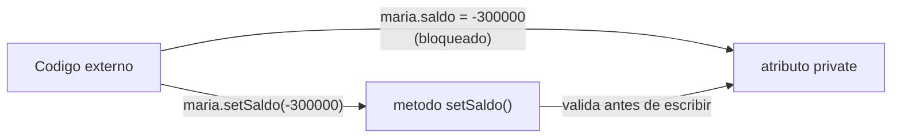
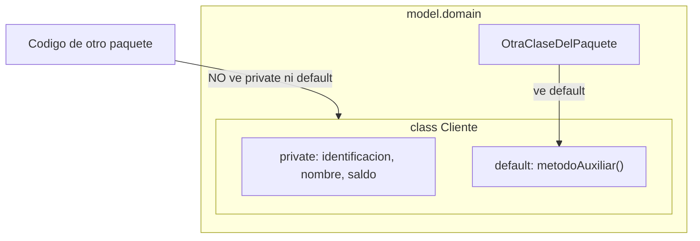

## El problema: un saldo que nunca debió existir

Retoma el `Cliente` de la sesión anterior. Cualquier parte de tu programa
puede escribir directamente sobre sus atributos:

```java
Cliente maria = new Cliente("1234", "Maria", 500000);
maria.saldo = -300000;   // compila. Se ejecuta. Nada lo impide.
```

Un saldo negativo no debería existir en un sistema bancario, pero Java no
tiene forma de saberlo: `saldo` es un `double` público como cualquier otro, y
asignarle un valor es solo aritmética. El problema no es un error de
sintaxis — es que **la clase nunca definió qué valores son válidos**. En un
sistema de decenas de archivos, con varias manos tocando el mismo `Cliente`,
esa puerta abierta es exactamente donde aparecen los bugs más difíciles de
rastrear.

## La solución: que el objeto se proteja a sí mismo

**En la práctica**, la respuesta es cerrar el acceso directo a los atributos
y obligar a que cualquier cambio pase por un método que la propia clase
controla:



> **Encapsulamiento:** principio de ocultar los atributos internos de un
> objeto y exponer únicamente los métodos necesarios para leerlos o
> modificarlos, de forma que la clase pueda garantizar que sus datos siempre
> quedan en un estado válido.

Esto no es una regla de estilo. Es lo que separa una clase que **describe**
datos de una clase que **cuida** sus datos — y es lo que hace que una clase de
dominio sea confiable por sí sola, sin depender de que quien la use recuerde
las reglas de negocio.

## Modificadores de acceso: quién puede ver qué

**Situación:** ya decidiste que `saldo` no debe ser tocado libremente desde
afuera. ¿Cómo se lo dices a Java?

**En la práctica**, con un modificador de acceso delante del atributo:

```java
public class Cliente {
    private String identificacion;
    private String nombre;
    private double saldo;
}
```

Java tiene cuatro niveles, de más a menos restrictivo:

| Modificador              | Visible desde                        | Uso típico                                 |
| ------------------------ | ------------------------------------ | ------------------------------------------ |
| `private`                | Solo dentro de la misma clase        | Atributos — casi siempre                   |
| _(default, sin palabra)_ | Clases del mismo paquete             | Colaboración interna del proyecto          |
| `protected`              | Mismo paquete + subclases (herencia) | Se retoma en la sesión de herencia         |
| `public`                 | Desde cualquier parte                | Métodos que forman la interfaz de la clase |



Ya viste `public class Cliente` y `public void mostrarInfo()` en la sesión
anterior — ese `public` en los métodos es intencional: son la puerta de
entrada. Los atributos, en cambio, casi siempre son `private`. `protected` no
lo vas a usar todavía: solo tiene sentido cuando existe una subclase, y eso
llega en la sesión de herencia.

## Getters y setters: la puerta de entrada controlada

**Situación:** `saldo` ya es `private`. Ahora nadie fuera de `Cliente` puede
leerlo ni escribirlo — ni siquiera para mostrarlo en pantalla. Necesitas una
forma controlada de hacer ambas cosas.

**En la práctica**, dos métodos por atributo, con una convención de nombre
fija:

```java
public class Cliente {
    private String nombre;
    private double saldo;

    public double getSaldo() {          // getter: lee el valor
        return saldo;
    }

    public void setSaldo(double saldo) { // setter: escribe el valor
        this.saldo = saldo;
    }

    public String getNombre() {
        return nombre;
    }
}
```

La convención no es opcional: `get` + nombre del atributo con mayúscula
inicial para leer, `set` + nombre del atributo para escribir. Herramientas,
frameworks y el resto del equipo asumen exactamente ese patrón. Con esto,
`maria.saldo` deja de compilar y se reemplaza por `maria.getSaldo()` y
`maria.setSaldo(600000)` — mismo resultado desde afuera, pero ahora la clase
tiene un punto único por donde pasa cualquier cambio.

No todos los atributos necesitan las dos cosas: `identificacion` puede tener
solo `getIdentificacion()` (se asigna una vez, en el constructor, y nunca más
cambia) — eso es una clase de **solo lectura** para ese atributo.

## Validación dentro del setter: el punto donde de verdad se gana algo

**Situación:** tener un setter no evita el saldo negativo por sí solo, si el
setter simplemente copia el valor sin revisarlo. El encapsulamiento vale por
lo que haces **dentro** del setter, no por tener el método.

**En la práctica:**

```java
public void setSaldo(double saldo) {
    if (saldo < 0) {
        throw new IllegalArgumentException("El saldo no puede ser negativo");
    }
    this.saldo = saldo;
}
```

Ahora `maria.setSaldo(-300000)` no llega a escribir nada: la excepción
detiene la ejecución antes de que el atributo quede en un estado inválido.
Este es el patrón que aplica a cualquier clase de dominio: cada atributo
(`Producto`, `Paciente`, `Jugador`, según el caso de estudio) tiene su propia
regla de negocio dentro del setter — un precio que no puede ser negativo, una
fecha de cita que no puede ser en el pasado, un cupo de equipo que no puede
superar un máximo.

## Constructores sobrecargados: más de una forma de nacer

**Situación:** el constructor de `Cliente` que ya conoces exige los tres
datos completos. Pero a veces necesitas crear un cliente nuevo sin saldo
inicial — debería nacer en `0`, no obligar a escribir `0` cada vez.

**En la práctica**, Java permite declarar **varios constructores** con la
misma clase, siempre que su lista de parámetros sea distinta — esto se llama
**sobrecarga**:

```java
public class Cliente {
    private String identificacion;
    private String nombre;
    private double saldo;

    public Cliente(String identificacion, String nombre, double saldo) {
        this.identificacion = identificacion;
        this.nombre = nombre;
        setSaldo(saldo);              // reutiliza la validacion del setter
    }

    public Cliente(String identificacion, String nombre) {
        this(identificacion, nombre, 0);   // llama al constructor anterior
    }
}
```

```java
Cliente maria  = new Cliente("1234", "Maria", 500000);
Cliente nuevo  = new Cliente("9999", "Andres");   // saldo queda en 0
```

`this(...)` en la primera línea de un constructor llama a **otro**
constructor de la misma clase — evita repetir la lógica de inicialización en
cada versión. Fíjate también que el constructor llama a `setSaldo(saldo)` en
vez de escribir `this.saldo = saldo` directamente: así el objeto queda válido
desde el primer instante, incluso durante la construcción, sin duplicar la
regla de negocio en dos lugares.

## Resumen operativo

| Concepto                 | Qué resuelve                                                  | Sintaxis                                                 |
| ------------------------ | ------------------------------------------------------------- | -------------------------------------------------------- |
| `private`                | Bloquea el acceso directo al atributo desde fuera de la clase | `private double saldo;`                                  |
| Getter                   | Lectura controlada de un atributo `private`                   | `public double getSaldo() { return saldo; }`             |
| Setter                   | Escritura controlada, con validación                          | `public void setSaldo(double saldo) { ... }`             |
| Validación en setter     | Impide que el objeto quede en estado inválido                 | `if (saldo < 0) throw new IllegalArgumentException(...)` |
| Constructor sobrecargado | Varias formas de crear un objeto válido                       | `public Cliente(String id, String nombre)`               |
| `this(...)`              | Reutiliza otro constructor de la misma clase                  | Primera línea del constructor                            |

## Síntesis

- El **encapsulamiento** oculta los atributos con `private` y expone solo los
  métodos necesarios — así la clase, no el resto del programa, decide qué
  valores son válidos.
- Los cuatro **modificadores de acceso** (`private`, default, `protected`,
  `public`) van de más a menos restrictivo; en esta etapa del curso usa
  `private` para atributos y `public` para los métodos que forman la interfaz
  de la clase.
- **Getters y setters** siguen una convención de nombre fija
  (`getAtributo()` / `setAtributo(valor)`) y son el único camino permitido
  para leer o escribir un atributo `private`.
- La validación **dentro del setter** es lo que de verdad protege al objeto:
  un setter que no valida es solo un atajo con más código.
- Los **constructores sobrecargados** permiten crear objetos válidos con
  distinta cantidad de información inicial, sin duplicar la lógica de
  inicialización gracias a `this(...)`.
- Con esto cerraste el molde del `Cliente`: clase, objeto, constructor y
  ahora encapsulamiento. El paso siguiente es elegir el caso de estudio
  sobre el que tu equipo va a aplicar todo esto — para eso está la guía
  **Guía — Elección del proyecto de aula**, con los cinco casos elegibles y
  el criterio para escoger uno.
