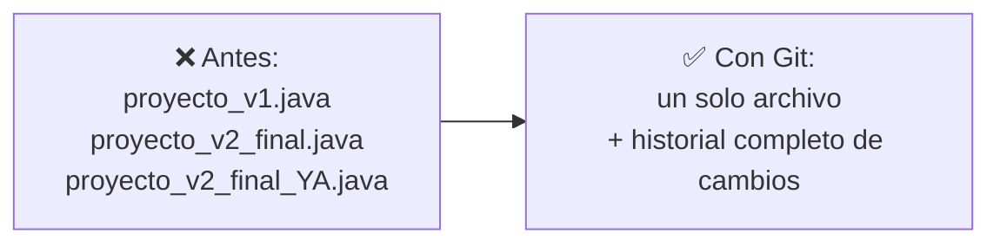
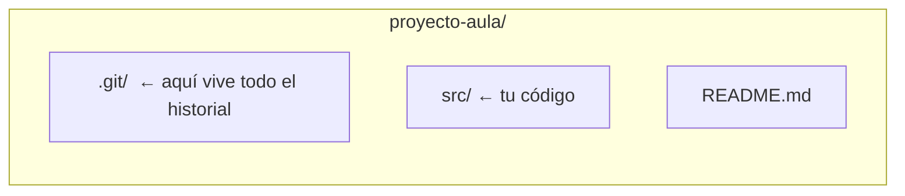
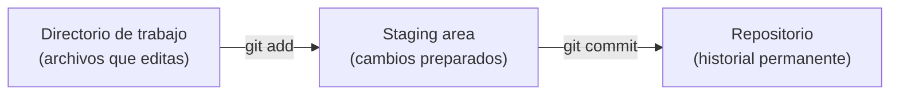
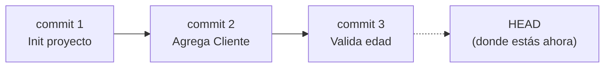

# Fundamentos de Control de Versiones

## El problema: proyectos sin memoria

Imagina que estás escribiendo el código de tu proyecto de aula. Para "no perder nada", vas guardando copias:

```text
proyectoAula.java
proyectoAula_v2.java
proyectoAula_v2_final.java
proyectoAula_v2_final_YA.java
proyectoAula_v2_final_YA_arreglado.java
```

- ¿Cuál es la versión buena?
- ¿Qué cambió exactamente entre una copia y la siguiente?
- Si borraste sin querer una función que sí funcionaba ayer, ¿cómo la recuperas?
- Ahora súmale un compañero de equipo que trabaja **al mismo tiempo** que tú sobre el mismo archivo, enviándolo por correo o USB o por WhastApp.

## La solución: un sistema que recuerda por ti

En vez de copias manuales, un **sistema de control de versiones** guarda automáticamente cada cambio significativo del proyecto, con quién lo hizo, cuándo y por qué — sin duplicar archivos.



**Git** es el sistema de control de versiones más usado en la industria. Es **distribuido**: cada persona tiene una copia completa del historial del proyecto en su propia máquina, no depende de un único servidor central.

> Definición formal: el **control de versiones** es la práctica de registrar los cambios realizados sobre uno o varios archivos a lo largo del tiempo, de modo que se pueda recuperar cualquier versión anterior cuando se necesite.

## Material adicional: descarga e instalación de Git

Antes de crear tu primer repositorio necesitas tener Git instalado en tu máquina. El siguiente video cubre la descarga e instalación paso a paso en los distintos sistemas operativos:

<YouTubeEmbed id="jdXKwLNUfmg" title="Descarga e instalación de Git" />

## La terminal: donde vas a escribir todo esto

**Situación:** cada comando de Git que verás de aquí en adelante (`git init`, `git add`, `git commit`...) no se hace haciendo clic en botones — se escribe. Necesitas saber dónde escribirlo.

**En la práctica**, la **terminal** (o línea de comandos) es una ventana de texto donde escribes instrucciones y el sistema operativo las ejecuta directamente, sin pasar por menús gráficos. Antes de usar Git necesitas moverte por carpetas y archivos desde ahí:

| Comando                                               | ¿Qué hace?                                            |
| ----------------------------------------------------- | ----------------------------------------------------- |
| `pwd`                                                 | Muestra la carpeta en la que estás parado ahora mismo |
| `ls` (`dir` en Windows)                               | Lista los archivos y carpetas del directorio actual   |
| `cd <carpeta>`                                        | Entra a esa carpeta                                   |
| `cd ..`                                               | Sube un nivel, a la carpeta contenedora               |
| `mkdir <nombre>`                                      | Crea una carpeta nueva                                |
| `touch <archivo>` (o `type nul > archivo` en Windows) | Crea un archivo vacío                                 |
| `clear` (`cls` en Windows)                            | Limpia el texto acumulado en la pantalla              |

> **Terminal:** interfaz de texto para dar instrucciones al sistema operativo mediante comandos, en vez de clics. Es el lugar donde ejecutarás **todos** los comandos de Git de esta lección.

## El repositorio: la memoria del proyecto

**Situación:** para que Git pueda "recordar" los cambios, primero necesita un lugar donde guardar esa historia.

**En la práctica**, esto se hace con un solo comando dentro de la carpeta del proyecto:

```bash
git init
```

Esto crea una carpeta oculta `.git/` que contiene **todo** el historial del proyecto. El resto de la carpeta (tu código) no cambia en nada visible.



> **Repositorio (repo):** carpeta cuyo contenido es rastreado por Git. Contiene el proyecto actual **y** toda su historia de cambios.
> ⚠️ Si borras la carpeta `.git/`, pierdes todo el historial — el código actual queda, pero la memoria del proyecto desaparece.

## De "guardar el archivo" a "guardar un cambio": el staging area

**Situación:** modificaste tres archivos, pero solo dos de esos cambios pertenecen a la misma idea (por ejemplo, "agregué validación de edad"). El tercero es un cambio suelto que aún no quieres registrar. ¿Cómo le dices a Git "guarda solo estos dos, juntos, como una unidad"?

**En la práctica**, Git separa el proceso en dos pasos:

```bash
git add Cliente.java Cuenta.java   # 1. Preparar (staging)
git commit -m "Agrega validacion de edad del cliente"   # 2. Guardar en la historia
```



Con `git status` puedes ver en cualquier momento en qué estado está cada archivo: sin rastrear, modificado, o ya preparado (_staged_).

> **Staging area:** zona intermedia donde eliges _exactamente qué cambios_ entrarán en el próximo commit, sin obligarte a guardar todo lo que has tocado.
> **Commit:** una "foto" (snapshot) permanente del proyecto en ese momento, con un mensaje descriptivo, autor, fecha y un identificador único (hash).

## HEAD y el historial: ¿dónde estoy parado?

**Situación:** después de 15 commits, ¿cómo sabes en cuál estás actualmente? ¿Cómo revisas qué pasó antes?

**En la práctica:**

```bash
git log            # historial completo de commits
git log --oneline  # versión resumida, un commit por línea
```



> **HEAD:** puntero que indica el commit en el que te encuentras actualmente. En el uso normal del día a día, HEAD apunta al último commit de tu rama de trabajo.
> **Historial:** la secuencia completa y ordenada de commits del proyecto, consultable en cualquier momento con `git log`.

## Buenas prácticas al escribir un mensaje de commit

**Situación:** revisas el `git log --oneline` de un compañero y encuentras mensajes como `cambios`, `arreglo`, `asdf`. Seis meses después, nadie — ni siquiera quien los escribió — recuerda qué significaban. El historial existe, pero no sirve como memoria del proyecto.

**En la práctica**, un buen mensaje de commit sigue unas pocas reglas simples:

- **Un commit, un cambio lógico.** Si el mensaje necesita un "y" para describirlo ("arregla el bug y refactoriza Cliente"), probablemente son dos commits.
- **Modo imperativo, presente:** "Agrega validación de edad", no "Agregado" ni "Agregando".
- **Máximo ~50 caracteres en la primera línea.** Si hace falta más detalle, una línea en blanco y luego el cuerpo explicando el _por qué_, no el _qué_ — el `git diff` ya muestra el qué.
- **Sin mensajes vacíos de contenido:** `wip`, `cambios`, `fix` no dicen nada sobre el proyecto.

```text
✅ "Agrega validacion de edad del cliente"
❌ "cambios"

✅ "Corrige NullPointerException en Cuenta.retirar"
❌ "fix"
```

> **Mensaje de commit:** la explicación de _por qué_ existe un cambio, dirigida a tu yo del futuro o a un compañero que nunca vio el código. Un buen mensaje ahorra minutos de arqueología cada vez que alguien revisa `git log`.

## Comandos esenciales — resumen

| Comando                   | ¿Qué hace?                                          | ¿Cuándo se usa?                                    |
| ------------------------- | --------------------------------------------------- | -------------------------------------------------- |
| `git init`                | Crea un repositorio en la carpeta actual            | Una sola vez, al iniciar el proyecto               |
| `git status`              | Muestra el estado de cada archivo                   | Constantemente, para saber qué falta preparar      |
| `git add <archivo>`       | Mueve cambios al staging area                       | Antes de cada commit                               |
| `git commit -m "mensaje"` | Guarda el staging area como un punto en la historia | Cada vez que completas una unidad lógica de cambio |
| `git log`                 | Muestra el historial de commits                     | Para revisar qué se ha hecho                       |

## Síntesis

- El control de versiones resuelve problemas reales: perder cambios, no saber qué cambió, que un error nuevo rompa funcionalidades que ya andaban bien, pisarse el trabajo entre compañeros, o no poder volver a "como estaba antes" cuando el cliente cambia de opinión.
- El **repositorio** (`.git/`) guarda todo el historial del proyecto.
- Los cambios pasan por dos etapas antes de quedar permanentes: **directorio de trabajo → staging area (`git add`) → historial (`git commit`)**.
- **HEAD** indica dónde estás parado en la historia; `git log` te muestra toda la historia.
- Un buen **mensaje de commit** explica el _por qué_ de un cambio, no el _qué_ — imperativo, presente, corto y con contenido real; es lo que hace útil el historial meses después.

## Material adicional

Si quieres repasar Git y GitHub desde cero, con más detalle y a tu propio ritmo, este curso completo cubre todo lo visto en la lección y algunos temas adicionales:

<YouTubeEmbed
  id="3GymExBkKjE"
  title="Curso COMPLETO de GIT y GITHUB desde CERO para PRINCIPIANTES"
/>

Otra alternativa, con un enfoque más orientado a aportar a proyectos reales:

<YouTubeEmbed
  id="niPExbK8lSw"
  title="Curso de GIT y GITHUB DESDE CERO Para Aportar a Proyectos"
/>
