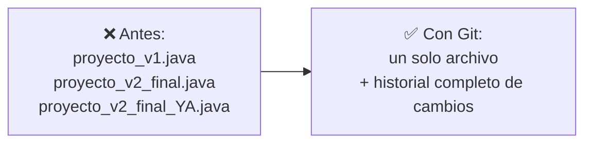
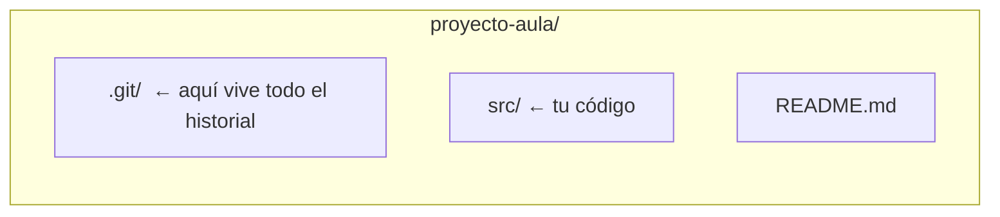
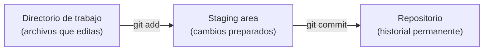
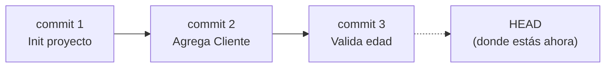

# Fundamentos de Control de Versiones

## El problema: proyectos sin memoria

Imagina que estás escribiendo el código de tu proyecto de aula. Para "no perder nada", vas guardando copias:

```text
proyectoAula.java
proyectoAula_v2.java
proyectoAula_v2_final.java
proyectoAula_v2_final_YA.java
proyectoAula_v2_final_YA_arreglado.java
```

- ¿Cuál es la versión buena?
- ¿Qué cambió exactamente entre una copia y la siguiente?
- Si borraste sin querer una función que sí funcionaba ayer, ¿cómo la recuperas?
- Ahora súmale un compañero de equipo que trabaja **al mismo tiempo** que tú sobre el mismo archivo, enviándolo por correo o USB o por WhastApp.

Esto no es un problema de programación: es un problema de **gestión de cambios en el tiempo**. Y es exactamente el problema que resuelve el control de versiones.

## Más problemas que resuelve el control de versiones

El ejemplo de las copias manuales es solo uno de varios escenarios donde la falta de control de versiones se convierte en un dolor de cabeza:

**1. Un cambio nuevo rompe lo que ya funcionaba**
Estás construyendo un proyecto con 5 funcionalidades. Terminaste las primeras tres, y funcionan bien. Al implementar la cuarta, algo sale mal: el código se daña y, sin darte cuenta, ese error también rompe las funcionalidades 1, 2 y 3. Sin un historial de cambios, no tienes forma de volver al punto exacto donde todo funcionaba — tocaría reescribir desde cero o depurar a ciegas.

**2. Juntar el trabajo de dos personas**
Tú y un compañero trabajan sobre el mismo proyecto al mismo tiempo. Cada uno edita partes distintas (o a veces las mismas) del código. Al final del día, ¿cómo combinan ambos trabajos sin que uno sobrescriba al otro? Copiar y pegar archivos a mano es lento y propenso a errores — casi siempre alguien termina perdiendo parte de su trabajo.

**3. El cliente cambia de opinión**
El profesor (o el cliente, en un proyecto real) te pide una función nueva. La construyes, la pruebas, todo bien. Una semana después te dice: "en realidad estaba mejor como estaba antes, revierte ese cambio". Sin un registro de versiones, "como estaba antes" es solo un recuerdo impreciso — no un estado real y recuperable del proyecto.

Los tres problemas comparten algo: todos requieren poder **volver atrás** o **combinar cambios** de forma confiable, en vez de depender de la memoria o de archivos duplicados. Git resuelve el primero y el tercero con el historial de commits que vemos hoy (`git log`, y comandos como `checkout`/`revert` que se profundizan en el laboratorio); el segundo requiere además trabajar con **ramas** (`branch`, `merge`), tema de la sesión T2.

## La solución: un sistema que recuerda por ti

En vez de copias manuales, un **sistema de control de versiones** guarda automáticamente cada cambio significativo del proyecto, con quién lo hizo, cuándo y por qué — sin duplicar archivos.



**Git** es el sistema de control de versiones más usado en la industria. Es **distribuido**: cada persona tiene una copia completa del historial del proyecto en su propia máquina, no depende de un único servidor central.

> Definición formal: el **control de versiones** es la práctica de registrar los cambios realizados sobre uno o varios archivos a lo largo del tiempo, de modo que se pueda recuperar cualquier versión anterior cuando se necesite.

## El repositorio: la memoria del proyecto

**Situación:** para que Git pueda "recordar" los cambios, primero necesita un lugar donde guardar esa historia.

**En la práctica**, esto se hace con un solo comando dentro de la carpeta del proyecto:

```bash
git init
```

Esto crea una carpeta oculta `.git/` que contiene **todo** el historial del proyecto. El resto de la carpeta (tu código) no cambia en nada visible.



> **Repositorio (repo):** carpeta cuyo contenido es rastreado por Git. Contiene el proyecto actual **y** toda su historia de cambios.
> ⚠️ Si borras la carpeta `.git/`, pierdes todo el historial — el código actual queda, pero la memoria del proyecto desaparece.

## De "guardar el archivo" a "guardar un cambio": el staging area

**Situación:** modificaste tres archivos, pero solo dos de esos cambios pertenecen a la misma idea (por ejemplo, "agregué validación de edad"). El tercero es un cambio suelto que aún no quieres registrar. ¿Cómo le dices a Git "guarda solo estos dos, juntos, como una unidad"?

**En la práctica**, Git separa el proceso en dos pasos:

```bash
git add Cliente.java Cuenta.java   # 1. Preparar (staging)
git commit -m "Agrega validacion de edad del cliente"   # 2. Guardar en la historia
```



Con `git status` puedes ver en cualquier momento en qué estado está cada archivo: sin rastrear, modificado, o ya preparado (_staged_).

> **Staging area:** zona intermedia donde eliges _exactamente qué cambios_ entrarán en el próximo commit, sin obligarte a guardar todo lo que has tocado.
> **Commit:** una "foto" (snapshot) permanente del proyecto en ese momento, con un mensaje descriptivo, autor, fecha y un identificador único (hash).

## HEAD y el historial: ¿dónde estoy parado?

**Situación:** después de 15 commits, ¿cómo sabes en cuál estás actualmente? ¿Cómo revisas qué pasó antes?

**En la práctica:**

```bash
git log            # historial completo de commits
git log --oneline  # versión resumida, un commit por línea
```



> **HEAD:** puntero que indica el commit en el que te encuentras actualmente. En el uso normal del día a día, HEAD apunta al último commit de tu rama de trabajo.
> **Historial:** la secuencia completa y ordenada de commits del proyecto, consultable en cualquier momento con `git log`.

## Ver el cambio exacto: git diff

**Situación:** antes de hacer `commit`, quieres confirmar _línea por línea_ qué modificaste, no solo recordar "creo que cambié algo en el constructor".

**En la práctica:**

```bash
git diff
```

```text
- public Cliente(String nombre) {
+ public Cliente(String nombre, int edad) {
+     if (edad < 0) throw new IllegalArgumentException("Edad invalida");
```

Las líneas con `-` son lo que había antes; las líneas con `+` son lo nuevo.

> `git diff` compara el directorio de trabajo contra la staging area. `git diff --staged` compara la staging area contra el último commit.

## Comandos esenciales — resumen

| Comando                   | ¿Qué hace?                                          | ¿Cuándo se usa?                                    |
| ------------------------- | --------------------------------------------------- | -------------------------------------------------- |
| `git init`                | Crea un repositorio en la carpeta actual            | Una sola vez, al iniciar el proyecto               |
| `git status`              | Muestra el estado de cada archivo                   | Constantemente, para saber qué falta preparar      |
| `git add <archivo>`       | Mueve cambios al staging area                       | Antes de cada commit                               |
| `git commit -m "mensaje"` | Guarda el staging area como un punto en la historia | Cada vez que completas una unidad lógica de cambio |
| `git log`                 | Muestra el historial de commits                     | Para revisar qué se ha hecho                       |
| `git diff`                | Muestra los cambios línea por línea                 | Antes de un `add` o `commit`, para revisar         |

## Síntesis

- El control de versiones resuelve problemas reales: perder cambios, no saber qué cambió, que un error nuevo rompa funcionalidades que ya andaban bien, pisarse el trabajo entre compañeros, o no poder volver a "como estaba antes" cuando el cliente cambia de opinión.
- El **repositorio** (`.git/`) guarda todo el historial del proyecto.
- Los cambios pasan por dos etapas antes de quedar permanentes: **directorio de trabajo → staging area (`git add`) → historial (`git commit`)**.
- **HEAD** indica dónde estás parado en la historia; `git log` te muestra toda la historia.
- `git diff` te deja ver exactamente qué cambió, línea por línea, antes de comprometerte con el cambio.
