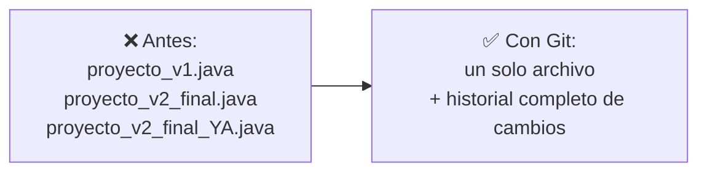
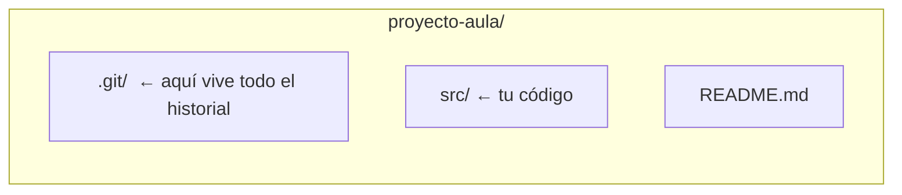
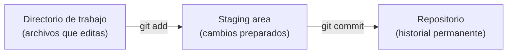
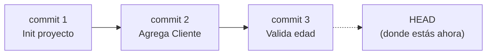

# Fundamentos de Control de Versiones

## Objetivo de la sesión

> Al terminar la clase, el estudiante entenderá **qué problema resuelve el control de versiones**, reconocerá los conceptos clave de Git (repositorio, commit, staging area, HEAD, historial) y ejecutará los comandos esenciales: `init`, `add`, `commit`, `status`, `log`, `diff`.

## El problema: proyectos sin memoria

Imagina que estás escribiendo el código de tu proyecto de aula. Para "no perder nada", vas guardando copias:

```text
proyectoAula.java
proyectoAula_v2.java
proyectoAula_v2_final.java
proyectoAula_v2_final_YA.java
proyectoAula_v2_final_YA_arreglado.java
```

- ¿Cuál es la versión buena?
- ¿Qué cambió exactamente entre una copia y la siguiente?
- Si borraste sin querer una función que sí funcionaba ayer, ¿cómo la recuperas?
- Ahora súmale un compañero de equipo que trabaja **al mismo tiempo** que tú sobre el mismo archivo, enviándolo por correo o USB.

Esto no es un problema de programación: es un problema de **gestión de cambios en el tiempo**. Y es exactamente el problema que resuelve el control de versiones.

## La solución: un sistema que recuerda por ti

En vez de copias manuales, un **sistema de control de versiones** guarda automáticamente cada cambio significativo del proyecto, con quién lo hizo, cuándo y por qué — sin duplicar archivos.



**Git** es el sistema de control de versiones más usado en la industria. Es **distribuido**: cada persona tiene una copia completa del historial del proyecto en su propia máquina, no depende de un único servidor central.

> Definición formal: el **control de versiones** es la práctica de registrar los cambios realizados sobre uno o varios archivos a lo largo del tiempo, de modo que se pueda recuperar cualquier versión anterior cuando se necesite.

## El repositorio: la memoria del proyecto

**Situación:** para que Git pueda "recordar" los cambios, primero necesita un lugar donde guardar esa historia.

**En la práctica**, esto se hace con un solo comando dentro de la carpeta del proyecto:

```bash
git init
```

Esto crea una carpeta oculta `.git/` que contiene **todo** el historial del proyecto. El resto de la carpeta (tu código) no cambia en nada visible.



> **Repositorio (repo):** carpeta cuyo contenido es rastreado por Git. Contiene el proyecto actual **y** toda su historia de cambios.
> ⚠️ Si borras la carpeta `.git/`, pierdes todo el historial — el código actual queda, pero la memoria del proyecto desaparece.

## De "guardar el archivo" a "guardar un cambio": el staging area

**Situación:** modificaste tres archivos, pero solo dos de esos cambios pertenecen a la misma idea (por ejemplo, "agregué validación de edad"). El tercero es un cambio suelto que aún no quieres registrar. ¿Cómo le dices a Git "guarda solo estos dos, juntos, como una unidad"?

**En la práctica**, Git separa el proceso en dos pasos:

```bash
git add Cliente.java Cuenta.java   # 1. Preparar (staging)
git commit -m "Agrega validacion de edad del cliente"   # 2. Guardar en la historia
```



Con `git status` puedes ver en cualquier momento en qué estado está cada archivo: sin rastrear, modificado, o ya preparado (_staged_).

> **Staging area:** zona intermedia donde eliges _exactamente qué cambios_ entrarán en el próximo commit, sin obligarte a guardar todo lo que has tocado.
> **Commit:** una "foto" (snapshot) permanente del proyecto en ese momento, con un mensaje descriptivo, autor, fecha y un identificador único (hash).

## HEAD y el historial: ¿dónde estoy parado?

**Situación:** después de 15 commits, ¿cómo sabes en cuál estás actualmente? ¿Cómo revisas qué pasó antes?

**En la práctica:**

```bash
git log            # historial completo de commits
git log --oneline  # versión resumida, un commit por línea
```



> **HEAD:** puntero que indica el commit en el que te encuentras actualmente. En el uso normal del día a día, HEAD apunta al último commit de tu rama de trabajo.
> **Historial:** la secuencia completa y ordenada de commits del proyecto, consultable en cualquier momento con `git log`.

## Ver el cambio exacto: git diff

**Situación:** antes de hacer `commit`, quieres confirmar _línea por línea_ qué modificaste, no solo recordar "creo que cambié algo en el constructor".

**En la práctica:**

```bash
git diff
```

```text
- public Cliente(String nombre) {
+ public Cliente(String nombre, int edad) {
+     if (edad < 0) throw new IllegalArgumentException("Edad invalida");
```

Las líneas con `-` son lo que había antes; las líneas con `+` son lo nuevo.

> `git diff` compara el directorio de trabajo contra la staging area. `git diff --staged` compara la staging area contra el último commit.

## Comandos esenciales — resumen

| Comando                   | ¿Qué hace?                                          | ¿Cuándo se usa?                                    |
| ------------------------- | --------------------------------------------------- | -------------------------------------------------- |
| `git init`                | Crea un repositorio en la carpeta actual            | Una sola vez, al iniciar el proyecto               |
| `git status`              | Muestra el estado de cada archivo                   | Constantemente, para saber qué falta preparar      |
| `git add <archivo>`       | Mueve cambios al staging area                       | Antes de cada commit                               |
| `git commit -m "mensaje"` | Guarda el staging area como un punto en la historia | Cada vez que completas una unidad lógica de cambio |
| `git log`                 | Muestra el historial de commits                     | Para revisar qué se ha hecho                       |
| `git diff`                | Muestra los cambios línea por línea                 | Antes de un `add` o `commit`, para revisar         |

## Síntesis

- El control de versiones resuelve un problema real: perder cambios, no saber qué cambió, o pisarse el trabajo entre compañeros.
- El **repositorio** (`.git/`) guarda todo el historial del proyecto.
- Los cambios pasan por dos etapas antes de quedar permanentes: **directorio de trabajo → staging area (`git add`) → historial (`git commit`)**.
- **HEAD** indica dónde estás parado en la historia; `git log` te muestra toda la historia.
- `git diff` te deja ver exactamente qué cambió, línea por línea, antes de comprometerte con el cambio.

## Notas para el docente

- **Tiempos sugeridos (sesión de 50–60 min):** problema inicial y motivación (5 min) · repositorio (10 min) · staging/commit (15 min) · HEAD/historial (10 min) · diff (5 min) · resumen y preguntas (5–10 min).
- **Pregunta para lanzar al grupo:** "¿Alguna vez han perdido una versión buena de un trabajo, o han recibido un archivo del compañero que sobrescribió lo que ustedes habían hecho?" — sirve para anclar el problema antes de nombrar Git.
- **Demo en vivo recomendada:** ejecutar `git init`, `git status`, editar un archivo, `git add`, `git status` de nuevo (para mostrar el cambio de estado), `git commit`, `git log`. Ver el cambio de estado en tiempo real ayuda más que solo mostrar el comando.
- **Variación si el grupo es más avanzado:** se puede adelantar la idea de que cada commit tiene un hash único (SHA-1), sin profundizar — se retoma en el laboratorio de la Semana 1.
- Esta sesión es **T1** de la Semana 1. La sesión **T2** (jueves) continúa con GitHub, ramas (`branch`, `checkout`, `merge`) y resolución de conflictos — no adelantar esos comandos aquí para no saturar la clase.
- El laboratorio del viernes 7 de agosto es festivo (Batalla de Boyacá): se realiza como trabajo independiente guiado, así que conviene dejar muy claros los comandos de esta sesión antes de cerrar la semana.

---

✅ Material generado
📘 Curso: Estructura de Datos — ED
📄 Tipo: Apuntes teóricos
💻 Lenguaje(s): Terminal (Bash) / Git
🎯 Dificultad: Básico
⏱ Tiempo est.: 50 minutos de clase
📦 Ítems: 8 diapositivas (secciones ##)
🎨 Visuales: 3 diagramas Mermaid, 0 fórmulas, 0 placeholders de imagen

---
