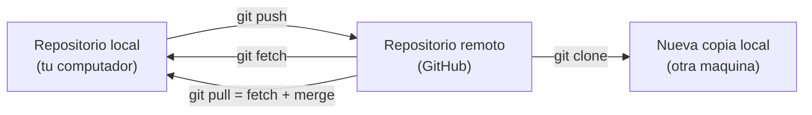
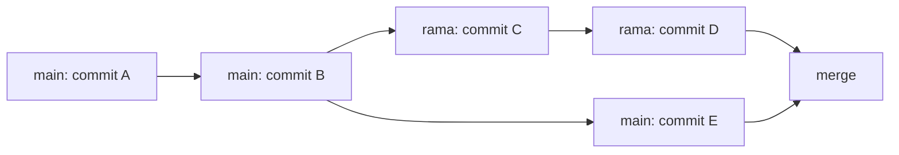
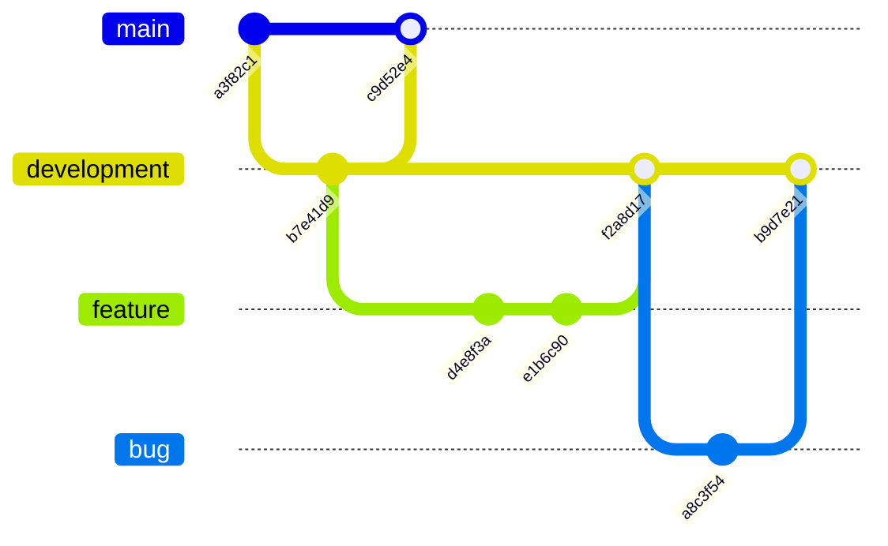
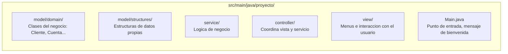
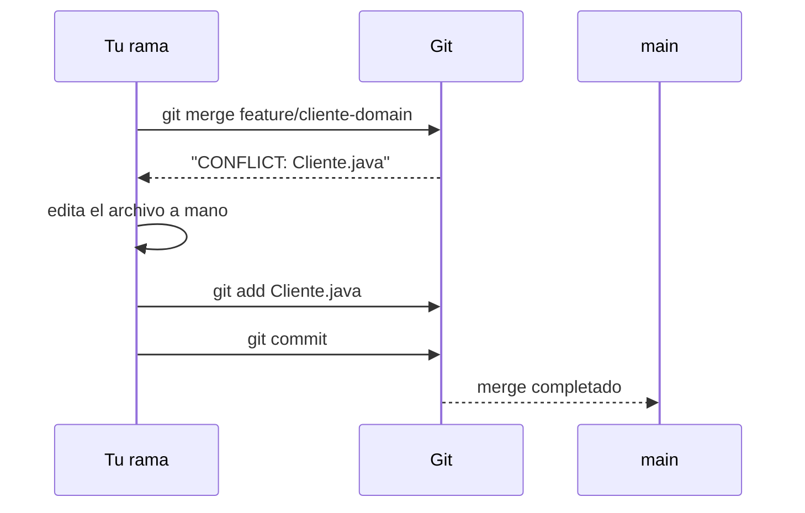

## El problema: tu historial vive solo en tu computador

El martes viste cómo Git registra cada cambio de tu proyecto con `add`, `commit` y `log`. Pero ese historial completo vive **solo en el disco de tu máquina**. Si el computador se daña, o simplemente lo dejas en la universidad, el historial desaparece con él.

Y hay un problema todavía más inmediato: ¿cómo le entregas tu proyecto al profesor? ¿Comprimes la carpeta en un `.zip` y la subes a la plataforma cada vez que avanzas? ¿Qué pasa si tu compañero de equipo trabaja al mismo tiempo que tú, en el mismo repositorio, sobre archivos distintos?

Ninguno de los comandos que ya conoces (`init`, `add`, `commit`) resuelve esto. Necesitas dos cosas nuevas: un lugar donde alojar una copia del repositorio fuera de tu máquina, y una forma de que dos personas trabajen sobre el mismo proyecto sin pisarse.

## Compartir el historial: repositorios remotos

**Situación:** quieres que tu repositorio exista en algún lugar además de tu computador — para no perderlo, y para que el profesor pueda revisarlo sin que le envíes archivos comprimidos.

**En la práctica**, Git puede sincronizar tu repositorio local con una copia alojada en un servidor: el **repositorio remoto**. GitHub es el servicio más usado para alojar esa copia. Cuatro comandos gobiernan la relación entre tu copia local y la remota:

```bash
git clone <url>       # descarga un repositorio remoto completo, con todo su historial
git push origin main   # sube tus commits locales al remoto
git fetch origin       # trae los commits nuevos del remoto, SIN aplicarlos todavia
git pull origin main    # trae los commits nuevos del remoto Y los aplica de una vez
```



`git fetch` es la operación prudente: te deja revisar qué trajo el remoto antes de mezclarlo con tu trabajo. `git pull` hace ambas cosas de una sola vez — cómodo, pero puede generar un conflicto de fusión de inmediato (lo ves más adelante en esta lección).

> **Repositorio remoto:** copia del repositorio alojada en un servidor (típicamente GitHub), que sincroniza su historial con una o varias copias locales mediante `push`, `pull`, `fetch` y `clone`.

Este es el mecanismo detrás de la entrega de tu proyecto del curso: un único repositorio en GitHub por equipo, al que ambos hacen `push`, y que el profesor revisa directamente ahí — sin `.zip`, sin USB.

## Experimentar sin romper lo que funciona: ramas

**Situación:** tu compañero de equipo va a implementar el módulo de `service/` mientras tú trabajas en `controller/`. Si los dos editan directamente sobre la única copia de código que existe, cualquier error de uno bloquea el trabajo del otro — y si algo se rompe, no hay forma limpia de aislar quién dañó qué.

**En la práctica**, Git permite abrir una **línea de trabajo paralela** llamada **rama (branch)**, que parte del estado actual sin afectar la rama principal (`main`) hasta que decides fusionarla:

```bash
git branch feature/cliente-domain     # crea la rama, sin cambiarte a ella
git checkout feature/cliente-domain   # te mueves a la rama nueva
git checkout -b feature/cliente-domain   # crea y cambia en un solo paso
# ... haces commits solo en esta rama ...
git checkout main                     # vuelves a la rama principal
git merge feature/cliente-domain      # incorporas esos commits a main
```



Este patrón — crear una rama para cada cambio que quieres probar, y fusionarla a `main` solo cuando funciona — se conoce como **flujo tipo feature branch**. Es la forma estándar de trabajar en equipo sin pisarse el trabajo entre sí, y la usarás desde el laboratorio del viernes para cada sprint del proyecto.

> **Rama (branch):** puntero móvil e independiente sobre una secuencia de commits, que permite desarrollar y probar cambios sin afectar la rama principal hasta que se fusionan explícitamente con `git merge`.

## Convención de ramas para el proyecto del curso

**Situación:** el flujo anterior sirve para un cambio aislado, pero tu equipo va a abrir varias ramas a lo largo del semestre — una funcionalidad nueva, la corrección de un error, un ajuste de última hora. Sin un acuerdo de nombres y de hacia dónde se fusiona cada una, nadie sabe qué rama corresponde a qué.

**En la práctica**, vas a usar el mismo esquema que se usa en la industria: ramas **permanentes** (viven todo el proyecto) y ramas **temporales** (se crean para un cambio puntual y se eliminan al fusionarse):

| Rama | Tipo | ¿De dónde parte? | ¿Hacia dónde se fusiona? | ¿Cuándo se usa? |
| --- | --- | --- | --- | --- |
| `main` | Permanente | — | — | Código estable, el que se entrega en cada sprint |
| `development` | Permanente | `main` | — | Integración: donde se juntan los cambios ya terminados |
| `feature/<nombre>` | Temporal | `development` | `development` | Una clase o funcionalidad nueva, ej. `feature/cliente-domain` |
| `bug/<nombre>` | Temporal | `development` | `development` | Corregir un error detectado, ej. `bug/npe-en-menu` |



Cada rama temporal se elimina inmediatamente después de fusionarse: dejarla viva no aporta nada y ensucia el repositorio.

> **Convención de ramas:** acuerdo de equipo sobre cómo nombrar cada rama según su propósito (`feature/`, `bug/`) y con qué rama permanente debe fusionarse. No es una regla de Git — es una disciplina que el equipo decide y respeta.

## La estructura que vas a versionar: el proyecto en capas

Todo lo anterior no es teoría suelta: es exactamente lo que vas a montar el viernes. El repositorio único del equipo va a contener la estructura de paquetes del proyecto del curso, organizada en cuatro capas:



Cada capa la vas a construir en ramas `feature/` distintas a lo largo del semestre, y las vas a integrar en `development` con `git merge`. El laboratorio del viernes crea el esqueleto completo — las cinco carpetas y un `Main.java` de bienvenida — sobre el repositorio que inicias hoy.

## Cuando dos cambios chocan: el conflicto de fusión

**Situación:** tú y tu compañero modificaron la **misma línea** del mismo archivo mientras trabajaban en paralelo — por ejemplo, ambos agregaron un atributo distinto a la clase `Cliente` en el mismo punto del archivo. Al hacer `git merge`, Git no tiene forma de adivinar cuál versión es la correcta.

**En la práctica**, Git detiene el merge y marca el archivo afectado con tres delimitadores:

```text
<<<<<<< HEAD
private String telefono;
=======
private String direccion;
>>>>>>> feature/cliente-domain
```

Todo lo que está entre `<<<<<<< HEAD` y `=======` es tu versión actual; todo entre `=======` y `>>>>>>> feature/cliente-domain` es la versión que intentas fusionar. Resolverlo significa editar el archivo a mano hasta dejar el contenido correcto — en este caso, probablemente conservar **ambos** atributos —, borrar los tres delimitadores, y cerrar el merge con un commit:

```bash
git add Cliente.java
git commit -m "Resuelve conflicto: agrega telefono y direccion"
```



> **Conflicto de fusión:** situación en la que Git no puede combinar automáticamente dos cambios porque afectan la misma parte de un archivo; requiere intervención manual antes de completar el `merge`.
> ⚠️ Un conflicto no es un error — es una señal normal de que dos personas tocaron lo mismo. El viernes vas a provocar uno a propósito y resolverlo, para que la primera vez que aparezca de verdad en tu proyecto ya sepas exactamente qué hacer.

## Lo que te espera el viernes

La sesión de hoy es la preparación teórica directa del laboratorio de este viernes (festivo, trabajo independiente guiado). Ahí vas a, en orden:

1. Crear el repositorio único del proyecto con `git init` y una secuencia de commits.
2. Crear al menos una rama, hacer commits en ella y fusionarla a `main` con `git merge`.
3. Provocar un conflicto de fusión a propósito y resolverlo siguiendo el procedimiento de esta lección.
4. Montar la estructura de paquetes completa (`model/domain`, `model/structures`, `service`, `controller`, `view`) con un `Main.java` que imprima un mensaje de bienvenida.

Todo lo que necesitas para ese laboratorio ya lo viste entre la sesión del martes y esta: `init`/`add`/`commit` para el historial local, y `branch`/`checkout`/`merge` más `push`/`pull` para el trabajo remoto y en equipo.

## Comandos de esta sesión — resumen

| Comando | ¿Qué hace? | ¿Cuándo se usa? |
| --- | --- | --- |
| `git clone <url>` | Descarga un repositorio remoto completo | Al empezar a trabajar sobre un repo ya existente en GitHub |
| `git push origin main` | Sube tus commits locales al remoto | Después de commitear, para compartir tu avance |
| `git fetch origin` | Trae los commits nuevos del remoto sin aplicarlos | Para revisar qué cambió antes de mezclarlo |
| `git pull origin main` | Trae y aplica los commits nuevos del remoto | Para actualizar tu copia local con el trabajo del equipo |
| `git branch <nombre>` | Crea una rama nueva | Antes de empezar una funcionalidad o corrección |
| `git checkout <rama>` | Cambia a otra rama | Para moverte entre líneas de trabajo |
| `git checkout -b <rama>` | Crea y cambia a la rama en un solo paso | Atajo del uso más común |
| `git merge <rama>` | Fusiona los commits de una rama en la actual | Cuando el trabajo de la rama ya está listo |

## Síntesis

- Los **repositorios remotos** (`push`, `pull`, `fetch`, `clone`) sincronizan tu historial local con una copia en GitHub — así no dependes de un solo computador y el profesor revisa directamente sobre el repositorio.
- Las **ramas** (`branch`, `checkout`, `merge`) te permiten a ti y a tu compañero trabajar en paralelo sin arriesgar el código que ya funciona en `main`; el flujo tipo feature branch es la forma estándar de organizar ese trabajo en equipo.
- Una **convención de ramas** (`main`, `development`, `feature/`, `bug/`) define de dónde parte cada rama y hacia dónde se fusiona, para que el equipo completo trabaje sin pisarse.
- El repositorio único del proyecto va a alojar la estructura en capas (`model/domain`, `model/structures`, `service`, `controller`, `view`) que construirás rama por rama durante el semestre.
- Un **conflicto de fusión** aparece cuando dos cambios tocan la misma línea del mismo archivo — no es un error, es parte normal del trabajo colaborativo, y se resuelve editando el archivo a mano, con `git add` y un commit final.
- El laboratorio del viernes pone en práctica exactamente estos cinco comandos nuevos: crear el repo, ramificar, fusionar, provocar y resolver un conflicto, y montar el esqueleto de paquetes con `Main.java`.
