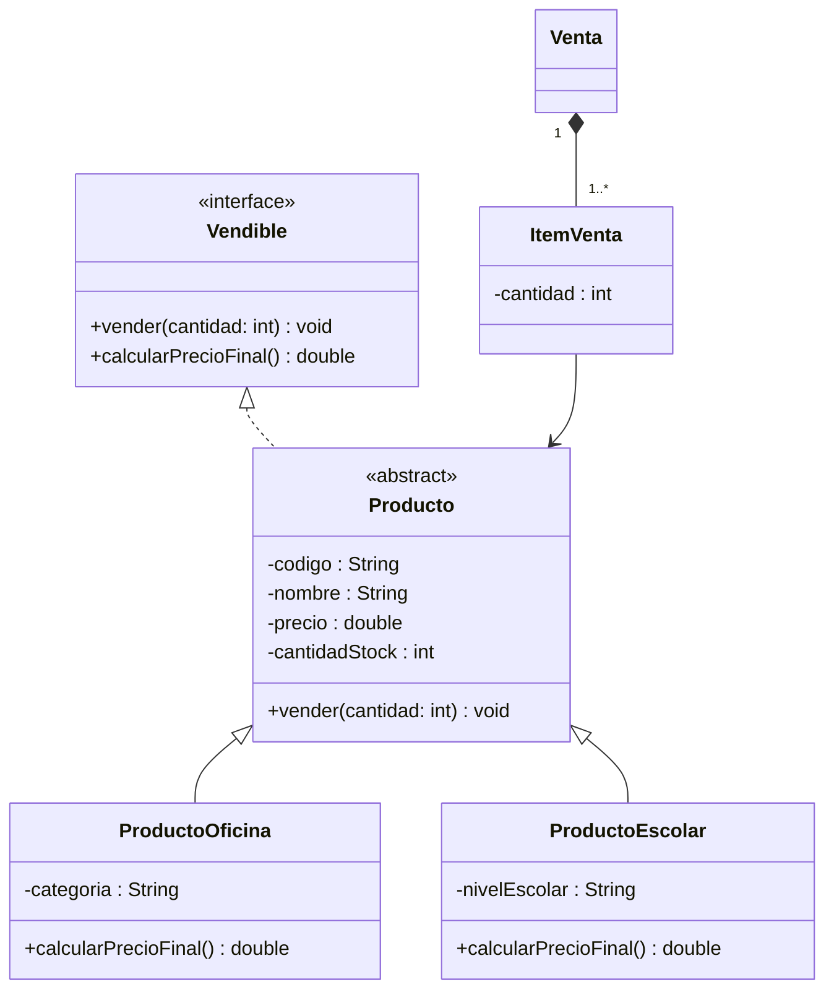
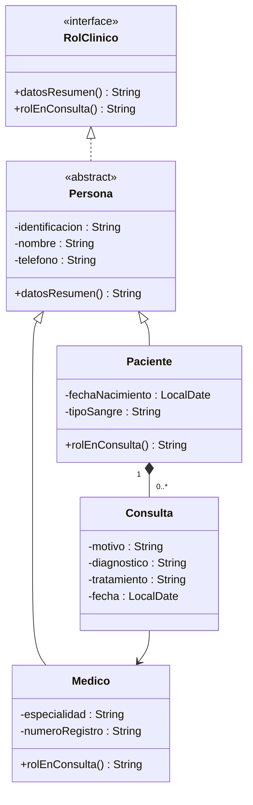
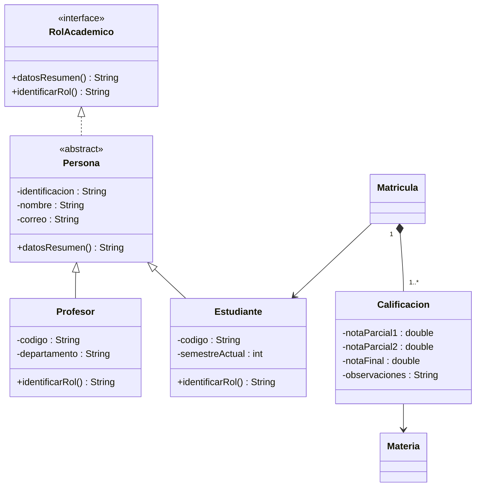
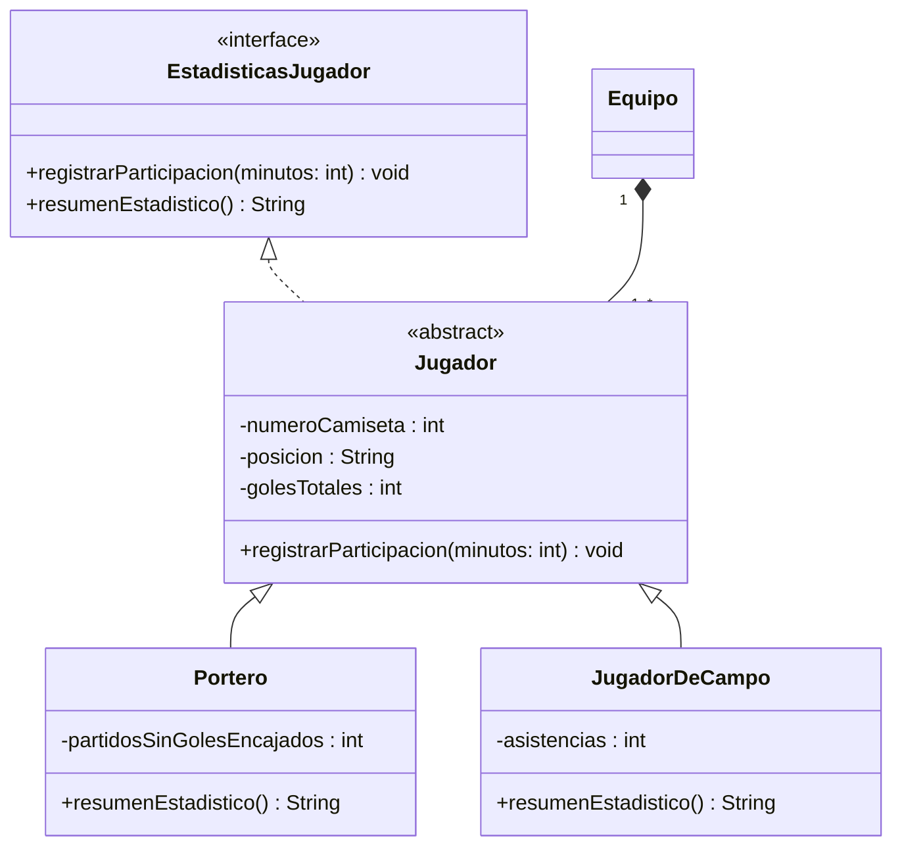

# Laboratorio Evaluativo — Codificación de Diseño OO (Momento 1)

## Objetivo

Leer e interpretar el diagrama UML de su proyecto de aula — entregado ya
resuelto en este documento, en la sección correspondiente a su caso de
estudio — e implementarlo fielmente en Java, aplicando encapsulamiento,
herencia, clases abstractas e interfaces.

**El UML no se diseña en este laboratorio: se entrega resuelto.** Su trabajo
es traducir el diagrama a código correcto, no decidir la estructura de
clases. Este laboratorio cierra el **Momento evaluativo 1 — Programación
orientada a objetos (5 %)**.

Competencias esperadas:
- Leer un diagrama de clases UML e identificar interfaz, clase abstracta,
  subclases concretas y relación de composición con su multiplicidad.
- Traducir la notación de visibilidad (`+`, `-`, `#`) a modificadores de
  acceso de Java.
- Implementar una interfaz mediante una clase abstracta que resuelve parte
  del contrato y deja el resto pendiente para sus subtipos concretos.
- Implementar herencia y polimorfismo fieles al diagrama, sin usar
  `instanceof` para distinguir subtipos donde el diagrama pide polimorfismo.
- Escribir una clase de prueba que demuestre la creación de objetos de cada
  subtipo y el comportamiento polimórfico esperado.

---

## Requisitos Previos

Antes de comenzar, debe dominar:
- La lección "Encapsulamiento": modificadores de acceso, getters y
  setters con validación.
- La lección "Introducción al UML": anatomía de una clase en UML,
  visibilidad, atributos y métodos, notación `<<interface>>` y realización.
- La lección "Herencia": `extends`, sobreescritura con `@Override`,
  invocación del constructor de la superclase con `super(...)`.
- La lección "Polimorfismo": binding dinámico, clases abstractas
  (`abstract`) e interfaces (`interface`, `implements`).
- La guía "Laboratorio — Jerarquía de Clases de Tres Niveles y
  Polimorfismo": ya practicó la lectura de un diagrama de clases y el
  polimorfismo sobre arreglos de referencias.
- La lección "Composición, agregación y diagramas de paquetes":
  diferencias conceptuales entre asociación, agregación y composición;
  multiplicidades y notación `*--` en UML.
- La guía "Guía — Elección del proyecto de aula": debe tener su caso de
  estudio asignado.

---

## Ubique su sección

Cada uno de los cinco proyectos elegibles tiene su diagrama UML ya resuelto
en la sección siguiente. **Ubique la sección de su proyecto asignado y
trabaje únicamente sobre ella** — no necesita leer ni implementar las otras
cuatro.

---

## Diagrama UML por proyecto

### 1. Papelería



**Requisitos de implementación:**
- Todas las clases van en el paquete `model.domain`.
- Los atributos son `private`; el acceso externo es siempre por getters (y
  setters solo donde el diagrama lo requiera).
- El constructor de `Producto` valida `precio > 0` y `cantidadStock >= 0`,
  lanzando `IllegalArgumentException` en caso contrario.
- `Producto.vender(cantidad)` valida que `cantidad` sea positiva y que haya
  stock suficiente antes de descontarlo; si no hay stock suficiente, lanza
  `IllegalStateException`.
- `calcularPrecioFinal()` queda **sin implementar en `Producto`**: cada
  subtipo la resuelve con su propia regla. `ProductoOficina` aplica un
  recargo fijo del 8 % sobre `precio` (mayor margen por manejo de insumos
  especializados). `ProductoEscolar` aplica un descuento del 10 % sobre
  `precio` cuando `nivelEscolar` sea `"primaria"`, y ningún descuento en
  cualquier otro caso.
- `ItemVenta` referencia un `Producto` por asociación (no composición): el
  producto existe independientemente de la venta.

```java
package model.domain;

public interface Vendible {
    void vender(int cantidad);
    double calcularPrecioFinal();
}
```

```java
package model.domain;

public abstract class Producto implements Vendible {
    private String codigo;
    private String nombre;
    private double precio;
    private int cantidadStock;

    public Producto(String codigo, String nombre, double precio, int cantidadStock) {
        // TODO: validar precio > 0 y cantidadStock >= 0
    }

    @Override
    public void vender(int cantidad) {
        // TODO: validar cantidad positiva y stock suficiente, descontar cantidadStock
    }

    // calcularPrecioFinal() queda sin resolver: cada subtipo la implementa

    // TODO: getters de codigo, nombre, precio, cantidadStock
}
```

```java
package model.domain;

public class ProductoOficina extends Producto {
    private String categoria;

    public ProductoOficina(String codigo, String nombre, double precio, int cantidadStock, String categoria) {
        super(codigo, nombre, precio, cantidadStock);
        // TODO: asignar categoria
    }

    @Override
    public double calcularPrecioFinal() {
        // TODO: aplicar recargo del 8% sobre el precio base
        return 0;
    }
}
```

```java
package model.domain;

public class ProductoEscolar extends Producto {
    private String nivelEscolar;

    public ProductoEscolar(String codigo, String nombre, double precio, int cantidadStock, String nivelEscolar) {
        super(codigo, nombre, precio, cantidadStock);
        // TODO: asignar nivelEscolar
    }

    @Override
    public double calcularPrecioFinal() {
        // TODO: aplicar descuento del 10% si nivelEscolar es "primaria"
        return 0;
    }
}
```

```java
package model.domain;

import java.util.ArrayList;
import java.util.List;

public class Venta {
    private final List<ItemVenta> items;

    public Venta() {
        this.items = new ArrayList<>();
    }

    public void agregarItem(ItemVenta item) {
        // TODO: agregar item a la lista (composicion: el ItemVenta solo existe dentro de una Venta)
    }

    // TODO: getter de items
}
```

```java
package model.domain;

public class ItemVenta {
    private Producto producto;
    private int cantidad;

    public ItemVenta(Producto producto, int cantidad) {
        // TODO: validar cantidad positiva, asignar producto y cantidad
    }

    // TODO: getters de producto y cantidad
}
```

---

### 2. Consultorio Médico



**Requisitos de implementación:**
- Todas las clases van en el paquete `model.domain`.
- Atributos `private`; acceso por getters y setters donde el diagrama lo
  requiera.
- El constructor de `Persona` valida que `identificacion` no sea nula ni
  esté vacía, lanzando `IllegalArgumentException` en caso contrario.
- `datosResumen()` queda implementado en `Persona` (igual para todos los
  subtipos): retorna una cadena que combine `identificacion`, `nombre` y
  `telefono`.
- `rolEnConsulta()` queda **sin implementar en `Persona`**: `Paciente` la
  resuelve incluyendo `tipoSangre` y la edad calculada a partir de
  `fechaNacimiento`; `Medico` la resuelve incluyendo `especialidad` y
  `numeroRegistro`.
- Una `Consulta` no existe fuera de un `Paciente` (composición); referencia
  a `Medico` por asociación, no por composición.

```java
package model.domain;

public interface RolClinico {
    String datosResumen();
    String rolEnConsulta();
}
```

```java
package model.domain;

public abstract class Persona implements RolClinico {
    private String identificacion;
    private String nombre;
    private String telefono;

    public Persona(String identificacion, String nombre, String telefono) {
        // TODO: validar identificacion no nula ni vacia
    }

    @Override
    public String datosResumen() {
        // TODO: combinar identificacion, nombre y telefono en una cadena
        return null;
    }

    // rolEnConsulta() queda sin resolver: cada subtipo la implementa

    // TODO: getters de identificacion, nombre, telefono
}
```

```java
package model.domain;

import java.time.LocalDate;

public class Paciente extends Persona {
    private LocalDate fechaNacimiento;
    private String tipoSangre;

    public Paciente(String identificacion, String nombre, String telefono, LocalDate fechaNacimiento, String tipoSangre) {
        super(identificacion, nombre, telefono);
        // TODO: asignar fechaNacimiento y tipoSangre
    }

    @Override
    public String rolEnConsulta() {
        // TODO: incluir tipoSangre y la edad calculada a partir de fechaNacimiento
        return null;
    }
}
```

```java
package model.domain;

public class Medico extends Persona {
    private String especialidad;
    private String numeroRegistro;

    public Medico(String identificacion, String nombre, String telefono, String especialidad, String numeroRegistro) {
        super(identificacion, nombre, telefono);
        // TODO: asignar especialidad y numeroRegistro
    }

    @Override
    public String rolEnConsulta() {
        // TODO: incluir especialidad y numeroRegistro
        return null;
    }
}
```

```java
package model.domain;

import java.time.LocalDate;

public class Consulta {
    private String motivo;
    private String diagnostico;
    private String tratamiento;
    private LocalDate fecha;
    private Medico medico;

    public Consulta(String motivo, String diagnostico, String tratamiento, LocalDate fecha, Medico medico) {
        // TODO: asignar los cinco atributos
    }

    // TODO: getters de motivo, diagnostico, tratamiento, fecha, medico
}
```

---

### 3. Clínica Veterinaria

```mermaid
classDiagram
  class FichaClinica {
    <<interface>>
    +actualizarFicha() void
    +resumenFicha() String
  }
  class Animal {
    <<abstract>>
    -numeroFicha : String
    -nombre : String
    -especie : String
    -fechaNacimiento : LocalDate
    +actualizarFicha() void
  }
  class Perro {
    -raza : String
    +resumenFicha() String
  }
  class Gato {
    -tipo : String
    +resumenFicha() String
  }
  class Dueño {
  }
  FichaClinica <|.. Animal
  Animal <|-- Perro
  Animal <|-- Gato
  Dueño "1" *-- "1..*" Animal
```

**Requisitos de implementación:**
- Todas las clases van en el paquete `model.domain`.
- Atributos `private`; acceso por getters y setters donde el diagrama lo
  requiera.
- El constructor de `Animal` valida que `numeroFicha` no sea nulo ni esté
  vacío.
- `actualizarFicha()` queda implementado en `Animal` (igual para todos los
  subtipos): defina en su implementación qué significa "actualizar" para su
  dominio (por ejemplo, refrescar un dato derivado); no requiere una regla
  numérica específica, pero debe compilar y ser invocable desde cualquier
  subtipo sin sobreescritura.
- `resumenFicha()` queda **sin implementar en `Animal`**: `Perro` la
  resuelve incluyendo `raza`; `Gato` la resuelve incluyendo `tipo`
  (`"indoor"` o `"outdoor"`).
- Un `Animal` no existe fuera de un `Dueño` (composición), con multiplicidad
  `"1"` a `"1..*"` explícita en el diagrama: un dueño tiene uno o más
  animales, y un animal pertenece exactamente a un dueño.

```java
package model.domain;

public interface FichaClinica {
    void actualizarFicha();
    String resumenFicha();
}
```

```java
package model.domain;

import java.time.LocalDate;

public abstract class Animal implements FichaClinica {
    private String numeroFicha;
    private String nombre;
    private String especie;
    private LocalDate fechaNacimiento;

    public Animal(String numeroFicha, String nombre, String especie, LocalDate fechaNacimiento) {
        // TODO: validar numeroFicha no nulo ni vacio
    }

    @Override
    public void actualizarFicha() {
        // TODO: implementar la actualizacion comun a todos los subtipos
    }

    // resumenFicha() queda sin resolver: cada subtipo la implementa

    // TODO: getters de numeroFicha, nombre, especie, fechaNacimiento
}
```

```java
package model.domain;

import java.time.LocalDate;

public class Perro extends Animal {
    private String raza;

    public Perro(String numeroFicha, String nombre, String especie, LocalDate fechaNacimiento, String raza) {
        super(numeroFicha, nombre, especie, fechaNacimiento);
        // TODO: asignar raza
    }

    @Override
    public String resumenFicha() {
        // TODO: incluir raza en el resumen
        return null;
    }
}
```

```java
package model.domain;

import java.time.LocalDate;

public class Gato extends Animal {
    private String tipo;

    public Gato(String numeroFicha, String nombre, String especie, LocalDate fechaNacimiento, String tipo) {
        super(numeroFicha, nombre, especie, fechaNacimiento);
        // TODO: asignar tipo ("indoor" o "outdoor")
    }

    @Override
    public String resumenFicha() {
        // TODO: incluir tipo en el resumen
        return null;
    }
}
```

```java
package model.domain;

import java.util.ArrayList;
import java.util.List;

public class Dueño {
    private String identificacion;
    private String nombre;
    private final List<Animal> animales;

    public Dueño(String identificacion, String nombre) {
        // TODO: validar identificacion y asignar atributos; inicializar la lista de animales
        this.animales = new ArrayList<>();
    }

    public void agregarAnimal(Animal animal) {
        // TODO: agregar animal a la lista (composicion: no existe fuera de este Dueño)
    }

    // TODO: getters de identificacion, nombre, animales
}
```

---

### 4. Sistema Académico



**Requisitos de implementación:**
- Todas las clases van en el paquete `model.domain`.
- Atributos `private`; acceso por getters y setters donde el diagrama lo
  requiera.
- El constructor de `Persona` valida que `correo` contenga el carácter
  `@`, lanzando `IllegalArgumentException` en caso contrario.
- `datosResumen()` queda implementado en `Persona`: retorna una cadena que
  combine `identificacion`, `nombre` y `correo`.
- `identificarRol()` queda **sin implementar en `Persona`**: `Estudiante` la
  resuelve incluyendo `codigo` y `semestreActual`; `Profesor` la resuelve
  incluyendo `codigo` y `departamento`.
- Una `Calificacion` no existe fuera de una `Matricula` (composición);
  `Matricula` referencia a `Estudiante` por asociación, y `Calificacion`
  referencia a `Materia` por asociación.

```java
package model.domain;

public interface RolAcademico {
    String datosResumen();
    String identificarRol();
}
```

```java
package model.domain;

public abstract class Persona implements RolAcademico {
    private String identificacion;
    private String nombre;
    private String correo;

    public Persona(String identificacion, String nombre, String correo) {
        // TODO: validar que correo contenga '@'
    }

    @Override
    public String datosResumen() {
        // TODO: combinar identificacion, nombre y correo en una cadena
        return null;
    }

    // identificarRol() queda sin resolver: cada subtipo la implementa

    // TODO: getters de identificacion, nombre, correo
}
```

```java
package model.domain;

public class Estudiante extends Persona {
    private String codigo;
    private int semestreActual;

    public Estudiante(String identificacion, String nombre, String correo, String codigo, int semestreActual) {
        super(identificacion, nombre, correo);
        // TODO: asignar codigo y semestreActual
    }

    @Override
    public String identificarRol() {
        // TODO: incluir codigo y semestreActual
        return null;
    }
}
```

```java
package model.domain;

public class Profesor extends Persona {
    private String codigo;
    private String departamento;

    public Profesor(String identificacion, String nombre, String correo, String codigo, String departamento) {
        super(identificacion, nombre, correo);
        // TODO: asignar codigo y departamento
    }

    @Override
    public String identificarRol() {
        // TODO: incluir codigo y departamento
        return null;
    }
}
```

```java
package model.domain;

import java.util.ArrayList;
import java.util.List;

public class Matricula {
    private Estudiante estudiante;
    private final List<Calificacion> calificaciones;

    public Matricula(Estudiante estudiante) {
        // TODO: validar estudiante no nulo; asignar; inicializar la lista de calificaciones
        this.calificaciones = new ArrayList<>();
    }

    public void agregarCalificacion(Calificacion calificacion) {
        // TODO: agregar calificacion a la lista (composicion: no existe fuera de esta Matricula)
    }

    // TODO: getters de estudiante, calificaciones
}
```

```java
package model.domain;

public class Calificacion {
    private double notaParcial1;
    private double notaParcial2;
    private double notaFinal;
    private String observaciones;
    private Materia materia;

    public Calificacion(double notaParcial1, double notaParcial2, double notaFinal, String observaciones, Materia materia) {
        // TODO: asignar los cinco atributos
    }

    // TODO: getters de notaParcial1, notaParcial2, notaFinal, observaciones, materia
}
```

---

### 5. Liga de Fútbol



> `Jugador` no hereda de una clase `Persona` en este laboratorio —
> simplificación deliberada para mantener dos niveles de jerarquía,
> consistentes con los otros cuatro proyectos.

**Requisitos de implementación:**
- Todas las clases van en el paquete `model.domain`.
- Atributos `private`; acceso por getters y setters donde el diagrama lo
  requiera.
- El constructor de `Jugador` valida que `numeroCamiseta` sea positivo,
  lanzando `IllegalArgumentException` en caso contrario.
- `registrarParticipacion(minutos)` queda implementado en `Jugador` (igual
  para todos los subtipos): valida que `minutos` sea positivo antes de
  registrar la participación (defina cómo la registra, por ejemplo con un
  contador acumulado).
- `resumenEstadistico()` queda **sin implementar en `Jugador`**: `Portero`
  la resuelve incluyendo `partidosSinGolesEncajados`; `JugadorDeCampo` la
  resuelve incluyendo `asistencias` y `golesTotales`.
- Un `Jugador` no existe fuera de un `Equipo` (composición).

```java
package model.domain;

public interface EstadisticasJugador {
    void registrarParticipacion(int minutos);
    String resumenEstadistico();
}
```

```java
package model.domain;

public abstract class Jugador implements EstadisticasJugador {
    private int numeroCamiseta;
    private String posicion;
    private int golesTotales;

    public Jugador(int numeroCamiseta, String posicion) {
        // TODO: validar numeroCamiseta positivo; asignar posicion; golesTotales inicia en 0
    }

    @Override
    public void registrarParticipacion(int minutos) {
        // TODO: validar minutos positivo y registrar la participacion
    }

    // resumenEstadistico() queda sin resolver: cada subtipo la implementa

    // TODO: getters de numeroCamiseta, posicion, golesTotales
}
```

```java
package model.domain;

public class Portero extends Jugador {
    private int partidosSinGolesEncajados;

    public Portero(int numeroCamiseta, String posicion) {
        super(numeroCamiseta, posicion);
        // TODO: inicializar partidosSinGolesEncajados en 0
    }

    @Override
    public String resumenEstadistico() {
        // TODO: incluir partidosSinGolesEncajados
        return null;
    }
}
```

```java
package model.domain;

public class JugadorDeCampo extends Jugador {
    private int asistencias;

    public JugadorDeCampo(int numeroCamiseta, String posicion) {
        super(numeroCamiseta, posicion);
        // TODO: inicializar asistencias en 0
    }

    @Override
    public String resumenEstadistico() {
        // TODO: incluir asistencias y golesTotales
        return null;
    }
}
```

```java
package model.domain;

import java.util.ArrayList;
import java.util.List;

public class Equipo {
    private String nombre;
    private final List<Jugador> jugadores;

    public Equipo(String nombre) {
        // TODO: validar nombre no nulo ni vacio; inicializar la lista de jugadores
        this.jugadores = new ArrayList<>();
    }

    public void agregarJugador(Jugador jugador) {
        // TODO: agregar jugador a la lista (composicion: no existe fuera de este Equipo)
    }

    // TODO: getters de nombre, jugadores
}
```

---

## Desarrollo del Laboratorio

### Parte 1 — Codifique el diagrama de su proyecto

Implemente en `model/domain/` la interfaz, la clase abstracta, las dos
subclases concretas y la clase de composición del diagrama de su proyecto,
siguiendo los requisitos de implementación de esa sección. Respete
exactamente los nombres de clase, atributo y método del diagrama — la
rúbrica evalúa la fidelidad de la codificación al UML entregado, no una
variación libre sobre él.

**Requisitos:**
- Todos los atributos son `private`; el acceso externo es siempre por
  métodos.
- Cada subclase invoca `super(...)` en su constructor.
- El método marcado en la interfaz pero no implementado en la clase
  abstracta queda declarado sin cuerpo en la clase abstracta (el compilador
  obliga a cada subtipo concreto a resolverlo con `@Override`).
- Los setters (donde el diagrama los requiera) validan antes de asignar.

### Parte 2 — Escriba la clase de prueba

Escriba una clase de prueba, con un método `main`, que:
- Cree al menos una instancia de cada uno de los dos subtipos concretos de
  su proyecto.
- Las agregue a la clase de composición correspondiente (por ejemplo,
  agregue sus `Producto` a una `Venta` a través de `ItemVenta`, o sus
  `Animal` a un `Dueño`).
- Ejercite el método polimórfico (el que quedó sin resolver en la clase
  abstracta) sobre cada instancia **sin usar `instanceof`** — recórralas
  como referencias del tipo abstracto o de la interfaz y deje que cada una
  resuelva su propia versión.
- Imprima por consola el resultado de cada llamada, de modo que se vea en
  pantalla que las dos implementaciones se comportan distinto.

```java
public class PruebaCreacionObjetos {
    public static void main(String[] args) {
        // TODO: construya al menos una instancia de cada subtipo concreto de su proyecto
        // TODO: agreguelas a la clase de composicion correspondiente
        // TODO: recorra las instancias como referencias del tipo abstracto/interfaz
        //       e invoque el metodo polimorfico sin usar instanceof
        // TODO: imprima por consola el resultado de cada llamada
    }
}
```

> **Extensión opcional, no evaluada:** si su equipo ya tiene avanzada la
> coordinación de las capas `service`, `controller` y `view` sobre estas
> clases, puede integrarlas al menú de consola del proyecto. No es requisito
> de este laboratorio ni forma parte de su rúbrica.

---

## Entregable

Estructura de archivos dentro de su repositorio del proyecto de aula (los
nombres exactos de clase dependen de su proyecto — use los del diagrama de
su sección):

```
proyecto-aula/
  src/
    model/
      domain/
        <Interfaz>.java
        <ClaseAbstracta>.java
        <SubtipoConcretoA>.java
        <SubtipoConcretoB>.java
        <ClaseDeComposicion>.java
    PruebaCreacionObjetos.java
```

**Formato de entrega:** commit sobre la rama de su proyecto de aula, con
mensaje descriptivo (por ejemplo, `feat: codificacion UML momento 1`). No se
entrega por archivo `.zip` aparte — el entregable **es** el estado del
repositorio en esa rama al momento del plazo.

### Ejemplo de archivo de prueba esperado

El docente verifica la Parte 2 ejecutando directamente su
`PruebaCreacionObjetos`. Debe compilar y ejecutar sin errores, mostrando por
consola al menos dos resultados distintos (uno por cada subtipo concreto).

---

## Criterios de Evaluación

| Criterio | Puntos | Descripción |
|---|---|---|
| **Codificación correcta del UML** | 60 | Las clases, constructores, atributos, métodos, getters y setters, y la relación de herencia coinciden exactamente con el diagrama entregado: la interfaz declara los métodos del contrato, la clase abstracta implementa solo el método que le corresponde y deja el otro pendiente, y cada subtipo concreto lo resuelve con `@Override` y lógica distinta entre ellos. |
| **Pruebas en el App — creación de objetos** | 20 | `PruebaCreacionObjetos` compila y se ejecuta sin errores, instancia al menos un objeto de cada subtipo concreto, las integra a la clase de composición, y ejercita el método polimórfico sobre cada una sin usar `instanceof`, imprimiendo el resultado por consola. |
| **Buenas prácticas de programación** | 20 | Commits descriptivos y frecuentes (no un único commit al final); uso correcto de ramas (trabajo sobre la rama del proyecto, no directo en `main`); nombres de clases, métodos y variables descriptivos y siguiendo las convenciones de Java (`PascalCase` para clases, `camelCase` para métodos y variables). |
| **TOTAL** | **100** | |

Cada ítem se califica en una escala de **0 a 5**. La nota final del
laboratorio es el promedio ponderado de los tres ítems, escalado al 5 % de
la nota del curso:

```
nota_laboratorio (0-5) = 0.60 × item1 + 0.20 × item2 + 0.20 × item3
nota_final_curso (%)   = (nota_laboratorio / 5) × 5%
```

**Ejemplo:** si obtiene 4.5 en "Codificación correcta del UML", 5 en
"Pruebas en el App" y 4 en "Buenas prácticas":

```
nota_laboratorio = 0.60 × 4.5 + 0.20 × 5 + 0.20 × 4 = 2.7 + 1.0 + 0.8 = 4.5
nota_final_curso = (4.5 / 5) × 5% = 4.5%
```

---

## Dificultades Comunes

### "No sé qué hacer con un método marcado en la interfaz pero no implementado en la clase abstracta"
- Es el comportamiento esperado: la clase abstracta puede dejar métodos de
  la interfaz sin resolver. Simplemente no escriba el método en la clase
  abstracta (o decláralo como `abstract` explícitamente); el compilador
  obliga a cada subclase **concreta** a implementarlo.

### "Mi clase abstracta no compila porque le falta un método"
- Revise si el método faltante es el que el diagrama deja pendiente a
  propósito. Si es así, no lo implemente ahí: impleméntelo en cada
  subclase concreta con `@Override`.

### "No entiendo la multiplicidad de la relación de composición"
- Lea la notación como "del lado del diamante relleno, cuántas instancias
  del otro extremo puede tener". Por ejemplo, `Dueño "1" *-- "1..*" Animal`
  se lee: un `Animal` pertenece exactamente a `1` `Dueño`, y un `Dueño`
  tiene `1` o más `Animal`.

### "¿Puedo cambiar los nombres de las clases o métodos del diagrama?"
- No. La rúbrica evalúa fidelidad al diagrama entregado: use exactamente
  los nombres de clase, atributo y método que aparecen en la sección de su
  proyecto.

---

## Extensiones Sugeridas (Bonus)

- Escribir una segunda clase de prueba que recorra un arreglo o lista de
  referencias del tipo abstracto/interfaz, mezclando instancias de los dos
  subtipos concretos, como en el laboratorio de la Semana 3.
- Adelantar la integración de estas clases con las capas `service`,
  `controller` y `view` de su proyecto de aula (no evaluado en este
  laboratorio).

---

## Recursos

- **Lecciones del curso:** "Encapsulamiento", "Herencia", "Polimorfismo",
  "Introducción al UML", "Composición, agregación y diagramas de
  paquetes".
- **Guía anterior:** "Laboratorio — Jerarquía de Clases de Tres Niveles y
  Polimorfismo", donde practicó la lectura de un diagrama de clases similar.
- **Guía de proyecto:** "Guía — Elección del proyecto de aula", para
  confirmar cuál de los cinco casos de estudio le corresponde.

**Plazo de entrega:** antes de finalizar la sesión del viernes 28 de
agosto (bloque de laboratorio evaluativo ★ M1).
