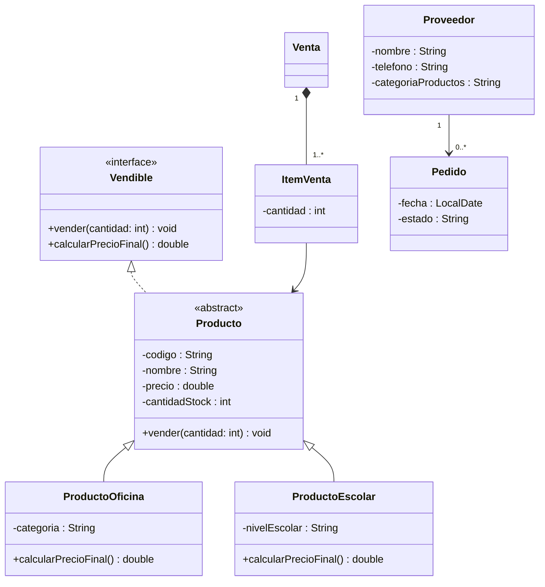
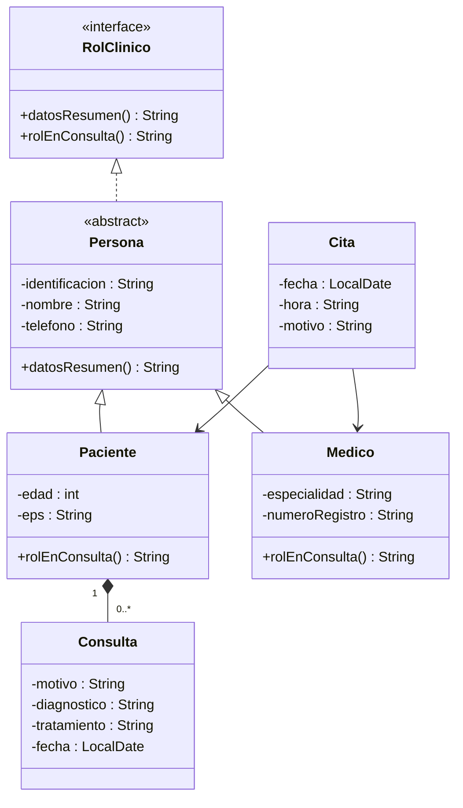
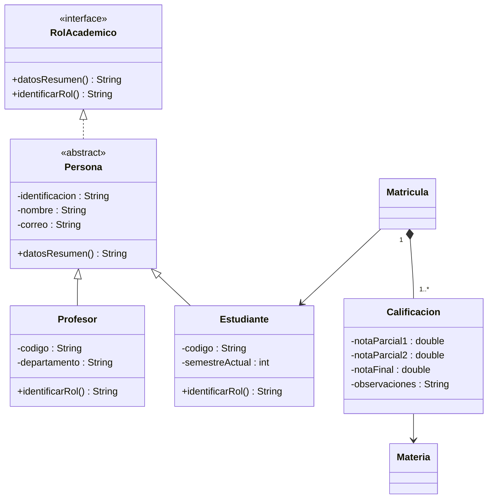
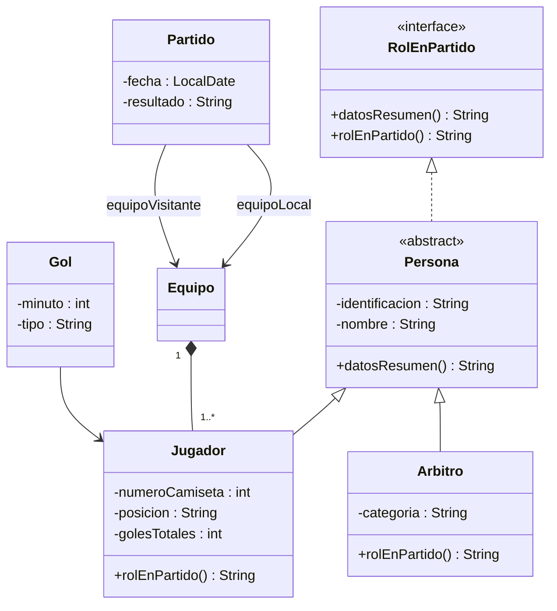

# Laboratorio Evaluativo — Codificación de Diseño OO (Momento 1)

## Objetivo

Leer e interpretar el diagrama UML de su proyecto de aula — entregado ya
resuelto en este documento, en la sección correspondiente a su caso de
estudio — e implementarlo fielmente en Java, aplicando encapsulamiento,
herencia, clases abstractas e interfaces.

---

## Ubique su sección

Cada uno de los cinco proyectos elegibles tiene su diagrama UML ya resuelto
en la sección siguiente. **Ubique la sección de su proyecto asignado y
trabaje únicamente sobre ella** — no necesita leer ni implementar las otras
cuatro.

---

## Diagrama UML por proyecto

### 1. Papelería

Sus cinco clases de la práctica fueron `Producto`, `Venta`, `Proveedor`,
`Pedido` e `ItemVenta`. Las cinco siguen siendo obligatorias. A ellas se
suman dos archivos **nuevos**: `ProductoOficina` y `ProductoEscolar`, los
subtipos concretos que especializan a `Producto`.



**Requisitos de implementación:**
- Todas las clases van en el paquete `model.domain`.
- Los atributos son `private`; el acceso externo es siempre por getters (y
  setters solo donde el diagrama lo requiera).
- `Producto` **ya existe** como el archivo de su práctica de Semana 2. Ahora
  se convierte en clase abstracta, implementa `Vendible`, encapsula sus
  cuatro atributos y resuelve `vender()`. El constructor valida
  `precio > 0` y `cantidadStock >= 0`, lanzando `IllegalArgumentException`
  en caso contrario.
- `Producto.vender(cantidad)` valida que `cantidad` sea positiva y que haya
  stock suficiente antes de descontarlo; si no hay stock suficiente, lanza
  `IllegalStateException`.
- `calcularPrecioFinal()` queda **sin implementar en `Producto`**: cada
  subtipo la resuelve con su propia regla. `ProductoOficina` y
  `ProductoEscolar` son **archivos nuevos** — su proyecto no los tenía en la
  práctica. `ProductoOficina` aplica un recargo fijo del 8 % sobre `precio`
  (mayor margen por manejo de insumos especializados). `ProductoEscolar`
  aplica un descuento del 10 % sobre `precio` cuando `nivelEscolar` sea
  `"primaria"`, y ningún descuento en cualquier otro caso.
- `Venta` e `ItemVenta` **ya existen** de la práctica; ahora solo se
  encapsulan (no entran en la jerarquía de herencia). `ItemVenta` referencia
  un `Producto` por asociación (no composición): el producto existe
  independientemente de la venta.
- `Proveedor` y `Pedido` **ya existen** de la práctica; se encapsulan y se
  relacionan entre sí por asociación (`Proveedor "1" --> "0..*" Pedido`): un
  pedido puede seguir existiendo aunque cambie el proveedor que lo generó.

**Archivos de este proyecto:** `Vendible.java`, `Producto.java`,
`ProductoOficina.java`, `ProductoEscolar.java`, `Venta.java`,
`ItemVenta.java`, `Proveedor.java`, `Pedido.java`.

---

### 2. Consultorio Médico

Sus cinco clases de la práctica fueron `Paciente`, `Medico`, `Cita`,
`Consulta` y `Persona`. Las cinco siguen siendo obligatorias — sin archivos
nuevos en este proyecto, solo evolución de los cinco que ya tiene.



**Requisitos de implementación:**
- Todas las clases van en el paquete `model.domain`.
- Atributos `private`; acceso por getters y setters donde el diagrama lo
  requiera.
- `Persona` **ya existe** como el archivo de su práctica de Semana 2 (la
  quinta entidad que le tocó modelar a algún integrante del equipo). Ahora
  se convierte en clase abstracta, implementa `RolClinico`, y encapsula sus
  tres atributos. El constructor valida que `identificacion` no sea nula ni
  esté vacía, lanzando `IllegalArgumentException` en caso contrario.
- `datosResumen()` queda implementado en `Persona` (igual para todos los
  subtipos): retorna una cadena que combine `identificacion`, `nombre` y
  `telefono`.
- `Paciente` **ya existe** de la práctica. Ahora extiende `Persona` (sus
  atributos `identificacion`, `nombre`, `telefono` pasan a heredarse en vez
  de repetirse) y conserva `edad` y `eps` como atributos propios.
  `rolEnConsulta()` queda **sin implementar en `Persona`**: `Paciente` la
  resuelve incluyendo `eps` y `edad`.
- `Medico` **ya existe** de la práctica. Extiende `Persona` y conserva
  `especialidad` y `numeroRegistro` como atributos propios; resuelve
  `rolEnConsulta()` incluyendo ambos.
- `Consulta` **ya existe** de la práctica; ahora solo se encapsula (no entra
  en la jerarquía). No existe fuera de un `Paciente` (composición).
- `Cita` **ya existe** de la práctica; se encapsula y queda asociada tanto a
  `Paciente` como a `Medico` (no composición: la cita referencia a ambos,
  pero ninguno depende de ella para existir).

**Archivos de este proyecto:** `RolClinico.java`, `Persona.java`,
`Paciente.java`, `Medico.java`, `Consulta.java`, `Cita.java`.

---

### 3. Clínica Veterinaria

Sus cinco clases de la práctica fueron `Animal`, `Dueño`, `Veterinario`,
`Consulta` y `Vacuna`. Las cinco siguen siendo obligatorias. A diferencia de
Consultorio Médico o Sistema Académico, este proyecto **no tenía** una
entidad `Persona` entre sus cinco de la práctica — aquí `Persona` es un
archivo nuevo, igual que la interfaz.

```mermaid
classDiagram
  class RolEnClinica {
    <<interface>>
    +datosResumen() String
    +rolEnClinica() String
  }
  class Persona {
    <<abstract>>
    -identificacion : String
    -nombre : String
    -telefono : String
    +datosResumen() String
  }
  class Dueño {
    -direccion : String
    +rolEnClinica() String
  }
  class Veterinario {
    -especialidad : String
    +rolEnClinica() String
  }
  class Animal {
    -numeroFicha : String
    -nombre : String
    -especie : String
    -raza : String
    -edadAnios : int
  }
  class Consulta {
    -motivo : String
    -diagnostico : String
    -tratamiento : String
    -fecha : LocalDate
  }
  class Vacuna {
    -nombre : String
    -fechaAplicacion : LocalDate
    -proximaFecha : LocalDate
  }
  RolEnClinica <|.. Persona
  Persona <|-- Dueño
  Persona <|-- Veterinario
  Dueño "1" *-- "1..*" Animal
  Consulta --> Animal
  Consulta --> Veterinario
  Vacuna --> Animal
```

**Requisitos de implementación:**
- Todas las clases van en el paquete `model.domain`.
- Atributos `private`; acceso por getters y setters donde el diagrama lo
  requiera.
- `Persona` es un **archivo nuevo** (igual que la interfaz `RolEnClinica`):
  su proyecto no la tenía en la práctica. El constructor valida que
  `identificacion` no sea nula ni esté vacía.
- `datosResumen()` queda implementado en `Persona` (igual para `Dueño` y
  `Veterinario`): retorna una cadena que combine `identificacion`, `nombre`
  y `telefono`.
- `Dueño` **ya existe** de la práctica. Ahora extiende `Persona` y conserva
  `direccion` como atributo propio. `rolEnClinica()` queda **sin implementar
  en `Persona`**: `Dueño` la resuelve mencionando cuántos animales tiene a
  cargo (el tamaño de su lista de `Animal`).
- `Veterinario` **ya existe** de la práctica. Extiende `Persona` y conserva
  `especialidad`; resuelve `rolEnClinica()` incluyéndola.
- `Animal` **ya existe** de la práctica. A diferencia de los otros cuatro
  proyectos, aquí `Animal` **no entra en la jerarquía de herencia ni
  implementa ninguna interfaz**: queda como una clase concreta plana,
  encapsulada, con `numeroFicha`, `nombre`, `especie`, `raza` y
  `edadAnios`. El constructor valida que `numeroFicha` no sea nulo ni esté
  vacío.
- Un `Animal` no existe fuera de un `Dueño` (composición, `"1"` a `"1..*"`):
  esta relación ya estaba en el diseño de la práctica y se mantiene igual.
- `Consulta` y `Vacuna` **ya existen** de la práctica; se encapsulan y
  quedan asociadas a `Animal` (`Consulta` además a `Veterinario`).

**Archivos de este proyecto:** `RolEnClinica.java`, `Persona.java`,
`Dueño.java`, `Veterinario.java`, `Animal.java`, `Consulta.java`,
`Vacuna.java`.

---

### 4. Sistema Académico

Sus cinco clases de la práctica fueron `Estudiante`, `Profesor`, `Materia`,
`Matricula` y `Calificacion`. Las cinco siguen siendo obligatorias. Igual
que en Clínica Veterinaria, `Persona` es un archivo nuevo: su proyecto no la
tenía como una de las cinco entidades repartidas en la práctica.



**Requisitos de implementación:**
- Todas las clases van en el paquete `model.domain`.
- Atributos `private`; acceso por getters y setters donde el diagrama lo
  requiera.
- `Persona` es un **archivo nuevo** (igual que la interfaz `RolAcademico`):
  su proyecto no la tenía en la práctica. El constructor valida que
  `correo` contenga el carácter `@`, lanzando `IllegalArgumentException` en
  caso contrario.
- `datosResumen()` queda implementado en `Persona`: retorna una cadena que
  combine `identificacion`, `nombre` y `correo`.
- `Estudiante` y `Profesor` **ya existen** de la práctica. Ahora extienden
  `Persona` (heredan `identificacion`, `nombre`, `correo` en vez de
  repetirlos) y conservan sus atributos propios (`codigo` +
  `semestreActual` en `Estudiante`; `codigo` + `departamento` en
  `Profesor`). `identificarRol()` queda **sin implementar en `Persona`**:
  cada uno la resuelve incluyendo sus atributos propios.
- `Matricula` y `Calificacion` **ya existen** de la práctica; se encapsulan
  y quedan relacionadas por composición (`Matricula "1" *-- "1..*"
  Calificacion`): una `Calificacion` no existe fuera de una `Matricula`.
- `Materia` **ya existe** de la práctica; se encapsula y queda asociada
  desde `Matricula` (a `Estudiante`) y desde `Calificacion` (a `Materia`).

**Archivos de este proyecto:** `RolAcademico.java`, `Persona.java`,
`Estudiante.java`, `Profesor.java`, `Matricula.java`, `Calificacion.java`,
`Materia.java`.

---

### 5. Liga de Fútbol

Sus cinco clases de la práctica fueron `Jugador`, `Equipo`, `Partido`, `Gol`
y `Arbitro`. Las cinco siguen siendo obligatorias. `Persona` es un archivo
nuevo, igual que en Clínica Veterinaria y Sistema Académico.



**Requisitos de implementación:**
- Todas las clases van en el paquete `model.domain`.
- Atributos `private`; acceso por getters y setters donde el diagrama lo
  requiera.
- `Persona` es un **archivo nuevo** (igual que la interfaz `RolEnPartido`,
  que reemplaza cualquier idea de `EstadisticasJugador` que haya manejado
  antes): el constructor valida que `identificacion` no sea nula ni esté
  vacía.
- `datosResumen()` queda implementado en `Persona`: retorna una cadena que
  combine `identificacion` y `nombre`.
- `Jugador` **ya existe** de la práctica, pero cambia de forma importante:
  ahora extiende `Persona` (deja de tener `identificacion`/`nombre` propios)
  y **deja de ser abstracta** — en este diseño es uno de los dos subtipos
  concretos, no la clase intermedia. Conserva `numeroCamiseta`, `posicion`
  y `golesTotales`. **Elimine el atributo `equipo` de tipo `String` suelto**
  que probablemente tenía en la práctica (el ejemplo guía de la práctica lo
  modeló así): esa relación ahora se resuelve con una composición real hacia
  la clase `Equipo` (ver más abajo), no con un nombre de equipo en texto
  plano. `rolEnPartido()` queda **sin implementar en `Persona`**: `Jugador`
  la resuelve incluyendo `numeroCamiseta`, `posicion` y `golesTotales`.
- `Arbitro` **ya existe** de la práctica, pero antes no participaba de
  ninguna jerarquía: ahora extiende `Persona` y conserva `categoria` como
  atributo propio; resuelve `rolEnPartido()` incluyéndola.
- `Equipo` **ya existe** de la práctica; se encapsula. Un `Jugador` no
  existe fuera de un `Equipo` (composición) — es la relación que reemplaza
  al atributo `equipo:String` que `Jugador` tenía antes.
- `Partido` y `Gol` **ya existen** de la práctica; se encapsulan y quedan
  asociados a `Equipo` (dos veces, como `equipoLocal` y `equipoVisitante`)
  y a `Jugador` respectivamente.

**Archivos de este proyecto:** `RolEnPartido.java`, `Persona.java`,
`Jugador.java`, `Arbitro.java`, `Equipo.java`, `Partido.java`, `Gol.java`.

---

## Desarrollo del Laboratorio

### Parte 1 — Codifique el diagrama de su proyecto

Parta del repositorio de su equipo con los cinco archivos `.java` de la
práctica de Semana 2 ya en `model/domain/`. Evolucione esos cinco archivos
según el diagrama de su proyecto: encapsule los atributos, agregue
`extends`/`implements` donde corresponda, y complete los métodos que el
diagrama le pide. Cree además los archivos nuevos que su sección indique
(la interfaz siempre es nueva; algunos proyectos también agregan una clase
`Persona` o subtipos concretos que no estaban en la práctica). Respete
exactamente los nombres de clase, atributo y método del diagrama — la
rúbrica evalúa la fidelidad de la codificación al UML entregado, no una
variación libre sobre él.

**Requisitos:**
- Todos los atributos son `private`; el acceso externo es siempre por
  métodos.
- Cada subclase invoca `super(...)` en su constructor.
- El método marcado en la interfaz pero no implementado en la clase
  abstracta queda declarado sin cuerpo en la clase abstracta (el compilador
  obliga a cada subtipo concreto a resolverlo con `@Override`).
- Los setters (donde el diagrama los requiera) validan antes de asignar.
- Las clases de su proyecto que no participan de la interfaz ni de la
  herencia (por ejemplo `Venta`/`ItemVenta`/`Proveedor`/`Pedido` en
  Papelería, o `Cita` en Consultorio Médico) también se entregan
  encapsuladas, con constructor validado y getters/setters — no basta con
  dejarlas como estaban en la práctica.

### Parte 2 — Escriba la clase de prueba

Escriba una clase de prueba, con un método `main`, que:
- Cree al menos una instancia de cada uno de los dos subtipos concretos de
  su proyecto.
- Las agregue a la clase de composición correspondiente (por ejemplo,
  agregue sus `Producto` a una `Venta` a través de `ItemVenta`, o sus
  `Animal` a un `Dueño`).
- Ejercite el método polimórfico (el que quedó sin resolver en la clase
  abstracta) sobre cada instancia **sin usar `instanceof`** — recórralas
  como referencias del tipo abstracto o de la interfaz y deje que cada una
  resuelva su propia versión.
- Imprima por consola el resultado de cada llamada, de modo que se vea en
  pantalla que las dos implementaciones se comportan distinto.
- Llame a la clase `PruebaCreacionObjetos` (con un método `main`), ubicada
  fuera de `model/domain/`, junto al `Main.java` de su proyecto.

> **Extensión opcional, no evaluada:** si su equipo ya tiene avanzada la
> coordinación de las capas `service`, `controller` y `view` sobre estas
> clases, puede integrarlas al menú de consola del proyecto. No es requisito
> de este laboratorio ni forma parte de su rúbrica.

---

## Entregable

Estructura de archivos dentro de su repositorio del proyecto de aula (los
nombres exactos de clase dependen de su proyecto — use la lista de
"Archivos de este proyecto" de la sección de su caso de estudio):

```
proyecto-aula/
  src/
    model/
      domain/
        <Interfaz>.java
        <ClaseAbstracta>.java
        <SubtipoConcretoA>.java
        <SubtipoConcretoB>.java
        <...resto de las clases de su proyecto, ya encapsuladas>
    PruebaCreacionObjetos.java
```

**Formato de entrega:** commit sobre la rama main de su proyecto de aula, con
mensaje descriptivo (por ejemplo, `feat: codificacion UML momento 1`). No se
entrega por archivo `.zip` aparte — el entregable **es** el estado del
repositorio en esa rama al momento del plazo.

---

## Criterios de Evaluación

| Criterio | Puntos | Descripción |
|---|---|---|
| **Codificación correcta del UML** | 60 | Las clases, constructores, atributos, métodos, getters y setters, y la relación de herencia coinciden exactamente con el diagrama entregado: las clases ya construidas en la práctica de Semana 2 quedan correctamente extendidas (encapsuladas, con `extends`/`implements` donde corresponda) y las nuevas siguen el mismo patrón; la interfaz declara los métodos del contrato, la clase abstracta implementa solo el método que le corresponde y deja el otro pendiente, y cada subtipo concreto lo resuelve con `@Override` y lógica distinta entre ellos. |
| **Pruebas en el App — creación de objetos** | 20 | `PruebaCreacionObjetos` compila y se ejecuta sin errores, instancia al menos un objeto de cada subtipo concreto, las integra a la clase de composición, y ejercita el método polimórfico sobre cada una sin usar `instanceof`, imprimiendo el resultado por consola. |
| **Buenas prácticas de programación** | 20 | Commits descriptivos y frecuentes (no un único commit al final); uso correcto de ramas (trabajo sobre la rama del proyecto, no directo en `main`); nombres de clases, métodos y variables descriptivos y siguiendo las convenciones de Java (`PascalCase` para clases, `camelCase` para métodos y variables). |
| **TOTAL** | **100** | |

Cada ítem se califica en una escala de **0 a 5**. La nota final del
laboratorio es el promedio ponderado de los tres ítems, escalado al 5 % de
la nota del curso:

```
nota_laboratorio (0-5) = 0.60 × item1 + 0.20 × item2 + 0.20 × item3
nota_final_curso (%)   = (nota_laboratorio / 5) × 5%
```

**Ejemplo:** si obtiene 4.5 en "Codificación correcta del UML", 5 en
"Pruebas en el App" y 4 en "Buenas prácticas":

```
nota_laboratorio = 0.60 × 4.5 + 0.20 × 5 + 0.20 × 4 = 2.7 + 1.0 + 0.8 = 4.5
nota_final_curso = (4.5 / 5) × 5% = 4.5%
```

---

## Dificultades Comunes

### "No sé qué hacer con un método marcado en la interfaz pero no implementado en la clase abstracta"
- Es el comportamiento esperado: la clase abstracta puede dejar métodos de
  la interfaz sin resolver. Simplemente no escriba el método en la clase
  abstracta (o decláralo como `abstract` explícitamente); el compilador
  obliga a cada subclase **concreta** a implementarlo.

### "Mi clase abstracta no compila porque le falta un método"
- Revise si el método faltante es el que el diagrama deja pendiente a
  propósito. Si es así, no lo implemente ahí: impleméntelo en cada
  subclase concreta con `@Override`.

### "No entiendo la multiplicidad de la relación de composición"
- Lea la notación como "del lado del diamante relleno, cuántas instancias
  del otro extremo puede tener". Por ejemplo, `Dueño "1" *-- "1..*" Animal`
  se lee: un `Animal` pertenece exactamente a `1` `Dueño`, y un `Dueño`
  tiene `1` o más `Animal`.

### "¿Puedo cambiar los nombres de las clases o métodos del diagrama?"
- No. La rúbrica evalúa fidelidad al diagrama entregado: use exactamente
  los nombres de clase, atributo y método que aparecen en la sección de su
  proyecto.

### "Mi clase de la práctica tenía un atributo que ya no aparece en el diagrama"
- Revise si ese atributo se reemplazó por una relación de objetos (es el
  caso de `equipo:String` en `Jugador`, del proyecto de Liga de Fútbol,
  reemplazado por la composición con `Equipo`). Si el diagrama de su
  sección no lo menciona, elimínelo: la fidelidad al diagrama entregado
  incluye no dejar atributos de más.

---

## Recursos

- **Lecciones del curso:** "Encapsulamiento", "Herencia", "Polimorfismo",
  "Introducción al UML", "Asociación, agregación y composición", "Diseño
  con TAD y orientación a objetos".
- **Práctica anterior:** "Práctica en clase — Modela una clase de tu
  proyecto de aula" (Semana 2), donde escribió las cinco clases que este
  laboratorio evoluciona.
- **Guía anterior:** "Laboratorio — Jerarquía de Clases de Tres Niveles y
  Polimorfismo", donde practicó la lectura de un diagrama de clases similar.
- **Guía de proyecto:** "Guía — Elección del proyecto de aula", para
  confirmar cuál de los cinco casos de estudio le corresponde.

**Plazo de entrega:** Miercoles 2 de septiembre
