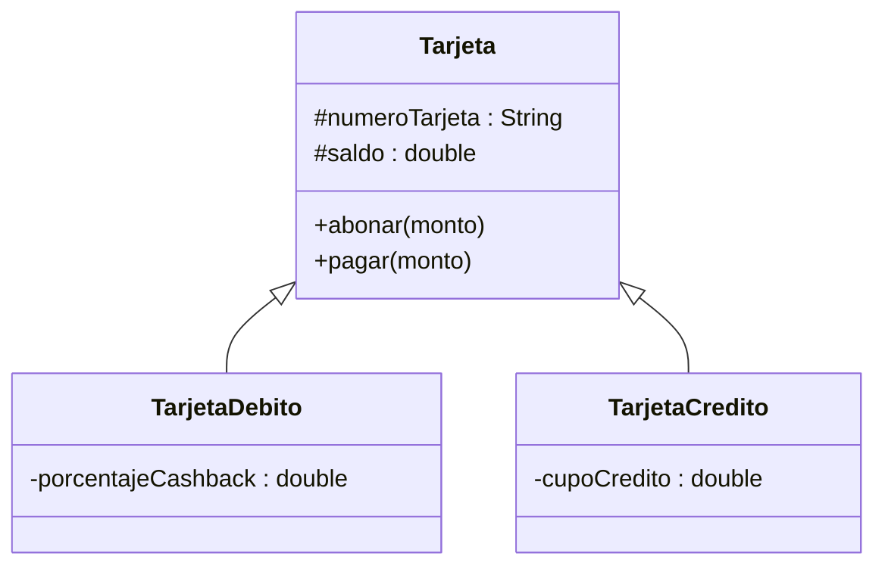

## El problema: dos tarjetas, el mismo código pegado dos veces

El Sistema Bancario necesita dos tipos de tarjeta: `TarjetaDebito`, que
descuenta directamente del saldo disponible del cliente, y `TarjetaCredito`,
que permite gastar más allá del saldo hasta un cupo de crédito. Sin otra
herramienta, la forma directa de escribirlas es dos clases separadas:

```java
public class TarjetaDebito {
    private String numeroTarjeta;
    private double saldo;
    private double porcentajeCashback;

    public void abonar(double monto) {
        if (monto <= 0) {
            throw new IllegalArgumentException("Monto invalido");
        }
        saldo += monto;
    }

    public void pagar(double monto) {
        if (monto > saldo) throw new IllegalArgumentException("Saldo insuficiente");
        saldo -= monto;
    }
}

public class TarjetaCredito {
    private String numeroTarjeta;
    private double saldo;
    private double cupoCredito;

    public void abonar(double monto) {          // <- identico al de arriba
        if (monto <= 0) throw new IllegalArgumentException("Monto invalido");
        saldo += monto;
    }

    public void pagar(double monto) {             // <- casi identico
        if (monto > saldo + cupoCredito) throw new IllegalArgumentException("Cupo insuficiente");
        saldo -= monto;
    }
}
```

`numeroTarjeta`, `saldo` y `abonar()` están copiados y pegados. Si mañana
corriges una validación de `abonar()` — por ejemplo, para rechazar montos
`NaN` — tienes que acordarte de aplicar el mismo cambio en **las dos**
clases. Y con cinco tipos de tarjeta, en cinco.

## La solución: superclase y subclase con `extends`

**En la práctica**, se saca todo lo común a una clase `Tarjeta`, y cada tipo
concreto la extiende:

```java
public class Tarjeta {
    protected String numeroTarjeta;
    protected double saldo;

    public void abonar(double monto) {
        if (monto <= 0) throw new IllegalArgumentException("Monto invalido");
        saldo += monto;
    }

    public void pagar(double monto) {
        if (monto > saldo) throw new IllegalArgumentException("Saldo insuficiente");
        saldo -= monto;
    }
}

public class TarjetaDebito extends Tarjeta {
    private double porcentajeCashback;
}

public class TarjetaCredito extends Tarjeta {
    private double cupoCredito;
}
```



`TarjetaDebito` y `TarjetaCredito` ya tienen `numeroTarjeta`, `saldo`,
`abonar()` y `pagar()` sin haberlos escrito: los heredaron de `Tarjeta`.
Cada una solo declara lo que la hace distinta.

> **Herencia:** mecanismo por el cual una clase (**subclase**) adquiere los
> atributos y métodos de otra clase (**superclase**), y puede agregar los
> suyos propios o redefinir los heredados. En Java se declara con la
> palabra clave `extends`.

## Qué hereda una subclase

**Situación:** en `Tarjeta` declaraste `numeroTarjeta` y `saldo` como
`protected`, no `private`. ¿Por qué no seguir la regla de Encapsulamiento de
usar siempre `private`?

**En la práctica**, un atributo `private` es invisible incluso para las
subclases — ni `TarjetaDebito` ni `TarjetaCredito` podrían leerlo
directamente, aunque hereden de `Tarjeta`. `protected` abre exactamente esa
puerta: visible dentro del mismo paquete y, además, dentro de cualquier
subclase, sin importar el paquete.

| Miembro de `Tarjeta`                   | ¿Lo hereda `TarjetaDebito`?             |
| -------------------------------------- | --------------------------------------- |
| `protected` (`numeroTarjeta`, `saldo`) | Sí, accesible directamente              |
| `public` (`abonar()`, `pagar()`)       | Sí, accesible directamente              |
| `private` (si `Tarjeta` tuviera uno)   | No — invisible incluso para la subclase |

La regla práctica: si un atributo solo lo usa la propia clase, sigue siendo
`private`; si una subclase necesita tocarlo directamente, se declara
`protected`. Esto es lo que te permite escribir el cuerpo de
`TarjetaDebito` sin repetir `numeroTarjeta` ni `saldo` — ya están ahí,
heredados.

## El constructor de la subclase y `super()`

**Situación:** `TarjetaDebito` necesita inicializar `numeroTarjeta` y
`saldo` (heredados) además de `porcentajeCashback` (propio). Pero
`numeroTarjeta` y `saldo` son `protected` de `Tarjeta` — la forma correcta
de inicializarlos no es asignarlos a mano, es dejar que el constructor de
`Tarjeta` haga su trabajo:

```java
public class Tarjeta {
    protected String numeroTarjeta;
    protected double saldo;

    public Tarjeta(String numeroTarjeta, double saldo) {
        this.numeroTarjeta = numeroTarjeta;
        this.saldo = saldo;
    }
}

public class TarjetaDebito extends Tarjeta {
    private double porcentajeCashback;

    public TarjetaDebito(String numeroTarjeta, double saldo, double porcentajeCashback) {
        super(numeroTarjeta, saldo);   // 1. construye la parte de Tarjeta
        this.porcentajeCashback = porcentajeCashback;   // 2. construye lo propio
    }
}
```

`super(...)` invoca el constructor de la superclase y **debe ser la primera
línea** del constructor de la subclase. Java lo exige así porque un objeto
`TarjetaDebito` es, primero que nada, un `Tarjeta` — su parte heredada tiene
que quedar construida antes de que empiece a construirse la parte propia. Si
omites `super(...)` y `Tarjeta` no tiene un constructor sin argumentos, el
código ni siquiera compila.

## Sobreescritura de métodos: `@Override`

**Situación:** `TarjetaDebito` y `TarjetaCredito` heredaron `pagar()` de
`Tarjeta`, pero no deberían comportarse igual: `TarjetaCredito` permite
gastar más allá del saldo hasta `cupoCredito`, algo que `Tarjeta` no
contempla.

**En la práctica**, la subclase redefine el método con la misma firma —
mismo nombre, mismos parámetros, mismo tipo de retorno — y Java ejecuta esa
versión en vez de la heredada:

```java
public class TarjetaCredito extends Tarjeta {
    private double cupoCredito;

    @Override
    public void pagar(double monto) {
        if (monto > saldo + cupoCredito) {
            throw new IllegalArgumentException("Cupo insuficiente");
        }
        saldo -= monto;
    }
}
```

`@Override` no es obligatorio para que la sobreescritura funcione, pero
escribirlo siempre es buena práctica: si te equivocas en la firma —un
parámetro de más, un tipo distinto— el compilador te avisa de inmediato en
vez de dejarte con un método nuevo que nunca se ejecuta porque no
sobreescribió nada.

> **Sobreescritura (`@Override`):** una subclase redefine un método
> heredado, conservando exactamente su firma. Al invocar ese método sobre un
> objeto de la subclase, se ejecuta la versión redefinida, no la de la
> superclase.

## `super.metodo()`: extender en vez de reemplazar

**Situación:** el cierre de mes de `TarjetaDebito` necesita acreditar
cashback **y** seguir validando el monto igual que `Tarjeta` ya lo hace en
`abonar()`. Reescribir la validación completa dentro de `TarjetaDebito`
duplicaría exactamente el código que la herencia evitó en primer lugar.

**En la práctica**, `super.metodo()` invoca la versión de la superclase
**desde dentro** de la versión sobreescrita, antes o después de agregar el
comportamiento propio:

```java
public class TarjetaDebito extends Tarjeta {
    private double porcentajeCashback;

    @Override
    public void abonar(double monto) {
        super.abonar(monto);                  // reutiliza la validacion de Tarjeta
        System.out.println("Abono a tarjeta de debito registrado");
    }

    public void aplicarCashbackMensual() {
        double cashback = saldo * porcentajeCashback;
        super.abonar(cashback);               // el cashback entra como un abono valido
    }
}
```

`super.metodo()` no reemplaza la sobreescritura, la complementa: la
validación de `Tarjeta` corre una sola vez, en un solo lugar, y
`TarjetaDebito` solo agrega lo que le es propio encima de ella.

## Síntesis

- El problema de partida era código duplicado entre `TarjetaDebito` y
  `TarjetaCredito`: los mismos atributos y el mismo `abonar()` escritos dos
  veces, con el riesgo de que un fix quede corregido en una sola clase.
- La **herencia** (`extends`) saca lo común a una superclase (`Tarjeta`) y
  cada subclase agrega solo lo que la distingue.
- Una subclase hereda los miembros `protected` y `public` de su superclase;
  los `private` quedan fuera de su alcance, igual que para cualquier otra
  clase externa.
- El constructor de la subclase debe invocar `super(...)` como su primera
  línea, para que la parte heredada del objeto quede construida antes que
  la propia.
- `@Override` redefine un método heredado con la misma firma — es cómo
  `TarjetaCredito` permite gastar más allá del saldo donde `Tarjeta` no lo
  hace.
- `super.metodo()` reutiliza la versión de la superclase desde dentro de la
  redefinida, en vez de duplicar su lógica — así `TarjetaDebito` valida
  como `Tarjeta` y además agrega su propio comportamiento.
