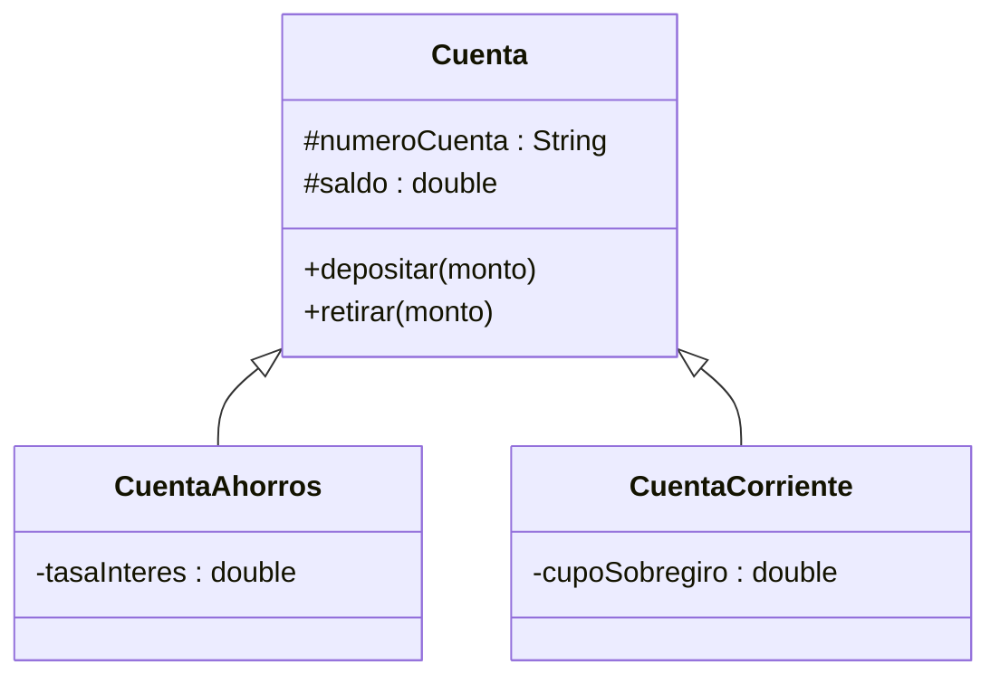
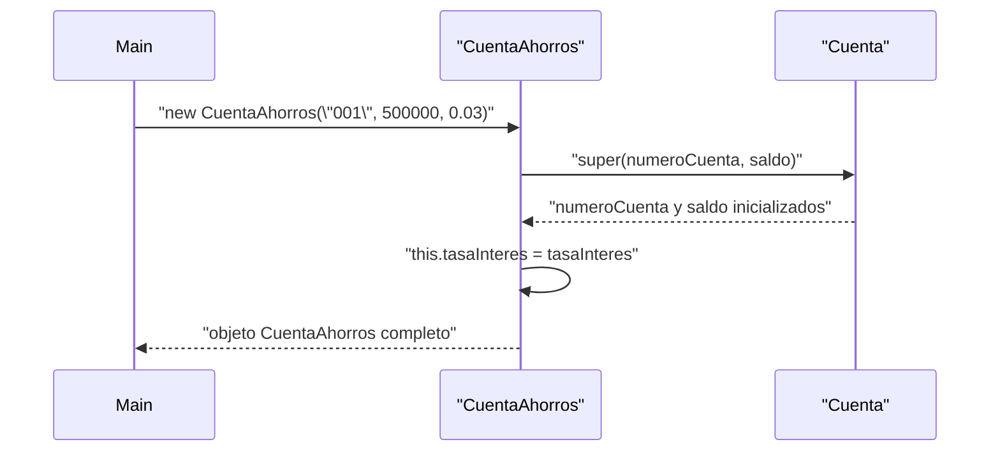
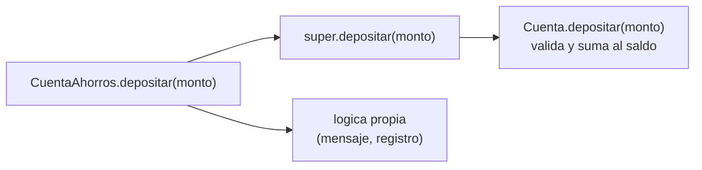

## El problema: dos cuentas, el mismo código pegado dos veces

El Sistema Bancario necesita dos tipos de cuenta: `CuentaAhorros`, que gana
intereses, y `CuentaCorriente`, que permite sobregirarse hasta un cupo. Sin
otra herramienta, la forma directa de escribirlas es dos clases separadas:

```java
public class CuentaAhorros {
    private String numeroCuenta;
    private double saldo;
    private double tasaInteres;

    public void depositar(double monto) {
        if (monto <= 0) throw new IllegalArgumentException("Monto invalido");
        saldo += monto;
    }

    public void retirar(double monto) {
        if (monto > saldo) throw new IllegalArgumentException("Saldo insuficiente");
        saldo -= monto;
    }
}

public class CuentaCorriente {
    private String numeroCuenta;
    private double saldo;
    private double cupoSobregiro;

    public void depositar(double monto) {          // <- identico al de arriba
        if (monto <= 0) throw new IllegalArgumentException("Monto invalido");
        saldo += monto;
    }

    public void retirar(double monto) {             // <- casi identico
        if (monto > saldo + cupoSobregiro) throw new IllegalArgumentException("Saldo insuficiente");
        saldo -= monto;
    }
}
```

`numeroCuenta`, `saldo` y `depositar()` están copiados y pegados. Si mañana
corriges una validación de `depositar()` — por ejemplo, para rechazar montos
`NaN` — tienes que acordarte de aplicar el mismo cambio en **las dos**
clases. Y con cinco tipos de cuenta, en cinco.

## Más problemas que resuelve la herencia

El copiar y pegar no solo duplica trabajo hoy; genera dos fallas que
aparecen después, cuando el proyecto ya creció:

**1. Un fix a medias**
Corriges la validación de `retirar()` en `CuentaAhorros` porque encontraste
un bug con montos negativos. Se te olvida — es fácil olvidarlo, son archivos
distintos — replicarlo en `CuentaCorriente`. El sistema queda con el mismo
bug corregido en un lado y vivo en el otro, sin que ningún error de
compilación te avise.

**2. Ningún lugar único para "qué es una cuenta"**
Si el equipo agrega un tercer tipo de cuenta (`CuentaNomina`, por ejemplo),
¿de dónde la copian? De `CuentaAhorros` o de `CuentaCorriente`, con el riesgo
de arrastrar algo que solo aplicaba a esa clase. No existe un lugar que
diga, una sola vez, "esto es lo que toda cuenta del banco tiene en común".

Ambos problemas son el mismo problema visto desde dos ángulos: el código
común entre `CuentaAhorros` y `CuentaCorriente` no tiene un dueño único.
Eso es exactamente lo que la **herencia** resuelve.

## La solución: superclase y subclase con `extends`

**En la práctica**, se saca todo lo común a una clase `Cuenta`, y cada tipo
concreto la extiende:

```java
public class Cuenta {
    protected String numeroCuenta;
    protected double saldo;

    public void depositar(double monto) {
        if (monto <= 0) throw new IllegalArgumentException("Monto invalido");
        saldo += monto;
    }

    public void retirar(double monto) {
        if (monto > saldo) throw new IllegalArgumentException("Saldo insuficiente");
        saldo -= monto;
    }
}

public class CuentaAhorros extends Cuenta {
    private double tasaInteres;
}

public class CuentaCorriente extends Cuenta {
    private double cupoSobregiro;
}
```



`CuentaAhorros` y `CuentaCorriente` ya tienen `numeroCuenta`, `saldo`,
`depositar()` y `retirar()` sin haberlos escrito: los heredaron de `Cuenta`.
Cada una solo declara lo que la hace distinta.

> **Herencia:** mecanismo por el cual una clase (**subclase**) adquiere los
> atributos y métodos de otra clase (**superclase**), y puede agregar los
> suyos propios o redefinir los heredados. En Java se declara con la
> palabra clave `extends`.

## Qué hereda una subclase

**Situación:** en `Cuenta` declaraste `numeroCuenta` y `saldo` como
`protected`, no `private`. ¿Por qué no seguir la regla de Encapsulamiento de
usar siempre `private`?

**En la práctica**, un atributo `private` es invisible incluso para las
subclases — ni `CuentaAhorros` ni `CuentaCorriente` podrían leerlo
directamente, aunque hereden de `Cuenta`. `protected` abre exactamente esa
puerta: visible dentro del mismo paquete y, además, dentro de cualquier
subclase, sin importar el paquete.

| Miembro de `Cuenta`                | ¿Lo hereda `CuentaAhorros`?          |
| ----------------------------------- | ------------------------------------- |
| `protected` (`numeroCuenta`, `saldo`) | Sí, accesible directamente            |
| `public` (`depositar()`, `retirar()`) | Sí, accesible directamente            |
| `private` (si `Cuenta` tuviera uno)  | No — invisible incluso para la subclase |

La regla práctica: si un atributo solo lo usa la propia clase, sigue siendo
`private`; si una subclase necesita tocarlo directamente, se declara
`protected`. Esto es lo que te permite escribir el cuerpo de
`CuentaAhorros` sin repetir `numeroCuenta` ni `saldo` — ya están ahí,
heredados.

## El constructor de la subclase y `super()`

**Situación:** `CuentaAhorros` necesita inicializar `numeroCuenta` y
`saldo` (heredados) además de `tasaInteres` (propio). Pero `numeroCuenta` y
`saldo` son `protected` de `Cuenta` — la forma correcta de inicializarlos no
es asignarlos a mano, es dejar que el constructor de `Cuenta` haga su
trabajo:

```java
public class Cuenta {
    protected String numeroCuenta;
    protected double saldo;

    public Cuenta(String numeroCuenta, double saldo) {
        this.numeroCuenta = numeroCuenta;
        this.saldo = saldo;
    }
}

public class CuentaAhorros extends Cuenta {
    private double tasaInteres;

    public CuentaAhorros(String numeroCuenta, double saldo, double tasaInteres) {
        super(numeroCuenta, saldo);   // 1. construye la parte de Cuenta
        this.tasaInteres = tasaInteres;   // 2. construye lo propio
    }
}
```



`super(...)` invoca el constructor de la superclase y **debe ser la primera
línea** del constructor de la subclase. Java lo exige así porque un objeto
`CuentaAhorros` es, primero que nada, un `Cuenta` — su parte heredada tiene
que quedar construida antes de que empiece a construirse la parte propia. Si
omites `super(...)` y `Cuenta` no tiene un constructor sin argumentos, el
código ni siquiera compila.

## Sobreescritura de métodos: `@Override`

**Situación:** `CuentaAhorros` y `CuentaCorriente` heredaron `retirar()` de
`Cuenta`, pero no deberían comportarse igual: `CuentaCorriente` permite
sobregirarse hasta `cupoSobregiro`, algo que `Cuenta` no contempla.

**En la práctica**, la subclase redefine el método con la misma firma —
mismo nombre, mismos parámetros, mismo tipo de retorno — y Java ejecuta esa
versión en vez de la heredada:

```java
public class CuentaCorriente extends Cuenta {
    private double cupoSobregiro;

    @Override
    public void retirar(double monto) {
        if (monto > saldo + cupoSobregiro) {
            throw new IllegalArgumentException("Saldo insuficiente");
        }
        saldo -= monto;
    }
}
```

`@Override` no es obligatorio para que la sobreescritura funcione, pero
escribirlo siempre es buena práctica: si te equivocas en la firma —un
parámetro de más, un tipo distinto— el compilador te avisa de inmediato en
vez de dejarte con un método nuevo que nunca se ejecuta porque no
sobreescribió nada.

> **Sobreescritura (`@Override`):** una subclase redefine un método
> heredado, conservando exactamente su firma. Al invocar ese método sobre un
> objeto de la subclase, se ejecuta la versión redefinida, no la de la
> superclase.

## `super.metodo()`: extender en vez de reemplazar

**Situación:** el cierre de mes de `CuentaAhorros` necesita calcular el
interés **y** seguir validando el monto igual que `Cuenta` ya lo hace en
`depositar()`. Reescribir la validación completa dentro de `CuentaAhorros`
duplicaría exactamente el código que la herencia evitó en primer lugar.

**En la práctica**, `super.metodo()` invoca la versión de la superclase
**desde dentro** de la versión sobreescrita, antes o después de agregar el
comportamiento propio:

```java
public class CuentaAhorros extends Cuenta {
    private double tasaInteres;

    @Override
    public void depositar(double monto) {
        super.depositar(monto);              // reutiliza la validacion de Cuenta
        System.out.println("Deposito en cuenta de ahorros registrado");
    }

    public void aplicarInteresMensual() {
        double interes = saldo * tasaInteres;
        super.depositar(interes);             // el interes entra como un deposito valido
    }
}
```



`super.metodo()` no reemplaza la sobreescritura, la complementa: la
validación de `Cuenta` corre una sola vez, en un solo lugar, y
`CuentaAhorros` solo agrega lo que le es propio encima de ella.

## Resumen operativo

| Herramienta       | Qué hace                                                        | Dónde se escribe                              |
| ------------------ | ----------------------------------------------------------------- | ---------------------------------------------- |
| `extends`          | Declara que una clase hereda de otra                              | `class CuentaAhorros extends Cuenta`           |
| `protected`         | Hace visible un miembro para el paquete y para las subclases      | Atributos de `Cuenta` que las subclases usan   |
| `super(...)`        | Invoca el constructor de la superclase                            | Primera línea del constructor de la subclase   |
| `@Override`         | Marca que un método redefine uno heredado con la misma firma      | Encima del método sobreescrito                 |
| `super.metodo()`    | Invoca la versión de la superclase desde dentro de la redefinida  | Dentro del cuerpo del método sobreescrito      |

## Síntesis

- El problema de partida era código duplicado entre `CuentaAhorros` y
  `CuentaCorriente`: los mismos atributos y el mismo `depositar()` escritos
  dos veces, con el riesgo de que un fix quede corregido en una sola clase.
- La **herencia** (`extends`) saca lo común a una superclase (`Cuenta`) y
  cada subclase agrega solo lo que la distingue.
- Una subclase hereda los miembros `protected` y `public` de su superclase;
  los `private` quedan fuera de su alcance, igual que para cualquier otra
  clase externa.
- El constructor de la subclase debe invocar `super(...)` como su primera
  línea, para que la parte heredada del objeto quede construida antes que
  la propia.
- `@Override` redefine un método heredado con la misma firma — es cómo
  `CuentaCorriente` permite sobregirarse donde `Cuenta` no lo hace.
- `super.metodo()` reutiliza la versión de la superclase desde dentro de la
  redefinida, en vez de duplicar su lógica — así `CuentaAhorros` valida
  como `Cuenta` y además agrega su propio comportamiento.
