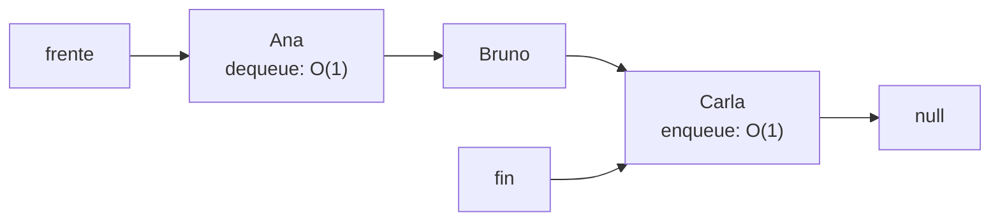
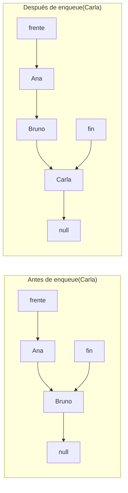
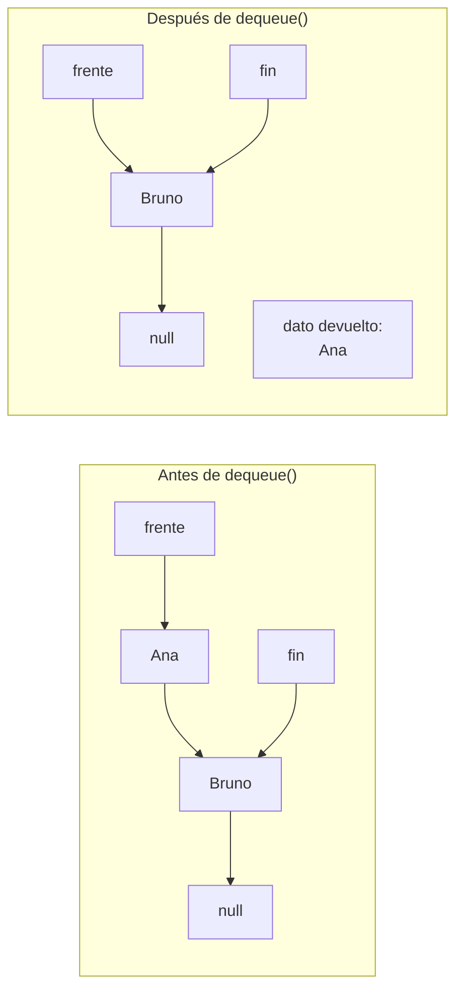
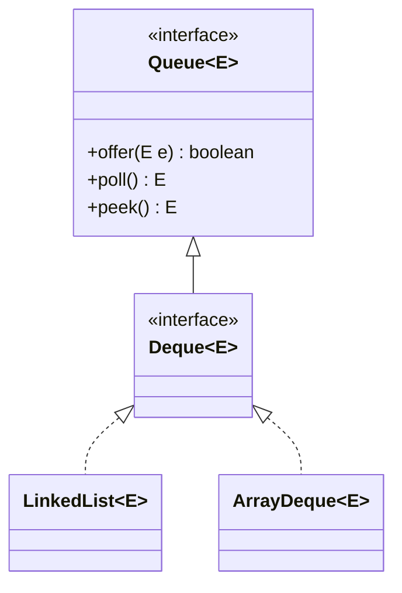
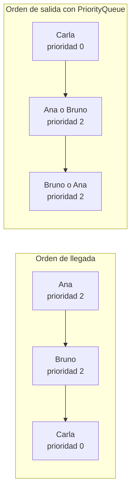

## El problema: un contrato que nadie puede instanciar

En la lección "TAD Cola" dejaste escrito el contrato: la `interface` `Cola<T>` y un `ServicioVentanilla` con su fila de turnos. Ahora intenta ejecutarlo:

```java
public class ServicioVentanilla {
    private final Cola<Cliente> turnos = new Cola<>();   // error de compilación
}
```

No compila: una `interface` no se puede instanciar con `new`. El contrato dice _qué_ debe hacer una cola; alguien tiene que escribir _cómo_. Y otra vez la tentación es reutilizar la `ListaSimple<Cliente>`, que solo guarda `head`.

Con esa lista, `enqueue` sería `insertarFinal`, y en "Operaciones sobre la lista simple" viste lo que cuesta: recorrer los `n` nodos hasta el último, **O(n)** por cada cliente que llega. El contrato de la cola espera **O(1)**, según la lección "Notación Big O y análisis de complejidad". En la pila tuviste suerte: entrar y salir ocurrían por el mismo extremo, y ese extremo era la cabeza. En la cola son dos extremos distintos, y la lista solo regala uno.

## ¿Por dónde entra y por dónde sale? La asimetría decide, otra vez

**Situación:** una cola tiene `frente` (por donde sale el cliente) y `fin` (por donde entra). Hay que decidir cuál extremo de la cadena de nodos hace cada papel, y qué referencias guarda la clase.

Hay dos opciones. Con la lista guardando además una referencia al último nodo (`fin`), llegar al último deja de costar `n`. Pero eso no basta si el sentido está mal elegido:

| Opción | `enqueue` | `dequeue` | Costo |
| --- | --- | --- | --- |
| Entra por la cabeza, sale por `fin` | Nuevo nodo antes de la cabeza | Hay que quitar el último nodo: necesitas el **anterior** al último | `dequeue` es **O(n)**, aunque exista `fin` |
| Entra por `fin`, sale por el `frente` (la cabeza) | Enlazar tras `fin` y mover `fin` | Mover `frente` al siguiente nodo | Ambas **O(1)** en el peor caso |

En una lista simple cada nodo conoce a su siguiente, no a su anterior. Quitar el último nodo exige recorrer la cadena para encontrar el penúltimo. Quitar el primero solo exige leer `frente.siguiente`. Por eso la cola entra por `fin` y sale por `frente`:



Con dos referencias, cada extremo se alcanza sin recorrer nada. Ese es el costo que el contrato espera de cada operación.

## `ColaEnlazada<T>`: la clase y su estado

**Situación:** ya sabes por dónde entra y sale cada elemento. Falta decidir qué guarda la clase para trabajar en O(1).

**En la práctica**, la clase guarda tres datos: los dos extremos y un contador que evita recorrer la cadena cada vez que alguien pregunta `size()`:

```java
package model.structures;

public class ColaEnlazada<T> implements Cola<T> {

    private Nodo<T> frente;   // primer nodo: el que sale; null si la cola está vacía
    private Nodo<T> fin;      // último nodo: donde entra el siguiente; null si está vacía
    private int tamano;       // cantidad de nodos en la cola

    public ColaEnlazada() {
        this.frente = null;
        this.fin = null;
        this.tamano = 0;
    }

    @Override
    public boolean isEmpty() {
        return frente == null;   // O(1): no hay que contar nada
    }

    @Override
    public int size() {
        return tamano;           // O(1): el contador se mantiene en enqueue y dequeue
    }
}
```

La cola **no envuelve una `ListaSimple<T>`**, por la misma razón que la pila: la lista solo conoce `head`, y aquí necesitas manejar `fin` y leer el dato del frente al mismo tiempo que lo retiras. Guardar los dos nodos directamente cuesta dos líneas y evita rodeos.

> **`ColaEnlazada<T>`:** implementación de `Cola<T>` que guarda los elementos en una cadena de `Nodo<T>`, con `frente` en el primer nodo y `fin` en el último. Un contador `tamano` hace que `size()` no dependa de la cantidad de elementos.

## `enqueue`: dos casos

**Situación:** llega un cliente a la ventanilla y debe quedar al final de la fila, sin alterar a quienes ya esperan.

**En la práctica**, hay dos casos. Si la cola está vacía, el nodo nuevo es a la vez el primero y el último. Si ya hay elementos, se enlaza detrás de `fin` y `fin` avanza:

```java
@Override
public void enqueue(T elemento) {
    Nodo<T> nuevo = new Nodo<>(elemento);
    if (isEmpty()) {
        frente = nuevo;              // vacía: el nuevo es frente y fin a la vez
    } else {
        fin.setSiguiente(nuevo);     // el último actual apunta al nuevo
    }
    fin = nuevo;                     // en ambos casos, fin es el nuevo nodo
    tamano++;
}
```



Nota que `frente` no se mueve salvo cuando la cola estaba vacía. Un nodo nuevo, una o dos asignaciones y un incremento, sin importar cuántos clientes esperen: **O(1)** en el peor caso.

## `dequeue` y `front`: la precondición hecha código

**Situación:** en "TAD Cola" el contrato dice que `dequeue` y `front` exigen una cola no vacía y lanzan `NoSuchElementException` si se viola. Aquí esa frase se vuelve una línea de código.

**En la práctica**, `dequeue` verifica, guarda el dato **antes** de mover `frente`, y solo después avanza:

```java
import java.util.NoSuchElementException;

@Override
public T dequeue() {
    if (isEmpty()) {
        throw new NoSuchElementException("La cola está vacía");   // precondición violada
    }
    T dato = frente.getDato();       // 1. guarda el dato mientras el nodo aún es alcanzable
    frente = frente.getSiguiente();  // 2. el frente avanza al nodo siguiente
    if (frente == null) {
        fin = null;                  // 3. se retiró el último: la cola quedó vacía
    }
    tamano--;
    return dato;
}

@Override
public T front() {
    if (isEmpty()) {
        throw new NoSuchElementException("La cola está vacía");
    }
    return frente.getDato();         // mira el frente sin modificar nada
}
```

El paso 3 es la trampa que la pila no tenía. Si retiras el único nodo, `frente` queda en `null`, pero `fin` seguiría apuntando al nodo retirado. El siguiente `enqueue` vería `isEmpty()` verdadero y reasignaría ambos, así que quizá no notarías el error de inmediato. Aun así, `fin` guardaría una referencia muerta que mantiene vivo un nodo que nadie debería alcanzar. Ponerlo en `null` deja la cola en un estado consistente: vacía significa `frente` y `fin` en `null`.



`front` repite la misma precondición pero no toca `frente`, `fin` ni `tamano`. El nodo retirado ya no tiene referencias: el recolector de basura lo libera solo. Así se ve la jornada de la ventanilla, con un `dequeue` de más:

```java
Cola<Cliente> turnos = new ColaEnlazada<>();
turnos.enqueue(new Cliente("Ana"));
turnos.enqueue(new Cliente("Bruno"));
turnos.enqueue(new Cliente("Carla"));   // size() == 3

turnos.front();     // Ana; la cola sigue con 3 elementos
turnos.dequeue();   // Ana;   size() == 2
turnos.dequeue();   // Bruno; size() == 1
turnos.dequeue();   // Carla; size() == 0, isEmpty() == true, fin == null
turnos.dequeue();   // lanza NoSuchElementException: nadie esperaba
```

La excepción del cuarto `dequeue` no es un fallo de la clase: es el contrato cumpliéndose. Quien llama decide si consulta `isEmpty()` antes o si atrapa la excepción.

## `Queue<E>` y `LinkedList<E>`: la cola que Java ya trae

**Situación:** antes de escribir tu propia cola en un proyecto real, conviene saber qué ofrece el API. `java.util.Queue<E>` es la `interface` de cola de Java, y `java.util.LinkedList<E>` es su implementación más conocida. Por dentro, `LinkedList` enlaza sus nodos en ambos sentidos.

**En la práctica**, la fila de la ventanilla se ve así:

```java
import java.util.LinkedList;
import java.util.Queue;

Queue<Cliente> turnos = new LinkedList<>();
turnos.offer(new Cliente("Ana"));
turnos.offer(new Cliente("Bruno"));
turnos.offer(new Cliente("Carla"));

Cliente siguiente = turnos.peek();   // Ana, sin retirarla
Cliente atendido = turnos.poll();    // Ana
```

`Queue` ofrece cada operación en **dos familias**: una lanza excepción cuando algo falla y otra devuelve un valor especial.

| Operación del TAD | Familia que lanza excepción | Familia que devuelve valor especial |
| --- | --- | --- |
| Encolar | `add(e)` | `offer(e)`, devuelve `true` |
| Retirar el frente | `remove()` lanza `NoSuchElementException` | `poll()` devuelve `null` si está vacía |
| Consultar el frente | `element()` lanza `NoSuchElementException` | `peek()` devuelve `null` si está vacía |

Una diferencia con la pila: `Stack` era una **clase**, y `Queue` es una **interface**. Al declarar `Queue<Cliente> turnos`, tu código solo depende del contrato, y puedes cambiar la implementación sin tocar el resto.



`Deque` es una `interface` que extiende `Queue`, y tanto `LinkedList` como `ArrayDeque` la implementan. Por eso ambas se pueden usar declaradas como `Queue<E>`.

## Lo que `LinkedList<E>` arrastra y la opción moderna

**Situación:** igual que `Stack` con `Vector`, `LinkedList` no nació como una cola pura. También implementa `List`, y esa herencia le cuesta el contrato.

Si declaras `LinkedList<Cliente> turnos` en lugar de `Queue<Cliente>`, cualquiera puede escribir `turnos.get(2)`, `turnos.add(1, x)` o `turnos.remove(0)` y tocar el medio de la fila: justo lo que FIFO prohíbe. Además admite `null` como elemento, lo que confunde con el valor que `poll()` y `peek()` devuelven para señalar "vacía". Y usa un objeto nodo por cada elemento, el mismo argumento de memoria que viste con la pila enlazada.

<Callout tipo="advertencia">
El Javadoc de `ArrayDeque` dice: "This class is likely to be faster than `Stack` when used as a stack, and faster than `LinkedList` when used as a queue." Por eso, en código real, la opción moderna para una cola es `ArrayDeque`.
</Callout>

**En la práctica**, se declara igual que antes, cambiando solo lo que va después del `new`:

```java
import java.util.ArrayDeque;
import java.util.Queue;

Queue<Cliente> turnos = new ArrayDeque<>();
turnos.offer(new Cliente("Ana"));
turnos.offer(new Cliente("Bruno"));
Cliente atendido = turnos.poll();   // Ana
```

`ArrayDeque` no admite `null` como elemento (lanza `NullPointerException`), no está sincronizada y usa un arreglo circular por dentro. Declarada como `Queue<E>`, solo ves el contrato de cola.

## Un mismo TAD, tres vocabularios

**Situación:** ya viste tres nombres para la misma idea de "encolar" y "atender". La tabla los alinea:

| TAD Cola | `Cola<T>` / `ColaEnlazada<T>` | `Queue<E>` (lanza excepción) | `Queue<E>` (devuelve `null` o `false`) |
| --- | --- | --- | --- |
| Encolar | `enqueue(x)` | `add(x)` | `offer(x)` |
| Retirar el frente | `dequeue()` | `remove()` | `poll()` |
| Consultar el frente | `front()` | `element()` | `peek()` |
| ¿Vacía? | `isEmpty()` | `isEmpty()` | `isEmpty()` |
| Cantidad | `size()` | `size()` | `size()` |

Contrasta con la pila: allí `Stack` preguntaba por la vacía con `empty()`, y en el contrato era `isEmpty()`. En `Queue`, `isEmpty()` y `size()` **sí coinciden** con el TAD.

`ColaEnlazada<T>` no implementa `Queue<E>`: hacerlo exigiría los muchos métodos de `Collection` (`contains`, `iterator`, `remove(Object)`, entre otros) que el TAD no pide y que romperían la disciplina FIFO.

Fíjate también en por qué el contrato del TAD no usa `null` como señal de "vacía". Si `dequeue()` devolviera `null`, no sabrías distinguir entre "la cola está vacía" y "el elemento retirado era `null`". La excepción no deja lugar a esa duda.

## Implementación propia vs. API: comparación y criterios de uso

Ya tienes tres formas de tener una cola de `Cliente`. Esta tabla es el mapa para elegir entre ellas:

| Criterio | `ColaEnlazada<T>` | `LinkedList<E>` | `ArrayDeque<E>` |
| --- | --- | --- | --- |
| Estructura interna | Cadena de nodos enlazados en un sentido | Cadena de nodos enlazados en ambos sentidos | Arreglo circular |
| Costo de encolar / retirar / consultar | **O(1)** peor caso | **O(1)** peor caso | **O(1)** amortizado |
| Cola vacía al retirar o consultar | `NoSuchElementException` | `remove`/`element` lanzan; `poll`/`peek` devuelven `null` | `remove`/`element` lanzan; `poll`/`peek` devuelven `null` |
| Contrato y encapsulamiento | Solo expone la interface `Cola<T>` | Expone todo `List` (`get(i)`, `add(i, x)`) | Expone todo `Deque` (métodos de ambos extremos) |
| Sincronización | No | No | No |
| Memoria | Un nodo por elemento | Un nodo por elemento, con dos referencias | Arreglo contiguo, con espacio sobrante |
| `null` como elemento | Permitido | Permitido | Lanza `NullPointerException` |
| Cuándo elegirla | La estructura es objeto de estudio o el contrato debe blindar el acceso | Solo para leer código heredado | Cola de propósito general en código real |

Como en la pila, `ArrayDeque` es O(1) **amortizado**: de vez en cuando el arreglo se llena y se copia a uno mayor, con costo O(n). Con nodos, cada operación cuesta lo mismo, pero pagas un objeto por elemento.

El criterio en tres líneas:

- Usa **`ColaEnlazada<T>`** cuando la estructura misma es el objeto de estudio o cuando necesitas un contrato que **impida** tocar otra cosa que no sea el frente y el fin.
- Usa **`ArrayDeque`** (declarado como `Queue`) en código real, donde importa la eficiencia y no necesitas reinventar la rueda.
- Usa **`LinkedList`** solo cuando te toque leer o mantener código heredado.

## Cuando ni FIFO ni LIFO alcanzan: `PriorityQueue<E>`

**Situación:** en la ventanilla llega una persona con atención preferencial. Con una cola, esperaría detrás de todos los que llegaron antes. Necesitas otra regla: atender primero al de mayor prioridad, sin importar cuándo llegó.

**En la práctica**, `PriorityQueue<E>` se usa como una `Queue<E>`, con `offer`, `poll` y `peek`. Lo que cambia es el orden de salida. Para ilustrarlo, imagina que cada cliente tiene un `int prioridad` (0 es la más urgente). _Ese atributo es solo un ejemplo: no forma parte de la clase `Cliente` real._

```java
import java.util.PriorityQueue;
import java.util.Queue;

// Regla de orden: menor prioridad numérica sale primero
Queue<Cliente> turnos = new PriorityQueue<>((a, b) -> Integer.compare(a.prioridad, b.prioridad));
turnos.offer(new Cliente("Ana", 2));       // llega primero
turnos.offer(new Cliente("Bruno", 2));
turnos.offer(new Cliente("Carla", 0));     // atención preferencial

Cliente atendido = turnos.poll();          // Carla, aunque llegó última
```

La **regla de orden** la define el orden natural del tipo (si el tipo lo tiene, como `Integer` o `String`) o una función de comparación como la de arriba. Por ahora, toma esa línea como una fórmula: "compara dos clientes por su `prioridad`, el menor sale antes".

Sus costos: `offer` y `poll` son **O(log n)** y `peek` es **O(1)**; los enuncio sin demostrarlos, y el O(log n) ya lo conoces de la lección de Big O. Tres advertencias:

- **No es FIFO entre iguales.** Ana y Bruno tienen la misma prioridad, y nada garantiza que Ana salga primero.
- **Iterar o imprimir no muestra el orden de salida.** Solo `poll` entrega los elementos en orden de prioridad.
- **No admite `null`.**



## Resumen operativo

| Operación | `ColaEnlazada<T>` | `Queue<E>` | Costo | Cola vacía |
| --- | --- | --- | --- | --- |
| Encolar | `enqueue(x)` | `add(x)` / `offer(x)` | **O(1)** | No aplica |
| Retirar | `dequeue()` | `remove()` / `poll()` | **O(1)** | Lanza excepción / devuelve `null` |
| Consultar el frente | `front()` | `element()` / `peek()` | **O(1)** | Lanza excepción / devuelve `null` |
| Preguntar si está vacía | `isEmpty()` | `isEmpty()` | **O(1)** | No aplica |
| Cantidad | `size()` | `size()` | **O(1)** | Devuelve `0` |
| Con prioridad (`PriorityQueue`) | No aplica | `offer(x)` / `poll()` / `peek()` | **O(log n)**, **O(log n)**, **O(1)** | `poll` y `peek` devuelven `null` |

## Síntesis

- **El problema:** una `interface` no se instancia; hace falta una clase concreta que cumpla `Cola<T>`, y `insertarFinal` de la lista costaría O(n).
- **Los extremos:** entra por `fin` y sale por `frente`; el sentido contrario exigiría el nodo anterior al último.
- **`ColaEnlazada<T>`:** guarda `frente`, `fin` y `tamano`; `isEmpty()` y `size()` son O(1) y no envuelve `ListaSimple<T>`.
- **`enqueue`:** distingue cola vacía de cola con elementos, y en ambos casos mueve `fin` al nodo nuevo.
- **`dequeue` y `front`:** validan la precondición con `NoSuchElementException`; `dequeue` guarda el dato antes de mover `frente` y pone `fin = null` al retirar el último.
- **`Queue<E>` y `LinkedList<E>`:** una interface con dos familias de métodos, una que lanza excepción y otra que devuelve `null` o `false`.
- **Su lastre y la opción moderna:** `LinkedList` permite acceso por posición y admite `null`; `ArrayDeque`, declarada como `Queue`, es la elección habitual.
- **Vocabularios:** el mismo TAD tiene tres juegos de nombres, y `isEmpty()` y `size()` coinciden con el contrato.
- **Elegir:** la propia cuando el contrato debe blindar el acceso, `ArrayDeque` en código real, `LinkedList` solo por herencia.
- **`PriorityQueue<E>`:** cuando la regla de salida es la prioridad y no la llegada; `offer` y `poll` son O(log n) y no es FIFO entre iguales.
- **Resumen operativo:** cinco operaciones de la cola en O(1); con prioridad, `offer` y `poll` en O(log n).
