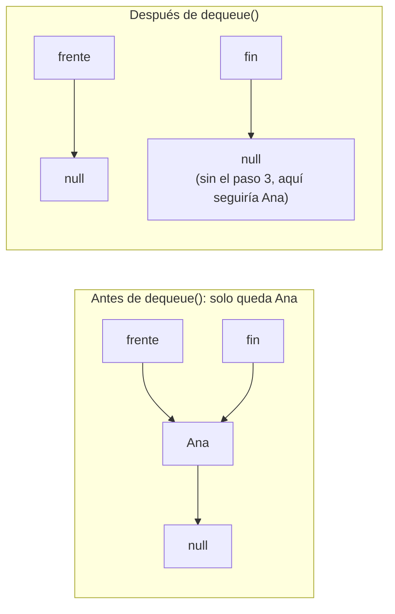

> 📖 Lectura previa a la clase — unos 15 minutos. Al final, responde la autoevaluación.

## La fila de la caja, vista desde adentro

En "TAD Cola" armaste el contrato con la fila del supermercado. Ahora mírala como quien la organiza: la cajera **no cuenta** a las personas para saber a quién atender; le basta con saber quién es **el primero**. Quien llega tampoco recorre la fila para ubicarse; le basta con ver quién es **el último** y ponerse detrás. Y cada persona solo sabe quién tiene **detrás**: si la primera se va, la cajera mira a quien venía después, sin preguntarle a nadie más.

Ni la cajera ni el recién llegado recorren la fila: todo es de costo constante. Pero `Cola<T>` es una `interface` y no se instancia con `new`; necesita una clase. Con una `ListaSimple<T>` que solo guarda `head`, llegar al último costaría **O(n)** por cada persona. Falta darle a la clase lo que tiene la caja: una referencia al primero y otra al último.

## De la fila a `ColaEnlazada<T>`

**Así en la vida real:** la cajera señala al primero (`frente`), el recién llegado ubica al último (`fin`), y cada persona conoce a quien tiene detrás.

**Así en código**, cada elemento vive en un `Nodo<T>` que solo conoce a su siguiente, y la clase guarda los dos extremos más un contador:

```java
package model.structures;

public class ColaEnlazada<T> implements Cola<T> {

    private Nodo<T> frente;   // primer nodo: el que sale; null si la cola está vacía
    private Nodo<T> fin;      // último nodo: detrás de él entra el siguiente; null si está vacía
    private int tamano;       // cantidad de nodos en la cola; el constructor deja todo en null y 0

    @Override
    public boolean isEmpty() { return frente == null; }   // O(1)

    @Override
    public int size() { return tamano; }                  // O(1): el contador se mantiene solo
}
```

¿Por qué se entra por `fin` y se sale por `frente` y no al revés? Porque cada nodo conoce a su siguiente, no a su anterior: quitar el primero solo exige leer `frente.siguiente`; quitar el último exigiría recorrer la cadena hasta el penúltimo, **O(n)**. Por eso la cola no envuelve una `ListaSimple<T>`: necesita `fin`, y la lista solo conoce `head`.

> **`ColaEnlazada<T>`:** implementación de `Cola<T>` sobre una cadena de `Nodo<T>`, con `frente` en el primer nodo y `fin` en el último. Al tener ambos extremos, `enqueue` y `dequeue` cuestan **O(1)** en el peor caso.

## `enqueue`: llega alguien a la fila

**Así en la vida real:** el recién llegado se pone detrás del último. Pero si la fila estaba vacía, no hay nadie detrás de quien ponerse: esa persona es el primero **y** el último a la vez.

**Así en código**, son esos dos casos y un paso común, mover `fin`:

```java
@Override
public void enqueue(T elemento) {
    Nodo<T> nuevo = new Nodo<>(elemento);
    if (isEmpty()) {
        frente = nuevo;              // fila vacía: el nuevo es frente y fin a la vez
    } else {
        fin.setSiguiente(nuevo);     // el último actual ahora conoce a quien tiene detrás
    }
    fin = nuevo;                     // en ambos casos, el último es el nuevo
    tamano++;
}
```

Un nodo, dos asignaciones y un incremento, sin importar cuántas personas esperen: **O(1)**.

## `dequeue` y `front`: atender a quien va primero

**Así en la vida real:** la cajera atiende al primero, y el siguiente pasa a ser el primero. Con la fila vacía no hay a quién atender: pedirlo es un error de quien pregunta. Y cuando se va **la última persona**, no queda ni primero ni último.

**Así en código**, la precondición de "TAD Cola" se vuelve una línea, y el caso de la última persona exige actualizar **también** `fin`:

```java
import java.util.NoSuchElementException;

@Override
public T dequeue() {
    if (isEmpty()) {
        throw new NoSuchElementException("La cola está vacía");   // precondición violada
    }
    T dato = frente.getDato();       // 1. guarda el dato mientras el nodo aún es alcanzable
    frente = frente.getSiguiente();  // 2. el segundo de la fila pasa a ser el primero
    if (frente == null) {
        fin = null;                  // 3. se fue la última persona: la fila quedó vacía
    }
    tamano--;
    return dato;
}

@Override
public T front() {
    if (isEmpty()) {
        throw new NoSuchElementException("La cola está vacía");
    }
    return frente.getDato();         // mira al primero sin atenderlo
}
```

El paso 3 es el error clásico. Si lo olvidas, con la fila vacía `frente` es `null` pero `fin` sigue señalando a una persona que ya se fue: una referencia muerta que mantiene vivo un nodo que nadie debería alcanzar. Vacía significa **ambos** en `null`.


```mermaid
flowchart LR
  subgraph antes["Antes de dequeue(): solo queda Ana"]
    F1["frente"] --> A1["Ana"]
    X1["fin"] --> A1
    A1 --> N1["null"]
  end
  subgraph despues["Después de dequeue()"]
    F2["frente"] --> N2["null"]
    X2["fin"] --> N3["null\n(sin el paso 3, aquí seguiría Ana)"]
  end
```

Un `dequeue` de más lanza `NoSuchElementException`: no es un fallo de la clase, es el contrato cumpliéndose. `front` repite la precondición pero no modifica nada.

## La cola que Java ya trae: `Queue<E>`

**Así en la vida real:** a veces no montas tú la fila; el supermercado ya la trae organizada con sus barandas. `java.util.Queue<E>` es esa fila ya organizada: una `interface` con implementaciones como `LinkedList<E>` y `ArrayDeque<E>`.

**Así en código**, cada operación viene en **dos familias**: una lanza excepción cuando la fila está vacía y otra devuelve un valor especial:

```java
Queue<Cliente> turnos = new ArrayDeque<>();   // declarada como Queue: solo ves el contrato
turnos.offer(new Cliente("Ana"));
turnos.offer(new Cliente("Bruno"));

Cliente siguiente = turnos.peek();   // Ana, sin atenderla
Cliente atendido = turnos.poll();    // Ana; en fila vacía devolvería null
```

| TAD Cola | `ColaEnlazada<T>` | `Queue<E>` lanza excepción | `Queue<E>` devuelve `null` o `false` |
| --- | --- | --- | --- |
| Encolar | `enqueue(x)` | `add(x)` | `offer(x)` |
| Retirar el frente | `dequeue()` | `remove()` | `poll()` |
| Consultar el frente | `front()` | `element()` | `peek()` |

`isEmpty()` y `size()` coinciden en todas. Los costos son **O(1)** (en `ArrayDeque`, amortizado).

¿Cuál implementación elegir? `LinkedList<E>` también implementa `List`: declarada como tal permite `get(2)` o `add(1, x)` y colarse en medio de la fila, lo que FIFO prohíbe; además admite `null`, que se confunde con el "vacía" de `poll()`. `ArrayDeque<E>` no tiene esos lastres y, según su Javadoc, es probablemente más rápida como cola. En código real, `Queue<E>` con `ArrayDeque`; `ColaEnlazada<T>` cuando la estructura es el objeto de estudio; `LinkedList` solo para leer código heredado.

## La fila preferencial: `PriorityQueue<E>`

**Así en la vida real:** en la caja preferencial, una embarazada o un adulto mayor pasa antes que quienes llegaron primero. Ya no manda el orden de llegada sino la **prioridad**.

**Así en código**, se usa como cualquier `Queue<E>`; lo que cambia es la regla de salida, que se da con el orden natural del tipo o con una función de comparación:

```java
// Regla: menor prioridad numérica sale primero (0 es la más urgente)
Queue<Cliente> turnos = new PriorityQueue<>((a, b) -> Integer.compare(a.prioridad, b.prioridad));
turnos.offer(new Cliente("Ana", 2));       // llega primero
turnos.offer(new Cliente("Bruno", 2));
turnos.offer(new Cliente("Carla", 0));     // atención preferencial

Cliente atendido = turnos.poll();          // Carla, aunque llegó última
```

_El atributo `prioridad` es solo un ejemplo: no forma parte de la clase `Cliente` real._ Sus costos: `offer` y `poll` son **O(log n)** y `peek` es **O(1)**; los enuncio sin demostrarlos. No admite `null`, y entre elementos de igual prioridad, como Ana y Bruno, **no garantiza** que salga primero quien llegó antes.

## Dónde se rompe la analogía

- **En la fila real ves a todos; en `ColaEnlazada<T>` solo ves `frente` y `fin`.** Para saber quién está en el medio habría que recorrer la cadena, y el contrato no lo ofrece. Es a propósito: si necesitas mirar en medio, quizá no necesitas una cola.
- **La fila preferencial real se ve ordenada de una vez; la `PriorityQueue<E>` no.** Solo `poll` entrega los elementos en orden de prioridad. Recorrerla con un `for-each` o imprimirla **no** muestra el orden de salida.

## Resumen operativo

| Operación | `ColaEnlazada<T>` | `Queue<E>` | Costo | Cola vacía |
| --- | --- | --- | --- | --- |
| Encolar | `enqueue(x)` | `add(x)` / `offer(x)` | **O(1)** | No aplica |
| Retirar | `dequeue()` | `remove()` / `poll()` | **O(1)** | Lanza excepción / devuelve `null` |
| Consultar el frente | `front()` | `element()` / `peek()` | **O(1)** | Lanza excepción / devuelve `null` |
| Con prioridad | No aplica | `offer` / `poll` / `peek` en `PriorityQueue<E>` | **O(log n)**, **O(log n)**, **O(1)** | `poll` y `peek` devuelven `null` |

## ¿Dónde aparece en tu proyecto?

- **Sistema Bancario:** `Cola<Cliente>` para la ventanilla. Es la fila del supermercado tal cual: llegada con `enqueue`, turno con `dequeue`, y la excepción cuando el cajero pide al siguiente y nadie espera.
- **Consultorio Médico o Clínica Veterinaria:** la sala de espera del día como `Cola<Paciente>` o `Cola<Animal>`. Si quieres que una urgencia pase antes que quien llegó primero, ya no es FIFO: es la fila preferencial, una `PriorityQueue<E>` con la gravedad como regla de orden.
- **Papelería, Sistema Académico y Liga de Fútbol:** pedidos a proveedor, solicitudes de matrícula y partidos pendientes se procesan en orden de llegada: la misma fila, con otros elementos.

## Síntesis

- **La fila por dentro:** la cajera solo necesita al primero, el recién llegado al último, y cada persona conoce a quien tiene detrás.
- **`ColaEnlazada<T>`:** guarda `frente`, `fin` y `tamano`; `enqueue` y `dequeue` son **O(1)**, y al irse la última persona `fin` también queda en `null`.
- **`dequeue` y `front`:** validan la precondición con `NoSuchElementException`.
- **`Queue<E>`:** la cola que Java ya trae, con dos familias de métodos y `ArrayDeque` como elección habitual.
- **`PriorityQueue<E>`:** manda la prioridad, no la llegada; su recorrido no muestra el orden de salida.
