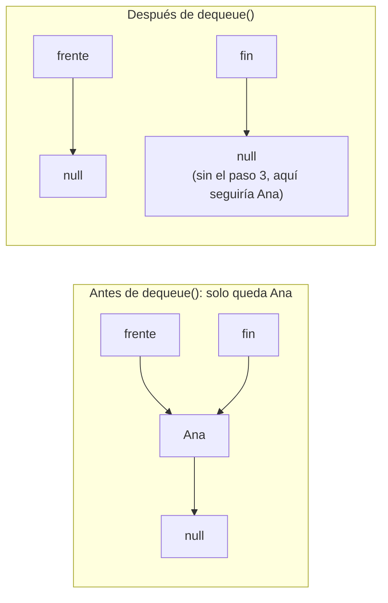

> 📖 Lectura previa a la clase — unos 15 minutos. Al final, responde la autoevaluación.

## La fila de la caja del supermercado

Llegas a pagar con el carrito lleno y ves la fila de una caja. Haces lo que hace todo el mundo: te pones **al final**. La cajera atiende a quien está **al frente**; cuando termina, esa persona se va y el siguiente da un paso adelante. Nadie se pasa de la mitad para adelante, y nadie atiende desde atrás.

Mientras esperas puedes hacer dos cosas más sin mover a nadie: **mirar quién sigue** y **contar cuántos hay** delante. Y hay un caso límite que ya viviste: a las 10 de la noche, la cajera libre pregunta "¿quién sigue?" y no hay nadie. No puede atender a una persona que no existe.

Fíjate en el orden: sale primero quien llegó primero. Si atendieran a la última persona en llegar, la primera se quedaría esperando media hora.

## De la fila a las reglas: el TAD Cola

Cada cosa que hiciste en la fila es una operación. Un **tipo abstracto de dato (TAD)** dice *qué* se puede hacer con una estructura, sin decir cómo está construida por dentro.

| En la fila | Operación |
|---|---|
| Te haces al final | `enqueue(x)` |
| Pasas a la caja | `dequeue()` |
| Miras quién sigue | `front()` |
| ¿Hay alguien en la fila? | `isEmpty()` |
| ¿Cuántos hay? | `size()` |

> **Cola (_queue_):** TAD lineal en el que las inserciones se hacen por un extremo, el **fin**, y las eliminaciones por el otro, el **frente**, con disciplina **FIFO** (_First In, First Out_): el primero en entrar es el primero en salir.

`dequeue` y `front` tienen una **precondición**: la cola no debe estar vacía. Igual que la cajera no llama a nadie si la fila está vacía, la operación **lanza un error** (`java.util.NoSuchElementException`) en vez de inventar un cliente de relleno o devolver `null`. Para no llegar ahí existen `isEmpty` y `size`, que no modifican nada.

## enqueue, dequeue y front en acción

**Así en la vida real:** Ana llega y se pone en la fila; después llegan Bruno y Carla. La cajera atiende a Ana. Bruno puede ver que él sigue, sin que nadie se mueva.

**Así en código:** llegar al final es `enqueue`, pasar a la caja es `dequeue` (quita y devuelve al del frente) y ver quién sigue es `front` (devuelve sin quitar). El comentario muestra la cola con el frente a la izquierda:

```java
ColaEnlazada<Cliente> fila = new ColaEnlazada<>();
fila.enqueue(new Cliente("Ana"));      // [Ana]
fila.enqueue(new Cliente("Bruno"));    // [Ana, Bruno]
fila.enqueue(new Cliente("Carla"));    // [Ana, Bruno, Carla]

Cliente quienSigue = fila.front();     // Ana; la fila no cambia
Cliente atendido = fila.dequeue();     // Ana; queda [Bruno, Carla]
```

> **enqueue(x):** coloca `x` al fin de la cola. **dequeue():** retira y devuelve el elemento del frente. **front():** devuelve el elemento del frente sin retirarlo. **isEmpty() / size():** indican si hay elementos y cuántos.

## La fila vista desde adentro: frente y fin

**Así en la vida real:** la cajera **no cuenta** a las personas para saber a quién atender; le basta con saber quién es **el primero**. Quien llega tampoco recorre la fila para ubicarse; le basta con ver quién es **el último** y ponerse detrás. Y cada persona solo sabe quién tiene **detrás**.

**Así en código:** cada persona es un `Nodo<T>` que solo conoce a su siguiente, y la cola guarda los dos extremos más un contador:

```java
public class Nodo<T> {
    private T dato;
    private Nodo<T> siguiente;   // quien tiene detrás; null si es el último

    public Nodo(T dato) { this.dato = dato; }
    public T getDato() { return dato; }
    public Nodo<T> getSiguiente() { return siguiente; }
    public void setSiguiente(Nodo<T> siguiente) { this.siguiente = siguiente; }
}
```

```java
public class ColaEnlazada<T> {
    private Nodo<T> frente;   // primer nodo: el que sale; null si la cola está vacía
    private Nodo<T> fin;      // último nodo: detrás de él entra el siguiente; null si está vacía
    private int tamano;       // cantidad de nodos

    public boolean isEmpty() { return frente == null; }   // O(1)
    public int size() { return tamano; }                  // O(1)
}
```

¿Por qué se entra por `fin` y se sale por `frente`, y no al revés? Porque cada nodo conoce a su siguiente, no a su anterior: quitar el primero solo exige leer `frente.getSiguiente()`; quitar el último exigiría recorrer la cadena hasta el penúltimo, **O(n)**. Y sin `fin`, llegar al último costaría **O(n)** por cada persona que entra.

> **`ColaEnlazada<T>`:** cola construida sobre una cadena de `Nodo<T>`, con `frente` en el primer nodo y `fin` en el último. Al tener ambos extremos, `enqueue` y `dequeue` cuestan **O(1)** en el peor caso.

## enqueue: llega alguien a la fila

**Así en la vida real:** el recién llegado se pone detrás del último. Pero si la fila estaba vacía, no hay nadie detrás de quien ponerse: esa persona es el primero **y** el último a la vez.

**Así en código:** son esos dos casos y un paso común, mover `fin`:

```java
public void enqueue(T elemento) {
    Nodo<T> nuevo = new Nodo<>(elemento);
    if (isEmpty()) {
        frente = nuevo;              // fila vacía: el nuevo es frente y fin a la vez
    } else {
        fin.setSiguiente(nuevo);     // el último actual ahora conoce a quien tiene detrás
    }
    fin = nuevo;                     // en ambos casos, el último es el nuevo
    tamano++;
}
```

Un nodo, dos asignaciones y un incremento, sin importar cuántas personas esperen: **O(1)**.

## dequeue y front: atender a quien va primero

**Así en la vida real:** la cajera atiende al primero, y el siguiente pasa a ser el primero. Con la fila vacía no hay a quién atender. Y cuando se va **la última persona**, no queda ni primero ni último.

**Así en código:** la precondición se vuelve una línea, y el caso de la última persona exige actualizar **también** `fin`:

```java
import java.util.NoSuchElementException;

public T dequeue() {
    if (isEmpty()) {
        throw new NoSuchElementException("La cola está vacía");   // precondición violada
    }
    T dato = frente.getDato();       // 1. guarda el dato mientras el nodo aún es alcanzable
    frente = frente.getSiguiente();  // 2. el segundo de la fila pasa a ser el primero
    if (frente == null) {
        fin = null;                  // 3. se fue la última persona: la fila quedó vacía
    }
    tamano--;
    return dato;
}

public T front() {
    if (isEmpty()) {
        throw new NoSuchElementException("La cola está vacía");
    }
    return frente.getDato();         // mira al primero sin atenderlo
}
```

El paso 3 es el error clásico. Si lo olvidas, con la fila vacía `frente` es `null` pero `fin` sigue señalando a una persona que ya se fue: una referencia muerta que mantiene vivo un nodo que nadie debería alcanzar. Vacía significa **ambos** en `null`.


```mermaid
flowchart LR
  subgraph antes["Antes de dequeue(): solo queda Ana"]
    F1["frente"] --> A1["Ana"]
    X1["fin"] --> A1
    A1 --> N1["null"]
  end
  subgraph despues["Después de dequeue()"]
    F2["frente"] --> N2["null"]
    X2["fin"] --> N3["null\n(sin el paso 3, aquí seguiría Ana)"]
  end
```

## La cola que Java ya trae: `Queue<E>`

**Así en la vida real:** a veces no montas tú la fila; el supermercado ya la trae con sus barandas. `java.util.Queue<E>` es esa fila: una `interface` con implementaciones como `LinkedList<E>` y `ArrayDeque<E>`.

**Así en código:** cada operación viene en **dos familias**: una lanza excepción cuando la fila está vacía y otra devuelve un valor especial.

```java
Queue<Cliente> turnos = new ArrayDeque<>();   // declarada como Queue: solo ves el contrato
turnos.offer(new Cliente("Ana"));
turnos.offer(new Cliente("Bruno"));

Cliente siguiente = turnos.peek();   // Ana, sin atenderla
Cliente atendido = turnos.poll();    // Ana; en fila vacía devolvería null
```

| TAD Cola | `ColaEnlazada<T>` | `Queue<E>` lanza excepción | `Queue<E>` devuelve `null` o `false` |
| --- | --- | --- | --- |
| Encolar | `enqueue(x)` | `add(x)` | `offer(x)` |
| Retirar el frente | `dequeue()` | `remove()` | `poll()` |
| Consultar el frente | `front()` | `element()` | `peek()` |

`isEmpty()` y `size()` coinciden en todas. Los costos son **O(1)** (en `ArrayDeque`, amortizado).

¿Cuál implementación elegir? `LinkedList<E>` también implementa `List`: declarada como tal permite `get(2)` o `add(1, x)` y colarse en medio de la fila, lo que FIFO prohíbe; además admite `null`, que se confunde con el "vacía" de `poll()`. `ArrayDeque<E>` no tiene esos lastres y es probablemente más rápida. En código real, `Queue<E>` con `ArrayDeque`.

## La fila preferencial: `PriorityQueue<E>`

**Así en la vida real:** en la misma caja hay un letrero de atención preferencial: una embarazada o un adulto mayor pasa antes que quienes llegaron primero. Ya no manda el orden de llegada sino la **prioridad**.

**Así en código:** se usa como cualquier `Queue<E>`; lo que cambia es la regla de salida, que se da con el orden natural del tipo o con una función de comparación:

```java
// Regla: menor prioridad numérica sale primero (0 es la más urgente)
Queue<Cliente> turnos = new PriorityQueue<>((a, b) -> Integer.compare(a.prioridad, b.prioridad));
turnos.offer(new Cliente("Ana", 2));       // llega primero
turnos.offer(new Cliente("Bruno", 2));
turnos.offer(new Cliente("Carla", 0));     // atención preferencial

Cliente atendido = turnos.poll();          // Carla, aunque llegó última
```

_El atributo `prioridad` es solo un ejemplo: no forma parte de la clase `Cliente` real._ Sus costos: `offer` y `poll` son **O(log n)** y `peek` es **O(1)**; los enuncio sin demostrarlos. No admite `null`, y entre elementos de igual prioridad, como Ana y Bruno, **no garantiza** que salga primero quien llegó antes.

## Pila y cola frente a frente

La pila de platos de "Implementación de pilas en Java" y la fila del supermercado aceptan los mismos elementos; solo cambia **por dónde salen**. Con Ana, Bruno y Carla llegando en ese orden:

| Estructura | Analogía | Orden de salida | Extremos |
| --- | --- | --- | --- |
| Pila (LIFO) | Pila de platos | Carla, Bruno, Ana | Uno solo: el tope |
| Cola (FIFO) | Fila de la caja | Ana, Bruno, Carla | Dos: fin (entrada) y frente (salida) |

Elegir entre una y otra es decidir qué significa "el siguiente": el más reciente (pila) o el que más lleva esperando (cola).

## Dónde se rompe la analogía

- **En la fila real ves a todos; en `ColaEnlazada<T>` solo ves `frente` y `fin`.** Alguien se cuela en la mitad, otro se sale del medio, tú preguntas "¿en qué puesto voy?": nada de eso existe en la cola. No es una carencia: es la garantía de que el orden de salida es el de llegada. Si necesitas mirar o quitar a alguien del medio, ese problema no pide una cola.
- **La fila preferencial real se ve ordenada de una vez; la `PriorityQueue<E>` no.** Solo `poll` entrega los elementos en orden de prioridad. Recorrerla con un `for-each` o imprimirla **no** muestra el orden de salida.

## Resumen operativo

| Operación | `ColaEnlazada<T>` | `Queue<E>` | Costo | Cola vacía |
| --- | --- | --- | --- | --- |
| Encolar | `enqueue(x)` | `add(x)` / `offer(x)` | **O(1)** | No aplica |
| Retirar | `dequeue()` | `remove()` / `poll()` | **O(1)** | Lanza excepción / devuelve `null` |
| Consultar el frente | `front()` | `element()` / `peek()` | **O(1)** | Lanza excepción / devuelve `null` |
| Con prioridad | No aplica | `offer` / `poll` / `peek` en `PriorityQueue<E>` | **O(log n)**, **O(log n)**, **O(1)** | `poll` y `peek` devuelven `null` |

## ¿Dónde aparece en tu proyecto?

Una cola es la respuesta cuando el enunciado dice "en orden de llegada" o "por turnos":

- **Sistema Bancario:** `ColaEnlazada<Cliente>` para la ventanilla: llegada con `enqueue`, turno con `dequeue`, y la excepción cuando el cajero pide al siguiente y nadie espera.
- **Consultorio Médico o Clínica Veterinaria:** la sala de espera del día como cola de `Paciente` o `Animal`. Si una urgencia debe pasar antes que quien llegó primero, ya no es FIFO: es la fila preferencial, una `PriorityQueue<E>` con la gravedad como regla de orden.
- **Papelería, Sistema Académico y Liga de Fútbol:** pedidos a proveedor, solicitudes de matrícula y partidos pendientes se procesan en orden de llegada: la misma fila, con otros elementos.

Fuera del proyecto, es lo que hace el sistema operativo: la **cola de impresión** imprime los documentos en el orden en que los enviaste, y el _scheduling_ mantiene una cola de procesos listos donde pasa a ejecutarse el que lleva más tiempo esperando.

## Síntesis

- Una **cola** es un TAD **FIFO**: como la fila de la caja, el primero en entrar es el primero en salir (Ana, Bruno y Carla entran; salen en ese orden).
- `enqueue` agrega por el **fin**, `dequeue` retira por el **frente** y `front` lo consulta sin modificar la cola.
- `dequeue` y `front` sobre una cola vacía lanzan `NoSuchElementException`, nunca devuelven `null`.
- `ColaEnlazada<T>` guarda `frente`, `fin` y `tamano` sobre nodos `Nodo<T>`; `enqueue` y `dequeue` son **O(1)**, y al irse la última persona `fin` también queda en `null`.
- `Queue<E>` es la cola que Java ya trae, con dos familias de métodos y `ArrayDeque` como elección habitual; `PriorityQueue<E>` cambia el orden de llegada por prioridad.
- La analogía se rompe donde importa: la cola no permite colarse ni salirse del medio, y la `PriorityQueue<E>` no se recorre en orden de salida. Pila y cola reciben las mismas llegadas y producen salidas opuestas.
