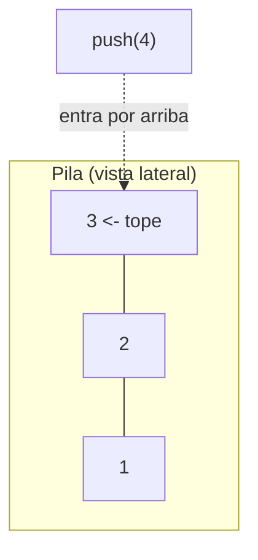
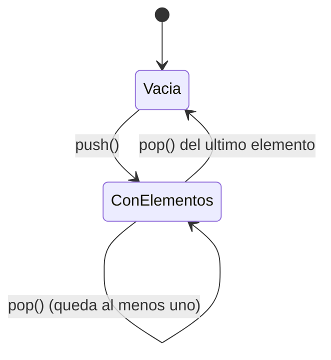
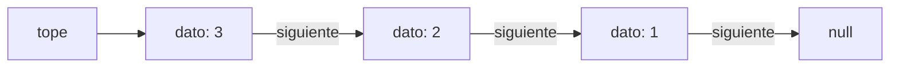
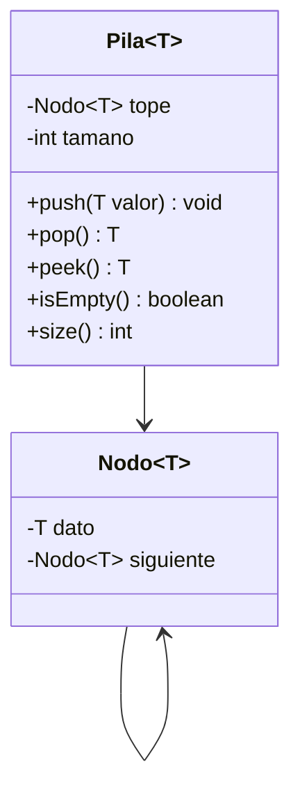
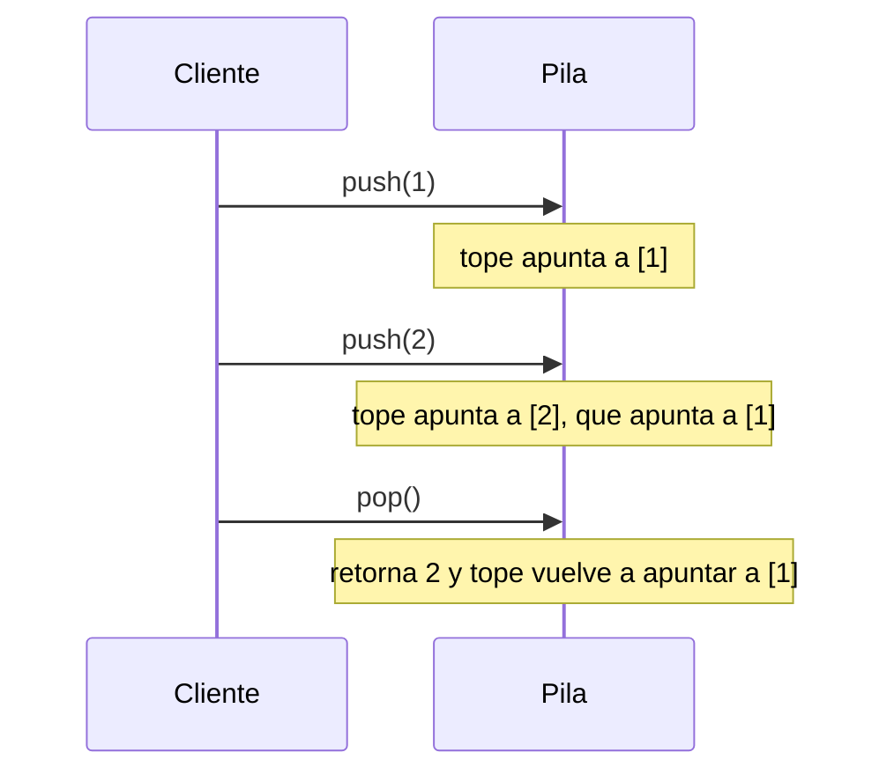

## El problema: deshacer solo el último cambio

Escribes un párrafo, lo formateas, le cambias el color y presionas `Ctrl+Z`
tres veces seguidas. Cada vez se deshace exactamente **la acción más
reciente**, nunca una al azar ni la primera que hiciste. El editor no guarda
tus acciones en una lista cualquiera: las guarda en un orden muy particular,
donde lo último que entra es lo primero que sale.

Ese mismo patrón aparece en el botón "atrás" del navegador y en la manera en
que un programa recuerda a qué función volver cuando termina una llamada
anidada. ¿Qué estructura modela "lo último que entró es lo primero que sale"?

## El mismo patrón en tres lugares distintos

Antes de nombrar la estructura, nota que resuelve problemas que a primera
vista parecen distintos:

- **Historial de navegación:** cada página visitada se apila; "atrás" retira
  la más reciente y te deja en la anterior.
- **Llamadas a funciones:** cuando una función llama a otra, la ejecución de
  la primera queda pendiente hasta que la segunda termine. El programa debe
  recordar, en orden inverso, a qué función volver.
- **Balanceo de símbolos:** un compilador valida que cada `(`, `[` o `{`
  tenga su cierre correspondiente, en el orden correcto de anidamiento.

Los tres comparten una restricción: solo importa el elemento más reciente que
sigue "abierto". No necesitas consultar todo el historial, solo lo último.

## El TAD Pila: el contrato LIFO

Un **tipo abstracto de dato (TAD)** define *qué* operaciones puede hacer una
estructura y *qué* garantiza cada una, sin decir *cómo* está construida por
dentro. El TAD Pila especifica un contrato con disciplina **LIFO**
(_Last In, First Out_): el último elemento agregado es el primero en salir.



> **Pila (stack):** TAD lineal en el que las inserciones y eliminaciones
> ocurren siempre por un único extremo, llamado **tope**, con disciplina
> LIFO.

El contrato tiene cinco operaciones: `push`, `pop`, `peek`, `isEmpty` y
`size`. Verlas primero como reglas te permite razonar sobre una pila sin
haber escrito una línea de código todavía.

## push y pop: agregar y retirar por el mismo extremo

**Situación:** el navegador carga una página nueva. Ese evento no reemplaza
el historial: se suma encima de todo lo que ya visitaste. Presionar "atrás"
hace lo opuesto: retira exactamente la página más reciente.

```text
Pila antes de push("pagina-C"):        Pila despues de push("pagina-C"):
  tope -> pagina-B                       tope -> pagina-C
          pagina-A                               pagina-B
                                                  pagina-A

pop() -> retorna "pagina-C"; la pila vuelve a quedar con tope en pagina-B
```

> **push:** agrega un elemento en el tope. No existe forma de insertar en
> otra posición — esa restricción es lo que hace predecible el orden de
> salida.
>
> **pop:** retira y devuelve el elemento del tope. Modifica la pila.

En la pila de llamadas de un programa, cada llamada a una función hace
`push`; cuando esa función termina, ocurre un `pop`. Por eso una función
recursiva sin caso base agota la memoria: cada llamada apila y ninguna
desapila, hasta que no queda espacio (_stack overflow_).

## peek, isEmpty y size: consultar sin romper el contrato

**Situación:** la barra de direcciones del navegador te muestra en qué
página estás. Eso no elimina nada del historial — solo consulta.

> **peek:** devuelve el elemento del tope sin retirarlo. No modifica la
> pila. Confundir `peek` con `pop` es el error conceptual más común al
> trabajar con pilas.
>
> **isEmpty:** indica si la pila no tiene elementos. Toda pila debe tratar
> `pop` y `peek` sobre una pila vacía como un error, nunca como un valor
> cualquiera.
>
> **size:** devuelve la cantidad de elementos actuales.



`isEmpty` y `size` le permiten a quien *usa* la pila protegerse antes de
llamar `pop` o `peek`, sin necesitar saber nada de cómo está construida por
dentro. Eso es exactamente lo que resolvemos a partir de aquí.

## Del contrato a la memoria: un nodo por cada elemento

El TAD dice *qué* hace una pila, no *cómo* se guardan los datos. Vas a
construir tu propia `Pila<T>` sin usar ninguna clase ya hecha de Java:
la vas a armar encadenando objetos pequeños llamados **nodos**, cada uno
apuntando al que quedó justo debajo.

Piensa en cada nodo como una caja con dos compartimentos: uno guarda el
valor, el otro guarda la dirección de la caja que quedó debajo de ella. La
pila completa es solo una referencia a la caja de arriba — el **tope** —
porque desde ahí, siguiendo las direcciones, se llega a todas las demás.



```java
public class Nodo<T> {
    T dato;
    Nodo<T> siguiente;

    Nodo(T dato) {
        this.dato = dato;
    }
}
```

`siguiente` empieza en `null` porque, al crear un nodo suelto, todavía no
sabe qué otro nodo queda debajo de él. Eso se decide cuando lo insertas en
la pila.

## La clase `Pila<T>`: push y pop moviendo el tope

`Pila<T>` solo necesita **una** referencia propia: `tope`, el nodo que está
arriba de todos. `push` y `pop` no mueven datos de un lugar a otro — solo
reacomodan a qué nodo apunta `tope`.



```java
public class Pila<T> {
    private Nodo<T> tope;
    private int tamano;

    public void push(T valor) {
        Nodo<T> nuevo = new Nodo<>(valor);
        nuevo.siguiente = tope;
        tope = nuevo;
        tamano++;
    }

    public T pop() {
        if (isEmpty()) {
            throw new IllegalStateException("La pila está vacía");
        }
        T valor = tope.dato;
        tope = tope.siguiente;
        tamano--;
        return valor;
    }
}
```

`push` crea el nodo nuevo, lo apunta hacia el tope actual (`nuevo.siguiente
= tope`) y recién después mueve `tope` para que apunte al nodo nuevo. Si
invirtieras esas dos líneas, perderías la referencia al resto de la pila.
`pop` hace lo inverso: guarda el dato del tope, avanza `tope` un lugar hacia
abajo (`tope = tope.siguiente`) y devuelve el dato guardado. El nodo viejo
queda sin ninguna referencia apuntándolo — Java lo libera solo.



## peek, isEmpty y size en la implementación

Las tres operaciones de consulta no modifican ningún nodo: `peek` solo
mira `tope.dato`, e `isEmpty`/`size` solo miran el contador que ya llevas
actualizado en `push` y `pop`.

```java
public T peek() {
    if (isEmpty()) {
        throw new IllegalStateException("La pila está vacía");
    }
    return tope.dato;
}

public boolean isEmpty() {
    return tope == null;
}

public int size() {
    return tamano;
}
```

Nota que `isEmpty` compara `tope == null`, no `tamano == 0` — ambas
condiciones deberían coincidir siempre, pero comparar contra `tope`
directamente es la comprobación más cercana a lo que realmente representa
una pila vacía: ninguna caja apuntada. Con esto, `push`, `pop`, `peek`,
`isEmpty` y `size` quedan completas, y ninguna recorre la cadena de nodos:
todas operan sobre `tope`, así que cuestan lo mismo sin importar cuántos
elementos tenga la pila.

## Resumen operativo

| Operación | Qué hace con `tope` | ¿Modifica la pila? | Precondición |
|-----------|----------------------|----------------------|--------------|
| `push(valor)` | Crea un nodo, lo enlaza al tope actual y lo vuelve el nuevo tope | Sí | Ninguna |
| `pop()` | Guarda `tope.dato`, avanza `tope` a `tope.siguiente` | Sí | La pila no está vacía |
| `peek()` | Lee `tope.dato` sin tocar `tope` | No | La pila no está vacía |
| `isEmpty()` | Verifica si `tope == null` | No | Ninguna |
| `size()` | Devuelve el contador `tamano` | No | Ninguna |

## Síntesis

- Una **pila** es un TAD con disciplina **LIFO**: el último elemento en
  entrar es el primero en salir. Historial de navegación, llamadas a
  funciones y balanceo de símbolos son la misma disciplina aplicada a datos
  distintos.
- `push` agrega y `pop` retira, siempre por el mismo extremo: el **tope**.
  `peek` consulta el tope sin modificarlo — confundirla con `pop` es el
  error más frecuente.
- `isEmpty` y `size` permiten verificar el estado antes de operar, porque
  `pop`/`peek` sobre una pila vacía violan el contrato.
- Construyes la pila encadenando objetos `Nodo<T>`, cada uno con su dato y
  una referencia `siguiente` al nodo de abajo. La pila entera se reduce a
  una única referencia: `tope`.
- `push` y `pop` solo reacomodan a qué nodo apunta `tope` — nunca desplazan
  datos ni recorren la cadena, así que las cinco operaciones cuestan lo
  mismo sin importar cuántos elementos tenga la pila.
