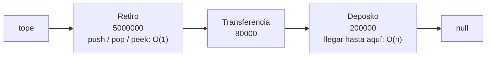
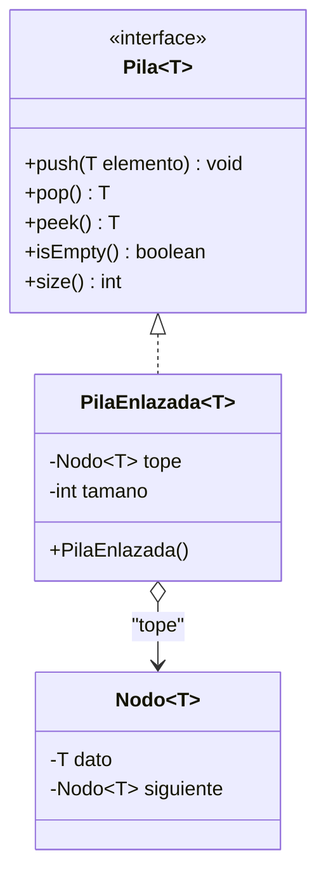
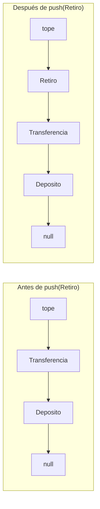
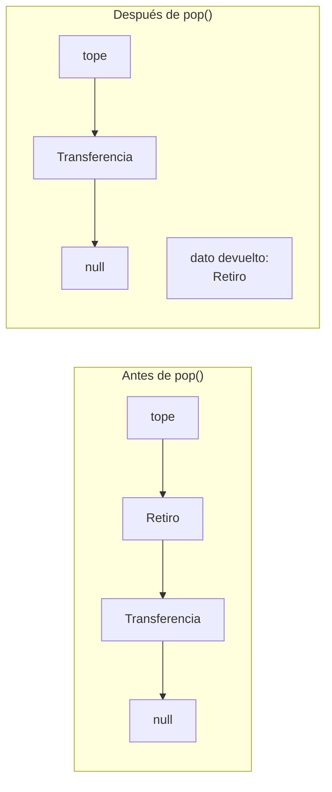
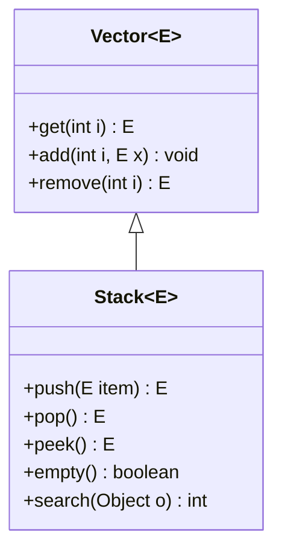

## El problema: un contrato que nadie puede instanciar

En la lección "TAD Pila" dejaste escrito el contrato: la `interface` `Pila<T>` y un `ServicioCuenta` que anula la última transacción de un cliente. Ahora intenta ejecutarlo:

```java
public class ServicioCuenta {
    private final Pila<Transaccion> deshacer = new Pila<>();   // error de compilación
}
```

No compila: una `interface` no se puede instanciar con `new`. El contrato dice _qué_ debe hacer una pila, pero alguien tiene que escribir _cómo_. Y la tentación es reutilizar lo que ya tienes: una `ListaSimple<Transaccion>`. Funciona, pero mira lo que cuesta.

Si el tope fuera el **último** nodo de la lista, cada `push` recorrería los `n` nodos hasta el final para enlazar al lado: **O(n)** por operación, cuando la lección "Notación Big O y análisis de complejidad" te enseñó a exigirle **O(1)** a una pila. La pregunta no es si se puede: es en qué extremo de la lista conviene poner el tope.

## ¿Dónde va el tope? La asimetría de la lista decide

**Situación:** en "Operaciones sobre la lista simple" viste que la lista solo guarda `head`. Llegar al primer nodo es gratis; llegar al último obliga a recorrer todo.

| Operación sobre la lista | Costo | Por qué |
| --- | --- | --- |
| `insertarInicio` / `eliminarInicio` | **O(1)** | Solo tocan `head` y una referencia |
| `insertarFinal` / `eliminarFinal` | **O(n)** | Hay que recorrer hasta el último nodo |

Una pila necesita insertar y retirar **por el mismo extremo**. Si ese extremo es la cabeza, las dos operaciones caen en la fila barata. El tope es, entonces, el primer nodo de la cadena:



Todo lo que ocurre en la cabeza cuesta un número fijo de pasos; llegar a la base, en cambio, depende de cuántas transacciones haya apiladas. Como una pila nunca necesita la base, nunca paga ese costo.

También se podría respaldar la pila con un arreglo dinámico (el tope sería el último índice ocupado). Esa alternativa es válida y se compara al final de la lección.

## `PilaEnlazada<T>`: la clase y su estado

**Situación:** ya sabes dónde va el tope. Falta decidir qué guarda la clase para trabajar en O(1).

**En la práctica**, la clase necesita solo dos datos: una referencia al primer nodo y un contador. El contador evita recorrer la cadena cada vez que alguien pregunta `size()`:

```java
package model.structures;

public class PilaEnlazada<T> implements Pila<T> {

    private Nodo<T> tope;   // primer nodo de la cadena; null si la pila está vacía
    private int tamano;     // cantidad de nodos apilados

    public PilaEnlazada() {
        this.tope = null;
        this.tamano = 0;
    }

    @Override
    public boolean isEmpty() {
        return tope == null;   // O(1): no hay que contar nada
    }

    @Override
    public int size() {
        return tamano;         // O(1): el contador se mantiene en push y pop
    }
}
```



La pila **no envuelve una `ListaSimple<T>`**: guarda el `Nodo<T>` del tope directamente. La razón es práctica: `eliminarInicio()` de la lista devuelve `void` y no expone un `peek`, así que `pop` tendría que leer el dato por un lado y borrarlo por otro. Con el nodo a la mano, `pop` hace ambas cosas sin rodeos.

> **`PilaEnlazada<T>`:** implementación de `Pila<T>` que guarda los elementos en una cadena de `Nodo<T>` cuyo primer nodo es el tope. Mantiene un contador `tamano` para que `size()` no dependa de la cantidad de elementos.

## `push`: apilar es insertar en la cabeza

**Situación:** el cajero registra una transacción y debe quedar en el tope, sin perder las que ya estaban.

**En la práctica**, hay tres pasos: crear el nodo, hacer que apunte al tope actual y reasignar el tope al nodo nuevo.

```java
@Override
public void push(T elemento) {
    Nodo<T> nuevo = new Nodo<>(elemento);
    nuevo.setSiguiente(tope);   // 1. el nuevo apunta al tope actual: aún no se pierde nada
    tope = nuevo;               // 2. el tope pasa a ser el nuevo nodo
    tamano++;
}
```

El orden de las dos líneas centrales importa. Si primero haces `tope = nuevo`, pierdes la única referencia a la cadena anterior y todas las transacciones previas quedan inalcanzables.



Dos asignaciones y un incremento, sin importar cuántos elementos haya: **O(1)** en el peor caso, no solo en promedio. Este es el mismo movimiento de `insertarInicio` que ya conoces, con otro nombre.

## `pop` y `peek`: la precondición hecha código

**Situación:** en "TAD Pila" el contrato dice que `pop` y `peek` exigen una pila no vacía y lanzan `EmptyStackException` si se viola. Aquí esa frase se vuelve una línea de código.

**En la práctica**, `pop` verifica, guarda el dato **antes** de mover el tope, y solo después avanza:

```java
import java.util.EmptyStackException;

@Override
public T pop() {
    if (isEmpty()) {
        throw new EmptyStackException();   // precondición violada
    }
    T dato = tope.getDato();        // 1. guarda el dato mientras el nodo aún es alcanzable
    tope = tope.getSiguiente();     // 2. el tope baja al nodo siguiente
    tamano--;
    return dato;
}

@Override
public T peek() {
    if (isEmpty()) {
        throw new EmptyStackException();
    }
    return tope.getDato();          // mira el tope sin modificar nada
}
```

Si movieras el tope antes de leer el dato, perderías la referencia al nodo que debes devolver. `peek` repite la misma precondición pero no toca `tope` ni `tamano`. El nodo retirado ya no tiene referencias: el recolector de basura lo libera solo, sin que escribas nada más.



Así se ve la jornada completa del cajero, con las tres transacciones de siempre y un `pop` de más:

```java
Pila<Transaccion> pila = new PilaEnlazada<>();
pila.push(new Transaccion("Deposito", 200000));
pila.push(new Transaccion("Transferencia", 80000));
pila.push(new Transaccion("Retiro", 5000000));   // size() == 3

pila.peek();   // Retiro; la pila sigue con 3 elementos
pila.pop();    // Retiro;        size() == 2
pila.pop();    // Transferencia; size() == 1
pila.pop();    // Deposito;      size() == 0, isEmpty() == true
pila.pop();    // lanza EmptyStackException: no había nada que anular
```

La excepción del cuarto `pop` no es un fallo de la clase: es el contrato cumpliéndose. Quien llama decide si consulta `isEmpty()` antes o si atrapa la excepción.

## `Stack<E>`: la pila que Java ya trae

**Situación:** antes de escribir tu propia pila en un proyecto real, conviene saber qué ofrece el API. `java.util.Stack<E>` existe desde Java 1.0 y hace lo mismo que tu `PilaEnlazada`.

**En la práctica**, el mismo ejemplo del cajero se ve así:

```java
import java.util.Stack;

Stack<Transaccion> pila = new Stack<>();
pila.push(new Transaccion("Deposito", 200000));
pila.push(new Transaccion("Transferencia", 80000));
pila.push(new Transaccion("Retiro", 5000000));

Transaccion vista = pila.peek();     // Retiro, sin retirarla
Transaccion anulada = pila.pop();    // Retiro
int posicion = pila.search(new Transaccion("Deposito", 200000));   // 2 (si equals compara por valor)
```

| Método | Qué hace | Vacía o no encontrada |
| --- | --- | --- |
| `push(E)` | Apila y **devuelve** el elemento apilado | Nunca falla |
| `pop()` | Retira y devuelve el tope | Lanza `EmptyStackException` |
| `peek()` | Devuelve el tope sin retirarlo | Lanza `EmptyStackException` |
| `empty()` | Indica si no hay elementos | Devuelve `true` o `false` |
| `size()` | Cantidad de elementos (heredado de `Vector`) | Devuelve `0` |
| `search(Object)` | Distancia desde el tope, contada desde 1 | Devuelve `-1` |

Los nombres se parecen tanto al contrato que engañan: `Stack` usa **`empty()`**, no `isEmpty()`, y **no implementa `Pila<T>`**. Por eso no puedes pasar un `Stack<Transaccion>` a `ServicioCuenta` sin escribir un adaptador que traduzca los nombres. Los dos comparten la idea, no el tipo.

## Lo que `Stack<E>` arrastra: `Vector`, sincronización y por qué hoy se prefiere `Deque`

**Situación:** `Stack<E>` no es una clase pensada desde cero como pila. Es una subclase de `Vector<E>`, y esa herencia le cuesta el contrato.



Como `Stack` hereda todo `Vector`, cualquiera puede escribir `pila.get(0)`, `pila.add(1, x)` o `pila.remove(0)` y tocar la base o el medio: justo lo que el TAD Pila prohíbe. Además, iterar una `Stack` recorre **de la base al tope**, al revés de cómo se desapila. Y cada método está sincronizado (pensado para varios hilos), un costo que pagas aunque tu programa use uno solo.

<Callout tipo="advertencia">
La documentación de `Stack` en el Javadoc recomienda usar `Deque` en su lugar: "A more complete and consistent set of LIFO stack operations is provided by the Deque interface and its implementations". `Stack` se conserva por compatibilidad, no para código nuevo.
</Callout>

**En la práctica**, la pila moderna del API es `ArrayDeque` usada a través de la interface `Deque`:

```java
import java.util.ArrayDeque;
import java.util.Deque;

Deque<Transaccion> pila = new ArrayDeque<>();
pila.push(new Transaccion("Deposito", 200000));
pila.push(new Transaccion("Transferencia", 80000));
Transaccion vista = pila.peek();   // Transferencia
Transaccion anulada = pila.pop();  // Transferencia
```

Tiene `push`, `pop` y `peek` como `Stack`, con cuatro diferencias que debes recordar: `pop()` sobre pila vacía lanza `NoSuchElementException` (no `EmptyStackException`), `peek()` devuelve **`null`** en vez de lanzar, no admite elementos `null`, e itera **del tope a la base**. Además no está sincronizada.

## Implementación propia vs. API: comparación y criterios de uso

Ya tienes tres formas de tener una pila de `Transaccion`. Esta tabla es el mapa para elegir entre ellas:

| Criterio | `PilaEnlazada<T>` | `Stack<E>` | `ArrayDeque<E>` |
| --- | --- | --- | --- |
| Estructura interna | Cadena de nodos | Arreglo (heredado de `Vector`) | Arreglo circular |
| Costo `push` / `pop` / `peek` | **O(1)** peor caso | **O(1)** amortizado | **O(1)** amortizado |
| Pila vacía en `pop` / `peek` | `EmptyStackException` | `EmptyStackException` | `NoSuchElementException` en `pop`; `null` en `peek` |
| Contrato y encapsulamiento | Solo expone la interface `Pila<T>` | Expone todo `Vector` (`get`, `add`, `remove`) | Expone todo `Deque` (incluidos métodos de cola) |
| Sincronización | No | Sí, en cada método | No |
| Memoria | Un nodo por elemento (dato + referencia) | Arreglo contiguo, con espacio sobrante | Arreglo contiguo, con espacio sobrante |
| `null` como elemento | Permitido | Permitido | Lanza `NullPointerException` |
| Cuándo elegirla | Cuando la estructura es parte de lo que enseñas o el contrato debe blindar el acceso | Solo para leer código heredado | Pila de propósito general en código real |

Una nota sobre el arreglo dinámico: en `Stack` y `ArrayDeque`, `push` es O(1) **amortizado**. Casi siempre hay espacio, pero de vez en cuando el arreglo se llena y se copia a uno mayor, y esa copia cuesta O(n). Con nodos, cada `push` cuesta lo mismo, pero pagas un objeto por elemento.

El criterio en tres líneas:

- Usa **`PilaEnlazada<T>`** cuando la estructura misma es el objeto de estudio o cuando necesitas un contrato que **impida** tocar otra cosa que no sea el tope.
- Usa **`ArrayDeque`** (declarado como `Deque`) en código real, donde importa la eficiencia y no necesitas reinventar la rueda.
- Usa **`Stack`** solo cuando te toque leer o mantener código heredado.

## Resumen operativo

| Operación | `PilaEnlazada<T>` | `Stack<E>` | `Deque<E>` (`ArrayDeque`) | Costo | Pila vacía |
| --- | --- | --- | --- | --- | --- |
| Apilar | `push(x)` | `push(x)` (devuelve `x`) | `push(x)` | **O(1)** | No aplica |
| Desapilar | `pop()` | `pop()` | `pop()` | **O(1)** | `EmptyStackException` / `EmptyStackException` / `NoSuchElementException` |
| Consultar tope | `peek()` | `peek()` | `peek()` | **O(1)** | `EmptyStackException` / `EmptyStackException` / devuelve `null` |
| Preguntar si está vacía | `isEmpty()` | `empty()` | `isEmpty()` | **O(1)** | No aplica |
| Cantidad | `size()` | `size()` | `size()` | **O(1)** | Devuelve `0` |

## Síntesis

- **El problema:** una `interface` no se instancia; hace falta una clase concreta que cumpla `Pila<T>`.
- **El tope:** en la cabeza de la lista, porque `insertarInicio` y `eliminarInicio` son O(1) y el final cuesta O(n).
- **`PilaEnlazada<T>`:** guarda `tope` y `tamano`; `isEmpty()` y `size()` son O(1) y no envuelve `ListaSimple<T>`.
- **`push`:** crea el nodo, lo enlaza al tope actual y luego reasigna el tope; el orden evita perder la cadena.
- **`pop` y `peek`:** validan la precondición con `EmptyStackException`; `pop` guarda el dato antes de mover el tope.
- **`Stack<E>`:** ofrece `push`, `pop`, `peek`, `empty()` y `search`, pero no implementa `Pila<T>` y su vacía se pregunta con `empty()`.
- **Su lastre:** hereda de `Vector`, permite acceso por posición, itera de base a tope y sincroniza todo.
- **`ArrayDeque`:** la pila moderna, con `NoSuchElementException` en `pop`, `null` en `peek` y sin `null` como elemento.
- **Elegir:** la propia cuando el contrato debe blindar el acceso, `ArrayDeque` en código real, `Stack` solo por herencia.
