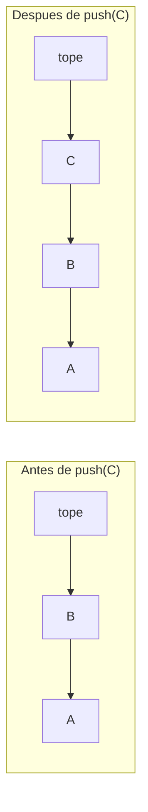

> 📖 Lectura previa a la clase — unos 15 minutos. Al final, responde la autoevaluación.

## La pila de platos del escurridor

Terminas de lavar los platos A, B y C, en ese orden. Los pones en el escurridor uno encima del otro: A queda abajo, B en medio y C arriba. Cuando llega la hora de cenar, ¿qué plato tomas? El de arriba, C. Luego B y al final A. Nadie saca A primero: tendría que desarmar toda la torre.

Tres cosas pasan siempre con esa pila:

- El plato limpio nuevo **solo se pone encima**; no lo metes en el medio.
- El plato que tomas **solo sale de arriba**: el último en llegar es el primero en salir.
- Puedes **mirar** cuál es el plato de arriba sin llevártelo. Y si no quedan platos, no hay nada que tomar: extender la mano al vacío es un error, no te da "un plato nulo".

## Del ejemplo a las reglas: el TAD Pila

Cada regla de la cocina es una operación. Un **tipo abstracto de dato (TAD)** dice *qué* se puede hacer con una estructura, sin decir cómo está construida por dentro.

| En la cocina | Operación |
|---|---|
| Pongo un plato encima | `push(valor)` |
| Tomo el plato de arriba | `pop()` |
| Miro el plato de arriba sin tomarlo | `peek()` |
| ¿Hay platos? | `isEmpty()` |
| ¿Cuántos platos hay? | `size()` |

> **Pila (stack):** TAD lineal en el que las inserciones y eliminaciones ocurren siempre por un único extremo, llamado **tope**, con disciplina **LIFO** (_Last In, First Out_): el último en entrar es el primero en salir.

## push y pop: poner y tomar por arriba

**Así en la vida real:** apilas A, B y C; los retiras en el orden C, B, A. Cada plato nuevo se suma encima de los que ya estaban; cada retiro saca únicamente el de arriba.

**Así en código:** `push` agrega en el tope y `pop` retira y devuelve el elemento del tope. Si apilas `"A"`, `"B"`, `"C"`, tres `pop()` seguidos devuelven `"C"`, `"B"` y `"A"`. Esa restricción —un solo extremo— es lo que hace predecible el orden de salida.

> **push:** agrega un elemento en el tope. **pop:** retira y devuelve el elemento del tope; modifica la pila.

## peek, isEmpty y size: mirar sin tomar

**Así en la vida real:** echas un vistazo al plato de arriba para decidir si sirve; el escurridor queda igual.

**Así en código:** `peek` devuelve el elemento del tope **sin retirarlo**. Piensa en el botón "atrás" del navegador: la barra de direcciones te muestra la página más reciente del historial (`peek`), y solo al presionar "atrás" esa página se descarta (`pop`). Confundir `peek` con `pop` es el error conceptual más común con pilas.

`isEmpty` y `size` responden lo que tú responderías mirando el escurridor: si hay platos y cuántos. Sirven para protegerte *antes* de tomar.

> **peek:** devuelve el elemento del tope sin modificar la pila. **isEmpty:** indica si no hay elementos. **size:** devuelve la cantidad actual.

## Pila vacía: la mano en el vacío es un error

**Así en la vida real:** no quedan platos. Extender la mano no produce un plato "nulo": te avisa que hiciste algo imposible.

**Así en código:** `pop()` y `peek()` sobre una pila vacía deben **lanzar un error**, no devolver `null`. Un `null` silencioso viajaría por el programa y estallaría lejos de donde nació, con un `NullPointerException` difícil de rastrear. Lanzar `IllegalStateException` en el punto exacto del error lo hace visible de inmediato.

## Del escurridor a la memoria: un nodo por plato

**Así en la vida real:** cada plato está apoyado sobre el de abajo, y para llegar a cualquiera hay que empezar por el de arriba. Solo necesitas saber cuál es el de arriba.

**Así en código:** cada plato es un **nodo**: una cajita con el valor y la referencia al nodo que quedó debajo. La pila completa es una sola referencia, `tope`, al nodo de arriba.

```java
public class Nodo<T> {
    T dato;
    Nodo<T> siguiente; // el "plato de abajo"; null si no hay ninguno

    Nodo(T dato) {
        this.dato = dato;
    }
}
```

## La clase `Pila<T>`: mover el tope

**Así en la vida real:** poner un plato es apoyarlo sobre el que era el tope; tomar uno es dejar como nuevo tope al plato que estaba debajo. Ningún plato cambia de sitio.

**Así en código:** `push` y `pop` solo reacomodan a qué nodo apunta `tope`.

```java
public class Pila<T> {
    private Nodo<T> tope;
    private int tamano;

    public void push(T valor) {
        Nodo<T> nuevo = new Nodo<>(valor);
        nuevo.siguiente = tope; // 1. el nodo nuevo se apoya en el tope actual
        tope = nuevo;           // 2. ahora el nuevo es el tope
        tamano++;
    }

    public T pop() {
        if (isEmpty()) {
            throw new IllegalStateException("La pila está vacía");
        }
        T valor = tope.dato;    // guarda el dato antes de perder el nodo
        tope = tope.siguiente;  // el tope "baja" un lugar
        tamano--;
        return valor;
    }
}
```

Si invirtieras las dos líneas de `push`, perderías la referencia al resto de la pila. En `pop`, el nodo retirado queda sin ninguna referencia apuntándolo y Java lo libera solo. El estado intermedio —invisible en el código— se ve así:


```mermaid
flowchart LR
  subgraph Antes["Antes de push(C)"]
    T1["tope"] --> B1["B"] --> A1["A"]
  end
  subgraph Despues["Despues de push(C)"]
    T2["tope"] --> C2["C"] --> B2["B"] --> A2["A"]
  end
```

Tras `push(C)`, `C` apunta a `B` y `tope` apunta a `C`. Un `pop()` hace el camino inverso: devuelve `C` y `tope` vuelve a `B`.

Las consultas no modifican ningún nodo:

```java
public T peek() {
    if (isEmpty()) {
        throw new IllegalStateException("La pila está vacía");
    }
    return tope.dato; // solo lee; no toca tope ni tamano
}

public boolean isEmpty() {
    return tope == null; // ningún plato encima de nada
}

public int size() {
    return tamano;
}
```

Ninguna operación recorre la cadena: todas trabajan sobre `tope`, así que cuestan lo mismo con 3 elementos que con 3 000.

## Dónde se rompe la analogía

Un escurridor real permite cosas que `Pila<T>` prohíbe a propósito:

- **Acceso al medio:** en la cocina puedes sacar con cuidado el plato de abajo. En `Pila<T>` no existe esa operación: el único acceso es el tope, y esa limitación es lo que garantiza el orden LIFO.
- **Límite de altura:** el escurridor se llena y los platos se caen. `Pila<T>` no tiene tope físico: crece mientras haya memoria.
- **Vacío:** con la pila vacía, en la cocina simplemente te quedas sin cenar; en código, la excepción es la forma de que el programa no siga como si nada.

## Resumen operativo

| Operación | Qué hace con `tope` | ¿Modifica la pila? | Precondición |
|-----------|----------------------|----------------------|--------------|
| `push(valor)` | Crea un nodo, lo enlaza al tope actual y lo vuelve el nuevo tope | Sí | Ninguna |
| `pop()` | Guarda `tope.dato`, avanza `tope` a `tope.siguiente` | Sí | Pila no vacía |
| `peek()` | Lee `tope.dato` sin tocar `tope` | No | Pila no vacía |
| `isEmpty()` | Verifica si `tope == null` | No | Ninguna |
| `size()` | Devuelve `tamano` | No | Ninguna |

## ¿Dónde aparece en tu proyecto?

En el **Sistema Bancario**, cada depósito o retiro se apila como una `Transaccion`; "deshacer última transacción" es un `pop()` que retira justo la más reciente, nunca una al azar. En la **Papelería**, `Pila<Venta>` permite anular la última venta y restaurar el stock. En el **Consultorio Médico**, `peek()` da la última consulta de un paciente sin sacarla del historial.

Fuera de tu proyecto, el mismo patrón está en todas partes:

- **Deshacer de un editor:** `Ctrl+Z` retira la acción más reciente.
- **Botón "atrás" del navegador:** cada página visitada se apila; "atrás" retira la más reciente y te deja en la anterior.
- **Pila de llamadas:** cuando una función llama a otra, la primera queda pendiente; el programa vuelve en orden inverso, la última llamada primero. Una recursión sin caso base apila sin desapilar hasta agotar la memoria (_stack overflow_).

## Síntesis

- Una **pila** es un TAD **LIFO**: como los platos del escurridor, el último en entrar es el primero en salir (A, B, C entran; C, B, A salen).
- `push` agrega en el **tope** y `pop` retira del tope; `peek` lo consulta sin modificar la pila.
- `pop` o `peek` sobre una pila vacía deben lanzar un error, nunca devolver `null`.
- Se construye con nodos `Nodo<T>` encadenados hacia abajo; la pila entera es la referencia `tope`.
- La analogía se rompe donde importa: `Pila<T>` no da acceso al medio ni tiene altura máxima física.
- Deshacer, historial y pila de llamadas son la misma pila aplicada a datos distintos.
