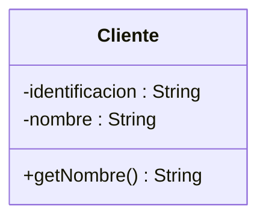
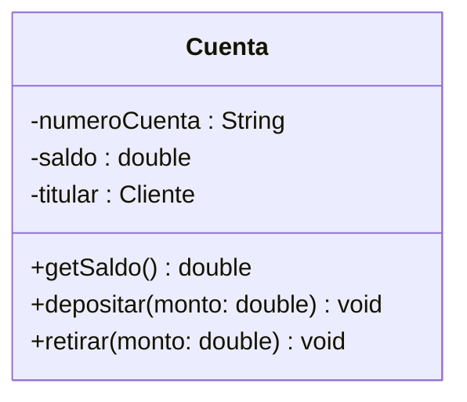
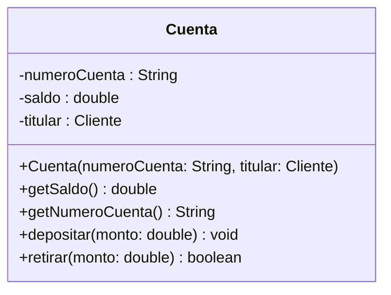

## El problema: diseñar en papel antes de escribir código

Tu equipo del proyecto de aula se reparte el trabajo del Sistema Bancario:
una persona modela `Cliente`, la otra modela `Cuenta`. Nadie se sienta antes
a acordar qué atributos tiene cada clase ni qué métodos va a necesitar la
otra parte. Cada quien programa por su cuenta durante dos días.

Al integrar el código, nada calza. Quien hizo `Cuenta` esperaba un método
`getIdentificacion()` en `Cliente` que nunca se escribió — la otra persona lo
llamó `getId()`. Quien hizo `Cliente` supuso que `Cuenta` guardaría el saldo
como `int`; la otra parte lo declaró `double`. Ya escribieron cientos de
líneas de código para descubrir un desacuerdo que podían haber resuelto en
cinco minutos de conversación, antes de abrir el editor.

## La solución: UML y el diagrama de clases

**UML** (_Unified Modeling Language_) es el lenguaje visual estándar de la
industria del software para representar el diseño de un sistema antes,
durante y después de programarlo. No es un lenguaje de programación: es una
notación gráfica que cualquier equipo, en cualquier empresa, reconoce sin
necesidad de traducción.

De los muchos tipos de diagrama que define UML, el que vas a usar en este
curso es el **diagrama de clases**: representa la estructura interna de una
clase — su nombre, sus atributos y sus métodos — antes de escribir una sola
línea de Java.



> **Diagrama de clases:** representación gráfica UML de una clase, que
> muestra su nombre, sus atributos y sus métodos, junto con la visibilidad de
> cada uno — sin depender de la sintaxis de ningún lenguaje concreto.

Con este diagrama, tu compañero de equipo sabe exactamente qué esperar de
`Cliente` sin haber leído una línea de código.

## Anatomía de una clase en UML

**Situación:** el diagrama anterior ya muestra una clase, pero necesitas
saber con precisión qué va en cada parte del recuadro para poder leer —o
dibujar— cualquier clase del proyecto.

**En la práctica**, todo recuadro de clase en UML se divide en **tres
compartimentos**, siempre en el mismo orden:

1. **Nombre de la clase** — arriba, tal como se llamaría en el código
   (`Cuenta`, no "cuenta bancaria").
2. **Atributos** — en medio, uno por línea.
3. **Métodos** — abajo, uno por línea.



Los tres compartimentos son obligatorios en la notación, aunque alguno esté
vacío: una clase sin atributos igual dibuja el compartimento del medio, solo
que en blanco. Esta estructura es la misma sin importar cuántos atributos o
métodos tenga la clase — es lo primero que reconoces al mirar cualquier
diagrama de clases.

## Visibilidad: los símbolos +, -,

**Situación:** en el diagrama de `Cuenta` cada atributo y cada método
arranca con un símbolo (`-`, `+`). No es decorativo — es la visibilidad, el
mismo concepto que ya usaste con `private` y `public` en la lección de
Encapsulamiento.

**En la práctica**, UML define un símbolo por cada modificador de acceso de
Java que vas a usar en este curso:

| Símbolo UML | Modificador Java | Significado                           |
| ----------- | ---------------- | ------------------------------------- |
| `+`         | `public`         | Visible desde cualquier parte         |
| `-`         | `private`        | Visible solo dentro de la misma clase |
| `#`         | `protected`      | Visible en el paquete y en subclases  |

El patrón que ya viste en `Cliente` y `Cuenta` se repite en casi cualquier
clase de dominio: atributos con `-` (`private`, protegidos por
encapsulamiento) y métodos con `+` (`public`, la interfaz que expone la
clase). Cuando en un diagrama ves `-saldo` y `+getSaldo()`, ya sabes —sin leer
una línea de Java— que `saldo` está encapsulado y que `getSaldo()` es el
único camino para leerlo desde afuera.

## Atributos: nombre y tipo en UML

**Situación:** ya sabes que `-saldo` significa "atributo privado llamado
`saldo`". Falta una pieza: ¿de qué tipo es?

**En la práctica**, UML anota el tipo de cada atributo con la notación
`nombre: Tipo` —el nombre primero, dos puntos, y el tipo después—:

```
-identificacion: String
-nombre: String
-saldo: double
```

Léelo de izquierda a derecha: símbolo de visibilidad, nombre del atributo,
dos puntos, tipo. Esta notación es la que vas a ver en cualquier diagrama de
clases, sin importar la herramienta con la que se dibujó: `-saldo: double` se
traduce, casi carácter por carácter, al `private double saldo;` que ya
escribiste en Java.

## Métodos: firma en UML

**Situación:** los atributos ya tienen tipo. Los métodos necesitan algo más:
qué reciben y qué devuelven.

**En la práctica**, la notación de un método en UML es
`nombre(parametro: Tipo): TipoRetorno`:

```
+getSaldo(): double
+depositar(monto: double): void
```

Contrasta esa notación con la firma equivalente en Java:

```java
public double getSaldo() {
    return saldo;
}

public void depositar(double monto) {
    saldo = saldo + monto;
}
```

La correspondencia es directa: el símbolo `+` es `public`, el tipo después
de los dos puntos finales es el tipo de retorno (`void` si el método no
devuelve nada), y cada parámetro dentro del paréntesis lleva su propio
`nombre: Tipo`. Un método sin parámetros —como `getSaldo()`— deja el
paréntesis vacío en ambas notaciones.

## Leer un diagrama de clases completo

**Situación:** ya conoces cada pieza por separado. El siguiente diagrama las
junta todas en una sola clase, con más detalle del que has visto hasta
ahora — así se ve un diagrama real de un proyecto.



Léelo compartimento por compartimento:

- **Nombre:** `Cuenta` — así se va a llamar la clase en el código.
- **Atributos:** tres, todos `-` (`private`). `numeroCuenta` y `saldo` son
  tipos simples (`String`, `double`); `titular` es de tipo `Cliente` — un
  atributo puede ser otra clase del mismo proyecto, no solo un tipo
  primitivo.
- **Métodos:** el primero, `+Cuenta(numeroCuenta: String, titular: Cliente)`,
  es el constructor —se distingue porque no tiene tipo de retorno y comparte
  el nombre de la clase—. Los siguientes son `public`, cada uno con su firma
  completa.

Con esa lectura, ya podrías escribir el esqueleto de `Cuenta.java` sin haber
visto una línea del archivo real: sabes exactamente qué atributos declarar,
qué constructor escribir y qué firma le corresponde a cada método. Esa es la
prueba de que el diagrama cumplió su función — comunicar el diseño completo
de la clase sin ambigüedad.

## Resumen operativo

| Símbolo UML                        | Significado                       | Equivalente Java                             |
| ---------------------------------- | --------------------------------- | -------------------------------------------- |
| `+`                                | Visibilidad pública               | `public`                                     |
| `-`                                | Visibilidad privada               | `private`                                    |
| `#`                                | Visibilidad protegida             | `protected`                                  |
| `nombre: Tipo`                     | Atributo con su tipo              | `private double saldo;`                      |
| `nombre(param: Tipo): TipoRetorno` | Firma de un método                | `public double getSaldo() { ... }`           |
| `+NombreClase(param: Tipo)`        | Constructor (sin tipo de retorno) | `public Cuenta(String numeroCuenta) { ... }` |

## Síntesis

- Sin un diseño acordado antes de programar, equipos que trabajan en
  paralelo terminan con clases que no calzan entre sí.
- El **UML** es el lenguaje visual estándar de la industria para documentar
  y comunicar el diseño de una clase antes de escribir código.
- Todo **diagrama de clases** tiene tres compartimentos fijos: nombre,
  atributos y métodos.
- Los símbolos de **visibilidad** (`+`, `-`, `#`) mapean directamente a
  `public`, `private` y `protected` — el mismo concepto que ya viste en
  Encapsulamiento.
- Los **atributos** se anotan `nombre: Tipo`; los **métodos**,
  `nombre(parametro: Tipo): TipoRetorno`, con correspondencia casi literal
  a la firma en Java.
- Leer un diagrama completo, compartimento por compartimento, te permite
  predecir el esqueleto del `.java` sin haberlo visto todavía.
- Esta lección modeló clases **aisladas**. El mismo diagrama se va a ampliar
  más adelante para mostrar cómo se relacionan entre sí — por ahora, con lo
  que tienes, ya puedes diseñar cualquier clase de dominio de tu proyecto
  antes de programarla.
