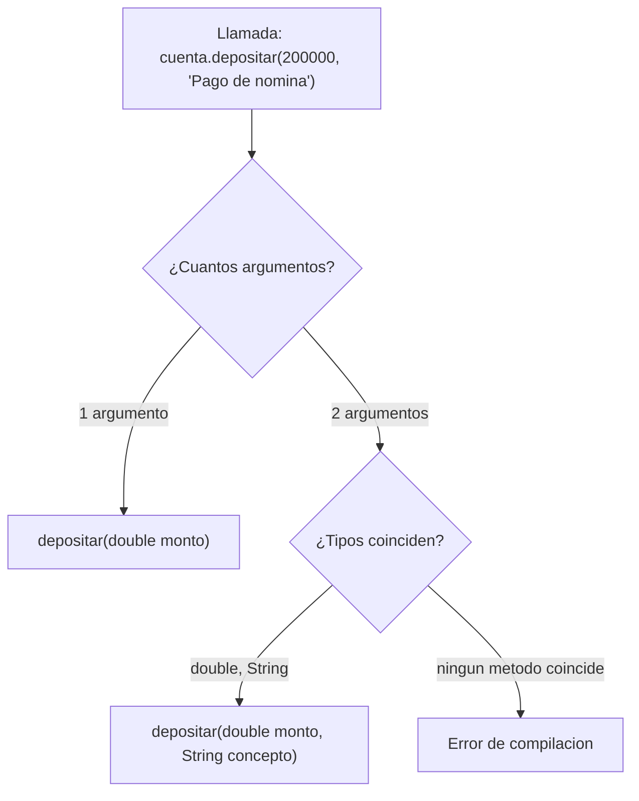
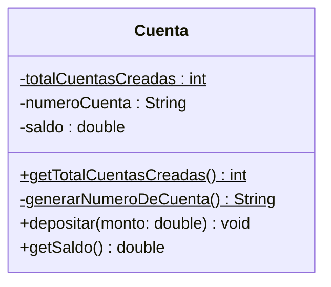

<Callout tipo="nota">
Repositorio de referencia del proyecto (Sistema Bancario): [github.com/santiagoSuarez219/estructura-de-datos-sistema-bancario](https://github.com/santiagoSuarez219/estructura-de-datos-sistema-bancario). Clónalo para seguir los ejemplos de esta lección sobre el código real del proyecto.
</Callout>

## El problema: dos métodos que hacen lo mismo

Retoma la clase `Cuenta` del sistema bancario. Ya sabe recibir depósitos, pero
a veces la transacción trae un concepto ("pago de nómina", "consignación en
efectivo") y a veces no. La solución ingenua es escribir dos métodos:

```java
public void depositarConMonto(double monto) {
    setSaldo(getSaldo() + monto);
}

public void depositarConMontoYConcepto(double monto, String concepto) {
    setSaldo(getSaldo() + monto);
    registrarMovimiento(concepto);
}
```

Los dos métodos hacen conceptualmente **lo mismo** — depositar dinero en la
cuenta — pero el nombre tuvo que inventarse para distinguirlos, porque Java no
permite dos métodos con el mismo nombre y los mismos parámetros. El resultado
es un nombre artificial que no describe una acción distinta, solo describe
"la misma acción con más o menos datos".

## Sobrecarga de métodos (overloading)

**En la práctica**, Java sí permite que dos métodos compartan nombre, siempre
que su **lista de parámetros** sea distinta. Ya viste esto con constructores
en Encapsulamiento — la sobrecarga de métodos es exactamente el mismo
mecanismo, aplicado a cualquier método:

```java
public class Cuenta {
    private double saldo;

    public void depositar(double monto) {
        setSaldo(getSaldo() + monto);
    }

    public void depositar(double monto, String concepto) {
        setSaldo(getSaldo() + monto);
        registrarMovimiento(concepto);
    }
}
```

```java
Cuenta cuenta = new Cuenta();
cuenta.depositar(50000);                       // llama a la primera version
cuenta.depositar(200000, "Pago de nomina");    // llama a la segunda
```

El compilador decide **en tiempo de compilación** cuál versión ejecutar,
comparando la cantidad y el tipo de los argumentos de la llamada contra la
lista de parámetros de cada método declarado:



> **Sobrecarga de métodos (overloading):** declarar varios métodos con el
> mismo nombre dentro de la misma clase, distinguibles solo por su lista de
> parámetros (cantidad, tipo u orden). El compilador elige la versión correcta
> según los argumentos de cada llamada.

## El problema: ¿cuántas cuentas lleva creadas el banco?

Cada objeto `Cuenta` sabe su propio saldo, su propio titular, su propio
número. Pero ¿cuántas cuentas ha creado el banco en total, desde que arrancó
el programa? Ese dato no le pertenece a ninguna cuenta en particular —no es
"el conteo de la cuenta 1002", es un dato del **banco como concepto**. Si lo
guardas como atributo normal de `Cuenta`, cada objeto tendría su propia copia
del contador, cada una arrancando en un valor distinto, y ninguna sabría el
total real.

## Atributos y métodos estáticos (static)

**En la práctica**, Java resuelve esto con la palabra clave `static`: un
atributo `static` no vive dentro de cada objeto, vive **una sola vez**, en la
clase misma. Todos los objetos de esa clase comparten la misma copia.

```java
public class Cuenta {
    private static int totalCuentasCreadas = 0;   // pertenece a la clase, no al objeto
    private String numeroCuenta;
    private double saldo;

    public Cuenta(String titular) {
        totalCuentasCreadas++;                      // se actualiza una sola vez, compartido
        this.numeroCuenta = generarNumeroDeCuenta(); // metodo estatico auxiliar
        this.saldo = 0;
    }

    private static String generarNumeroDeCuenta() {
        return "CTA-" + (1000 + totalCuentasCreadas);
    }

    public static int getTotalCuentasCreadas() {
        return totalCuentasCreadas;
    }
}
```

```java
Cuenta c1 = new Cuenta("Maria");
Cuenta c2 = new Cuenta("Andres");
System.out.println(Cuenta.getTotalCuentasCreadas());   // 2 — se llama sobre la clase, no sobre un objeto
```

Un método `static` solo puede tocar atributos y métodos `static` de la misma
clase directamente — no tiene un objeto (`this`) asociado, así que no puede
leer `saldo` ni `numeroCuenta` de ninguna cuenta en particular.



> **Miembro estático (`static`):** atributo o método que pertenece a la clase
> misma y no a cada objeto individual. Existe una única copia, compartida por
> todas las instancias, y se accede con `NombreClase.miembro` en vez de
> `objeto.miembro`.

Esto es lo que te permite modelar datos que describen a la clase como
concepto —un contador, un límite global, una configuración compartida— sin
inventar un objeto extra solo para guardarlos.

## Cuándo NO usar static

La tentación después de ver esto es marcar cualquier atributo como `static`
"para no tener que pasarlo entre objetos". Es un error de encapsulamiento:
`saldo` y `titular` sí varían de una cuenta a otra, así que **no pueden** ser
`static` — si lo fueran, todas las cuentas del banco compartirían el mismo
saldo, y depositar en una cuenta cambiaría el saldo de todas las demás.

```java
private static double saldo;   // INCORRECTO: cada cuenta necesita su propio saldo
```

La pregunta que decide es siempre la misma: **¿este dato describe a un objeto
particular, o describe a la clase como concepto?** Si depende de qué objeto
estás mirando, es de instancia. Si es el mismo sin importar qué objeto
consultes, es candidato a `static`.

## Síntesis

- La **sobrecarga de métodos** deja usar el mismo nombre para variantes de la
  misma acción, distinguidas por su lista de parámetros — el compilador
  resuelve cuál invocar en tiempo de compilación.
- Los miembros **`static`** pertenecen a la clase, no a cada objeto: úsalos
  para datos o comportamientos que describen la clase como concepto (un
  contador, un generador de identificadores), nunca para atributos que varían
  de un objeto a otro.
