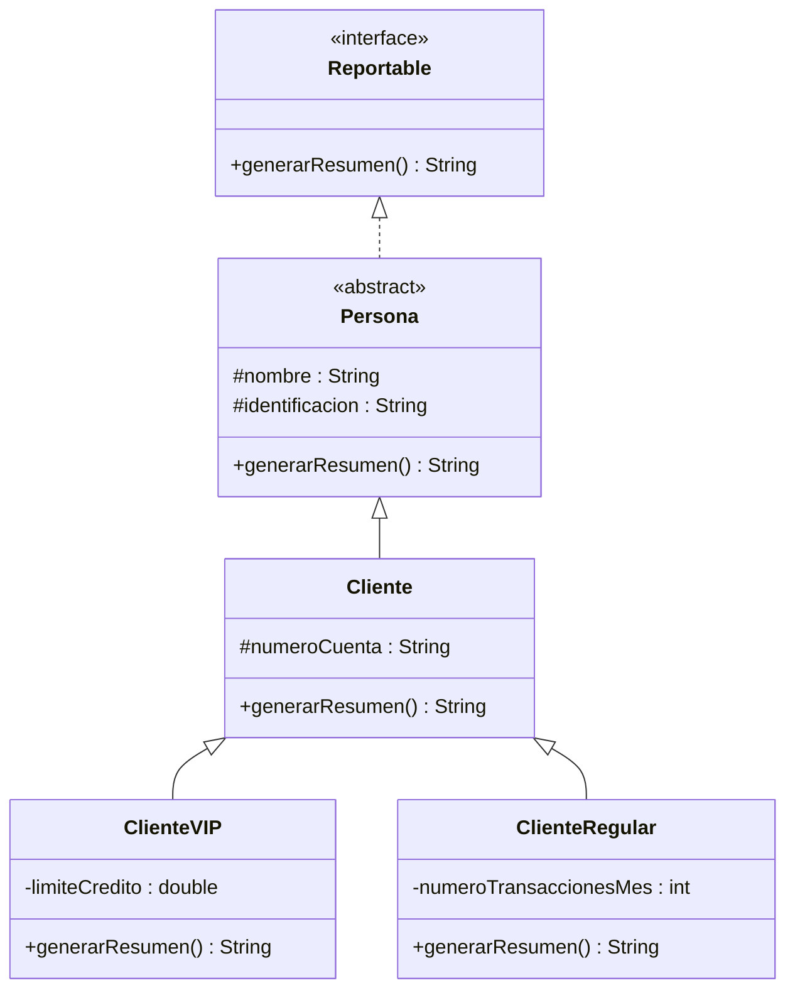

# Lab 03 — Jerarquía de clases de tres niveles y polimorfismo · Guía del docente

## Ficha de la sesión

| Campo | Valor |
|---|---|
| Curso | Estructuras de Datos |
| Semana / sesión | Semana 3, sesión P (viernes 21 de agosto) |
| Duración | 2 horas (120 minutos) |
| Momento evaluativo | Ninguno — **Seguimiento continuo**. El ★ M1 (POO, 15 %) cierra en la Semana 4 (28 de agosto); esta sesión es la preparación práctica inmediatamente anterior. |
| Lecciones teóricas de las que depende | "Herencia" (T1, martes 18 ago) y "Polimorfismo" (T2, jueves 20 ago) |
| Sprint del proyecto de aula | Sprint 1 — POO y arquitectura base (Semanas 1–4) |

## Objetivo de la sesión

Al salir del aula, cada estudiante debe poder:

- Extender una jerarquía de dos niveles a **tres niveles** (`Persona → Cliente → ClienteVIP/ClienteRegular`, o el equivalente en su caso de estudio) usando `extends`, `@Override` y `super(...)`.
- Definir una interfaz simple y hacer que una clase abstracta la implemente, distinguiendo verbalmente "implementa interfaz" de "extiende clase abstracta".
- Escribir y ejecutar una prueba con un arreglo de referencias del tipo interfaz que demuestre binding dinámico en consola.
- Leer un diagrama de clases UML e identificar clase abstracta, interfaz, flecha de herencia y flecha de realización, sin haberlo construido desde cero (eso es de la Semana 4).

## Conexión con la teoría

La lección "Herencia" dejó la jerarquía `Cuenta → CuentaAhorros/CuentaCorriente` (dos niveles) y la lección "Polimorfismo" agregó la interfaz `Auditable` y la clase abstracta `Cuenta` con `calcularInteres()` abstracto. Esta sesión da el paso que ninguna de las dos lecciones dio todavía: **un tercer nivel** de herencia (un `ClienteVIP` que a su vez es un `Cliente`) y la prueba explícita del polimorfismo con un arreglo de referencias recorrido en un `for`.

Pregunta de apertura para el grupo: *"Si `ClienteVIP extends Cliente` y `Cliente extends Persona`, y las tres sobreescriben `generarResumen()`, ¿qué versión se ejecuta cuando la referencia declarada es `Reportable` pero el objeto real es un `ClienteVIP`?"* — la respuesta que deben poder justificar (no solo recordar) es "la de `ClienteVIP`, porque el binding es dinámico y mira el tipo real del objeto, no el tipo de la referencia".

## Minutado

| Tiempo | Bloque | Qué hace el docente | Qué hace el estudiante |
|---|---|---|---|
| 0–10' | Recordatorio activo T1–T2 | Lanza la pregunta de apertura de arriba y dos preguntas rápidas más (ver "Preguntas socráticas"). No corrige en el pizarrón todavía — solo recoge respuestas en voz alta. | Responde desde su puesto, sin código abierto. Activa lo visto el martes y el jueves. |
| 10–40' | Demo en vivo + lectura guiada del diagrama | Codifica en vivo la jerarquía de referencia del Sistema Bancario (ver "Desarrollo paso a paso"): `Reportable`, `Persona` abstracta, `Cliente`, `ClienteVIP`, `ClienteRegular`, y la prueba con `Reportable[]`. Proyecta el UML de esa misma jerarquía (ver diagrama) y nombra cada parte señalando sobre el diagrama: clase abstracta, interfaz, flecha de herencia (`<\|--`) vs. flecha de realización (`<\|..`). | Sigue la demo sin escribir código todavía. Identifica en voz alta, cuando el docente pregunta, qué flecha del diagrama corresponde a `implements` y cuál a `extends`. |
| 40–100' | Trabajo en equipos sobre su caso de estudio | Circula entre equipos. Punto de control a los **20'** de este bloque (minuto 60 de la sesión): cada equipo debe tener ya decidido el nombre de sus dos subtipos de tercer nivel y el método declarado en su interfaz. Punto de control a los **45'** de este bloque (minuto 85 de la sesión): cada equipo debe tener la jerarquía compilando, aunque `generarResumen()` todavía esté a medio implementar en algún nivel. | Extiende la jerarquía existente de su caso de estudio a tres niveles, define la interfaz equivalente a `Reportable` en su dominio, y la implementa/sobreescribe en cada nivel. Trabaja sobre su propio repositorio del proyecto de aula. |
| 100–120' | Cierre: prueba polimórfica en vivo | Pide a 2–3 equipos (rotando semana a semana) que compartan pantalla y corran su prueba con arreglo de referencias frente al grupo. Cierra nombrando explícitamente qué faltó ver en detalle sobre UML — eso es lo que abre la Semana 4. | Cada equipo ejecuta su `Main` (o clase de prueba) con el arreglo de referencias y muestra la salida polimórfica por consola. |

**Total: 120 minutos.**

## Desarrollo paso a paso

### Paso 1 — La interfaz `Reportable`

Contrato mínimo, sin estado, que cualquier nivel de la jerarquía debe cumplir:

```java
public interface Reportable {
    String generarResumen();
}
```

Punto a resaltar en la demo: es una interfaz de un solo método — suficiente
para el ejercicio, sin sobrecargar la sesión con `default`/`static`.

### Paso 2 — `Persona`, clase abstracta que implementa la interfaz

```java
public abstract class Persona implements Reportable {
    protected String nombre;
    protected String identificacion;

    public Persona(String nombre, String identificacion) {
        this.nombre = nombre;
        this.identificacion = identificacion;
    }

    @Override
    public String generarResumen() {
        return "Persona: " + nombre + " (ID " + identificacion + ")";
    }
}
```

Punto a resaltar: `Persona` **sí** puede dar una implementación por defecto de
`generarResumen()` — no es obligatorio dejarlo `abstract` solo porque venga de
una interfaz. La clase completa (`Persona`) sigue siendo `abstract` porque no
tiene sentido instanciar "una persona genérica del banco" sin saber si es
cliente, empleado, etc. Ese es el matiz que separa "abstracta porque no debe
instanciarse conceptualmente" de "abstracta porque tiene métodos sin cuerpo".

### Paso 3 — `Cliente`, segundo nivel

```java
public class Cliente extends Persona {
    protected String numeroCuenta;

    public Cliente(String nombre, String identificacion, String numeroCuenta) {
        super(nombre, identificacion);
        this.numeroCuenta = numeroCuenta;
    }

    @Override
    public String generarResumen() {
        return super.generarResumen() + " | Cuenta: " + numeroCuenta;
    }
}
```

Punto a resaltar: `Cliente` reutiliza `super.generarResumen()` en vez de
reescribir el formato completo — es el mismo patrón de `super.metodo()` que
vieron en la lección de Herencia, aplicado ahora sobre un método que viene
de una interfaz vía una clase abstracta intermedia.

### Paso 4 — `ClienteVIP` y `ClienteRegular`, tercer nivel

```java
public class ClienteVIP extends Cliente {
    private double limiteCredito;

    public ClienteVIP(String nombre, String identificacion, String numeroCuenta, double limiteCredito) {
        super(nombre, identificacion, numeroCuenta);
        this.limiteCredito = limiteCredito;
    }

    @Override
    public String generarResumen() {
        return super.generarResumen() + " | VIP, cupo: " + limiteCredito;
    }
}

public class ClienteRegular extends Cliente {
    private int numeroTransaccionesMes;

    public ClienteRegular(String nombre, String identificacion, String numeroCuenta, int numeroTransaccionesMes) {
        super(nombre, identificacion, numeroCuenta);
        this.numeroTransaccionesMes = numeroTransaccionesMes;
    }

    @Override
    public String generarResumen() {
        return super.generarResumen() + " | Regular, transacciones del mes: " + numeroTransaccionesMes;
    }
}
```

Punto a resaltar: los **tres** niveles (`Persona`, `Cliente`, `ClienteVIP`/
`ClienteRegular`) sobreescriben `generarResumen()`, encadenando `super` en
cada paso. Esto es intencional: hace visible en la salida de consola que la
cadena completa se ejecutó, no solo el nivel más específico.

### Paso 5 — Prueba con arreglo de referencias

```java
public class Main {
    public static void main(String[] args) {
        Reportable[] personas = {
            new ClienteVIP("Ana Torres", "1001", "CTA-001", 5_000_000),
            new ClienteRegular("Luis Pérez", "1002", "CTA-002", 7)
        };

        for (Reportable p : personas) {
            System.out.println(p.generarResumen());
        }
    }
}
```

Salida esperada:

```
Persona: Ana Torres (ID 1001) | Cuenta: CTA-001 | VIP, cupo: 5000000.0
Persona: Luis Pérez (ID 1002) | Cuenta: CTA-002 | Regular, transacciones del mes: 7
```

Punto a resaltar: la variable de recorrido es `Reportable p`, **no**
`Cliente p` ni `ClienteVIP p`. El arreglo declarado como `Reportable[]` es la
prueba de que ni la interfaz ni la clase abstracta necesitan saber, en tiempo
de compilación, qué subtipo concreto van a recorrer — eso es exactamente lo
que valida el ejercicio.

## Diagrama de clases para la lectura guiada (minuto 10–40)

Proyectar este diagrama junto al código. El objetivo del bloque es que el
grupo aprenda a **leer** las partes marcadas, no a dibujarlo — construir un
UML completo de las cuatro capas es el contenido de la Semana 4.



Guion de lectura, señalando cada elemento en orden:

1. **`<<interface>>` sobre `Reportable`** — así se marca una interfaz en UML; no tiene atributos, solo la firma del método.
2. **`<<abstract>>` sobre `Persona`** — clase que no se puede instanciar directamente; nombre en itálica en un UML dibujado a mano, aquí marcado con la etiqueta.
3. **Flecha punteada con triángulo hueco (`<|..`), de `Persona` a `Reportable`** — es **realización**: "`Persona` implementa el contrato de `Reportable`". Es la flecha que más se confunde con la de herencia — resaltar que es **punteada**.
4. **Flechas sólidas con triángulo hueco (`<|--`)** — son **herencia**: `Cliente` extiende `Persona`, `ClienteVIP` y `ClienteRegular` extienden `Cliente`. Continua, no punteada.
5. **Tres niveles en la misma cadena de flechas sólidas** — así se ve una jerarquía de tres niveles en UML: no hay una notación especial, solo dos flechas de herencia encadenadas.

## Puntos de control

| Minuto de la sesión | Qué revisar en pantalla | Señal de que va bien |
|---|---|---|
| 60' (20' del bloque de trabajo) | Nombre de las dos subclases de tercer nivel y firma del método de su interfaz equivalente a `Reportable` | El equipo puede nombrar sus dos subtipos y explicar en una frase qué los diferencia, sin código escrito todavía |
| 85' (45' del bloque de trabajo) | La jerarquía completa compila (`javac`) aunque la lógica de negocio esté incompleta | Cero errores de compilación por sintaxis de `extends`/`implements`; los métodos abstractos/de interfaz están al menos declarados en cada clase concreta |

## Errores frecuentes y cómo intervenir

| Síntoma observable | Causa probable | Intervención sugerida |
|---|---|---|
| El método sobreescrito no se ejecuta — sale la versión del padre aunque el objeto sea del hijo | Falta `@Override`, y el "método nuevo" tiene una firma ligeramente distinta (typo, parámetro de más) que no sobreescribe nada | Pedir que agreguen `@Override` a todos los métodos que creen que están sobreescribiendo; si el compilador marca error ahí, ese es el bug |
| `error: cannot find symbol` apuntando a un atributo heredado | El atributo de la superclase quedó `private` en vez de `protected`, o se intentó acceder sin pasar por un getter | Revisar la declaración de atributos en la clase base del equipo; recordar la tabla de visibilidad de la lección de Herencia |
| `ClassCastException` o casteos explícitos dentro del `for` que recorre el arreglo | El estudiante declaró el arreglo como `Object[]` o como el tipo concreto más específico, y necesita castear para llamar al método | Preguntar: "¿de qué tipo debería ser el arreglo para no necesitar castear nada?" — la respuesta es el tipo de la interfaz o la clase abstracta común |
| `error: Cliente is not abstract and does not override abstract method` | Una subclase concreta no implementó un método abstracto heredado de una clase abstracta o de una interfaz | Revisar que **todas** las clases hoja (no abstractas) de la jerarquía tengan el método concreto |
| El constructor de la subclase no compila, o los atributos heredados quedan en `null`/`0` | No se invocó `super(...)` como primera línea del constructor, o se invocó con los argumentos en el orden equivocado | Volver al ejemplo de la lección de Herencia: `super(...)` es siempre la primera línea |
| En el diagrama, el equipo dibuja la flecha de `implements` igual que la de `extends` (ambas sólidas) | Confusión entre "implementa interfaz" y "extiende clase abstracta" — es el error de lectura más común de este bloque | Volver al diagrama proyectado y señalar de nuevo la diferencia punteada/sólida; pedir que digan en voz alta "esta flecha es realización, esta es herencia" antes de seguir |

## Preguntas socráticas

- *"¿Por qué `Persona` es `abstract` si ya tiene una implementación completa de `generarResumen()`?"* — Respuesta esperada: porque no tiene sentido instanciar "una persona genérica" en el dominio del banco; ser `abstract` no depende de tener métodos sin cuerpo, sino de si la clase representa un concepto completo por sí sola.
- *"Si cambio el arreglo de `Reportable[]` a `Cliente[]`, ¿sigue compilando el mismo `for`? ¿Y si lo cambio a `Persona[]`?"* — Respuesta esperada: sí en ambos casos, porque `ClienteVIP` y `ClienteRegular` son también `Cliente` y también `Persona` — el polimorfismo funciona con cualquier tipo de referencia que sea ancestro común del objeto real.
- *"¿Qué pasaría si `ClienteVIP` no sobreescribiera `generarResumen()`?"* — Respuesta esperada: se ejecutaría la versión heredada de `Cliente` (o de `Persona`, si `Cliente` tampoco la sobreescribiera) — no es un error, es exactamente cómo funciona la herencia cuando no hay sobreescritura.
- *"¿Podría `Persona` implementar dos interfaces a la vez?"* — Respuesta esperada: sí, `implements InterfazA, InterfazB` — a diferencia de `extends`, que admite una sola superclase.

## Diferenciación

**Sugerencia de tercer nivel por caso de estudio** (para orientar a los equipos que no arrancan; no es la única partición válida — el equipo puede justificar otra):

| Caso de estudio | Jerarquía existente (Sprint 1, Semana 2) | Tercer nivel sugerido |
|---|---|---|
| Papelería | `Producto` (abstracta) | `ProductoOficina` → `ArticuloPapeleria` / `ArticuloTecnologico` |
| Consultorio Médico | `Persona` (abstracta) → `Paciente` | `Paciente` → `PacienteRegular` / `PacienteHospitalizado` |
| Clínica Veterinaria | `Animal` (abstracta) → `Perro`/`Gato` | Extender sobre `Animal`: por ejemplo `Perro` → `PerroDeCompania` / `PerroDeAsistencia`, o el criterio equivalente que el equipo justifique sobre su subtipo actual |
| Sistema Académico | `Persona` (abstracta) → `Estudiante` | `Estudiante` → `EstudianteRegular` / `EstudianteBecado` |
| Liga de Fútbol | `Persona` (abstracta) → `Jugador` (abstracta) → `Portero`/`JugadorDeCampo` | **Ya tiene tres niveles nativos.** No pedirles inventar un cuarto nivel: aquí el ejercicio se reduce a agregar e implementar la interfaz `Reportable` (o su equivalente) sobre esa jerarquía ya existente. |

**Quien termina antes de los 60' del bloque de trabajo:** agregar un
**segundo método polimórfico** al contrato de la interfaz (por ejemplo
`Reportable` gana `String generarAlertaSiAplica()`) e implementarlo con
comportamiento distinto en cada nivel — refuerza que el contrato no está
limitado a un solo método.

**Quien no arranca:** aceptar como andamiaje mínimo que el equipo trabaje
sobre el Sistema Bancario de referencia (`Persona`/`Cliente`/`ClienteVIP`/
`ClienteRegular` de esta guía) en lugar de su propio caso, con el compromiso
de trasladarlo a su dominio antes del cierre de la sesión o como tarea
independiente. El objetivo del día es que salga con la mecánica de
`extends`/`implements`/`@Override` funcionando, no con el dominio correcto.

## Cierre de la sesión

Conectar explícitamente con la Semana 4: hoy leyeron un diagrama ya hecho e
identificaron sus partes; la próxima semana van a **construir** el diagrama
completo de las cuatro capas de su proyecto (con asociación, agregación y
composición además de herencia/realización) y ese diagrama es insumo directo
del laboratorio evaluativo ★ M1 del viernes 28 de agosto. Anunciar que la
guía de laboratorio de esta semana (publicada) incluye una Parte 4 opcional
con un segundo diagrama para practicar la lectura por su cuenta antes de esa
sesión.

## Materiales y preparación previa

- Tener compilado y probado el ejemplo completo del Sistema Bancario (`Reportable`, `Persona`, `Cliente`, `ClienteVIP`, `ClienteRegular`, `Main`) antes de entrar a clase, para la demo en vivo del bloque 10–40'.
- Tener el diagrama de clases de la sección anterior ya proyectable (esta guía, o una versión renderizada aparte) — no improvisarlo en el pizarrón durante la lectura guiada.
- Repasar el `microdiseno/projects/` de los 6 casos de estudio antes de la sesión, para poder orientar a cada equipo con la sugerencia de tercer nivel de la tabla de diferenciación sin tener que consultarla en vivo.
- Confirmar que cada equipo tiene acceso a su repositorio del proyecto de aula y que la jerarquía de encapsulamiento de la Semana 2 (clase de dominio abstracta con al menos un subtipo) ya está en `model/domain/` antes de esta sesión — sin eso, no hay base para extender a tres niveles.
