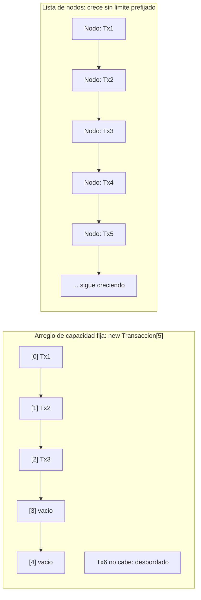
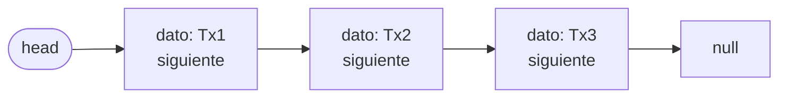
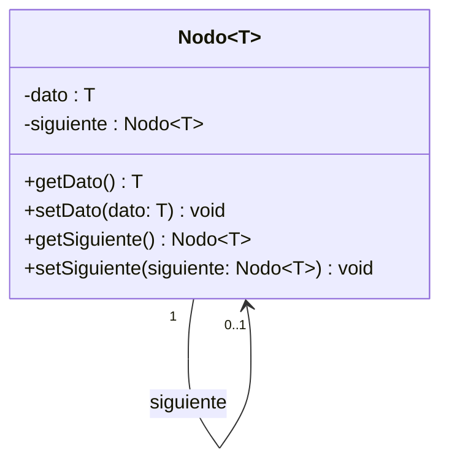
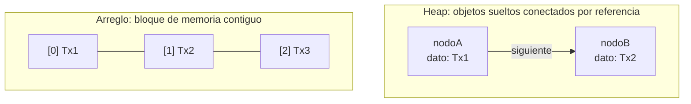
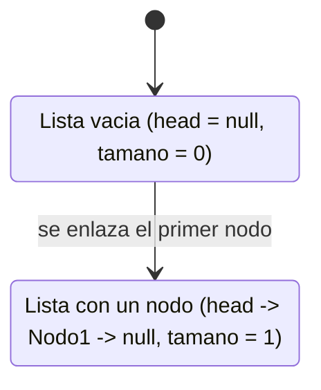

## El problema: el historial que no cabe en un arreglo

Imagina que estás construyendo el historial de transacciones de una cuenta
bancaria. El primer día tiene 3 movimientos. A la semana, 40. Al mes, nadie
sabe cuántos — depende de cuánto use la cuenta cada cliente. Si declaras
`Transaccion[] historial = new Transaccion[50]`, ¿qué pasa el día 51? Y si
declaras `new Transaccion[10000]` "para estar seguro", ¿qué pasa con las
miles de cuentas que solo tienen 5 movimientos y reservaron espacio para
10000 que nunca van a usar?



Un arreglo obliga a decidir el tamaño **antes** de saber cuántos datos van a
llegar. Y si te quedas corto, "agrandarlo" en Java no es una operación
mágica: significa crear un arreglo nuevo, más grande, y copiar uno por uno
todos los elementos del viejo al nuevo. El criterio de costo que ya
instalaste esta semana — contar cuántas operaciones hace un algoritmo según
el tamaño de la entrada — aplica exactamente igual aquí: copiar `n`
elementos cada vez que el arreglo se queda pequeño es trabajo que crece con
`n`, y se repite cada vez que vuelve a desbordarse.

## Memoria estática vs. memoria dinámica en Java

Un arreglo reserva su espacio de una sola vez, en un bloque contiguo, con un
tamaño fijado en el momento de la declaración:

```java
Transaccion[] historial = new Transaccion[50]; // 50 casillas, ni una mas
```

La alternativa es pedirle memoria a Java **de a un objeto a la vez**, en el
momento en que realmente lo necesitas, sin comprometerte de antemano a un
número total:

```java
Transaccion t1 = new Transaccion("Deposito", 50000);
// mas adelante, si llega otra transaccion, pides otro bloque de memoria:
Transaccion t2 = new Transaccion("Retiro", 20000);
```

Cada `new` reserva memoria en tiempo de ejecución, en una región del heap
que Java administra por ti. Esto es **memoria dinámica**: en vez de un
bloque fijo reservado por adelantado, cada elemento nuevo pide su propio
espacio cuando aparece. El problema que falta resolver es cómo conectar esos
objetos sueltos entre sí, para poder recorrerlos como una sola colección.

## La solución: encadenar objetos por referencia

Si cada `Transaccion` puede guardar, además de sus propios datos, una
referencia a la *siguiente* transacción, ya no necesitas un bloque contiguo
para tener una colección: basta con que el primer objeto sepa dónde está el
segundo, el segundo dónde está el tercero, y así sucesivamente hasta que el
último apunte a "nada".



Cada elemento se envuelve en un objeto que carga su dato y una referencia al
próximo eslabón de la cadena. Agregar un elemento nuevo ya no exige mover
nada de lo existente: solo se crea un objeto nuevo y se enlaza al final. Ese
objeto envoltorio es el **nodo**, la pieza que resuelve directamente el
problema con el que abrió esta lección.

## El nodo genérico: dato y referencia al siguiente

**Situación:** una `Transaccion` sola no sabe nada del mundo — no sabe si
hay una transacción después de ella ni cómo llegar a la siguiente. Necesitas
algo que envuelva ese dato y le agregue la capacidad de apuntar al próximo.

**En la práctica**, esa envoltura es una clase con dos campos: el dato que
guarda y la referencia al siguiente nodo de la cadena. Se escribe genérica
con `<T>` porque la misma clase sirve para encadenar transacciones, clientes,
jugadores o cualquier otro tipo que el curso necesite más adelante:

```java
package model.structures;

public class Nodo<T> {
    private T dato;
    private Nodo<T> siguiente;

    public Nodo(T dato) {
        this.dato = dato;
        this.siguiente = null; // todavia no esta enlazado a nada
    }

    public T getDato() {
        return dato;
    }

    public void setDato(T dato) {
        this.dato = dato;
    }

    public Nodo<T> getSiguiente() {
        return siguiente;
    }

    public void setSiguiente(Nodo<T> siguiente) {
        this.siguiente = siguiente;
    }
}
```

`Nodo<T>` no sabe insertar, buscar ni eliminar nada — no le corresponde a
él: solo guarda su dato y su referencia al vecino. Esa mínima responsabilidad
es justo lo que lo hace reutilizable en cualquier estructura que se
construya sobre nodos encadenados.



> **Nodo:** unidad mínima de una estructura enlazada. Guarda un dato de tipo
> `T` y una referencia al siguiente nodo de la cadena (`null` si no hay
> ninguno después). La auto-referencia del diagrama es la clave de todo el
> módulo: un nodo apunta a otro nodo de su mismo tipo.

## Qué significa "enlazar" dos nodos en memoria

Cuando escribes `nodoA.siguiente = nodoB`, no estás copiando el contenido de
`nodoB` dentro de `nodoA`. Estás guardando, en el campo `siguiente` de
`nodoA`, la dirección en el heap donde vive `nodoB` — un objeto que ya
existía, creado con su propio `new`, en cualquier momento anterior. Enlazar
es una asignación de referencia: una operación de costo constante, sin
importar cuántos nodos tenga la cadena.



Compáralo con lo que pasa en un arreglo cuando insertas un elemento en medio:
las casillas siguientes tienen que desplazarse una posición para abrir
espacio, porque el bloque es contiguo y no admite huecos. Enlazar dos nodos
no desplaza nada: solo reescribe una referencia. Esto es lo que permite que
una lista de nodos crezca (o inserte en medio) sin tocar los elementos que
ya estaban.

## La estructura de la lista: head, tamaño y lista vacía

**Situación:** ya tienes nodos que pueden encadenarse entre sí, pero algo
tiene que llevar la cuenta de dónde empieza la cadena — sin eso, un conjunto
de nodos sueltos en el heap es imposible de recorrer desde cero.

**En la práctica**, ese "algo" es una clase que guarda solo dos cosas: una
referencia al primer nodo de la cadena (`head`) y un contador de cuántos
nodos tiene (`tamano`). Cuando no hay ningún nodo todavía, `head` vale
`null` — ese es el único criterio para decidir si la lista está vacía:

```java
package model.structures;

public class ListaSimple<T> {
    private Nodo<T> head;
    private int tamano;

    public ListaSimple() {
        this.head = null; // lista vacia: ningun nodo enlazado todavia
        this.tamano = 0;
    }

    public boolean estaVacia() {
        return head == null;
    }

    public int getTamano() {
        return tamano;
    }
}
```

`ListaSimple<T>` tampoco resuelve todavía cómo insertar o buscar un
elemento: por ahora solo declara la forma que va a tener la estructura y el
criterio para reconocer su estado vacío.



> **Lista simplemente enlazada:** estructura dinámica que guarda solo una
> referencia a su primer nodo (`head`) y un contador de tamaño; cada nodo
> conoce al siguiente, y el último apunta a `null`. `head == null` es la
> única condición que define una lista vacía.

## Resumen operativo: arreglo vs. lista enlazada por nodos

| Criterio | Arreglo | Lista enlazada por nodos |
|---|---|---|
| Tamaño | Fijo, declarado al crear el arreglo | Dinámico: crece un nodo a la vez |
| Insertar un elemento nuevo | Si no cabe, copia todos los elementos a un arreglo más grande | Crea un nodo y enlaza una referencia — no toca los nodos existentes |
| Acceso en memoria | Bloque contiguo: todas las casillas seguidas | Disperso: cada nodo vive donde el heap le asignó espacio, conectado solo por referencias |

La diferencia no es de qué estructura es "mejor" en abstracto — es el mismo
criterio de costo de la sesión anterior, aplicado a un caso concreto: el
arreglo paga el costo de copiar cuando se queda sin espacio; la lista paga
el costo de no tener acceso directo por posición, porque para llegar al
nodo `k` hay que recorrer los `k - 1` nodos anteriores.

## Síntesis

- Un arreglo obliga a fijar su tamaño de antemano; si se queda corto, crecer
  significa copiar todos sus elementos a uno nuevo — costoso cuando el
  historial no tiene un límite conocido.
- Java reserva memoria dinámica con `new`, uno a uno, en tiempo de ejecución,
  sin comprometer un tamaño total por adelantado.
- Encadenar objetos por referencia — cada uno apuntando al siguiente — es la
  solución: una colección que crece sin bloque contiguo.
- `Nodo<T>` es la unidad mínima de esa cadena: un dato y una referencia al
  siguiente nodo, sin lógica de inserción ni búsqueda.
- `nodoA.siguiente = nodoB` conecta dos objetos ya existentes en el heap por
  referencia, sin copiar datos ni desplazar nada — a diferencia de insertar
  en medio de un arreglo.
- `ListaSimple<T>` guarda solo una referencia al primer nodo (`head`) y un
  contador de tamaño; `head == null` es el criterio de lista vacía.
- Arreglo y lista enlazada difieren en dónde pagan el costo: el arreglo al
  copiar cuando crece, la lista al recorrer cuando accede por posición.

`Nodo<T>` y `ListaSimple<T>` son ahora el plano estructural sobre el que se
construye cualquier operación que quieras hacer con una colección que crece
un elemento a la vez.
