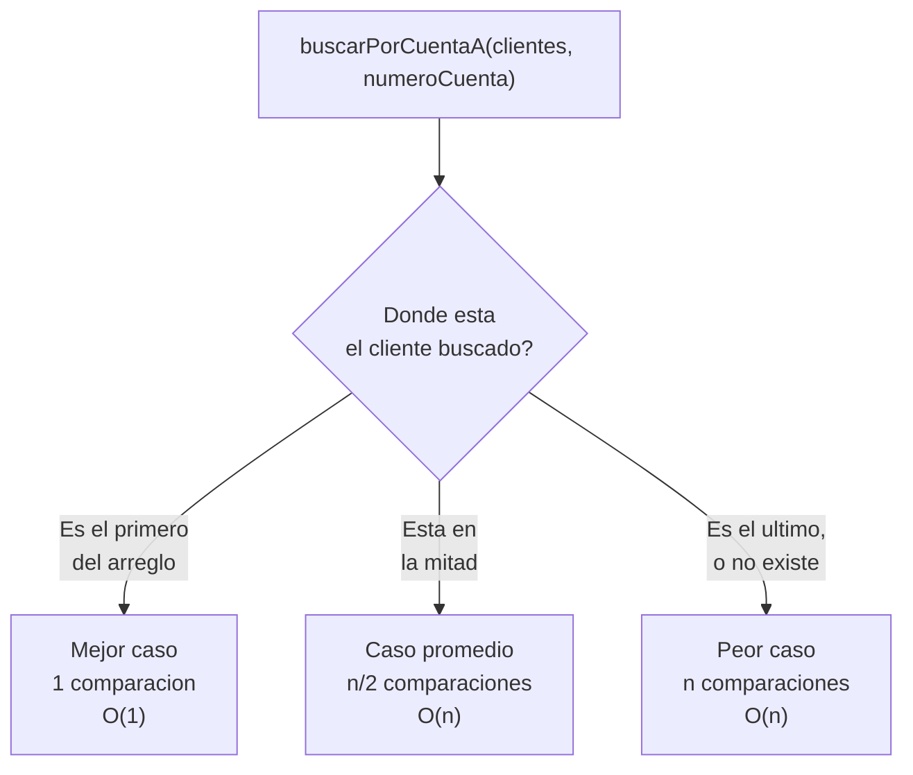

## El problema: cuando "funciona" no alcanza

Tienes dos formas de buscar un cliente por número de cuenta en el arreglo
del Sistema Bancario. Las dos compilan, las dos devuelven el cliente
correcto, y con los 10 clientes de prueba que usas en tu máquina las dos
responden en el mismo instante. Ningún profesor, ningún compilador y ningún
`System.out.println` te avisa cuál es mejor — hasta que el arreglo tiene
100.000 cuentas y una de las dos tarda perceptiblemente más que la otra.

```java
// Opcion A: recorrer el arreglo de clientes uno por uno.
public Cliente buscarPorCuentaA(Cliente[] clientes, String numeroCuenta) {
    for (Cliente c : clientes) {
        if (c.tieneCuenta(numeroCuenta)) {
            return c;
        }
    }
    return null;
}

// Opcion B: el mismo recorrido, pero comparando ademas contra
// una lista de cuentas bloqueadas en cada iteracion.
public Cliente buscarPorCuentaB(Cliente[] clientes, String[] bloqueadas, String numeroCuenta) {
    for (Cliente c : clientes) {
        for (String cuentaBloqueada : bloqueadas) {
            if (numeroCuenta.equals(cuentaBloqueada)) {
                return null;
            }
        }
        if (c.tieneCuenta(numeroCuenta)) {
            return c;
        }
    }
    return null;
}
```

Con 10 clientes y 5 cuentas bloqueadas, la diferencia es invisible a simple
vista. La pregunta que esta lección responde no es "¿cuál tarda menos en mi
computador hoy?", sino algo que puedes calcular sin ejecutar nada: **¿cómo
crece el costo de cada una a medida que crece el número de clientes?**

## Más problemas que la misma pregunta resuelve

No es solo la búsqueda. A lo largo del proyecto de aula vas a tomar
decisiones que "funcionan igual" con datos de prueba y se comportan muy
distinto en producción:

- ¿Guardas el historial de transacciones de un cliente agregando al final de
  una lista, o insertando al principio? Ambas compilan.
- ¿Ordenas el arreglo de cuentas antes de buscar, o buscas directo sobre el
  arreglo desordenado? Ordenar cuesta algo — ¿cuándo compensa?
- Tienes dos algoritmos distintos para la misma tarea (dos implementaciones
  de una búsqueda, dos formas de recorrer una colección). ¿Cómo los
  comparas sin medir en un hardware específico, que además puede ser más
  rápido o más lento que el de otra persona?

Las tres preguntas comparten la misma raíz: **¿cómo crece el costo cuando
crece n?**, donde `n` es el tamaño de la entrada — número de clientes,
número de transacciones, número de cuentas. Responderla de forma
predecible, sin depender de qué computador la corre, es lo que esta lección
enseña a hacer.

## La solución: medir el crecimiento, no el cronómetro

Cronometrar un algoritmo con `System.currentTimeMillis()` mide tu
computador, tu JVM y qué más tenías abierto en ese momento — no mide el
algoritmo. Dos ejecuciones del mismo código, en dos máquinas distintas, dan
números distintos aunque el algoritmo sea idéntico.

**Big O** resuelve esto cambiando la pregunta: en vez de "¿cuántos
milisegundos tarda?", pregunta "¿cuántas operaciones básicas ejecuta en
función de `n`, cuando `n` se hace muy grande?". Es una comparación por
**tasa de crecimiento asintótico** — qué forma tiene la curva, no qué altura
tiene en un punto concreto. Un algoritmo O(n) siempre termina ganándole a
uno O(n²) a medida que `n` crece, sin importar qué tan rápido sea el
procesador de cada uno.

La curva de abajo (constante) apenas se mueve; la de arriba (cuadrática) se
dispara. Esa forma de la curva — no el valor exacto en `n = 10` — es lo que
Big O compara.

> **Big O:** notación que describe cómo crece el costo (tiempo o memoria) de
> un algoritmo en función del tamaño de la entrada `n`, cuando `n` tiende a
> ser muy grande, ignorando constantes y detalles de hardware.

## Complejidad temporal y espacial

Un algoritmo tiene dos costos independientes, y ambos se miden con la misma
notación Big O:

- **Complejidad temporal:** cuántas operaciones básicas ejecuta en función
  de `n`. En `buscarPorCuentaA`, cada comparación `c.tieneCuenta(...)` es
  una operación básica, y en el peor caso se ejecutan tantas como clientes
  haya.
- **Complejidad espacial:** cuánta memoria adicional usa en función de `n`,
  más allá de la entrada misma. `buscarPorCuentaA` no crea ninguna
  estructura nueva mientras busca — su complejidad espacial es constante.
  `buscarPorCuentaB` tampoco crea estructuras nuevas, pero **si** en vez de
  recorrer `bloqueadas` la copiaras en un arreglo nuevo antes de buscar,
  esa copia sí costaría memoria proporcional a su tamaño.

> **Complejidad temporal y espacial:** el tiempo y la memoria que un
> algoritmo consume, expresados como funciones del tamaño `n` de su
> entrada, no como cantidades absolutas de segundos o bytes.

## Notación Big O: qué significa "cota superior"

Big O describe el **peor comportamiento garantizado** de un algoritmo, no
su comportamiento promedio ni el mejor caso posible. Decir que un algoritmo
es O(n) es decir: "en el peor de los casos, el costo crece como mucho de
forma proporcional a `n`" — nunca peor que eso, aunque a veces sea mejor.

**Acceso por índice — O(1):**

```java
// Acceso directo: el costo no depende de cuantos clientes haya.
Cliente primero = clientes[0];
```

> **O(1) — constante:** el costo no depende del tamaño de la entrada. Un
> acceso por índice a un arreglo siempre cuesta lo mismo, tenga el arreglo
> 10 o 10 millones de elementos.

**Recorrido de arreglo — O(n):**

```java
// Recorre todos los clientes una vez: el costo crece linealmente con n.
for (Cliente c : clientes) {
    procesar(c);
}
```

> **O(n) — lineal:** el costo crece proporcionalmente al tamaño de la
> entrada. Duplicar `n` duplica (como mucho) el número de operaciones.

**Búsqueda binaria sobre un arreglo de cuentas ordenado — O(log n):**

```java
// Requiere que 'cuentas' este ordenado por numero de cuenta.
public int buscarBinaria(String[] cuentas, String numeroCuenta) {
    int inicio = 0;
    int fin = cuentas.length - 1;
    while (inicio <= fin) {
        int medio = (inicio + fin) / 2;
        int cmp = cuentas[medio].compareTo(numeroCuenta);
        if (cmp == 0) {
            return medio;
        } else if (cmp < 0) {
            inicio = medio + 1;
        } else {
            fin = medio - 1;
        }
    }
    return -1;
}
```

> **O(log n) — logarítmica:** cada paso descarta la mitad de lo que queda
> por revisar. Buscar entre 1.000.000 de cuentas ordenadas toma como mucho
> 20 comparaciones, no 1.000.000.

**Doble bucle sobre transacciones — O(n²):**

```java
// Compara cada transaccion contra todas las demas: n * n comparaciones.
public boolean hayTransaccionesDuplicadas(Transaccion[] transacciones) {
    for (int i = 0; i < transacciones.length; i++) {
        for (int j = i + 1; j < transacciones.length; j++) {
            if (transacciones[i].equals(transacciones[j])) {
                return true;
            }
        }
    }
    return false;
}
```

> **O(n²) — cuadrática:** el costo crece con el cuadrado de `n`. Duplicar
> `n` cuadruplica el número de operaciones — es la forma más habitual en
> que un algoritmo "que funciona con pocos datos" deja de ser usable con
> muchos.

## Casos mejor, promedio y peor

El mismo algoritmo puede costar distinto según **dónde** esté el dato que
buscas, no solo según cuántos datos haya. Tomemos `buscarPorCuentaA` sobre
un arreglo de `n` clientes:



- **Mejor caso:** el cliente buscado es el primero del arreglo — una sola
  comparación.
- **Caso promedio:** en promedio, sobre muchas búsquedas distintas, el
  cliente aparece a mitad del arreglo — `n/2` comparaciones.
- **Peor caso:** el cliente es el último, o no existe y hay que recorrer
  todo el arreglo para confirmarlo — `n` comparaciones.

El curso trabaja casi siempre con el **peor caso** porque es el único que
da una garantía: no depende de suerte, ni de qué tan ordenados llegaron los
datos, ni de con qué frecuencia ocurre cada escenario. Diseñar pensando en
el peor caso significa que el sistema del banco responde dentro de un
límite conocido incluso el día en que la cuenta que se busca es,
precisamente, la que no existe.

## Tabla comparativa: el mapa de referencia del semestre

Esta tabla se va a completar a lo largo del curso, a medida que cada
estructura se estudie en detalle. Por ahora solo el arreglo está resuelto —
es la única estructura que ya conoces en profundidad:

| Estructura                          | Acceso                    | Búsqueda    | Inserción   | Eliminación |
| ----------------------------------- | ------------------------- | ----------- | ----------- | ----------- |
| Arreglo                             | O(1)                      | O(n)        | O(n)        | O(n)        |
| Arreglo ordenado + búsqueda binaria | O(1)                      | O(log n)    | O(n)        | O(n)        |
| Lista enlazada                      | _pendiente — semanas 5–6_ | _pendiente_ | _pendiente_ | _pendiente_ |
| Pila                                | _pendiente — semana 8_    | _pendiente_ | _pendiente_ | _pendiente_ |
| Cola                                | _pendiente — semana 9_    | _pendiente_ | _pendiente_ | _pendiente_ |
| Árbol binario de búsqueda (BST)     | _pendiente — semana 15_   | _pendiente_ | _pendiente_ | _pendiente_ |

El arreglo tiene acceso O(1) por índice, pero cualquier búsqueda por valor
—como buscar un cliente por número de cuenta sin conocer su posición— cuesta
O(n) salvo que el arreglo esté ordenado y puedas usar búsqueda binaria.
Insertar o eliminar en un arreglo cuesta O(n) porque, en el peor caso, hay
que desplazar el resto de los elementos para no dejar huecos ni perder el
orden.

## Síntesis

- Un problema que "funciona igual" con pocos datos puede comportarse muy
  distinto con muchos: la pregunta que importa es cómo crece el costo
  cuando crece `n`.
- Big O compara algoritmos por tasa de crecimiento asintótico, no por
  segundos de reloj — así la comparación no depende del hardware.
- La complejidad temporal mide operaciones en función de `n`; la
  complejidad espacial mide memoria adicional en función de `n`. Son costos
  independientes.
- Big O describe una cota superior: el peor comportamiento garantizado, no
  el promedio. O(1), O(log n), O(n) y O(n²) son las clases más comunes.
- El mismo algoritmo puede tener mejor, promedio y peor caso según dónde
  esté el dato buscado; el curso trabaja con el peor caso porque es el
  único que da una garantía.
- Simplificar un análisis se reduce a tres reglas: sumar pasos secuenciales,
  multiplicar bucles anidados, y descartar constantes y términos de menor
  orden.
- La tabla comparativa de estructuras es el mapa de referencia del
  semestre: hoy solo el arreglo está resuelto, el resto se completa
  estructura por estructura.
