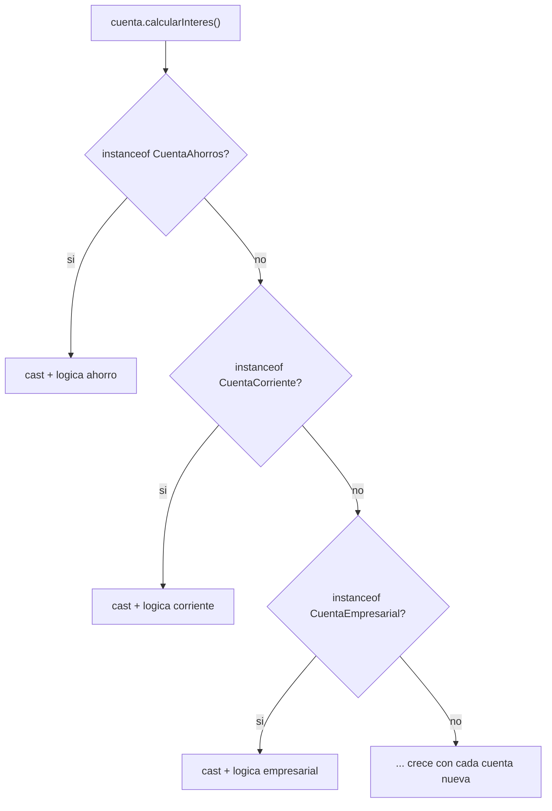
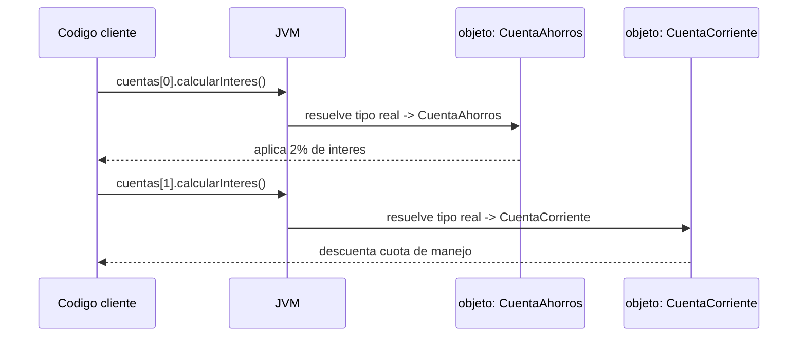
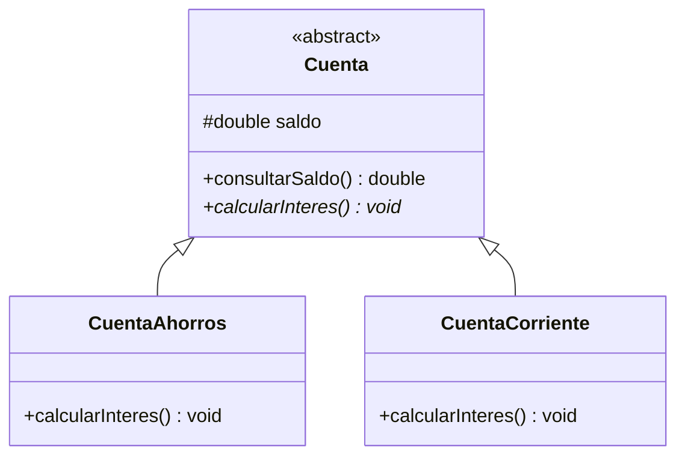
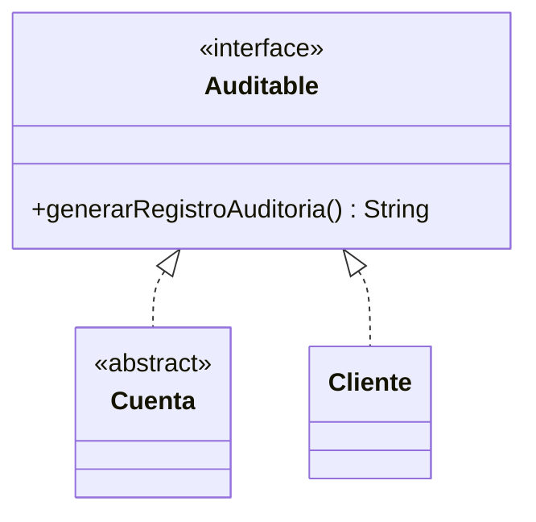

## El problema: preguntarle a cada cuenta qué tipo es

En la lección de Herencia dejaste `CuentaAhorros` y `CuentaCorriente` extendiendo
de `Cuenta`, cada una con su propia forma de sobreescribir `calcularInteres()`.
Llega el cierre de mes y el banco necesita liquidar el interés de **todas** las
cuentas, guardadas juntas en un mismo `Cuenta[]`. La primera idea, sin pensarlo
mucho, es preguntar tipo por tipo:

```java
for (Cuenta cuenta : cuentas) {
    if (cuenta instanceof CuentaAhorros) {
        CuentaAhorros ca = (CuentaAhorros) cuenta;
        ca.setSaldo(ca.getSaldo() + ca.getSaldo() * 0.02);
    } else if (cuenta instanceof CuentaCorriente) {
        CuentaCorriente cc = (CuentaCorriente) cuenta;
        cc.setSaldo(cc.getSaldo() - 5000); // cuota de manejo
    }
}
```

Funciona mientras el banco tenga dos tipos de cuenta. El día que aparece
`CuentaEmpresarial`, este bloque hay que volver a tocarlo — y si algún equipo
olvida el nuevo `else if`, esa cuenta simplemente no liquida interés, sin que
nada avise del error.



## Más problemas que resuelve el polimorfismo

La cadena de `if instanceof` no es solo fea — es **frágil** de una forma
concreta: cada vez que el dominio del banco crece, hay que volver a este mismo
bloque y modificarlo. Eso viola un principio simple: el código que ya funciona
no debería cambiar solo porque apareció un tipo nuevo — debería bastar con
**agregar** una clase.

Hay una segunda señal de que algo está mal en el diseño: la variable `cuenta`
está declarada como `Cuenta`, pero el código real no confía en ese tipo — lo
convierte (`cast`) al tipo concreto en cuanto puede, para poder llamar a un
método específico de esa subclase. Si tienes que hacer `cast` para operar sobre
algo, la referencia genérica no te está sirviendo de nada.

El polimorfismo resuelve ambos problemas a la vez: el código que recorre el
`Cuenta[]` nunca necesita saber si tiene una `CuentaAhorros` o una
`CuentaCorriente` en la mano, y agregar `CuentaEmpresarial` no toca una sola
línea de ese recorrido.

## La solución: polimorfismo en tiempo de ejecución

En vez de preguntar el tipo, cada cuenta responde al mismo mensaje con su
propio comportamiento:

```java
for (Cuenta cuenta : cuentas) {
    cuenta.calcularInteres();   // sin instanceof, sin cast
}
```

Este `for` es idéntico sin importar cuántos tipos de cuenta existan hoy o
mañana. Lo que decide **qué versión** de `calcularInteres()` se ejecuta no es
el tipo declarado de la variable (`Cuenta`) — es el tipo **real** del objeto al
que apunta, resuelto por la JVM en el instante en que el método se invoca:



> **Polimorfismo en tiempo de ejecución (binding dinámico):** capacidad de
> enviar el mismo mensaje (llamada a método) a referencias del mismo tipo
> declarado y obtener comportamientos distintos, según el tipo **real** del
> objeto que cada referencia contiene en ese momento.

## Cómo decide la JVM qué método ejecutar

Java resuelve las llamadas a método de dos formas distintas, y la diferencia
importa:

- **Binding estático:** el compilador decide qué método se ejecuta mirando
  solo el tipo **declarado**. Así funcionan los métodos `static` y la
  sobrecarga (mismo nombre, distintos parámetros) — se resuelven en
  compilación, sin mirar el objeto real.
- **Binding dinámico:** la JVM decide en **tiempo de ejecución**, mirando el
  tipo **real** del objeto. Así funciona cualquier método de instancia que
  fue **sobreescrito** (`@Override`) en una subclase.

`cuenta.calcularInteres()` usa binding dinámico precisamente porque
`CuentaAhorros` y `CuentaCorriente` sobreescriben ese método con `@Override`.
Si `Cuenta` tuviera un método que ninguna subclase sobreescribe, no habría
nada que decidir en runtime: se ejecutaría siempre la misma versión, la
heredada — el polimorfismo solo aparece donde hay sobreescritura real.

> `@Override` no es decoración: es la instrucción que le dice al compilador
> "esta versión reemplaza a la del padre para este tipo concreto", habilitando
> que la JVM elija correctamente en tiempo de ejecución.

## Cuando el contrato no tiene implementación por defecto: clases abstractas

**Situación:** `Cuenta` define `calcularInteres()`, pero no existe una fórmula
de interés razonable para "una cuenta en general" — cada tipo real la calcula
distinto. Dejar un cuerpo vacío o un valor por defecto (`return 0`) es
peligroso: si una subclase olvida sobreescribirlo, el banco liquidaría cero
interés sin ningún error visible.

**En la práctica**, Java permite declarar el método sin cuerpo y obligar a
cada subclase a definirlo:

```java
public abstract class Cuenta {
    protected double saldo;

    public abstract void calcularInteres();   // sin cuerpo: cada subclase decide

    public double consultarSaldo() {           // con cuerpo: compartido tal cual
        return saldo;
    }
}
```

Una clase `abstract` **no se puede instanciar** — `new Cuenta()` no compila.
Solo sirve como molde: obliga a que cualquier subclase concreta implemente
`calcularInteres()`, y de paso le regala `consultarSaldo()` ya hecho, sin que
cada subclase tenga que reescribirlo.



> **Clase abstracta:** clase que puede mezclar métodos con cuerpo (compartidos
> por herencia) y métodos `abstract` sin cuerpo (obligatorios para cada
> subclase concreta). No es instanciable directamente.

## Interfaces en Java: el contrato puro

**Situación:** además de calcular interés, el banco necesita que **algunas**
clases —no solo cuentas— puedan quedar registradas para una auditoría:
`Cuenta` y también `Cliente`, que no tienen ninguna relación de herencia entre
sí. Una clase abstracta no ayuda aquí: obligaría a forzar una jerarquía
artificial entre dos conceptos que no son "el mismo tipo de cosa".

**En la práctica**, una `interface` declara un contrato sin ningún estado ni
implementación propia (salvo métodos `default` o `static`, que son la
excepción, no la regla), y **cualquier clase** puede `implements`-arla sin
importar su jerarquía de herencia:

```java
public interface Auditable {
    String generarRegistroAuditoria();
}

public abstract class Cuenta implements Auditable { /* ... */ }

public class Cliente implements Auditable {
    public String generarRegistroAuditoria() {
        return "Cliente: " + nombre;
    }
}
```



Una clase solo puede extender **una** superclase (`extends`), pero puede
implementar **varias** interfaces (`implements A, B, C`) — así es como
`Cuenta` participa del árbol de cuentas del banco y, al mismo tiempo, del
contrato de auditoría, sin que ambos mundos se mezclen.

> **Interfaz:** contrato 100% abstracto (salvo `default`/`static`) que
> cualquier clase puede implementar sin importar su jerarquía de herencia.
> Una clase implementa cuantas interfaces necesite, pero extiende como máximo
> una superclase.

## Clase abstracta vs interfaz: ¿cuándo cada una?

La pregunta que separa ambos casos es **"¿es-un" o "puede-hacer"**:
`CuentaAhorros` *es-una* `Cuenta` (relación de herencia real, con estado
compartido); `Cuenta` y `Cliente` *pueden hacer* algo en común
(auditarse), sin ser el mismo tipo de cosa.

| | Clase abstracta | Interfaz |
|---|---|---|
| Relación que expresa | "es-un" (jerarquía real) | "puede-hacer" (capacidad) |
| Estado compartido (atributos) | Sí — `protected double saldo` | No — solo constantes `static final` |
| Métodos con implementación | Sí, mezclados con `abstract` | Solo `default`/`static` |
| Una clase puede tener varias | No — máximo una superclase | Sí — varias interfaces |
| Ejemplo del banco | `Cuenta` → `CuentaAhorros`, `CuentaCorriente` | `Auditable` → `Cuenta`, `Cliente` |

## Resumen operativo

| Sintaxis | Palabra clave | Relación | Instanciable |
|---|---|---|---|
| Clase abstracta | `abstract class` / método `abstract` | `extends` (una sola) | No |
| Interfaz | `interface` / método sin cuerpo | `implements` (varias) | No |
| Sobreescritura | `@Override` | habilita binding dinámico | — |

Regla de decisión rápida: si las subclases comparten **atributos y algo de
comportamiento** con el padre, usa clase abstracta; si solo comparten **una
capacidad**, sin importar su jerarquía, usa interfaz. Cuando dudes, empieza
por la interfaz — es el contrato más flexible y siempre puedes combinarla con
una clase abstracta.

## Síntesis

- El polimorfismo elimina las cadenas de `if instanceof` — el mismo mensaje,
  `cuenta.calcularInteres()`, produce comportamiento distinto sin que el
  código cliente pregunte el tipo.
- Es **binding dinámico**: la JVM decide en tiempo de ejecución, según el tipo
  real del objeto, cuál versión sobreescrita (`@Override`) ejecutar.
- Una **clase abstracta** declara el contrato y puede compartir estado y
  métodos concretos con sus subclases; no es instanciable.
- Una **interfaz** es un contrato puro, implementable por clases sin relación
  de herencia entre sí, y una clase puede implementar varias a la vez.
- La pregunta que decide entre las dos es "es-un" (clase abstracta) versus
  "puede-hacer" (interfaz).
