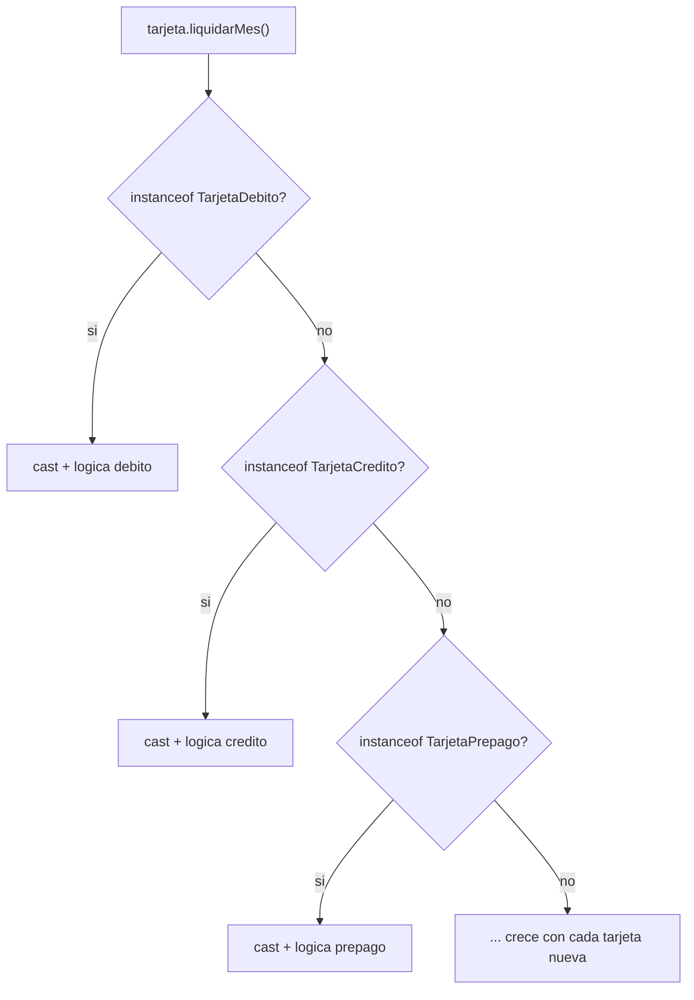
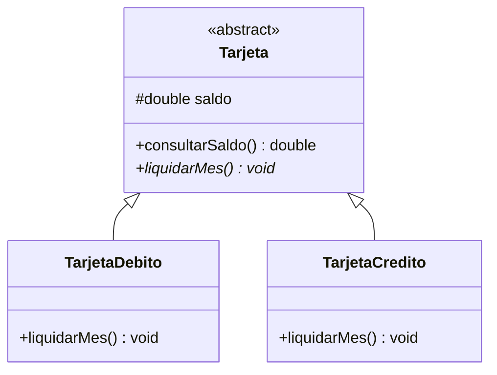
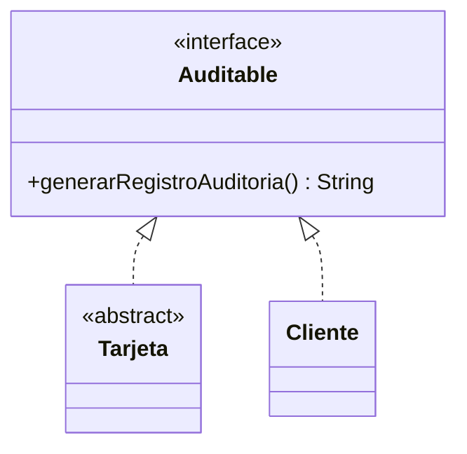

## El problema: preguntarle a cada tarjeta qué tipo es

En la lección de Herencia dejaste `TarjetaDebito` y `TarjetaCredito`
extendiendo de `Tarjeta`, cada una con su propia forma de sobreescribir
`liquidarMes()`. Llega el cierre de mes y el banco necesita liquidar
**todas** las tarjetas, guardadas juntas en un mismo `Tarjeta[]`. La primera
idea, sin pensarlo mucho, es preguntar tipo por tipo:

```java
for (Tarjeta tarjeta : tarjetas) {
    if (tarjeta instanceof TarjetaDebito) {
        TarjetaDebito td = (TarjetaDebito) tarjeta;
        td.setSaldo(td.getSaldo() + td.getSaldo() * 0.02);   // cashback
    } else if (tarjeta instanceof TarjetaCredito) {
        TarjetaCredito tc = (TarjetaCredito) tarjeta;
        tc.setSaldo(tc.getSaldo() - 5000); // cuota de manejo
    }
}
```

Funciona mientras el banco tenga dos tipos de tarjeta. El día que aparece
`TarjetaPrepago`, este bloque hay que volver a tocarlo — y si algún equipo
olvida el nuevo `else if`, esa tarjeta simplemente no liquida el mes, sin que
nada avise del error.



## La solución: polimorfismo en tiempo de ejecución

En vez de preguntar el tipo, cada tarjeta responde al mismo mensaje con su
propio comportamiento:

```java
for (Tarjeta tarjeta : tarjetas) {
    tarjeta.liquidarMes();   // sin instanceof, sin cast
}
```

Este `for` es idéntico sin importar cuántos tipos de tarjeta existan hoy o
mañana. Lo que decide **qué versión** de `liquidarMes()` se ejecuta no es
el tipo declarado de la variable (`Tarjeta`) — es el tipo **real** del objeto al
que apunta, resuelto por la JVM en el instante en que el método se invoca:

> **Polimorfismo en tiempo de ejecución (binding dinámico):** capacidad de
> enviar el mismo mensaje (llamada a método) a referencias del mismo tipo
> declarado y obtener comportamientos distintos, según el tipo **real** del
> objeto que cada referencia contiene en ese momento.

## Cuando el contrato no tiene implementación por defecto: clases abstractas

**Situación:** `Tarjeta` define `liquidarMes()`, pero no existe una fórmula
de cierre razonable para "una tarjeta en general" — cada tipo real la calcula
distinto. Dejar un cuerpo vacío o sin efecto es peligroso: si una subclase
olvida sobreescribirlo, el banco cerraría el mes sin liquidar nada, sin
ningún error visible.

**En la práctica**, Java permite declarar el método sin cuerpo y obligar a
cada subclase a definirlo:

```java
public abstract class Tarjeta {
    protected double saldo;

    public abstract void liquidarMes();   // sin cuerpo: cada subclase decide

    public double consultarSaldo() {        // con cuerpo: compartido tal cual
        return saldo;
    }
}
```

Una clase `abstract` **no se puede instanciar** — `new Tarjeta()` no compila.
Solo sirve como molde: obliga a que cualquier subclase concreta implemente
`liquidarMes()`, y de paso le regala `consultarSaldo()` ya hecho, sin que
cada subclase tenga que reescribirlo.



> **Clase abstracta:** clase que puede mezclar métodos con cuerpo (compartidos
> por herencia) y métodos `abstract` sin cuerpo (obligatorios para cada
> subclase concreta). No es instanciable directamente.

## Interfaces en Java: el contrato puro

**En la práctica**, una `interface` declara un contrato sin ningún estado ni
implementación propia , y **cualquier clase** puede `implements`-arla sin
importar su jerarquía de herencia:

```java
public interface Auditable {
    String generarRegistroAuditoria();
}

public abstract class Tarjeta implements Auditable { /* ... */ }

public class Cliente implements Auditable {
    public String generarRegistroAuditoria() {
        return "Cliente: " + nombre;
    }
}
```



Una clase solo puede extender **una** superclase (`extends`), pero puede
implementar **varias** interfaces (`implements A, B, C`) — así es como
`Tarjeta` participa del árbol de tarjetas del banco y, al mismo tiempo, del
contrato de auditoría, sin que ambos mundos se mezclen.

> **Interfaz:** contrato 100% abstracto que
> cualquier clase puede implementar sin importar su jerarquía de herencia.
> Una clase implementa cuantas interfaces necesite, pero extiende como máximo
> una superclase.

## Clase abstracta vs interfaz: ¿cuándo cada una?

La pregunta que separa ambos casos es **"¿es-un" o "puede-hacer"**:
`TarjetaDebito` _es-una_ `Tarjeta` (relación de herencia real, con estado
compartido); `Tarjeta` y `Cliente` _pueden hacer_ algo en común
(auditarse), sin ser el mismo tipo de cosa.

|                               | Clase abstracta                               | Interfaz                            |
| ----------------------------- | --------------------------------------------- | ----------------------------------- |
| Relación que expresa          | "es-un" (jerarquía real)                      | "puede-hacer" (capacidad)           |
| Estado compartido (atributos) | Sí — `protected double saldo`                 | No — solo constantes `static final` |
| Métodos con implementación    | Sí, mezclados con `abstract`                  | Solo `default`/`static`             |
| Una clase puede tener varias  | No — máximo una superclase                    | Sí — varias interfaces              |
| Ejemplo del banco             | `Tarjeta` → `TarjetaDebito`, `TarjetaCredito` | `Auditable` → `Tarjeta`, `Cliente`  |

## Resumen operativo

| Sintaxis        | Palabra clave                        | Relación                  | Instanciable |
| --------------- | ------------------------------------ | ------------------------- | ------------ |
| Clase abstracta | `abstract class` / método `abstract` | `extends` (una sola)      | No           |
| Interfaz        | `interface` / método sin cuerpo      | `implements` (varias)     | No           |
| Sobreescritura  | `@Override`                          | habilita binding dinámico | —            |

Regla de decisión rápida: si las subclases comparten **atributos y algo de
comportamiento** con el padre, usa clase abstracta; si solo comparten **una
capacidad**, sin importar su jerarquía, usa interfaz. Cuando dudes, empieza
por la interfaz — es el contrato más flexible y siempre puedes combinarla con
una clase abstracta.

## Síntesis

- El polimorfismo elimina las cadenas de `if instanceof` — el mismo mensaje,
  `tarjeta.liquidarMes()`, produce comportamiento distinto sin que el
  código cliente pregunte el tipo.
- Es **binding dinámico**: la JVM decide en tiempo de ejecución, según el tipo
  real del objeto, cuál versión sobreescrita (`@Override`) ejecutar.
- Una **clase abstracta** declara el contrato y puede compartir estado y
  métodos concretos con sus subclases; no es instanciable.
- Una **interfaz** es un contrato puro, implementable por clases sin relación
  de herencia entre sí, y una clase puede implementar varias a la vez.
- La pregunta que decide entre las dos es "es-un" (clase abstracta) versus
  "puede-hacer" (interfaz).
