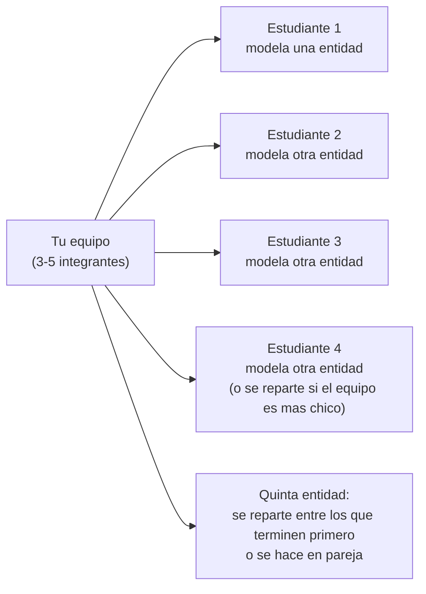
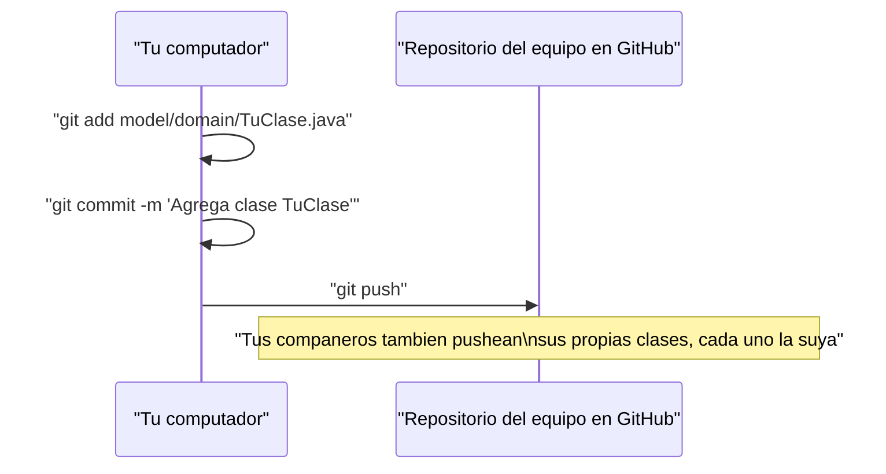
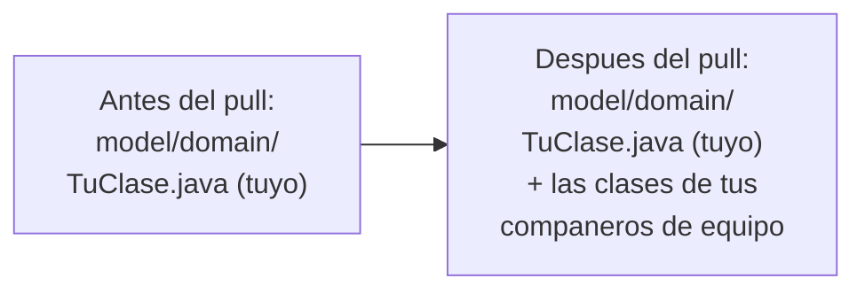

## El objetivo de hoy: tu propia clase, en tu propio computador

Acabas de repasar clase, objeto, atributo, método y constructor con el
ejemplo de `Cliente` del sistema bancario. Ahora te toca hacer exactamente lo
mismo, pero con una entidad real de **tu** proyecto de aula.

Tu equipo ya tiene asignado uno de los cinco casos de estudio del curso, y
cada integrante va a modelar **una clase de dominio distinta**, en su propio
computador, dentro de la carpeta `model/domain/` del repositorio compartido
de tu equipo. Trabajar cada quien en un archivo separado no es un detalle
menor: es justamente lo que evita que dos personas terminen editando la
misma línea del mismo archivo al mismo tiempo.

Esta vez el proyecto tiene **cinco entidades**, no cuatro: la práctica busca
que cada equipo profundice más en la creación de clases, así que hay una
entidad extra para repartir. Si tu equipo tiene 5 integrantes, cada uno toma
una. Si son menos, repártanse las cinco de todas formas: alguien toma dos, o
dos personas trabajan en pareja sobre la que sobra. Pónganse de acuerdo
**antes** de empezar a escribir código, para no duplicar trabajo.



## Qué debe tener tu clase

**Situación:** vas a modelar una clase de dominio real, con el mismo nivel
de detalle que `Cliente` — sin `private`, sin getters ni setters todavía.
Eso llega en la próxima lección, sobre **encapsulamiento**; hoy todos los
atributos son públicos, igual que en el repaso de clases y objetos.

**En la práctica**, tu clase necesita tres piezas, sin excepción:

- **Entre 3 y 4 atributos**, con el tipo correcto para cada dato (`String`,
  `int`, `double`, según lo que representen).
- **Un constructor** que reciba todos los atributos como parámetros y los
  asigne con `this`.
- **Un método** que muestre la información del objeto por consola —
  equivalente al `mostrarInfo()` que ya viste.

> No agregues `private` a ningún atributo todavía, ni escribas getters o
> setters. Esta actividad se queda deliberadamente en el mismo punto que la
> lección de la que parte: clase, objeto, atributo, constructor. El
> encapsulamiento es la capa siguiente.

## Pruébala desde tu `main`

**Situación:** una clase que nunca se instancia no demuestra nada — necesitas
verla funcionar con datos reales, igual que `maria` y `carlos` en el ejemplo
de `Cliente`.

**En la práctica**, en el `Main.java` de bienvenida que ya tiene tu
repositorio (o en una clase de prueba aparte), crea **al menos dos objetos**
de tu clase con datos distintos, con `new` y el constructor que escribiste, y
llama al método que muestra la información de cada uno — igual que hiciste
con `maria` y `carlos` en el ejemplo de `Cliente`.

Si tu clase compila y ambos objetos imprimen su información con los datos
correctos, ya cumpliste la parte individual de la actividad.

## Reparte las entidades de tu proyecto

La primera pestaña es el **Sistema Bancario**: ahí tienes las cinco
entidades que el profesor modela en vivo, una por una, durante la clase.
Síguelas en tu propio computador mientras el profesor las escribe — es la
misma actividad que vas a repetir después, solo que aquí el profesor va
primero.

Las siguientes cinco pestañas son los proyectos de aula de los equipos. Cada
proyecto de aula tiene cinco entidades candidatas para repartir entre el
equipo. Busca la pestaña de tu proyecto: ahí tienes, para **una** de esas
entidades, qué atributos debe tener y qué debe mostrar su método de
información — no el código. Ese código lo escribes tú, con el mismo formato
que usó el profesor en su demostración: atributos, constructor y método de
información. El resto de las entidades las modela cada integrante siguiendo
exactamente ese mismo patrón, como en los ejercicios propuestos de
"Ejercicios propuestos — Clases y objetos".

<Tabs>
  <Tab label="Sistema Bancario (demo del profesor)">

Entidades: `Cliente`, `Cuenta`,
`Tarjeta`, `Transaccion` y `Sucursal`.

Ejemplo guía — `Cuenta`: número de cuenta (`String`), saldo (`double`) y
fecha de apertura (`String`). El método de información debe mostrar el
número de cuenta, el saldo y la fecha de apertura.

  </Tab>
  <Tab label="Papelería">

Entidades para repartir: `Producto`, `Venta`, `Proveedor`, `Pedido` e
`ItemVenta`.

Ejemplo guía — `Producto`: código (`String`), nombre (`String`), precio
unitario (`double`) y cantidad en stock (`int`). El método de información
debe mostrar el nombre, el código, el precio y el stock disponible.

  </Tab>
  <Tab label="Consultorio Médico">

Entidades para repartir: `Paciente`, `Medico`, `Cita`, `Consulta` y
`Persona`.

Ejemplo guía — `Paciente`: identificación (`String`), nombre (`String`), edad
(`int`) y EPS (`String`). El método de información debe mostrar el nombre, la
edad y la EPS.

  </Tab>
  <Tab label="Clínica Veterinaria">

Entidades para repartir: `Animal`, `Dueño`, `Veterinario`, `Consulta` y
`Vacuna`.

Ejemplo guía — `Animal`: nombre (`String`), especie (`String`), raza
(`String`) y edad en años (`int`). El método de información debe mostrar el
nombre, la especie, la raza y la edad.

  </Tab>
  <Tab label="Sistema Académico">

Entidades para repartir: `Estudiante`, `Profesor`, `Materia`, `Matricula` y
`Calificacion`.

Ejemplo guía — `Estudiante`: código (`String`), nombre (`String`), semestre
(`int`) y promedio (`double`). El método de información debe mostrar el
nombre, el código, el semestre y el promedio.

  </Tab>
  <Tab label="Liga de Fútbol">

Entidades para repartir: `Jugador`, `Equipo`, `Partido`, `Gol` y
`Arbitro`.

Ejemplo guía — `Jugador`: nombre (`String`), dorsal (`int`), posición
(`String`) y equipo (`String`). El método de información debe mostrar el
nombre, el dorsal, la posición y el equipo.

  </Tab>
</Tabs>

## Sube tu clase: `add`, `commit`, `push`

**Situación:** ya escribiste tu clase y la probaste desde tu `main`. Sigue
sola en tu computador — nadie más del equipo la ve todavía.

**En la práctica**, con tu clase compilando y probada, la subes al
repositorio compartido de tu equipo con la misma secuencia que ya conoces de
la lección "GitHub y flujo de trabajo con ramas":

```bash
git add model/domain/NombreDeTuClase.java
git commit -m "Agrega clase NombreDeTuClase"
git push
```



Cada integrante hace exactamente esto con su propia clase, cuando la termine
— no hace falta coordinarse para el orden de los `push`.

## Trae el trabajo de tus compañeros: `git pull`

**Situación:** ya subiste tu clase, pero tu copia local todavía no tiene las
que están modelando tus compañeros de equipo.

**En la práctica**, un `git pull` trae al repositorio local todo lo que ya
se pusheó al remoto:

```bash
git pull
```



Después del `pull`, revisa tu carpeta `model/domain/`: deben aparecer los
archivos `.java` de las clases que modelaron tus compañeros, cada uno en su
propio archivo. Como nadie tocó el archivo de nadie más, Git combina los
cambios automáticamente — sin conflicto de fusión. Esa es la razón exacta
detrás de repartir una clase por estudiante: el conflicto de fusión que
viste en la lección de ramas aparece cuando dos personas editan la **misma**
línea del **mismo** archivo, y esta actividad está diseñada para que eso no
pase.

## Al terminar la sesión

- Tu clase compila sin errores y sigue el mismo patrón que `Cliente`:
  atributos públicos, constructor que los inicializa todos, método que
  muestra la información del objeto.
- La probaste desde tu `main` con al menos dos objetos distintos.
- Hiciste `add`, `commit` y `push` de tu clase al repositorio del equipo.
- Hiciste `pull` y confirmaste que en tu copia local aparecen los archivos
  `.java` de tus compañeros, cada uno en su propio archivo dentro de
  `model/domain/`.
