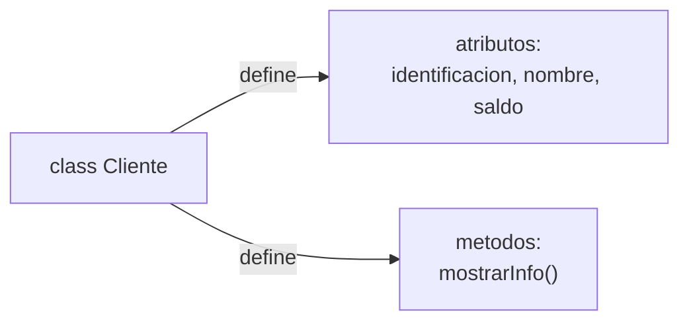
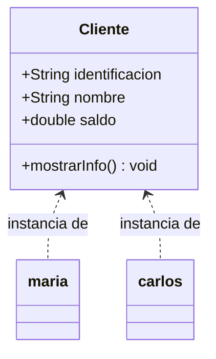
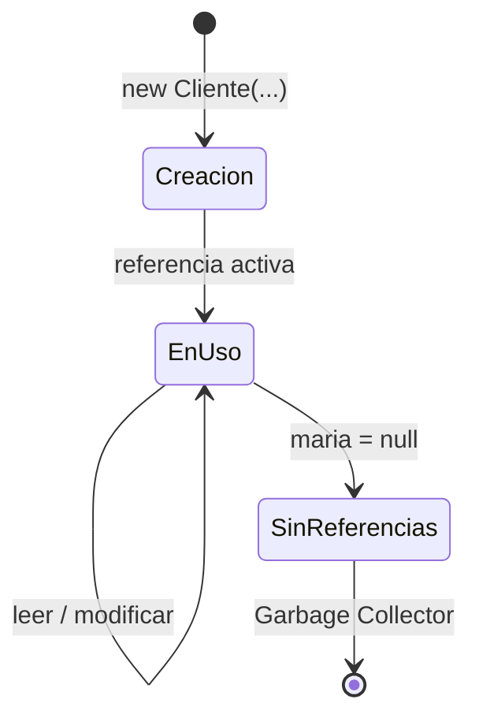

## El problema: modelar algo del mundo real en código

Todas las estructuras de datos del curso se modelan como clases y objetos, y
las entidades de cualquier sistema que construyas también. Antes de agregarle
a ese modelo validaciones y modificadores de acceso, necesitas tener
absolutamente claro algo más básico: ¿qué es exactamente una clase, qué es un
objeto, y qué pasa en memoria cuando "creas uno"? Si esa distinción no está
firme, el encapsulamiento no tiene sobre qué apoyarse.

## La clase: el molde

**Situación:** un sistema bancario maneja decenas de miles de clientes. No vas
a escribir el código de cada cliente por separado — necesitas un **molde** que
describa qué información y qué comportamiento tiene _cualquier_ cliente.

**En la práctica**, eso es una clase:

```java
public class Cliente {
    String identificacion;
    String nombre;
    double saldo;

    void mostrarInfo() {
        System.out.println(nombre + " - saldo: " + saldo);
    }
}
```



Una clase no es un cliente concreto — es la **descripción** de qué forma
tiene un cliente. `identificacion`, `nombre` y `saldo` son sus
**atributos** (los datos que guarda); `mostrarInfo` es un **método** (el
comportamiento que puede ejecutar). Ningún cliente real existe todavía solo
por haber escrito esta clase.

> **Clase:** plantilla o molde que define los atributos (datos) y métodos
> (comportamiento) que van a tener los objetos creados a partir de ella. No
> ocupa memoria para datos concretos — solo describe la estructura.

## El objeto: una instancia concreta

**Situación:** ya tienes el molde `Cliente`. Ahora necesitas un cliente real
en tu sistema: María, identificación `1234`, saldo `500000`.

**En la práctica**, creas un **objeto** a partir de la clase con la palabra
clave `new`:

```java
Cliente maria = new Cliente();
maria.identificacion = "1234";
maria.nombre = "Maria";
maria.saldo = 500000;

maria.mostrarInfo();   // Maria - saldo: 500000.0
```

`maria` es una **instancia** de `Cliente`: un objeto concreto, con valores
propios para cada atributo, que vive en memoria mientras el programa se
ejecuta. Si creas otro objeto `Cliente carlos = new Cliente();`, `carlos`
tiene sus propios `identificacion`, `nombre` y `saldo` — completamente
independientes de los de `maria`, aunque ambos comparten el mismo molde.

> **Objeto:** instancia concreta de una clase, creada con `new`, que ocupa
> memoria propia y tiene valores específicos para cada atributo definido en
> la clase. Una clase puede generar tantos objetos como necesites, todos
> independientes entre sí.

## Clase vs. objeto: la relación exacta

Esta es la confusión más común al empezar: mezclar la clase con sus objetos.
La analogía que ya conoces de otros cursos aplica igual aquí — un plano de
construcción no es la casa, es lo que permite construir muchas casas iguales
en estructura pero distintas en detalles (color, dirección, dueño).



|                        | Clase                         | Objeto                            |
| ---------------------- | ----------------------------- | --------------------------------- |
| Qué es                 | El molde, la definición       | Una instancia concreta del molde  |
| Cuántos hay            | Una sola, en el código fuente | Tantos como `new` hayas ejecutado |
| Ocupa memoria de datos | No                            | Sí, una copia propia por objeto   |
| Ejemplo                | `Cliente`                     | `maria`, `carlos`                 |

Cada objeto tiene sus **propios** valores de atributo, pero **comparte** el
código de los métodos definidos en la clase — no existe una copia separada
de `mostrarInfo()` por cada cliente.

## El constructor: cómo nace un objeto correctamente

**Situación:** crear a `maria` te tomó cuatro líneas — `new Cliente()` y
luego asignar cada atributo uno por uno. Además, nada te impide olvidar
asignar `saldo` y dejarlo en su valor por defecto sin darte cuenta.

**En la práctica**, un **constructor** te permite crear el objeto completo
en una sola instrucción:

```java
public class Cliente {
    String identificacion;
    String nombre;
    double saldo;

    public Cliente(String identificacion, String nombre, double saldo) {
        this.identificacion = identificacion;
        this.nombre = nombre;
        this.saldo = saldo;
    }
}
```

```java
Cliente maria = new Cliente("1234", "Maria", 500000);
```

El constructor es un método especial: tiene el **mismo nombre que la
clase**, no declara tipo de retorno, y se ejecuta automáticamente cada vez
que usas `new`. `this.identificacion` se refiere al atributo del objeto que
se está construyendo; distinguirlo del parámetro `identificacion` (mismo
nombre) es exactamente para qué existe la palabra clave `this`.

> **Constructor:** método especial que inicializa un objeto en el momento de
> su creación con `new`. Tiene el mismo nombre que la clase, sin tipo de
> retorno, y garantiza que el objeto nazca con todos sus atributos en un
> estado válido desde el primer instante.

Si no escribes ningún constructor, Java te da uno vacío por defecto
(`Cliente()`, sin parámetros) — pero en cuanto escribes al menos uno propio,
ese constructor por defecto desaparece.

## El ciclo de vida de un objeto en memoria

**Situación:** ¿qué pasa exactamente entre que escribes `new Cliente(...)` y
el momento en que ese objeto ya no sirve para nada?

**En la práctica**, un objeto en Java pasa por tres momentos:



Cuando escribes `Cliente maria = new Cliente(...)`, Java reserva memoria
para el objeto y `maria` guarda una **referencia** a esa memoria — no el
objeto en sí. Mientras exista al menos una referencia activa, el objeto
sigue vivo. Si en algún momento reasignas `maria = null` (o `maria` sale de
su alcance sin que nadie más lo referencie), el objeto queda sin
referencias, y el **Garbage Collector** de Java libera esa memoria
automáticamente — a diferencia de otros lenguajes, no tienes que liberarla
tú manualmente.

> **Referencia:** el valor que realmente guarda una variable de tipo objeto
> en Java — no el objeto, sino la dirección en memoria donde vive. Dos
> variables pueden apuntar al mismo objeto; modificar uno afecta lo que ve
> el otro.

## Múltiples objetos, mismo molde

Para consolidar la idea completa, así se ve gestionar varios clientes con la
misma clase:

```java
Cliente maria = new Cliente("1234", "Maria", 500000);
Cliente carlos = new Cliente("5678", "Carlos", 120000);

maria.mostrarInfo();    // Maria - saldo: 500000.0
carlos.mostrarInfo();   // Carlos - saldo: 120000.0

maria.saldo = 600000;   // solo cambia el saldo de maria
carlos.mostrarInfo();   // Carlos - saldo: 120000.0 (sin cambios)
```

Modificar `maria.saldo` no afecta a `carlos` en absoluto: son objetos
distintos, con memoria distinta, aunque provengan exactamente de la misma
clase. Esto es justo lo que necesitas para gestionar una lista de decenas de
clientes, productos o pacientes — cada uno es un objeto independiente del
mismo molde.

## Resumen operativo

| Concepto    | Qué es                                         | Sintaxis                                        |
| ----------- | ---------------------------------------------- | ----------------------------------------------- |
| Clase       | Molde que define atributos y métodos           | `public class Cliente { }`                      |
| Atributo    | Dato que guarda cada objeto                    | `String nombre;`                                |
| Método      | Comportamiento que puede ejecutar el objeto    | `void mostrarInfo() { }`                        |
| Objeto      | Instancia concreta de una clase                | `Cliente maria = new Cliente(...);`             |
| Constructor | Inicializa el objeto al crearlo                | `public Cliente(String n) { this.nombre = n; }` |
| Referencia  | Lo que realmente guarda una variable de objeto | `maria` apunta a la memoria del objeto          |

## Síntesis

- Una **clase** es el molde: define qué atributos y métodos va a tener
  cualquier objeto creado a partir de ella, sin ocupar memoria de datos
  concretos.
- Un **objeto** es una instancia concreta, creada con `new`, con valores
  propios e independientes para cada atributo.
- Muchos objetos pueden compartir la misma clase sin interferir entre sí:
  modificar uno no afecta a los demás.
- El **constructor** garantiza que un objeto nazca completo y válido desde
  el primer instante, en lugar de armarlo a mano atributo por atributo.
- Una variable de tipo objeto guarda una **referencia**, no el objeto en sí;
  el Garbage Collector libera la memoria cuando ya nadie referencia ese
  objeto.
- Con clase, objeto y constructor firmes, el paso siguiente es agregarle una
  capa más a este mismo molde: **encapsulamiento** — atributos privados,
  getters, setters con validación y constructores sobrecargados.
