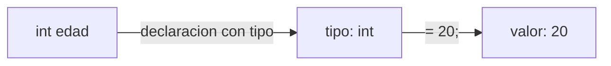
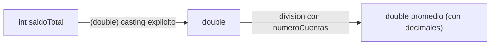
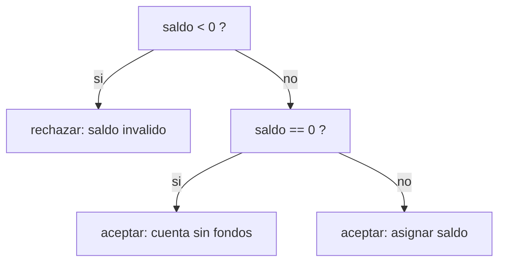
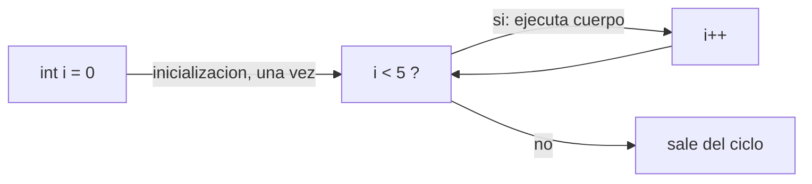
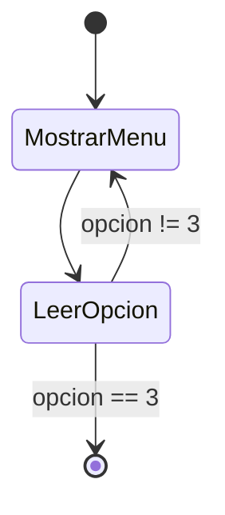

## El problema: ya sabes lógica, pero no la sintaxis de Java

Vienes de Lógica de Programación, donde trabajaste con pseudocódigo y con
Java. Sabes lo que es una condición, un ciclo, una variable — el razonamiento
ya lo tienes, y la sintaxis la viste. Lo que este repaso busca es dejarla
afilada antes de empezar: cómo se declara un `int`, dónde van las llaves de un
`if`, qué diferencia hay entre `=` y `==`.

Esto no es un capricho académico. De aquí en adelante vas a escribir clases
Java con atributos tipados, validaciones y constructores — y ninguna de esas
cosas compila si la sintaxis está mal. Este es el repaso exacto de lo que
necesitas para que ese código funcione a la primera.

## Variables y tipos primitivos

**Situación:** en pseudocódigo podías escribir `edad = 20` y seguir adelante:
el tipo se sobreentendía. Java no te deja hacer eso — exige que digas de
antemano qué tipo de dato guarda cada variable.

**En la práctica**, toda variable en Java se declara con su **tipo explícito**
antes del nombre, y ese tipo no cambia después:

```java
int edad = 20;
double saldo = 150000.75;
boolean activo = true;
char categoria = 'A';
```

Los cuatro tipos primitivos que vas a usar constantemente son `int` (enteros),
`double` (decimales), `boolean` (verdadero/falso) y `char` (un solo carácter,
entre comillas simples). El tipo se fija en la declaración y no cambia: una
vez escribes `int edad`, esa variable **solo** puede contener enteros durante
toda su vida. Por eso el compilador detecta el error antes de ejecutar, en vez
de que reviente a mitad del programa.



> **Tipado estático:** el tipo de cada variable se fija en la declaración y el
> compilador lo verifica antes de ejecutar el programa. Asignar un valor de
> otro tipo sin conversión es un error de compilación, no un error en
> tiempo de ejecución.

Esta es exactamente la sintaxis que vas a repetir en cada atributo de cada
clase que modeles de aquí en adelante.

## Operadores y casting

**Situación:** calculas el saldo promedio de las cuentas de un cliente
dividiendo el saldo total entre el número de cuentas, ambos declarados como
`int`. El resultado te sale sin decimales, aunque matemáticamente debería
tenerlos.

```java
int saldoTotal = 700000;
int numeroCuentas = 3;
double promedio = saldoTotal / numeroCuentas;   // 233333.0, no 233333.33
```

**En la práctica**, esto pasa porque `saldoTotal / numeroCuentas` es una
**división entera**: si ambos operandos son `int`, Java descarta la parte
decimal del resultado antes de asignarlo a `promedio`. La solución es forzar
a que al menos uno de los operandos sea `double` con un **casting explícito**:

```java
double promedio = (double) saldoTotal / numeroCuentas;   // 233333.33
```



Java también hace **casting implícito** cuando no hay riesgo de perder
información — por ejemplo, asignar un `int` a un `double` no requiere nada
especial, porque todo entero cabe exacto en un decimal. El camino inverso
(`double` a `int`) sí necesita casting explícito, porque ahí sí se puede
perder la parte decimal.

Los operadores que vas a usar constantemente:

| Tipo         | Operadores                        |
| ------------ | --------------------------------- |
| Aritméticos  | `+`, `-`, `*`, `/`, `%` (residuo) |
| Relacionales | `==`, `!=`, `>`, `<`, `>=`, `<=`  |
| Lógicos      | `&&` (y), `\|\|` (o), `!` (no)    |

> **Casting:** conversión explícita del valor de un tipo a otro, escribiendo
> el tipo destino entre paréntesis antes del valor: `(double) saldoTotal`.
> Necesario cuando la conversión puede perder información (`double` → `int`).

## Condicionales `if`/`else`

**Situación:** vas a escribir un setter para el saldo de una cuenta, y ese
setter tiene que rechazar valores negativos — nadie puede tener saldo bajo
cero. Necesitas decidir entre dos caminos según una condición.

**En la práctica**, Java evalúa la condición entre paréntesis y ejecuta el
bloque entre llaves que corresponda:

```java
public void setSaldo(double saldo) {
    if (saldo < 0) {
        System.out.println("El saldo no puede ser negativo");
    } else if (saldo == 0) {
        System.out.println("Cuenta creada sin fondos");
        this.saldo = saldo;
    } else {
        this.saldo = saldo;
    }
}
```



`else if` te permite encadenar condiciones adicionales sin anidar `if` dentro
de `if`; el `else` final captura cualquier caso que no cumplió ninguna
condición anterior.

> **Precondición:** condición que debe cumplirse para que una operación sea
> válida. En un setter, validar la precondición antes de asignar evita que el
> objeto quede en un estado inconsistente (ej. saldo negativo).

## El `switch`

**Situación:** tienes un código categórico — el tipo de cuenta (`'A'` para
ahorros, `'C'` para corriente) o el tipo de mascota en una clínica veterinaria
— y necesitas ejecutar una acción distinta según ese código. Podrías usar una
cadena de `if`/`else if`, pero cuando son muchos casos sobre el mismo valor,
`switch` es más claro:

```java
char tipoCuenta = 'A';
String descripcion;

switch (tipoCuenta) {
    case 'A':
        descripcion = "Cuenta de ahorros";
        break;
    case 'C':
        descripcion = "Cuenta corriente";
        break;
    default:
        descripcion = "Tipo de cuenta no reconocido";
        break;
}
```

Cada `case` compara `tipoCuenta` contra un valor exacto. El `break` es
obligatorio al final de cada bloque: sin él, la ejecución **continúa** cayendo
en el siguiente `case` aunque no coincida (un error de sintaxis clásico y
silencioso). `default` cubre cualquier valor que no coincidió con ningún
`case` — es el equivalente al `else` final de un `if` encadenado.

> **`switch`:** estructura de control que compara una misma variable contra
> una lista de valores posibles (`case`), ejecutando el bloque que coincide.
> Preferible sobre una cadena larga de `if`/`else if` cuando todas las
> condiciones comparan la misma variable contra valores concretos.

## Bucles `for` y `while`

**Situación:** a veces sabes exactamente cuántas veces necesitas repetir algo
— por ejemplo, generar 5 cuentas de prueba. Otras veces no lo sabes de
antemano — por ejemplo, seguir pidiendo un valor hasta que el usuario
digite algo válido.

**En la práctica**, Java tiene un bucle para cada caso. Cuando el número de
repeticiones es conocido, usas `for`:

```java
for (int i = 0; i < 5; i++) {
    System.out.println("Generando cuenta de prueba " + i);
}
```



Cuando no sabes cuántas repeticiones necesitas, y la condición depende de
algo que se evalúa en cada vuelta, usas `while`:

```java
double saldoIngresado = -1;
while (saldoIngresado < 0) {
    saldoIngresado = leerSaldoDesdeConsola();
}
```

El `for` empaqueta inicialización, condición e incremento en una sola línea;
el `while` solo tiene la condición, y tú controlas manualmente cuándo cambia
esa condición dentro del cuerpo del bucle.

## `do-while`

**Situación:** un programa de consola muestra un menú de opciones. Ese menú
tiene que aparecer **al menos una vez**, sin importar qué elija el usuario, y
seguir repitiéndose hasta que elija "Salir". Un `while` normal no te sirve
bien aquí, porque evalúa la condición
**antes** de ejecutar el cuerpo por primera vez, y el menú necesita mostrarse
sí o sí una vez antes de poder evaluar nada.

**En la práctica**, `do-while` invierte el orden: ejecuta el cuerpo primero y
evalúa la condición después.

```java
int opcion;
do {
    System.out.println("1. Crear cliente\n2. Consultar saldo\n3. Salir");
    opcion = leerOpcionDesdeConsola();
} while (opcion != 3);
```



> **`do-while`:** bucle que garantiza al menos una ejecución del cuerpo antes
> de evaluar la condición de salida, porque la condición se revisa al final
> de cada vuelta y no al inicio. Es el patrón exacto de un menú de consola
> que se repite hasta que el usuario decide salir.

## Resumen operativo

**Tipos primitivos:**

| Tipo      | Contenido             | Ejemplo                     |
| --------- | --------------------- | --------------------------- |
| `int`     | Números enteros       | `int edad = 20;`            |
| `double`  | Números con decimales | `double saldo = 150000.75;` |
| `boolean` | Verdadero o falso     | `boolean activo = true;`    |
| `char`    | Un solo carácter      | `char categoria = 'A';`     |

**Estructuras de control:**

| Estructura            | Sintaxis                                | Cuándo usarla                                                 |
| --------------------- | --------------------------------------- | ------------------------------------------------------------- |
| `if`/`else if`/`else` | `if (cond) { } else { }`                | Decisión según una o varias condiciones                       |
| `switch`              | `switch (valor) { case x: ... break; }` | Comparar una variable contra varios valores exactos           |
| `for`                 | `for (init; cond; incr) { }`            | Número de repeticiones conocido                               |
| `while`               | `while (cond) { }`                      | Número de repeticiones desconocido, condición evaluada antes  |
| `do-while`            | `do { } while (cond);`                  | Igual que `while`, pero el cuerpo se ejecuta al menos una vez |

## Síntesis

- Java exige declarar el tipo explícito de cada variable (`int`, `double`,
  `boolean`, `char`); a diferencia del tipado dinámico, ese tipo no cambia.
- El casting resuelve el conflicto entre tipos: implícito cuando no hay
  riesgo de pérdida de información, explícito (`(double) valor`) cuando sí
  lo hay — la división entera es el caso que más te va a sorprender.
- `if`/`else if`/`else` decide entre caminos según condiciones; es la
  estructura que vas a usar para validar precondiciones dentro de setters.
- `switch` compara una misma variable contra una lista de valores concretos;
  más claro que una cadena larga de `if`/`else if` en ese caso.
- `for` sirve cuando conoces el número de repeticiones; `while` cuando no lo
  conoces de antemano.
- `do-while` garantiza al menos una ejecución del cuerpo — el patrón exacto
  de un menú de consola que se repite hasta que el usuario elige salir.
- Con esta sintaxis ya puedes escribir el cuerpo de cualquier clase Java. En
  **Repaso de clases y objetos** retomamos qué es una clase, qué es un objeto
  y cómo se instancian — el terreno donde vas a aplicar todo esto.
