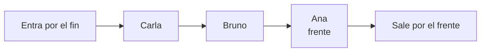
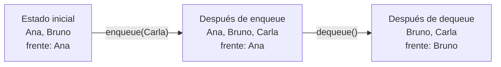
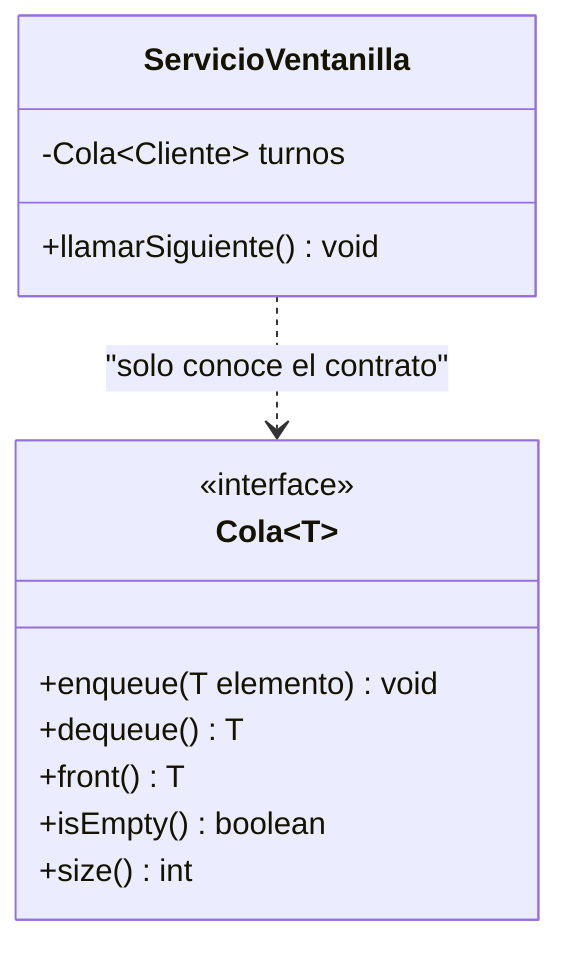
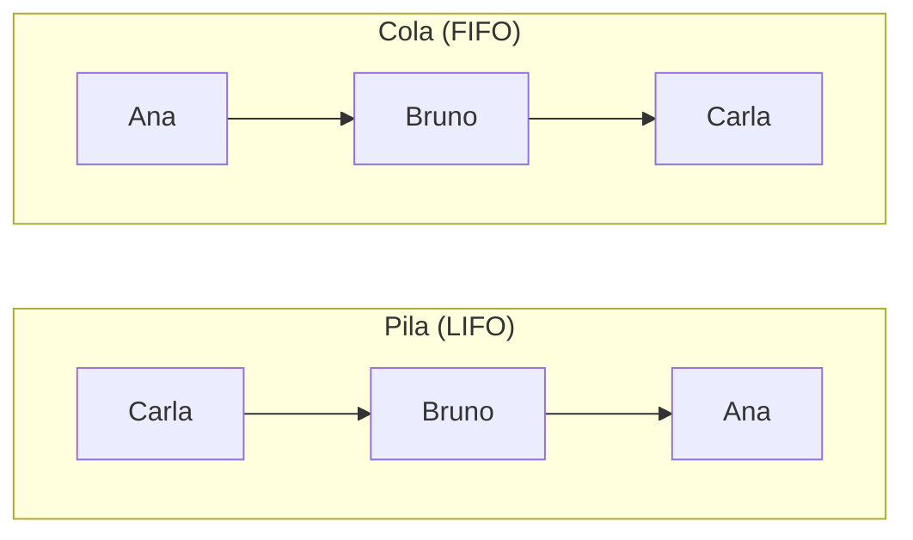

## El problema: la ventanilla y el turno

Imagina que ahora eres quien organiza la ventanilla del Sistema Bancario. A las 8:00 llegan tres clientes, uno tras otro: primero Ana, después Bruno y por último Carla. Cuando el cajero queda libre, ¿a quién llama?

```text
Llegada a la ventanilla (de la más antigua a la más reciente):
Ana
Bruno
Carla
```

Si guardas a los clientes con la lógica del deshacer, el primero en salir sería Carla, la última en llegar. Ana llevaría media hora esperando y vería pasar a todos los demás por delante. Eso es injusto y, en un banco, es un reclamo seguro.

- ¿Cómo garantizas que el primero en llegar sea el primero en ser atendido?
- Cuando atiendes a Ana, ¿quién pasa a ser "el siguiente"?
- ¿Qué debe pasar si el cajero pide al siguiente y la fila está vacía?

Lo que necesitas es una estructura donde se entre por un extremo y se salga por el otro, de modo que el orden de salida sea el orden de llegada.

## Más problemas con la misma forma

La fila de la ventanilla no es un caso aislado. Estas situaciones comparten su forma: quien lleva más tiempo esperando es quien se atiende primero.

| Situación | ¿Qué entra? | ¿Qué sale primero? |
| --- | --- | --- |
| Turnos de un banco | Cada cliente que llega | El cliente que llegó primero |
| Cola de impresión | Cada documento enviado | El documento enviado primero |
| _Scheduling_ de procesos | Cada proceso listo para ejecutar | El proceso que lleva más tiempo esperando |
| Sala de espera del consultorio o la veterinaria | Cada paciente que se registra | El paciente que se registró primero |

En los cuatro casos el orden de salida es **igual** al de llegada, lo contrario de lo que viste con la pila. Y en los cuatro, nadie se cuela en el medio: para atender a alguien, hay que haber atendido antes a todos los que llegaron antes.

## La solución: la cola (FIFO)

Piensa en la fila de personas frente a una taquilla. Quien llega se pone al final; quien es atendido sale por el frente. Nadie entra por adelante ni sale por atrás.



La fila de la ventanilla, vista como cola: Ana está en el **frente**, así que es la única accesible y la primera en salir; Carla, en el **fin**, es la última.

> **TAD Cola (_queue_):** colección ordenada de elementos en la que las inserciones se hacen por un extremo, llamado **fin**, y las eliminaciones por el otro, llamado **frente**. Sigue la disciplina **FIFO** (_First In, First Out_): el primer elemento en entrar es el primero en salir.

Igual que con la pila, la definición **no** dice nada de arreglos, nodos ni referencias: describe _qué_ se puede hacer y _qué garantías_ se cumplen, no _cómo_ se guarda por dentro. Ese "qué" es lo que te permite usar una cola sin conocer su interior.

## enqueue, dequeue y front

**Situación:** llegan tres clientes a la ventanilla y el cajero atiende al primero.

**En la práctica**, tres operaciones bastan. `enqueue` coloca un elemento al fin de la cola; `dequeue` **quita y devuelve** el elemento del frente; `front` **devuelve el frente sin quitarlo**. Aquí, `cola` llega como parámetro y el comentario muestra cómo queda tras cada línea (el frente es el elemento más a la izquierda):

```java
static void registrarJornada(Cola<Cliente> cola) {
    cola.enqueue(new Cliente("Ana"));      // [Ana]
    cola.enqueue(new Cliente("Bruno"));    // [Ana, Bruno]
    cola.enqueue(new Cliente("Carla"));    // [Ana, Bruno, Carla]

    Cliente proximo = cola.front();        // devuelve Ana; la cola no cambia
    Cliente atendido = cola.dequeue();     // devuelve Ana; [Bruno, Carla]
    // ahora el frente es Bruno: es el nuevo "siguiente en ser atendido"
}
```

_Nota:_ en estos ejemplos `Cliente` se simplifica a un constructor con el nombre; en el Sistema Bancario completo también lleva identificación, teléfono y dirección.



> **enqueue(x):** coloca `x` al fin de la cola. **dequeue():** retira y devuelve el elemento del frente. **front():** devuelve el elemento del frente sin retirarlo.

Fíjate en que `enqueue` no cambia el frente, mientras que `dequeue` sí. La diferencia entre `dequeue` y `front` es la diferencia entre _atender_ y _mirar_: el cajero puede ver quién es el siguiente (`front`) antes de llamarlo de verdad (`dequeue`).

## isEmpty y size: preguntar antes de actuar

**Situación:** es la hora de cierre, el cajero atendió a todos los clientes y, por costumbre, pide "el siguiente" una vez más. ¿Qué debería devolver `dequeue` si nadie espera? Ni `null` ni un cliente inventado serían honestos: no hay nadie a quien entregar.

**En la práctica**, el contrato de la cola define que `dequeue` y `front` tienen una **precondición**: la cola no debe estar vacía. Si se viola, lanzan `java.util.NoSuchElementException`, una excepción no verificada (_unchecked_). Para no llegar ahí, la cola ofrece dos consultas que no modifican nada:

```java
static void llamarSiguiente(Cola<Cliente> cola) {
    if (!cola.isEmpty()) {
        Cliente cliente = cola.dequeue();
        System.out.println("Pase a la ventanilla: " + cliente);
    }
}

System.out.println("Clientes en espera: " + cola.size());
```

> **Precondición:** condición que quien llama debe garantizar antes de invocar una operación. **isEmpty():** indica si la cola no tiene elementos. **size():** indica cuántos elementos tiene.

El método no devuelve un valor de relleno cuando la fila está vacía: simplemente no llama a nadie. El contrato dice qué ocurre si la precondición se viola (la excepción), y tú decides con `isEmpty` cuándo evitarlo.

## El contrato en Java: una interface

Todo lo que has visto se puede escribir en Java sin decir cómo se guarda nada. Una `interface` declara las operaciones y sus precondiciones, y deja los cuerpos para quien la implemente:

```java
import java.util.NoSuchElementException;

public interface Cola<T> {

    /** Coloca el elemento al fin de la cola. */
    void enqueue(T elemento);

    /**
     * Retira y devuelve el elemento del frente.
     * Precondición: la cola no está vacía.
     * @throws NoSuchElementException si la cola está vacía
     */
    T dequeue();

    /**
     * Devuelve el elemento del frente sin retirarlo.
     * Precondición: la cola no está vacía.
     * @throws NoSuchElementException si la cola está vacía
     */
    T front();

    /** Indica si la cola no contiene elementos. */
    boolean isEmpty();

    /** Devuelve la cantidad de elementos almacenados. */
    int size();
}
```



Observa que `ServicioVentanilla` depende de `Cola`, no de una forma concreta de guardar los datos. El `T` genérico permite que la misma interface sirva para `Cola<Cliente>`, `Cola<String>` o cualquier otro tipo, igual que `Pila<T>` y `ListaSimple<T>`.

## Pila y cola frente a frente

Las dos estructuras aceptan los mismos elementos y ofrecen operaciones casi gemelas. Lo único que cambia es **por dónde salen**. Toma las tres llegadas de la ventanilla, Ana, Bruno y Carla, y procésalas con cada disciplina:



| Estructura | Orden de llegada | Orden de salida | Extremos |
| --- | --- | --- | --- |
| Pila | Ana, Bruno, Carla | Carla, Bruno, Ana | Uno solo: el tope |
| Cola | Ana, Bruno, Carla | Ana, Bruno, Carla | Dos: fin (entrada) y frente (salida) |

Elegir entre una y otra no es cuestión de gusto: es decidir qué significa "el siguiente" para el problema. Si el siguiente es el más reciente, pila; si es el que más lleva esperando, cola.

## La cola que el sistema operativo ya usa

En la lección "TAD Pila" viste que la JVM usa una pila sin que lo pidas: la pila de llamadas. El sistema operativo hace lo mismo con colas. Cuando envías tres documentos a la impresora, el sistema los guarda en una **cola de impresión** y los imprime en el orden en que los enviaste; no reordena por su cuenta ni le da prioridad al último.

Con los procesos ocurre igual. Un procesador ejecuta un proceso a la vez y los demás esperan su turno en una cola de procesos listos. Cuando un proceso termina o cede el procesador, el que lleva más tiempo esperando pasa a ejecutarse. Es el mismo mecanismo de la ventanilla: cada elemento espera su turno y el orden de llegada decide el orden de atención.

## ¿Qué problemas piden una cola y no una pila?

Una cola es la respuesta cuando el enunciado dice, con otras palabras, "el que llegó primero es el primero que se atiende". Las señales típicas: _en orden de llegada_, _por turnos_, _el que lleva más tiempo esperando_, _atender en el orden en que se recibieron_.

Con esto se cierra la pregunta que dejó la lección "TAD Pila": la fila de turnos de la ventanilla es justo lo que **no** es una pila, y ahora tiene nombre propio.

| Señal en el enunciado | ¿Cola? |
| --- | --- |
| "Atender los clientes en orden de llegada" | Sí |
| "Imprimir los documentos en el orden en que se enviaron" | Sí |
| "Anular la última operación registrada" | No, es una pila |
| "Atender primero al cliente más urgente" | Ni cola ni pila simples: pide otra regla de orden |
| "Buscar la transacción número 37 del historial" | No, exige acceso por posición |

La fila del "más urgente" merece atención: en una cola, la urgencia no cuenta, solo el orden de llegada. Si el problema exige saltarse la fila según algún criterio, ese criterio es una regla de orden distinta a FIFO y a LIFO, y ninguna de las dos estructuras la cumple por sí sola.

## Resumen operativo

| Operación | ¿Qué hace? | Retorno | Precondición | Costo esperado |
| --- | --- | --- | --- | --- |
| `enqueue(x)` | Coloca `x` al fin | `void` | Ninguna | **O(1)** |
| `dequeue()` | Retira el frente | El elemento retirado | Cola no vacía | **O(1)** |
| `front()` | Consulta el frente | El elemento del frente | Cola no vacía | **O(1)** |
| `isEmpty()` | Pregunta si no hay elementos | `boolean` | Ninguna | **O(1)** |
| `size()` | Cuenta los elementos | `int` | Ninguna | **O(1)** |

El costo **O(1)** es lo que el contrato espera de cada operación: ninguna debería recorrer los elementos almacenados.

## Síntesis

- **El problema:** atender la ventanilla en orden justo exige una estructura donde salga primero quien llegó primero.
- **Misma forma:** turnos, impresión, _scheduling_ y sala de espera comparten el orden de salida igual al de llegada.
- **La cola:** TAD con disciplina FIFO, con entrada por el fin y salida por el frente.
- **Operaciones base:** `enqueue` encola, `dequeue` quita y devuelve, `front` solo mira.
- **Consultas:** `isEmpty` y `size` permiten evitar la violación de la precondición, que lanza `NoSuchElementException`.
- **Contrato:** la `interface` `Cola<T>` declara operaciones y excepciones sin decir cómo se almacena.
- **Pila y cola:** las mismas llegadas producen salidas opuestas; cambia el significado de "el siguiente".
- **Sistema operativo:** la cola de impresión y la de procesos listos aplican FIFO.
- **Cuándo usarla:** cuando el primero en llegar es el primero en atenderse; si es al revés, es una pila, y si importa la urgencia, hace falta otra regla de orden.
- **Resumen operativo:** cinco operaciones, todas con costo esperado O(1).
