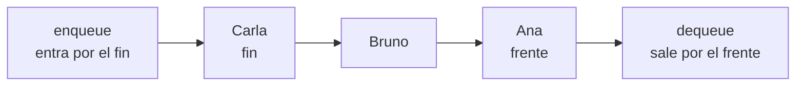

> 📖 Lectura previa a la clase — unos 12 minutos. Al final, responde la autoevaluación.

## La fila de la caja del supermercado

Llegas a pagar con el carrito lleno y ves la fila de una caja. Haces lo que hace todo el mundo: te pones **al final**. La cajera atiende a quien está **al frente**; cuando termina, esa persona se va y el siguiente da un paso adelante. Nadie se pasa de la mitad para adelante, y nadie atiende desde atrás.

Mientras esperas puedes hacer dos cosas más sin mover a nadie: **mirar quién sigue** y **contar cuántos hay** delante. Y hay un caso límite que ya viviste: a las 10 de la noche, la cajera libre pregunta "¿quién sigue?" y no hay nadie. No puede atender a una persona que no existe.

Fíjate en el orden: sale primero quien llegó primero. Si el supermercado atendiera a la última persona en llegar, la primera se quedaría esperando media hora viendo pasar a todos.

## De la fila a las reglas: el TAD Cola

Cada cosa que hiciste en la fila es una operación, y las reglas del supermercado son las de la estructura:

| En la fila | En la cola |
| --- | --- |
| Te haces al final | `enqueue` |
| Pasas a la caja | `dequeue` |
| Miras quién sigue | `front` |
| ¿Hay alguien en la fila? | `isEmpty` |
| ¿Cuántos hay? | `size` |

> **TAD Cola (_queue_):** colección ordenada de elementos en la que las inserciones se hacen por un extremo, el **fin**, y las eliminaciones por el otro, el **frente**. Sigue la disciplina **FIFO** (_First In, First Out_): el primero en entrar es el primero en salir.

Igual que con la pila, la definición no dice nada de arreglos ni nodos: dice _qué_ se puede hacer, no _cómo_ se guarda. Eso te permite usar una cola sin conocer su interior.


```mermaid
flowchart LR
  E["enqueue\nentra por el fin"] --> C["Carla\nfin"]
  C --> B["Bruno"]
  B --> A["Ana\nfrente"]
  A --> S["dequeue\nsale por el frente"]
```

Aquí el diagrama sí aporta algo que el texto no muestra: hay **dos extremos** con funciones distintas, uno para entrar y otro para salir.

## enqueue, dequeue y front

**Así en la vida real:** Ana llega y se pone en la fila; después llegan Bruno y Carla. La cajera atiende a Ana. Mientras tanto, Bruno puede ver que él sigue, sin que nadie se mueva.

**Así en código:** llegar al final es `enqueue`, pasar a la caja es `dequeue` (quita y devuelve al que estaba al frente) y ver quién sigue es `front` (devuelve sin quitar). El comentario muestra la cola tras cada línea, con el frente a la izquierda:

```java
static void abrirCaja(Cola<Cliente> fila) {
    fila.enqueue(new Cliente("Ana"));      // [Ana]
    fila.enqueue(new Cliente("Bruno"));    // [Ana, Bruno]
    fila.enqueue(new Cliente("Carla"));    // [Ana, Bruno, Carla]

    Cliente quienSigue = fila.front();     // devuelve Ana; la fila no cambia
    Cliente atendido = fila.dequeue();     // devuelve Ana; [Bruno, Carla]
    // el frente ahora es Bruno: nuevo "siguiente"
}
```

> **enqueue(x):** coloca `x` al fin de la cola. **dequeue():** retira y devuelve el elemento del frente. **front():** devuelve el elemento del frente sin retirarlo.

`enqueue` nunca cambia el frente; `dequeue` sí. La diferencia entre `dequeue` y `front` es la de _atender_ y _mirar_.

## isEmpty y size: preguntar antes de actuar

**Así en la vida real:** la cajera no llama a nadie si la fila está vacía; primero mira. Y si quiere saber cuánta gente hay, la cuenta sin sacar a nadie.

**Así en código:** `dequeue` y `front` tienen una **precondición**: la cola no debe estar vacía. Si se viola, lanzan `java.util.NoSuchElementException`, una excepción no verificada (_unchecked_). Para no llegar ahí existen `isEmpty` y `size`, que no modifican nada:

```java
static void llamarSiguiente(Cola<Cliente> fila) {
    if (!fila.isEmpty()) {
        System.out.println("Pase a la caja: " + fila.dequeue());
    }
    System.out.println("Personas en espera: " + fila.size());
}
```

> **Precondición:** condición que quien llama debe garantizar antes de invocar una operación. **isEmpty():** indica si la cola no tiene elementos. **size():** indica cuántos tiene.

El contrato no inventa un cliente de relleno: si no hay nadie, avisa con una excepción, y tú decides con `isEmpty` cuándo evitarla.

## El contrato en Java: una interface

Las cinco reglas de la fila caben en una `interface`: declara operaciones y precondiciones y deja los cuerpos para quien la implemente.

```java
import java.util.NoSuchElementException;

public interface Cola<T> {

    /** Coloca el elemento al fin de la cola. */
    void enqueue(T elemento);

    /**
     * Retira y devuelve el elemento del frente.
     * Precondición: la cola no está vacía.
     * @throws NoSuchElementException si la cola está vacía
     */
    T dequeue();

    /**
     * Devuelve el elemento del frente sin retirarlo.
     * Precondición: la cola no está vacía.
     * @throws NoSuchElementException si la cola está vacía
     */
    T front();

    /** Indica si la cola no contiene elementos. */
    boolean isEmpty();

    /** Devuelve la cantidad de elementos almacenados. */
    int size();
}
```

El `T` genérico sirve para `Cola<Cliente>`, `Cola<String>` o cualquier otro tipo, igual que `Pila<T>`. Quien use la fila solo conoce este contrato, no cómo se guarda por dentro.

## Dónde se rompe la analogía

La fila real permite cosas que la cola **no**. Alguien se cuela en la mitad ("solo voy a preguntar algo"), otro se cansa y se sale del medio, y tú puedes preguntar "¿en qué puesto voy?" y recorrer con la mirada a todos.

En el TAD Cola no existe ninguna de esas operaciones: solo se entra por el fin y solo se sale por el frente. No es una carencia: es la garantía. Si cualquiera pudiera colarse o salirse, ya no podrías asegurar que el orden de salida es el de llegada. Y si necesitas buscar o quitar a alguien del medio, ese problema no pide una cola.

## Pila y cola frente a frente

La pila de platos de "Implementación de pilas en Java" y la fila del supermercado aceptan los mismos elementos; solo cambia **por dónde salen**. Con Ana, Bruno y Carla llegando en ese orden:

| Estructura | Analogía | Orden de salida | Extremos |
| --- | --- | --- | --- |
| Pila (LIFO) | Pila de platos | Carla, Bruno, Ana | Uno solo: el tope |
| Cola (FIFO) | Fila de la caja | Ana, Bruno, Carla | Dos: fin (entrada) y frente (salida) |

Elegir entre una y otra es decidir qué significa "el siguiente": el más reciente (pila) o el que más lleva esperando (cola).

## Resumen operativo

| Operación | ¿Qué hace? | Retorno | Precondición | Costo esperado |
| --- | --- | --- | --- | --- |
| `enqueue(x)` | Coloca `x` al fin | `void` | Ninguna | **O(1)** |
| `dequeue()` | Retira el frente | El elemento retirado | Cola no vacía | **O(1)** |
| `front()` | Consulta el frente | El elemento del frente | Cola no vacía | **O(1)** |
| `isEmpty()` | Pregunta si no hay elementos | `boolean` | Ninguna | **O(1)** |
| `size()` | Cuenta los elementos | `int` | Ninguna | **O(1)** |

El costo **O(1)** es lo que el contrato espera: ninguna operación debería recorrer los elementos.

## ¿Dónde aparece en tu proyecto?

Una cola es la respuesta cuando el enunciado dice "en orden de llegada" o "por turnos". En los proyectos de aula aparece así:

- **Sistema Bancario:** `Cola<Cliente>` para la atención en ventanilla, con el turno y el siguiente cliente.
- **Consultorio Médico:** `Cola<Paciente>` para la sala de espera del día; el médico atiende al siguiente.
- **Clínica Veterinaria:** `Cola<Animal>` para la sala de espera.
- **Papelería:** `Cola<Pedido>` para los pedidos a proveedor, procesados en orden de llegada.

Fuera del proyecto, es lo que hace el sistema operativo: la **cola de impresión** imprime los documentos en el orden en que los enviaste, y el _scheduling_ mantiene una cola de procesos listos donde pasa a ejecutarse el que lleva más tiempo esperando.

## Síntesis

- **La fila:** entras por el final, sales por el frente; sale primero quien llegó primero.
- **La cola:** TAD con disciplina FIFO y dos extremos, fin y frente.
- **Operaciones base:** `enqueue` encola, `dequeue` quita y devuelve, `front` solo mira.
- **Consultas:** `isEmpty` y `size` evitan violar la precondición, que lanza `NoSuchElementException`.
- **Contrato:** la `interface` `Cola<T>` declara operaciones y excepciones sin decir cómo se almacena.
- **Dónde se rompe la analogía:** colarse o salirse del medio no existe en la cola, y por eso el orden FIFO se garantiza.
- **Pila y cola:** las mismas llegadas producen salidas opuestas.
- **Aplicaciones:** turnos, impresión y _scheduling_ aplican FIFO.
