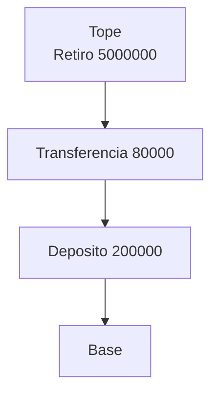
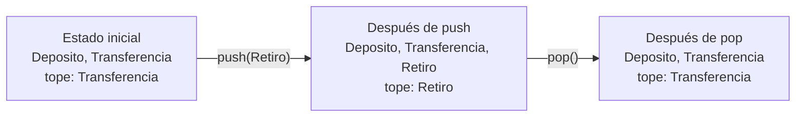
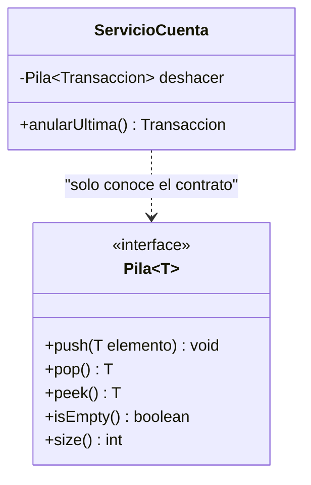
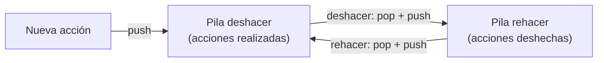

## El problema: deshacer la última transacción

Imagina que eres el cajero del Sistema Bancario. Registras un retiro de 500.000 en la cuenta de un cliente y, al segundo, te das cuenta de que digitaste un cero de más. Necesitas **anular ese retiro** — y solo ese, no el depósito de hace una hora ni la transferencia de ayer.

```text
Historial de la cuenta (de la más antigua a la más reciente):
Deposito 200000
Transferencia 80000
Retiro 5000000      <-- la equivocada, fue la última en entrar
```

- ¿Cómo sabe el programa cuál fue la última transacción registrada?
- Si anulas esa, ¿cuál es ahora "la última"? Porque el cajero puede necesitar deshacer otra más.
- ¿Qué debe pasar si el cajero pide deshacer y ya no queda nada por deshacer?

Con una `ListaSimple` puedes guardar el historial, pero nada en ella te obliga a trabajar solo con el extremo reciente: cualquiera podría tocar cualquier posición. Lo que necesitas es una estructura cuya única puerta de entrada y de salida sea **el último elemento que llegó**.

## Más problemas con la misma forma

El deshacer del banco no es un caso aislado. Estas situaciones tienen exactamente la misma forma: lo último que ocurrió es lo primero que hay que atender.

| Situación | ¿Qué entra? | ¿Qué sale primero? |
| --- | --- | --- |
| Botón "Atrás" del navegador | Cada página que visitas | La página que visitaste más recientemente |
| `Ctrl+Z` en un editor de texto | Cada edición que haces | La última edición realizada |
| _Stack trace_ de un error en Java | Cada método que se va invocando | El método que se invocó más recientemente |

En los tres casos el orden de salida es el **inverso** al de llegada. Y en los tres, nadie necesita acceder a lo que quedó "en el medio" sin antes atender lo que está encima.

## La solución: la pila (LIFO)

Piensa en una pila de platos limpios. Agregas platos encima y, cuando necesitas uno, tomas el de encima. Nadie saca el plato del fondo sin retirar antes los que lo cubren.



El historial del banco, visto como pila: la transacción equivocada está en el **tope**, así que es la única accesible y la primera en salir.

> **TAD Pila (_stack_):** colección ordenada de elementos en la que las inserciones y las eliminaciones se hacen por un solo extremo, llamado **tope**. Sigue la disciplina **LIFO** (_Last In, First Out_): el último elemento en entrar es el primero en salir.

Fíjate en lo que la definición **no** dice: no habla de arreglos, de nodos ni de referencias. Un **TAD** (tipo abstracto de datos) describe _qué_ se puede hacer y _qué garantías_ se cumplen, no _cómo_ se guarda por dentro. Ese "qué" es lo que te deja usar una pila sin conocer su interior.

## push, pop y peek

**Situación:** el cajero registra tres transacciones y después necesita anular la última.

**En la práctica**, tres operaciones bastan. `push` apila un elemento en el tope; `pop` **quita y devuelve** el elemento del tope; `peek` **devuelve el tope sin quitarlo**. Aquí, `pila` llega como parámetro y el comentario muestra cómo queda tras cada línea (el tope es el elemento más a la derecha):

```java
static void registrarJornada(Pila<Transaccion> pila) {
    pila.push(new Transaccion("Deposito", 200000));       // [Deposito]
    pila.push(new Transaccion("Transferencia", 80000));   // [Deposito, Transferencia]
    pila.push(new Transaccion("Retiro", 5000000));        // [Deposito, Transferencia, Retiro]

    Transaccion vista = pila.peek();     // devuelve Retiro; la pila no cambia
    Transaccion anulada = pila.pop();    // devuelve Retiro; [Deposito, Transferencia]
    // ahora el tope es Transferencia: es la nueva "última transacción"
}
```



> **push(x):** coloca `x` en el tope. **pop():** retira y devuelve el elemento del tope. **peek():** devuelve el elemento del tope sin retirarlo.

La diferencia entre `pop` y `peek` es la diferencia entre _anular_ y _mostrar_: el cajero puede ver qué transacción sería la anulada (`peek`) antes de confirmar que la anula (`pop`).

## isEmpty y size: preguntar antes de actuar

**Situación:** el cajero acaba de anular todas las transacciones y, por costumbre, pulsa "deshacer" una vez más. ¿Qué debería devolver `pop` si no hay nada que devolver? Ni `null` ni un valor inventado serían honestos: no hay ninguna transacción que entregar.

**En la práctica**, el contrato de la pila define que `pop` y `peek` tienen una **precondición**: la pila no debe estar vacía. Si se viola, lanzan una excepción (`EmptyStackException`). Para no llegar ahí, la pila ofrece dos consultas que no modifican nada:

```java
static Transaccion anularUltima(Pila<Transaccion> pila) {
    if (!pila.isEmpty()) {
        return pila.pop();
    }
    return null;   // o informar al cajero: "no hay transacciones por anular"
}

System.out.println("Pendientes de anular: " + pila.size());
```

> **Precondición:** condición que quien llama debe garantizar antes de invocar una operación. **isEmpty():** indica si la pila no tiene elementos. **size():** indica cuántos elementos tiene.

Preguntar antes de actuar convierte un error en una decisión: tú eliges qué hacer cuando no hay nada que deshacer, en lugar de que el programa se caiga.

## El contrato en Java: una interface

Todo lo que has visto hasta aquí se puede escribir en Java sin decir cómo se guarda nada. Una `interface` declara las operaciones y sus precondiciones, y deja los cuerpos para quien la implemente:

```java
import java.util.EmptyStackException;

public interface Pila<T> {

    /** Coloca el elemento en el tope de la pila. */
    void push(T elemento);

    /**
     * Retira y devuelve el elemento del tope.
     * Precondición: la pila no está vacía.
     * @throws EmptyStackException si la pila está vacía
     */
    T pop();

    /**
     * Devuelve el elemento del tope sin retirarlo.
     * Precondición: la pila no está vacía.
     * @throws EmptyStackException si la pila está vacía
     */
    T peek();

    /** Indica si la pila no contiene elementos. */
    boolean isEmpty();

    /** Devuelve la cantidad de elementos almacenados. */
    int size();
}
```



Observa que `ServicioCuenta` depende de `Pila`, no de una forma concreta de guardar los datos. El `T` genérico permite que la misma interface sirva para `Pila<Transaccion>`, `Pila<String>` o cualquier otro tipo, tal como `ListaSimple<T>` servía para cualquier elemento.

## La pila que Java usa por ti: la pila de llamadas

Sin que lo hayas pedido, cada programa Java que ejecutas ya usa una pila. Cuando un método llama a otro, la JVM apila un **marco** con sus variables locales; cuando el método termina, lo desapila y regresa al método que lo llamó.

```java
public static void main(String[] args) {
    procesarRetiro(500000);            // apila el marco de procesarRetiro
}

static void procesarRetiro(double monto) {
    validarSaldo(monto);               // apila el marco de validarSaldo
    // aquí se retoma cuando validarSaldo termina
}

static void validarSaldo(double monto) {
    // pila en este punto (tope al final): main, procesarRetiro, validarSaldo
}
```

Cuando `validarSaldo` termina, se hace `pop` de su marco y la ejecución vuelve a `procesarRetiro`, que es justo el que estaba debajo. Esa es la razón por la que un _stack trace_ de una excepción se lee de arriba hacia abajo: es la pila de llamadas, del tope hacia la base.

## Dos pilas para deshacer y rehacer

**Situación:** en un editor, `Ctrl+Z` deshace y `Ctrl+Y` rehace. Con una sola pila, lo deshecho se pierde. La solución es usar **dos** pilas: cada acción que deshaces no se descarta, cambia de pila.



El navegador funciona igual: la pila de "atrás" guarda las páginas visitadas, y al retroceder cada página pasa a la pila de "adelante". Dos pilas, las mismas tres operaciones, y ninguna necesita saber nada de la otra.

## ¿Qué problemas piden una pila?

Una pila es la respuesta cuando el enunciado dice, con otras palabras, "lo último que ocurrió es lo primero que hay que atender". Las señales típicas: _deshacer_, _volver a lo anterior_, _regresar al punto desde donde llamé_, _revertir en orden inverso_.

También hay que reconocer lo que **no** es una pila. La fila de turnos de la ventanilla es lo contrario: el primero que llegó es el primero que se atiende (ver la lección "TAD Cola").

| Señal en el enunciado | ¿Pila? |
| --- | --- |
| "Anular la última operación registrada" | Sí |
| "Volver a la página anterior" | Sí |
| "Atender los clientes en orden de llegada" | No, es una cola |
| "Buscar la transacción número 37 del historial" | No, exige acceso por posición |

¿Por qué restringir el acceso es una ventaja y no una limitación? Con un `ArrayList` puedes leer y modificar cualquier posición, pero nada te impide corromper el orden sin querer. Con una pila, el contrato **garantiza** que solo se toca el tope: el código que la usa comunica su intención y el compilador impide el resto.

## Resumen operativo

| Operación | ¿Qué hace? | Retorno | Precondición | Costo esperado |
| --- | --- | --- | --- | --- |
| `push(x)` | Coloca `x` en el tope | `void` | Ninguna | **O(1)** |
| `pop()` | Retira el tope | El elemento retirado | Pila no vacía | **O(1)** |
| `peek()` | Consulta el tope | El elemento del tope | Pila no vacía | **O(1)** |
| `isEmpty()` | Pregunta si no hay elementos | `boolean` | Ninguna | **O(1)** |
| `size()` | Cuenta los elementos | `int` | Ninguna | **O(1)** |

## Síntesis

- **El problema:** anular la última transacción exige una estructura donde solo se acceda al elemento más reciente.
- **Misma forma:** deshacer, "atrás" del navegador y _stack trace_ comparten el orden de salida inverso al de llegada.
- **La pila:** TAD con disciplina LIFO y un único punto de acceso, el tope.
- **Operaciones base:** `push` apila, `pop` quita y devuelve, `peek` solo mira.
- **Consultas:** `isEmpty` y `size` permiten evitar la violación de la precondición.
- **Contrato:** la `interface` `Pila<T>` declara operaciones y excepciones sin decir cómo se almacena.
- **Pila de llamadas:** la JVM ya usa una pila para recordar a qué método regresar.
- **Deshacer y rehacer:** dos pilas se pasan elementos entre sí.
- **Cuándo usarla:** cuando lo último en llegar es lo primero en atenderse; si es al revés, es una cola.
