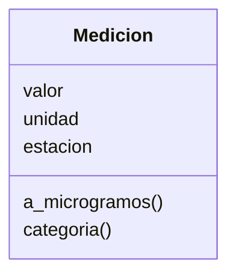
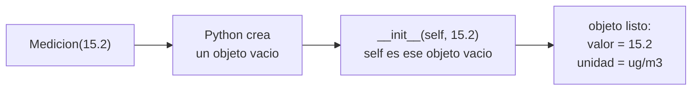
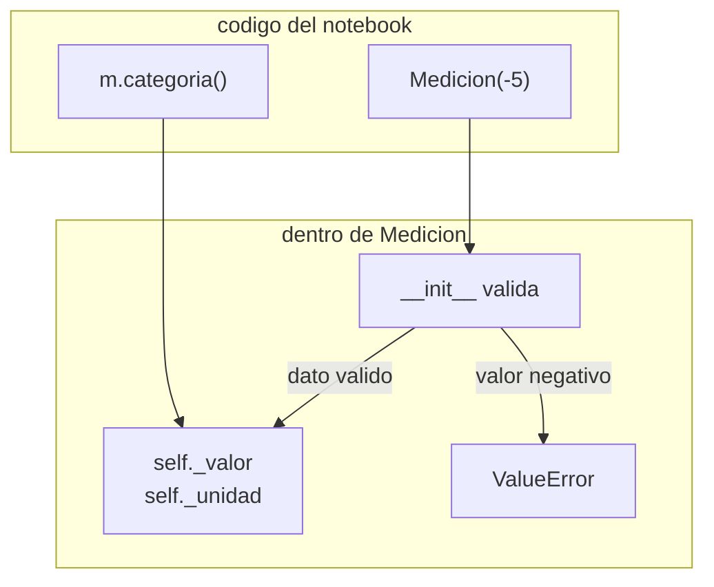
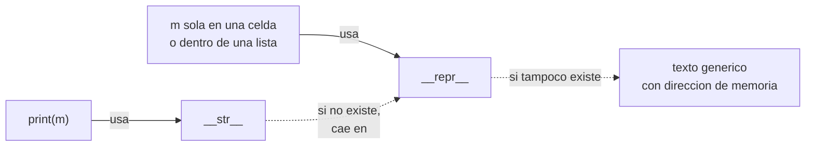
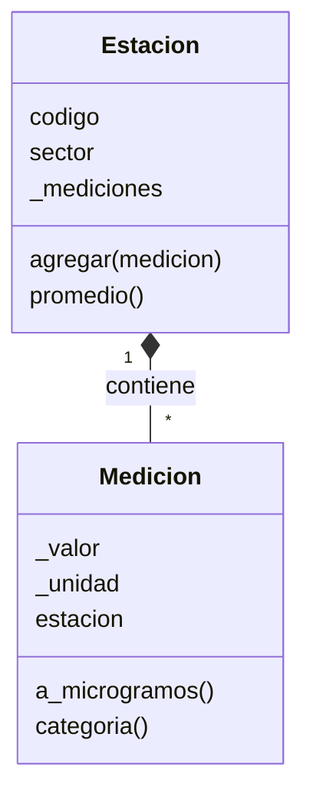

## El problema: una lectura suelta no sabe qué es

La red de monitoreo de PM2.5 quedó guardada como una lista de diccionarios, y las operaciones sobre ella como funciones sueltas: `convertir_a_microgramos` y `clasificar_calidad_aire`, las que escribiste en Funciones.

```python
registros_estaciones = [
    {"codigo": "EST-01", "sector": "Norte",  "coordenadas": (6.28, -75.57), "lecturas": [8.4, 12.7, 15.2]},
    {"codigo": "EST-02", "sector": "Centro", "coordenadas": (6.24, -75.58), "lecturas": [41.8, 58.3, 36.1]},
    {"codigo": "EST-03", "sector": "Sur",    "coordenadas": (6.19, -75.59), "lecturas": [9.6, 13.9, 7.5], "humedad_relativa": 68.0},
]

def convertir_a_microgramos(valor, unidad="mg/m3"):
    """Convierte una lectura a ug/m3."""
    if unidad == "mg/m3":
        return valor * 1000
    return valor
```

Todo funciona mientras los datos sean correctos. Pero nada obliga a que lo sean: un diccionario acepta cualquier cosa, y una función acepta cualquier número.

```python
lectura = {"valor": -5, "unidad": "kg"}
print(lectura)
print(convertir_a_microgramos(-5))
```

```text
{'valor': -5, 'unidad': 'kg'}
-5000
```

Una concentración negativa, medida en kilogramos, y ninguna alarma: Python guardó el diccionario sin quejarse y la función devolvió `-5000` como si fuera un resultado válido. Ese dato inválido viajaría por todo el notebook hasta contaminar un promedio, y nadie sabría dónde nació. El problema de fondo es que la lectura es solo un puñado de datos: no sabe qué es, ni qué valores le están permitidos, ni cómo convertirse o clasificarse. Esa lógica vive lejos, en funciones que hay que acordarse de llamar.

Al final de Funciones quedó una promesa: ver cómo una función puede vivir dentro de un objeto. Aquí se cumple.

## La solución: una clase es un molde, un objeto es una medición concreta

¿Y si la lectura llevara consigo sus datos **y** las operaciones que le corresponden? Eso es una **clase**: un molde que describe qué datos tiene una medición y qué puede hacer. A partir del molde se crean tantas mediciones concretas como quieras, y cada una es un **objeto**.



El bloque de arriba del diagrama lista los **atributos** (los datos que cada medición guarda) y el de abajo los **métodos** (las funciones que la medición sabe ejecutar sobre sí misma). `Medicion` es el molde; la lectura de 15.2 µg/m³ de la estación Norte y la de 58.3 µg/m³ de la estación Centro serán dos objetos distintos hechos con el mismo molde.

> **Clase:** plantilla que define los atributos y los métodos que tendrán todos los objetos creados a partir de ella.
>
> **Objeto (instancia):** una medición concreta creada desde una clase, con sus propios valores en cada atributo.

Con esto, el objeto puede validarse a sí mismo, convertirse y clasificarse sin que nadie tenga que acordarse de llamar funciones sueltas.

## Tu primera clase: `__init__` y `self`

**Situación:** necesitas crear una `Medicion` con su valor, su unidad y la estación que la reportó, en una sola línea, y que esos datos queden guardados dentro del objeto.

**En la práctica**, escribes el molde con `class` y un método especial llamado `__init__`, que Python ejecuta automáticamente cada vez que se crea un objeto:

```python
class Medicion:
    """Una lectura de PM2.5 de una estacion."""

    def __init__(self, valor, unidad="ug/m3", estacion="sin asignar"):
        self.valor = valor
        self.unidad = unidad
        self.estacion = estacion


m = Medicion(15.2)
otra = Medicion(0.0084, "mg/m3", "EST-01")
print(m.valor, m.unidad, m.estacion)
print(otra.valor, otra.unidad, otra.estacion)
```

```text
15.2 ug/m3 sin asignar
0.0084 mg/m3 EST-01
```

Al escribir `Medicion(15.2)`, Python crea un objeto vacío y llama a `__init__` pasándole ese objeto como primer argumento, que por convención se llama `self`. Las líneas `self.valor = valor` guardan cada dato **dentro** de ese objeto. Por eso `m` y `otra` tienen valores distintos: cada una guarda los suyos.



> **`__init__`:** método que se ejecuta al crear un objeto y sirve para dejar guardados sus atributos iniciales.
>
> **`self`:** el objeto que se está creando (o sobre el que se llama un método). Siempre es el primer parámetro; al llamar no lo escribes, Python lo pasa solo.

Los valores por defecto funcionan igual que en las funciones: `Medicion(15.2)` asume µg/m³ y una estación sin asignar.

## Métodos: la función que vive dentro del objeto

**Situación:** en Funciones tenías `convertir_a_microgramos(valor, unidad)`: había que pasarle el valor **y** la unidad, y esperar no equivocarse de par. Pero la medición ya sabe su valor y su unidad. ¿Para qué pasárselos de nuevo?

**En la práctica**, la misma lógica se mueve dentro de la clase como método, y la escala oficial se define una sola vez como constante:

```python
ESCALA_OFICIAL = [
    (12.0, "Buena"),
    (35.4, "Moderada"),
    (55.4, "Dañina para grupos sensibles"),
]


class Medicion:
    """Una lectura de PM2.5 de una estacion."""

    def __init__(self, valor, unidad="ug/m3", estacion="sin asignar"):
        self.valor = valor
        self.unidad = unidad
        self.estacion = estacion

    def a_microgramos(self):
        """Devuelve la concentracion en ug/m3."""
        if self.unidad == "mg/m3":
            return self.valor * 1000
        return self.valor

    def categoria(self):
        """Clasifica la lectura segun la escala oficial."""
        concentracion = self.a_microgramos()
        for limite, nombre in ESCALA_OFICIAL:
            if concentracion <= limite:
                return nombre
        return "Dañina para la salud"


m = Medicion(0.0084, "mg/m3", "EST-01")
print(m.a_microgramos())
print(m.categoria())
print([Medicion(v).categoria() for v in registros_estaciones[1]["lecturas"]])
```

```text
8.4
Buena
['Dañina para grupos sensibles', 'Dañina para la salud', 'Dañina para grupos sensibles']
```

Compara las dos formas de pedir lo mismo: `convertir_a_microgramos(0.0084, "mg/m3")` contra `m.a_microgramos()`. En la segunda no repites datos: el método lee `self.valor` y `self.unidad` del propio objeto. Y `categoria()` reutiliza `a_microgramos()` llamándolo con `self`, así que una lectura en mg/m³ se clasifica correctamente sin que tengas que convertirla antes. La escala vive en `ESCALA_OFICIAL`, fuera de la clase: si el umbral cambia, se corrige en un solo lugar.

> **Método:** función definida dentro de una clase. Su primer parámetro es `self`, y por eso puede leer y modificar los atributos del objeto sobre el que se llama.

Un método es lo que permite que un dato sepa hacer cosas con sus propios datos, en vez de depender de una función externa que recibe todo por parámetro.

## Un objeto que se cuida solo: validación y encapsulamiento

**Situación:** el problema de entrada era que `-5` kg entraba sin protesta. Con una clase, el lugar natural para rechazarlo es `__init__`: si los datos no sirven, el objeto no llega a existir.

**En la práctica**, validas antes de guardar y lanzas un error con `raise ValueError`:

```python
UNIDADES_VALIDAS = ("ug/m3", "mg/m3")


class Medicion:
    """Una lectura de PM2.5 que valida sus datos al crearse."""

    def __init__(self, valor, unidad="ug/m3", estacion="sin asignar"):
        if valor < 0:
            raise ValueError(f"concentración negativa: {valor}")
        if unidad not in UNIDADES_VALIDAS:
            raise ValueError(f"unidad no reconocida: {unidad}")
        self._valor = valor
        self._unidad = unidad
        self.estacion = estacion

    def a_microgramos(self):
        """Devuelve la concentracion en ug/m3."""
        if self._unidad == "mg/m3":
            return self._valor * 1000
        return self._valor

    def categoria(self):
        """Clasifica la lectura segun la escala oficial."""
        concentracion = self.a_microgramos()
        for limite, nombre in ESCALA_OFICIAL:
            if concentracion <= limite:
                return nombre
        return "Dañina para la salud"


Medicion(-5)
```

```text
ValueError: concentración negativa: -5
```

`raise ValueError(...)` detiene la creación y explica qué salió mal: la medición inválida ya no puede circular por el notebook. Con `unidad="kg"` ocurre lo mismo, con el mensaje `unidad no reconocida: kg`.

Fíjate también en el guion bajo: `_valor` y `_unidad` en lugar de `valor` y `unidad`. Es una **convención** de Python que le dice a quien lea el código "este atributo es interno: no lo toques desde afuera, usa los métodos". Python no lo impide: si alguien escribe `m._valor = -5`, funciona y se salta la validación. La regla se apoya en el acuerdo entre quienes programan, no en un candado. (Existe una variante con doble guion bajo, `__valor`, que Python sí disfraza para dificultar el acceso; por ahora basta con reconocerla si la ves en código ajeno.)



> **Encapsulamiento:** guardar los datos dentro del objeto y ofrecer métodos como única vía prevista para usarlos, de modo que el objeto pueda garantizar que sus datos siempre son válidos. En Python se señala con la convención `_atributo`.

Ahora la garantía es del objeto: cualquier `Medicion` que exista pasó la validación, y las funciones que la usan no tienen que volver a revisarla.

## Inspeccionar un objeto: `__repr__` y `__str__`

**Situación:** creaste una medición y quieres ver qué contiene. Haces lo natural:

```python
m = Medicion(15.2)
print(m)
```

```text
<__main__.Medicion object at 0x7f3a1c2b5d90>
```

Ese texto (la dirección exacta cambia en cada ejecución) solo dice "es un objeto de la clase `Medicion`, guardado en la memoria en tal posición". No dice qué medición es. Puedes enseñarle a tu clase a describirse con dos métodos especiales. Añádelos dentro de `Medicion`, al final:

```python
    def __repr__(self):
        """Devuelve la forma tecnica, para quien programa."""
        return f"Medicion(valor={self._valor}, unidad='{self._unidad}')"

    def __str__(self):
        """Devuelve la forma legible, para quien lee el resultado."""
        return f"{self.a_microgramos()} µg/m³ — {self.categoria()}"
```

```python
m = Medicion(15.2)
print(m)
print(repr(m))
print([m, Medicion(41.8)])
```

```text
15.2 µg/m³ — Moderada
Medicion(valor=15.2, unidad='ug/m3')
[Medicion(valor=15.2, unidad='ug/m3'), Medicion(valor=41.8, unidad='ug/m3')]
```

Cada método responde a un lector distinto. `__str__` es la versión para personas: `print(m)` la usa. `__repr__` es la versión para quien programa: idealmente se parece al código que crearía el objeto, y es la que Python muestra cuando el objeto aparece solo al final de una celda o dentro de una lista. Si defines solo `__repr__`, `print` también lo usa; si no defines ninguno, cae en el texto genérico de arriba.



> **`__repr__`:** método especial que devuelve el texto técnico del objeto, útil para depurar. **`__str__`:** método especial que devuelve el texto legible que muestra `print`.

> **Extensión opcional:** en `__repr__` puedes escribir `{self._unidad!r}` en lugar de `'{self._unidad}'`. El `!r` pide a Python la representación con comillas de ese valor, y así el texto queda idéntico a la línea de código que recrea el objeto, sin comillas escritas a mano.

Con estos dos métodos, cualquier medición se puede revisar en una lista, en un mensaje de error o en un reporte sin abrir sus atributos uno por uno.

## De una medición a una estación: objetos que contienen objetos

**Situación:** una estación no tiene una lectura, tiene varias. En los diccionarios eso era una lista de números dentro de `"lecturas"`. Con clases, una estación puede guardar una lista de objetos `Medicion`, cada uno validado y capaz de convertirse y clasificarse.

**En la práctica**, `Estacion` es una segunda clase que contiene objetos de la primera:

```python
class Estacion:
    """Una estacion de la red con sus mediciones."""

    def __init__(self, codigo, sector):
        self.codigo = codigo
        self.sector = sector
        self._mediciones = []

    def agregar(self, medicion):
        """Guarda una Medicion en la estacion."""
        self._mediciones.append(medicion)

    def promedio(self):
        """Devuelve el promedio en ug/m3 de sus mediciones."""
        if not self._mediciones:
            raise ValueError(f"{self.codigo} no tiene mediciones")
        total = 0
        for medicion in self._mediciones:
            total += medicion.a_microgramos()
        return total / len(self._mediciones)

    def __repr__(self):
        """Devuelve la forma tecnica de la estacion."""
        return f"Estacion('{self.codigo}', '{self.sector}', mediciones={len(self._mediciones)})"
```

Ahora se construyen las tres estaciones desde `registros_estaciones`, y cada lectura pasa por la validación de `Medicion` al entrar:

```python
estaciones = []
for registro in registros_estaciones:
    estacion = Estacion(registro["codigo"], registro["sector"])
    for valor in registro["lecturas"]:
        estacion.agregar(Medicion(valor, estacion=registro["codigo"]))
    estaciones.append(estacion)

print(estaciones)
for estacion in estaciones:
    promedio = estacion.promedio()
    print(estacion.codigo, round(promedio, 1), Medicion(promedio).categoria())
```

```text
[Estacion('EST-01', 'Norte', mediciones=3), Estacion('EST-02', 'Centro', mediciones=3), Estacion('EST-03', 'Sur', mediciones=3)]
EST-01 12.1 Moderada
EST-02 45.4 Dañina para grupos sensibles
EST-03 10.3 Buena
```



La línea con rombo relleno significa **composición**: una estación contiene sus mediciones. `Estacion.promedio()` no toca `_valor` de ninguna medición; le pide a cada una `a_microgramos()`, y así funciona aunque unas estén en mg/m³ y otras en µg/m³. Cada clase se ocupa de lo suyo.

> **Composición:** relación en la que un objeto guarda otros objetos como parte de sus datos. La estación "tiene" mediciones; no es una medición.

Esta forma de organizar datos con su comportamiento es la que sostiene a las librerías científicas que vienen: un arreglo de NumPy o una tabla de Pandas son objetos, y los métodos que les aplicarás (como calcular un promedio) se llaman igual que `estacion.promedio()`.

## Resumen operativo

| Elemento | Qué hace | Ejemplo |
|---|---|---|
| `class` | Define el molde de un tipo de objeto | `class Medicion:` |
| `__init__` | Se ejecuta al crear el objeto y guarda sus datos iniciales | `def __init__(self, valor, unidad="ug/m3"):` |
| `self` | El objeto actual; primer parámetro de todo método | `self._valor = valor` |
| `_atributo` | Convención: dato interno, no se toca desde afuera | `self._valor` |
| `raise ValueError` | Rechaza datos inválidos y explica por qué | `raise ValueError("concentración negativa: -5")` |
| `__repr__` | Texto técnico; lo usan la celda sola y las listas | `Medicion(valor=15.2, unidad='ug/m3')` |
| `__str__` | Texto legible; lo usa `print` | `15.2 µg/m³ — Moderada` |

## Síntesis

- Una lista de diccionarios con funciones sueltas acepta datos inválidos como `{"valor": -5, "unidad": "kg"}` sin avisar: los datos no saben qué son.
- Una **clase** es un molde que agrupa datos (atributos) y comportamiento (métodos); un **objeto** es una medición concreta creada desde ese molde.
- `__init__` guarda los datos al crear el objeto y `self` es el propio objeto: por eso cada `Medicion` tiene sus valores.
- Un método es una función que vive dentro del objeto y usa `self` para leer sus propios datos, sin recibirlos por parámetro.
- Validar en `__init__` con `raise ValueError` impide que existan objetos inválidos; el guion bajo `_valor` señala que un atributo es interno, por convención.
- `__repr__` describe el objeto para quien programa y `__str__` para quien lee; `print` prefiere `__str__`, y la celda sola y las listas usan `__repr__`.
- Un objeto puede contener otros: `Estacion` guarda objetos `Medicion` y delega en ellos, la misma idea con la que trabajan los arreglos de NumPy y las tablas de Pandas.
